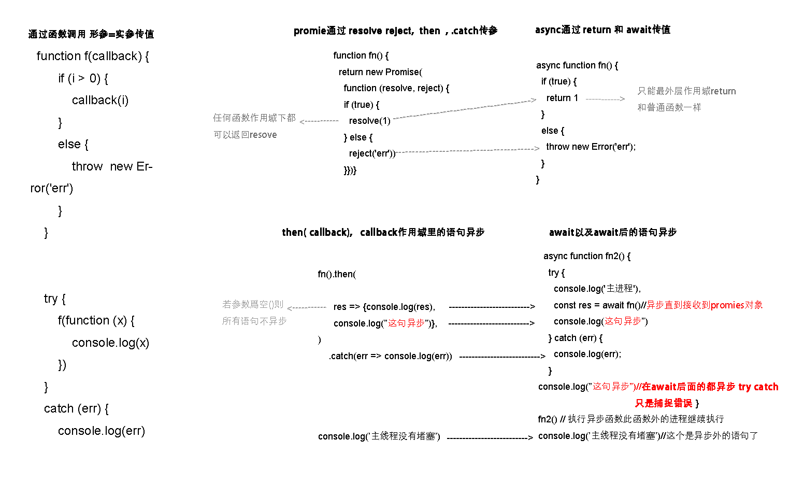
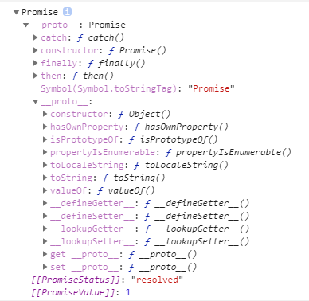
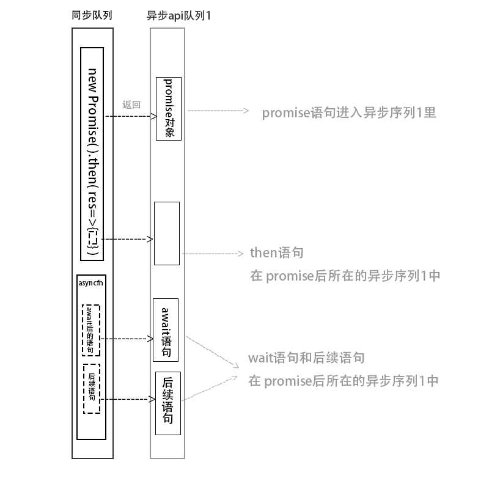

# 返回promise实例的表达式

### 回调 promise asyncawait比较



### 链式

```html
<meta charset="utf-8">
<script>
  let state = 1;

  function step1(resolve, reject) {
    console.log('1.开始-洗菜做饭');
    if (state === 1) {
      resolve('洗菜做饭--完成');
    } else {
      reject('洗菜做饭--出错');
    }
  }

  function step2(resolve, reject) {
    console.log('2.开始-坐下来吃饭');
    if (state === 1) {
      resolve('坐下来吃饭--完成');
    } else {
      reject('坐下来吃饭--出错');
    }
  }

  function step3(resolve, reject) {
    console.log('3.开始-收拾桌子洗完');
    if (state === 1) {
      resolve('收拾桌子洗完--完成');
    } else {
      reject('收拾桌子洗完--出错');
    }
  }

  new Promise(step1).then(function (val) {
    console.log(val);
    return new Promise(step2);
  }).then(function (val) {
    console.log(val);
    return new Promise(step3);
  }).then(function (val) {
    console.log(val);
    return val;
  });

</script>

```

```html
    <meta charset="UTF-8">
<script>

    var i = 0;
    //函数返回promise
    function sleep(ms) {
        return new Promise(function (resolve, reject) {
            setTimeout(function () {
                console.log('我执行好了');
                i++;
                if (i >= 3) reject(new Error('i>=2'));
                else resolve(i);
            }, ms);
        })
    }
    function sleep2(ms) {
        return new Promise(function (resolve, reject) {
            setTimeout(function () {
                console.log('我执行好了');
                i++;
                if (i >= 3) reject(new Error('i>=2'));
                else resolve(i);
            }, ms);
        })
    }
    (async function () {
        try {
            var val;
            val = await sleep(1000);
            console.log(val);
            val = await sleep(1001);
            console.log(val);
            val = await sleep2(1002);
            console.log(val);
        }
        catch (err) {
            console.log('出错啦:'+err.message);
        }
    } ())
</script>
```

```html
<meta charset="utf-8">
<script>

    function fn(i) {
        return new Promise((resolve, reject) => {
                if (i > 0) {
                    resolve(i)
                } else {

                    reject(new Error('不能输入小于等于0的值'))
                }
            }
        )
    }

    function fn2(i) {
        return new Promise((resolve, reject) => {
                if (i > 0) {
                    resolve(i)
                } else {

                    reject(new Error('不能输入小于等于0的值'))
                }
            }
        )
    }


    async function f() {
        try {

            const m = await fn(2)
            console.log(m)
            const n = await fn2(1)
            console.log(n)


        } catch (e) {
            console.log(e)
        }

    }

    f()
</script>
```


###  兼容 回调  async和 promise的写法

```html
 <script>
    /*,若不传入回调函数，则会返回一个 promise,mongose vue的$nexttick 都是这样做的*/

    const i = 1

    function asynFn(callback) {

        const promise = new Promise((resolve, reject) => {
            if (i > 0) {
                setTimeout(() => {
                    resolve(i + 1)
                }, 500)
            } else {
                reject(new Error('err'))
            }

        })
        if (callback) {

            promise.then(res => {
                callback(false, res)
            })
                .catch(err => {
                    callback(err)
                })
        } else {
            return promise
        }
    }
   //写法1
    asynFn((err, res) => {
        if (err) {
            console.log(err)
        } else {
            console.log(res)


        }

    })
//写法2
    asynFn().then(res => console.log(res)).catch(err => {
        console.log(err)
    })
//写法3
    async function  f() {
        const i=await asynFn()
        console.log(i)
    }
    f()
</script>

```

### 返回值为promise对象的函数

自定义return promise

    function fn(){
     return new promise(()=>)
    }
    
    fn().then()

自定义异步函数

````javascript
async function f() {
    return 1
}

f().then()
````

axios 异步函数


    axios.post("/brandUpdate",para).then

mogoose异步函数

````
Dog.find({name:'小黑'}).then()
````

vm.$nextTick()

```javascript
vm.$nextTick=function(){

return new Promise((resolve,reject)=>{})
}

```

# Promise的静态函数

### Promise.reject( )

```js
Promise.reject('renson');
//等价于
new Promise((resolve,reject)=>{reject('renson')})
```

### Promise.resolve(1)

```js
Promise.resolve(1);
//等价于
new Promise((resolve,reject)=>{resolve(1)})
```


# Promise.ptototype



##### .then().catch()

```js
new Promise((resolve,reject)=>{.....})
                         .then(res=>{})
                         .catch(err=>{})
```

# promise实例对象的作用


##### 1异步队列,不影响执行主程序

-  返回异步的promise对象,

-  用.then().catch()或 async  fn( ){ await} 接收值
- 普通程序流不能接受promise对象,



```html
<script>
    //函数中所有代码都是顺序运行的
    function f() {
       //new Promise异步了 拖出正常函数流
        return new Promise((resolve, reject) => {

            setTimeout(function () {
                resolve(2)
            }, 1000)
        })
    }

    //这个函数异步了拖出正常函数流
    async function f1() {
        console.log(0)//这句不异步
        const i = await f()//异步,接受数据,网络堵塞等待,有点像for循环堵塞
        console.log(i)//异步
        console.log(3)//异步
    }

    //正常运行
    f1()
    console.log(1)//正常运行


</script>
```

##### 2.避免了回调地狱: 


promise对象可以在函数体任意级别 resove值, 普通函数和异步函数的return不行,

##### 3.承诺接收promise

then接收不到Promise对象值绝不运行

```javascript
  new Promise((resolve) => {
    // resolve(undefined)
  }).then((res) => console.log('promise-run'))//没返回值

```

await等待不到Promise对象 后面的代码绝不运行

##### 4.两个值可以做选择逻辑

例1: element的对话框

例2

```html
<html>


</html>
<meta charset="utf-8">


<button id="submit">submit</button>
<button id="reset">reset</button>
<script>

    /*
    * method@fn
    * params@{dom对象}  例:确定按钮dom对象 取消按钮dom对象
    * rerurn@{promise}
    * */
    function f(el, el2) {
        return new Promise((resolve, reject) => {

            el.addEventListener('click', function () {
                resolve('submit')
            })
            el2.addEventListener('click', function () {
                reject('reset')
            })
        })
    }

    const submitBtn = document.getElementById('submit')
    const resetBtn = document.getElementById('reset')


    f(submitBtn, resetBtn).then(_ => {
        console.log('submit')

    }).catch(_ => {
        console.log('reset')
    })

</script>
```

