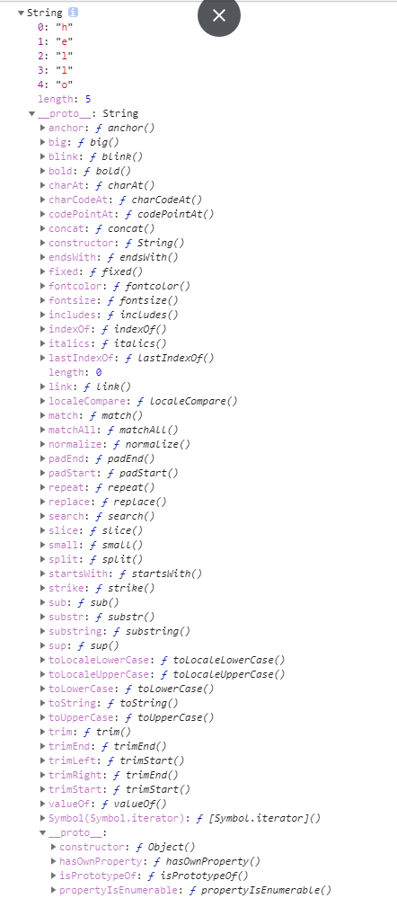

# String实例化包装对象的表达式和键值对





### __ proto __:String.prototype

##### 和数组相同的公共方法

| 公共方法      | array                                                        | string（类数组）                                             | Function    |
| ------------- | ------------------------------------------------------------ | ------------------------------------------------------------ | ----------- |
| length        | ✓                                                            | ✓                                                            | ✓类数组参数 |
| includes()    | ✓                                                            | ✓                                                            |             |
| indexOf()     | ✓                                                            | ✓                                                            |             |
| lastIndexOf() | ✓                                                            | ✓                                                            |             |
| concat()      | ✓                                                            | ✓                                                            |             |
| 截取          | str.slice(1)      <br/>str.slice(1,3)  <br/>str.slice(-3,-1) | 1.slice(-10,-1 );<br />2. substring(0,30) //参数2的值要比参数1大 |             |
| 填充          | 填充指定位置fill(’qsl’,1,4))                                 | 填充开头结尾 <br /> padStart(7,'111111'),padEnd()            |             |

##### trim去除空格

```
str.trim('   123')
```

##### endsWith判断是否以xxx开头结尾

endsWith()

startsWith()

##### repeat重复

```
repeat()
```

### own属性 

```js
  const str=new String('hello')
  console.log(Object.getOwnPropertyNames(str))//["0", "1", "2", "3", "4", "length"]
```
### ennumerable属性

```
  console.log(Object.keys(str))//["0", "1", "2", "3", "4"]
```


