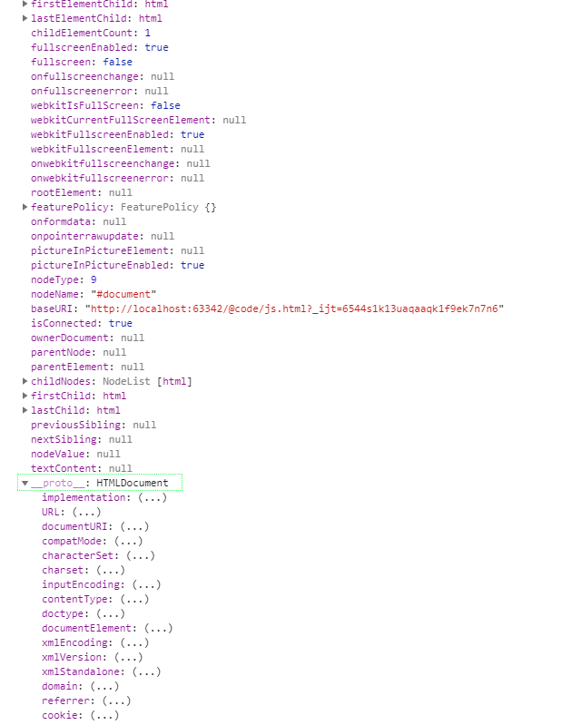
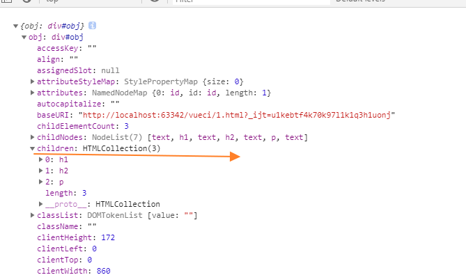
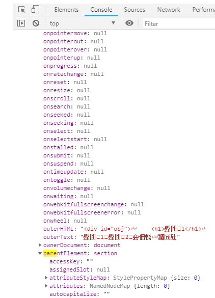

# document对象(对象存储和改变html)

代表整个文档 



```html
<!DOCTYPE html>
<html lang="en">
<head>
    <meta charset="UTF-8">
    <title>Title</title>
</head>
<body>
<div id="app">

</div>


</body>

<script>
    //document对象,windown顶部对象,
    console.log(document)
    console.log({document})


    console.log(Object.getPrototypeOf(document)) //"HTMLDocument"
    console.log(Object.getOwnPropertyNames(document))//["location"]
    console.log(Object.keys(document))//["location"]
 


</script>
</html>
  
```

# document.location

```
document.location===window.location
```

# document.cookie

JavaScript ==前端== 可以使用 **document.cookie** 属性来创建 、读取、及删除 cookie。

JavaScript 中，创建 cookie 如下所示：


```
document.cookie="username=John Doe";
```

您还可以为 cookie 添加一个过期时间（以 UTC 或 GMT 时间）。默认情况下，cookie 在浏览器关闭时删除：

```
document.cookie="username=John Doe; expires=Thu, 18 Dec 2043 12:00:00 GMT";
```

您可以使用 path 参数告诉浏览器 cookie 的路径。**默认情况下，cookie 属于当前页面**。

```
document.cookie="username=John Doe; expires=Thu, 18 Dec 2043 12:00:00 GMT; path=/";
```

1、服务器端每次访问的cookie是每次请求头中发送给服务器端的

2、客户端每次请求只发送当前路径下和“直系”关系的父路径的cookie（父路径的页面是不能访问子路径和兄弟路径的cookie的）

3、setcookie如果不设置路径，默认为当前页面的路径，父亲路径的页面是无法访问的

4 "/"这个根路径可以在任何路径下访问，求简单可以把cookie都放在这里。

#####  JavaScript 读取 Cookie的函数封装

```js
    function setCookie(cname, cvalue, exdays) {
      var d = new Date();
      d.setTime(d.getTime() + (exdays * 24 * 60 * 60 * 1000));
      var expires = "expires=" + d.toGMTString();
      document.cookie = cname + "=" + cvalue + "; " + expires;
    }

    function getCookie(cname) {
      var name = cname + "=";
      var ca = document.cookie.split(';');
      for (var i = 0; i < ca.length; i++) {
        var c = ca[i].trim();
        if (c.indexOf(name) == 0) {
          return c.substring(name.length, c.length);
        }
      }
      return "";
    }
```

# doument节点对象

el是document的key

### 获取已有节点对象

###### 获得html

```js
 var el = document.documentElement
```

###### 获得body

```
  var el = document.body
```

###### getElementById

```javascript
const el=document.getElementById("app") //返回dom节点对象
```

*id注入到了window*

```html


<p id="text">
  hello
</p>
<script>
  console.log(img)
  console.log(text)
  img.src = 'http://img.hb.aicdn.com/ee9c62e8caf1b7907072b90b8058b87b2b92b237102ea-4LB0wq_sq320'
  text.style.fontSize = '100px'

</script>

```

###### vue的ref

```
vue-$refs//返回dom节点对象和自定义组件对象
```

### 创建新的document的节点

###### 字面量创建(用于新建对象和控制台打印)

```
<div id='app'></div>
```

###### document.createElement创建节点

```
var el = document.createElement("A");
```


# el节点实例的所有属性和事件(真实对象数据结构)

div是HTMLDivElement的实例,注意对比div的原型和document的原型是不同的


## document的节点对象的状态

##### 通过属性访问当前节点的父、子和同胞


```html
<html xmlns="http://www.w3.org/1999/xhtml">
<head>


</head>
<body>
<span></span>
<div id="App">
  <li>1</li>
  <li>2</li>
  <a href="baidu">3</a>4
</div><p>
5
</p>
<script>
  const el = document.getElementById('App')

//列出下级节点 包含text和文档----------------------------------------------
  console.log('el.parentNode', el.parentNode)

  console.log('el.nextSibling',el.previousSibling)
  console.log('el.nextSibling',el.nextSibling)

  //列出下级的所有节点 包裹标签节点和文本节点(代码换行也算)  ie有兼容问题,-------------------------------
  //判断是否有子节点
  console.log('el.hasChildNodes', el.hasChildNodes())

  console.log('el.childNodes', el.childNodes)
  //第一个
  console.log(' el.firstChild', el.firstChild);
  //第二个
  console.log('el.firstChild.nextSibling', el.firstChild.nextSibling)
  //最后一个
  console.log(' el.lastChild', el.lastChild);
  //倒数第二个
  console.log('el.lastChild.previousSibling', el.lastChild.previousSibling);


  //列出下级标签节点----------------------------------------------------------------------------
  console.log(el.children)


  // 列出下级的li节点----------------------------------------------------------------------
  console.log(el.querySelectorAll('li'))


  //文本节点-------------------------------------------------------------------------------
  console.log(el.querySelectorAll('li')[0].childNodes)

</script>
</body>
</html>

```


##### 节点的类型属性

```html
<!DOCTYPE HTML PUBLIC "-//W3C//DTD HTML 4.01 Transitional//EN">
<html>
<head>
    <title>index.html</title>

    <meta charset="utf-8">


</head>
<body>

<a href="www.baidu.com" data-src="baidu" id="app">百度</a>

</body>
</html>
<script type="text/javascript">
    function log(data) {
        console.log(data);
    }


    var el = document.getElementsByTagName("a")[0];


    log("----------A标签节点----------------");
    log({el})
    log(el.nodeName);//A
    log(el.nodeValue);//null
    log(el.nodeType);//1
    log(el.attributes) //{0: href, 1: name, 2: id, 3: data-src, href: href,  id: id, data-src: data-src, length: 3}
    log(el.dataset) //{src: "baidu"}


    log("----------text节点----------------");

    const textNode = el.firstChild
    console.log('textNode:', {textNode})
</script>

```

##### 节点的高度宽度属性

```js
<!DOCTYPE html>
<html lang="en">
<head>
  <meta charset="UTF-8">
  <title>Title</title>
</head>


<body>


<main>
  <section id="app" onclick="go()" style="height: 310px">
    <p>
    </p>
  </section>
</main>
<script>


  function fn() {
    var el
    el = document.documentElement
    // el = document.body
    // el = document.getElementById('app')

    el.scrollTop = 200
    //高度---------------------------xxxHeight-----------------------
    //console.log('style.height:', el.style.height)

    console.log('clientHeight', el.clientHeight)// 父区域视口高度   (包括滚动条槽),
    console.log('scrollHeight', el.scrollHeight) //滚动区域的高度
    console.log('offsetHeight', el.offsetHeight)//控件自身的高度css高度        (height+border)


    //高度---------------------------xxxWidth-----------------------
    //console.log('style.width:', el.style.width)

    console.log('clientWidth', el.clientWidth)
    console.log('scrollWidth', el.scrollWidth)
    console.log('offsetWidth', el.offsetWidth)


    //局部顶部的高度-----------------xxxTop------------------------------------------------------
    console.log('clientTop', el.clientTop)//10 //控件的父区域(overflow)到上层区域的高度(就是边框)
    console.log('offsetTop', el.offsetTop)//它返回当前元素相对于其 offsetParent 元素的顶部的距离。
    console.log('el.scrollTop:', el.scrollTop)//控件顶端到垂直滚动条顶端的距离


    //局部顶部的高度--------------------------xxxLeft---------------------------------------------
    console.log('clientLeft', el.clientLeft)//10
    console.log('offsetLeft', el.offsetLeft)//50
    console.log('el.scrollLeft:', el.scrollLeft)

  }

  setTimeout(() => {
    fn()
  }, 10)
</script>

<style>

  main {
    width: 130%;
    height: 2000px;
  }

  section {
    width: 300px;
    height: 300px;
    margin: 50px;
    padding: 20px;
    border: 10px solid gray;
    overflow: scroll;
  }

  p {
    height: 600px;
    width: 600px;
    background: red
  }


</style>

</body>
</html>

```

##### 表单节点的特别属性

```
<input type="file" onchange="console.log(this.files[0])"></input>
```

```
<input onchange="console.log(this.value)" value="123" />
```

##### 节点的自定义属性

```html
<meta charset="uft-8">
<script>
  function addElement() {
    //创建新节点对象
    var el = document.createElement("A");

    //通过 . 设置系统属性
    el.id = 'app'
    el.target = '_black'

    //设置和获取系统属性和自定义属性
    el.setAttribute('href', '#')
    el.getAttribute('href')//获得href
    el.setAttribute('someattr', '123')
    //移除系统属性和自定义属性
    el.removeAttribute('id')
    //在el节点下级插入文本
    var text = document.createTextNode("Hi there and greetings!");
    el.appendChild(text);

    //el插入到body
    document.body.appendChild(el)
  }

  addElement()
</script>

```

##### 节点的style属性

```html
<div id="app">

  1111111111111111

</div>

<script>
  app.style.color='white'
  //设置变量
  app.style.setProperty('--bg', 'red');
  //获得变量
  const color=app.style.getPropertyValue('--bg').trim();
  console.log(color)
  // 删除变量
  app.style.removeProperty('--primary');
</script>

<style>
  #app {
    background: var(--bg)
  }

</style>

```

##### el节点对象的使用场景

###### vue组件对象注入el对象




###### 指令的回调参数也是el对象



###### 全局对象event注入了el对象

```
event.target===el
```

##### 例

```html
<body>


</body>

<meta charset="uft-8">
<script>
  function addElement() {
    //创建新节点对象
    var el = document.createElement("A");

    //通过 . 设置系统属性
    el.id = 'app'
    el.target = '_black'

    //设置和获取系统属性和自定义属性
    el.setAttribute('href', '#')
    el.getAttribute('href')//获得href
    el.setAttribute('someattr', '123')
    //移除系统属性和自定义属性
    el.removeAttribute('id')
    //在el节点下级插入文本
    var text = document.createTextNode("Hi there and greetings!");
    el.appendChild(text);

    //el插入到body
    document.body.appendChild(el)
  }

  addElement()
</script>

```


## el的事件(监听dom event)

### 节点的事件名

##### 鼠标事件

| 属性                                                         | 事件                        | 描述                                   | DOM  |
| ------------------------------------------------------------ | --------------------------- | -------------------------------------- | ---- |
| [onclick](https://www.runoob.com/jsref/event-onclick.html)   | 点击事件                    | 当用户点击某个对象时调用的事件句柄。   | 2    |
| [oncontextmenu](https://www.runoob.com/jsref/event-oncontextmenu.html) | 右键                        | 在用户点击鼠标右键打开上下文菜单时触发 |      |
| [ondblclick](https://www.runoob.com/jsref/event-ondblclick.html) | 双击                        | 当用户双击某个对象时调用的事件句柄。   | 2    |
| [onmousedown](https://www.runoob.com/jsref/event-onmousedown.html) | 按下鼠标                    | 鼠标按钮被按下。                       | 2    |
| [onmouseenter](https://www.runoob.com/jsref/event-onmouseenter.html) | 移动到元素上触发            | 当鼠标指针移动到元素上时触发。         | 2    |
| [onmouseleave](https://www.runoob.com/jsref/event-onmouseleave.html) | 移出元素触发                | 当鼠标指针移出元素时触发               | 2    |
| [onmousemove](https://www.runoob.com/jsref/event-onmousemove.html) | 鼠标移动                    | 鼠标被移动。                           | 2    |
| [onmouseover](https://www.runoob.com/jsref/event-onmouseover.html) | 鼠标移动某元素上---指定某个 | 鼠标移到某元素之上。                   | 2    |
| [onmouseout](https://www.runoob.com/jsref/event-onmouseout.html) | 鼠标从某元素移开            | 鼠标从某元素移开。                     | 2    |
| [onmouseup](https://www.runoob.com/jsref/event-onmouseup.html) | 松开                        | 鼠标按键被松开。                       | 2    |

 

##### 键盘事件

| 属性                                                         | 描述                       | DOM  |
| ------------------------------------------------------------ | -------------------------- | ---- |
| [onkeydown](https://www.runoob.com/jsref/event-onkeydown.html) | 某个键盘按键被按下。       | 2    |
| [onkeypress](https://www.runoob.com/jsref/event-onkeypress.html) | 某个键盘按键被按下并松开。 | 2    |
| [onkeyup](https://www.runoob.com/jsref/event-onkeyup.html)   | 某个键盘按键被松开。       | 2    |

 

##### 框架/对象（Frame/Object）事件

| 属性                                                         | 描述                                                         | DOM  |
| ------------------------------------------------------------ | ------------------------------------------------------------ | ---- |
| [onabort](https://www.runoob.com/jsref/event-onabort.html)   | 图像的加载被中断。 ( <object>)                               | 2    |
| [onbeforeunload](https://www.runoob.com/jsref/event-onbeforeunload.html) | 该事件在即将离开页面（刷新或关闭）时触发                     | 2    |
| [onerror](https://www.runoob.com/jsref/event-onerror.html)   | 在加载文档或图像时发生错误。 ( <object>, <body>和 <frameset>) |      |
| [onhashchange](https://www.runoob.com/jsref/event-onhashchange.html) | 该事件在当前 URL 的锚部分发生修改时触发。                    |      |
| [onload](https://www.runoob.com/jsref/event-onload.html)     | 一张页面或一幅图像完成加载。                                 | 2    |
| [onpageshow](https://www.runoob.com/jsref/event-onpageshow.html) | 该事件在用户访问页面时触发                                   |      |
| [onpagehide](https://www.runoob.com/jsref/event-onpagehide.html) | 该事件在用户离开当前网页跳转到另外一个页面时触发             |      |
| [onresize](https://www.runoob.com/jsref/event-onresize.html) | 窗口或框架被重新调整大小。                                   | 2    |
| [onscroll](https://www.runoob.com/jsref/event-onscroll.html) | 当文档被滚动时发生的事件。                                   | 2    |
| [onunload](https://www.runoob.com/jsref/event-onunload.html) | 用户退出页面。 ( <body> 和 <frameset>)                       | 2    |

 

##### 表单事件

| 属性                                                         | 描述                                                         | DOM  |
| ------------------------------------------------------------ | ------------------------------------------------------------ | ---- |
| [onblur](https://www.runoob.com/jsref/event-onblur.html)     | 元素失去焦点时触发                                           | 2    |
| [onchange](https://www.runoob.com/jsref/event-onchange.html) | 该事件在表单元素的内容改变时触发( <input>, <keygen>, <select>, 和 <textarea>) | 2    |
| [onfocus](https://www.runoob.com/jsref/event-onfocus.html)   | 元素获取焦点时触发                                           | 2    |
| [onfocusin](https://www.runoob.com/jsref/event-onfocusin.html) | 元素即将获取焦点时触发                                       | 2    |
| [onfocusout](https://www.runoob.com/jsref/event-onfocusout.html) | 元素即将失去焦点时触发                                       | 2    |
| [oninput](https://www.runoob.com/jsref/event-oninput.html)   | 元素获取用户输入时触发                                       | 3    |
| [onreset](https://www.runoob.com/jsref/event-onreset.html)   | 表单重置时触发                                               | 2    |
| [onsearch](https://www.runoob.com/jsref/event-onsearch.html) | 用户向搜索域输入文本时触发 ( <input="search">)               |      |
| [onselect](https://www.runoob.com/jsref/event-onselect.html) | 用户选取文本时触发 ( <input> 和 <textarea>)                  | 2    |
| [onsubmit](https://www.runoob.com/jsref/event-onsubmit.html) | 表单提交时触发                                               | 2    |

##### 剪贴板事件

| 属性                                                       | 描述                           | DOM  |
| ---------------------------------------------------------- | ------------------------------ | ---- |
| [oncopy](https://www.runoob.com/jsref/event-oncopy.html)   | 该事件在用户拷贝元素内容时触发 |      |
| [oncut](https://www.runoob.com/jsref/event-oncut.html)     | 该事件在用户剪切元素内容时触发 |      |
| [onpaste](https://www.runoob.com/jsref/event-onpaste.html) | 该事件在用户粘贴元素内容时触发 |      |

##### 打印事件

| 属性                                                         | 描述                                                 | DOM  |
| ------------------------------------------------------------ | ---------------------------------------------------- | ---- |
| [onafterprint](https://www.runoob.com/jsref/event-onafterprint.html) | 该事件在页面已经开始打印，或者打印窗口已经关闭时触发 |      |
| [onbeforeprint](https://www.runoob.com/jsref/event-onbeforeprint.html) | 该事件在页面即将开始打印时触发                       |      |

##### 拖动事件

| 事件                                                         | 描述                                 | DOM  |
| ------------------------------------------------------------ | ------------------------------------ | ---- |
| [ondrag](https://www.runoob.com/jsref/event-ondrag.html)     | 该事件在元素正在拖动时触发           |      |
| [ondragend](https://www.runoob.com/jsref/event-ondragend.html) | 该事件在用户完成元素的拖动时触发     |      |
| [ondragenter](https://www.runoob.com/jsref/event-ondragenter.html) | 该事件在拖动的元素进入放置目标时触发 |      |
| [ondragleave](https://www.runoob.com/jsref/event-ondragleave.html) | 该事件在拖动元素离开放置目标时触发   |      |
| [ondragover](https://www.runoob.com/jsref/event-ondragover.html) | 该事件在拖动元素在放置目标上时触发   |      |
| [ondragstart](https://www.runoob.com/jsref/event-ondragstart.html) | 该事件在用户开始拖动元素时触发       |      |
| [ondrop](https://www.runoob.com/jsref/event-ondrop.html)     | 该事件在拖动元素放置在目标区域时触发 |      |

##### 多媒体（Media）事件

| 事件                                                         | 描述                                                         | DOM  |
| ------------------------------------------------------------ | ------------------------------------------------------------ | ---- |
| [onabort](https://www.runoob.com/jsref/event-onabort-media.html) | 事件在视频/音频（audio/video）终止加载时触发。               |      |
| [oncanplay](https://www.runoob.com/jsref/event-oncanplay.html) | 事件在用户可以开始播放视频/音频（audio/video）时触发。       |      |
| [oncanplaythrough](https://www.runoob.com/jsref/event-oncanplaythrough.html) | 事件在视频/音频（audio/video）可以正常播放且无需停顿和缓冲时触发。 |      |
| [ondurationchange](https://www.runoob.com/jsref/event-ondurationchange.html) | 事件在视频/音频（audio/video）的时长发生变化时触发。         |      |
| onemptied                                                    | 当期播放列表为空时触发                                       |      |
| [onended](https://www.runoob.com/jsref/event-onended.html)   | 事件在视频/音频（audio/video）播放结束时触发。               |      |
| [onerror](https://www.runoob.com/jsref/event-onerror-media.html) | 事件在视频/音频（audio/video）数据加载期间发生错误时触发。   |      |
| [onloadeddata](https://www.runoob.com/jsref/event-onloadeddata.html) | 事件在浏览器加载视频/音频（audio/video）当前帧时触发触发。   |      |
| [onloadedmetadata](https://www.runoob.com/jsref/event-onloadedmetadata.html) | 事件在指定视频/音频（audio/video）的元数据加载后触发。       |      |
| [onloadstart](https://www.runoob.com/jsref/event-onloadstart.html) | 事件在浏览器开始寻找指定视频/音频（audio/video）触发。       |      |
| [onpause](https://www.runoob.com/jsref/event-onpause.html)   | 事件在视频/音频（audio/video）暂停时触发。                   |      |
| [onplay](https://www.runoob.com/jsref/event-onplay.html)     | 事件在视频/音频（audio/video）开始播放时触发。               |      |
| [onplaying](https://www.runoob.com/jsref/event-onplaying.html) | 事件在视频/音频（audio/video）暂停或者在缓冲后准备重新开始播放时触发。 |      |
| [onprogress](https://www.runoob.com/jsref/event-onprogress.html) | 事件在浏览器下载指定的视频/音频（audio/video）时触发。       |      |
| [onratechange](https://www.runoob.com/jsref/event-onratechange.html) | 事件在视频/音频（audio/video）的播放速度发送改变时触发。     |      |
| [onseeked](https://www.runoob.com/jsref/event-onseeked.html) | 事件在用户重新定位视频/音频（audio/video）的播放位置后触发。 |      |
| [onseeking](https://www.runoob.com/jsref/event-onseeking.html) | 事件在用户开始重新定位视频/音频（audio/video）时触发。       |      |
| [onstalled](https://www.runoob.com/jsref/event-onstalled.html) | 事件在浏览器获取媒体数据，但媒体数据不可用时触发。           |      |
| [onsuspend](https://www.runoob.com/jsref/event-onsuspend.html) | 事件在浏览器读取媒体数据中止时触发。                         |      |
| [ontimeupdate](https://www.runoob.com/jsref/event-ontimeupdate.html) | 事件在当前的播放位置发送改变时触发。                         |      |
| [onvolumechange](https://www.runoob.com/jsref/event-onvolumechange.html) | 事件在音量发生改变时触发。                                   |      |
| [onwaiting](https://www.runoob.com/jsref/event-onwaiting.html) | 事件在视频由于要播放下一帧而需要缓冲时触发。                 |      |

##### 动画事件

| 事件                                                         | 描述                            | DOM  |
| ------------------------------------------------------------ | ------------------------------- | ---- |
| [animationend](https://www.runoob.com/jsref/event-animationend.html) | 该事件在 CSS 动画结束播放时触发 |      |
| [animationiteration](https://www.runoob.com/jsref/event-animationiteration.html) | 该事件在 CSS 动画重复播放时触发 |      |
| [animationstart](https://www.runoob.com/jsref/event-animationstart.html) | 该事件在 CSS 动画开始播放时触发 |      |

##### 过渡事件

| 事件                                                         | 描述                          | DOM  |
| ------------------------------------------------------------ | ----------------------------- | ---- |
| [transitionend](https://www.runoob.com/jsref/event-transitionend.html) | 该事件在 CSS 完成过渡后触发。 |      |

##### 其他事件

| 事件                                                         | 描述                                                         | DOM  |
| ------------------------------------------------------------ | ------------------------------------------------------------ | ---- |
| onmessage                                                    | 该事件通过或者从对象(WebSocket, Web Worker, Event Source 或者子 frame 或父窗口)接收到消息时触发 |      |
| onmousewheel                                                 | 已废弃。 使用 [onwheel](https://www.runoob.com/jsref/event-onwheel.html) 事件替代 |      |
| [ononline](https://www.runoob.com/jsref/event-ononline.html) | 该事件在浏览器开始在线工作时触发。                           |      |
| [onoffline](https://www.runoob.com/jsref/event-onoffline.html) | 该事件在浏览器开始离线工作时触发。                           |      |
| onpopstate                                                   | 该事件在窗口的浏览历史（history 对象）发生改变时触发。       |      |
| [onshow](https://www.runoob.com/jsref/event-onshow.html)     | 该事件当 <menu> 元素在上下文菜单显示时触发                   |      |
| onstorage                                                    | 该事件在 Web Storage(HTML 5 Web 存储)更新时触发              |      |
| [ontoggle](https://www.runoob.com/jsref/event-ontoggle.html) | 该事件在用户打开或关闭 <details> 元素时触发                  |      |
| [onwheel](https://www.runoob.com/jsref/event-onwheel.html)   | 该事件在鼠标滚轮在元素上下滚动时触发                         |      |


##### 鼠标/键盘事件对象

###### 属性

| 属性                                                         | 描述                                                         | DOM  |
| ------------------------------------------------------------ | ------------------------------------------------------------ | ---- |
| [altKey](https://www.runoob.com/jsref/event-altkey.html)     | 返回当事件被触发时，"ALT" 是否被按下。                       | 2    |
| [button](https://www.runoob.com/jsref/event-button.html)     | 返回当事件被触发时，哪个鼠标按钮被点击。                     | 2    |
| [clientX](https://www.runoob.com/jsref/event-clientx.html)   | 返回当事件被触发时，鼠标指针的水平坐标。                     | 2    |
| [clientY](https://www.runoob.com/jsref/event-clienty.html)   | 返回当事件被触发时，鼠标指针的垂直坐标。                     | 2    |
| [ctrlKey](https://www.runoob.com/jsref/event-ctrlkey.html)   | 返回当事件被触发时，"CTRL" 键是否被按下。                    | 2    |
| [Location](https://www.runoob.com/jsref/event-key-location.html) | 返回按键在设备上的位置                                       | 3    |
| [charCode](https://www.runoob.com/jsref/event-key-charcode.html) | 返回onkeypress事件触发键值的字母代码。                       | 2    |
| [key](https://www.runoob.com/jsref/event-key-key.html)       | 在按下按键时返回按键的标识符。                               | 3    |
| [keyCode](https://www.runoob.com/jsref/event-key-keycode.html) | 返回onkeypress事件触发的键的值的字符代码，或者 onkeydown 或 onkeyup 事件的键的代码。 | 2    |
| [which](https://www.runoob.com/jsref/event-key-which.html)   | 返回onkeypress事件触发的键的值的字符代码，或者 onkeydown 或 onkeyup 事件的键的代码。 | 2    |
| [metaKey](https://www.runoob.com/jsref/event-metakey.html)   | 返回当事件被触发时，"meta" 键是否被按下。                    | 2    |
| [relatedTarget](https://www.runoob.com/jsref/event-relatedtarget.html) | 返回与事件的目标节点相关的节点。                             | 2    |
| [screenX](https://www.runoob.com/jsref/event-screenx.html)   | 返回当某个事件被触发时，鼠标指针的水平坐标。                 | 2    |
| [screenY](https://www.runoob.com/jsref/event-screeny.html)   | 返回当某个事件被触发时，鼠标指针的垂直坐标。                 | 2    |
| [shiftKey](https://www.runoob.com/jsref/event-shiftkey.html) | 返回当事件被触发时，"SHIFT" 键是否被按下。                   | 2    |

###### 事件

| 方法                | 描述                   | W3C  |
| ------------------- | ---------------------- | ---- |
| initMouseEvent()    | 初始化鼠标事件对象的值 | 2    |
| initKeyboardEvent() | 初始化键盘事件对象的值 | 3    |


### 为el的dom监听事件(事件)添加/删除处理函数

三种方式为DOM元素的事件的书写处理函数

```html
<!--方式1，
双引号里可以放任何语句,
this===当前dom对象
优势可以自定义传参
-->
<button onmouseover="fn()" id="btn">btn</button>


<script>

  function fn() {
    //event 其实是window全局变量,注意不是global
    console.log(window.event)
  }
  const el = document.getElementById('btn')


  //方式2
    el.onmouseout = fn


    //方式3
    el.addEventListener('click', fn, false)
    setTimeout(() => {
            el.removeEventListener("click", fn, false);  //有效！
        }, 3000
    )

</script>

```


### 增删改查节点的el兄弟孩子节点 

```js
<meta charset="UTF-8">
<div id="wangjianlin">王健林</div>

<div id="persons">
    <div>马云</div>
    <div>马化腾</div>
    <div>李彦宏</div>
    <div>刘强东</div>
</div>
<button onclick="appendChild_()">appendChild_</button>
<button onclick="replaceChild_()">replaceChild</button>
<button onclick="removeChild_()">removeChild_</button>
<button onclick="InsertBefore_()">InsertBefore_</button>
<script>

    var persons = document.getElementById('persons')
    var wangjianlin = document.getElementById("wangjianlin");

    var shilei = document.createElement("div");//创建一个新的标签
    shilei.innerHTML = "石磊";

    function appendChild_() {
        persons.appendChild(wangjianlin);//添加

    }

    function replaceChild_() {
        persons.replaceChild(shilei, wangjianlin);//修改
    }

    function removeChild_() {
        persons.removeChild(shilei);//删除
    }


    /*
    target.insertBefore(newChild,existingChild)

        （1）.target：被插入节点和参考节点的父节点。

        （2）.newChild：必需，要被插入的新节点。

        （3）.existingChild：必需，规定在哪个节点前面插入新节点。
        */

    function InsertBefore_() {
        persons.insertBefore(shilei, persons.childNodes[0])
    }
</script>
```

```
<!DOCTYPE html>
<html>
<head>
    <meta charset="utf-8">

</head>
<body>

<ul id="myList">
    <li>Coffee</li>
    <li>Tea</li>
</ul>

<button onclick="myFunction()">单击按钮插入一个项目列表</button>
<script>
    function myFunction() {
        const li = document.createElement("LI")
        const text = document.createTextNode("Water")
        li.appendChild(text)
        const ul = document.getElementById("myList")
        ul.insertBefore(li, ul.childNodes[0]);
    }
</script>


</body>
</html>
```


# Event(记录dom事件)

1. `Event` 接口表示在 DOM 中发生的任何事件; 一些是用户生成的（例如鼠标或键盘事件），而其他由 API 生成（例如指示动画已经完成运行的事件，视频已被暂停等等）。事件通常由外部源触发，同样也会以编程方式触发，例如执行一个 `element` 的一个 [HTMLElement.click( )](https://developer.mozilla.org/en-US/docs/Web/API/HTMLElement/click) 事件，或通过定义事件，然后使用 [EventTarget.dispatchEvent( )](https://developer.mozilla.org/en-US/docs/Web/API/EventTarget/dispatchEvent) 将其派发到一个指定的目标。有许多类型的事件，其中一些使用基于主要事件接口的其他接口。事件本身包含所有事件通用的属性和事件。

2. dom回调事件的实参

​            函数和实参的关系

```js
el.onclick=event=>{}//onclick监听客户的鼠标键盘做了什么   event 谁去做 客户的鼠标键盘的动作包装成对象
```

## 创建Event类型的实例化对象

### 1 浏览器会自动实例化对象event 记录默认事件 并注入到global.event

```html
<button onclick="fn(),fn(event),console.log(event)" id="btn">btn</button>


<script>

    console.log(event) //undifine也不是err 说明event声明过,事件操作只是为event赋值

    function fn() {
        console.log(event)
        //event 其实是window全局变量,注意不是global
        console.log(window.event)

    }


</script>

```

### 2 `evt=new  Event('build' )`

## event实例


### 常量

| 静态变量        | 描述                                 |
| --------------- | ------------------------------------ |
| CAPTURING-PHASE | 当前事件阶段为捕获阶段(1)            |
| AT-TARGET       | 当前事件是目标阶段,在评估目标事件(1) |
| BUBBLING-PHASE  | 当前的事件为冒泡阶段 (3)             |

### 属性

| 属性                                                         | 描述                                           |
| ------------------------------------------------------------ | ---------------------------------------------- |
| [bubbles](https://www.runoob.com/jsref/event-bubbles.html)   | 返回布尔值，指示事件是否是起泡事件类型。       |
| [cancelable](https://www.runoob.com/jsref/event-cancelable.html) | 返回布尔值，指示事件是否可拥可取消的默认动作。 |
| [currentTarget](https://www.runoob.com/jsref/event-currenttarget.html) | 返回其事件监听器触发该事件的元素。             |
| eventPhase                                                   | 返回事件传播的当前阶段。                       |
| [target](https://www.runoob.com/jsref/event-target.html)     | 返回触发此事件的元素（事件的目标节点）。       |
| [timeStamp](https://www.runoob.com/jsref/event-timestamp.html) | 返回事件生成的日期和时间。                     |
| [type](https://www.runoob.com/jsref/event-type.html)         | 返回当前 Event 对象表示的事件的名称。          |

### 事件

| 方法              | 描述                                     |
| ----------------- | ---------------------------------------- |
| initEvent()       | 初始化新创建的 Event 对象的属性。        |
| preventDefault()  | 通知浏览器不要执行与事件关联的默认动作。 |
| stopPropagation() | 不再派发事件。                           |

##### initEvent()

[见下方触发dom事件](#触发DOM事件)

##### preventDefault()

阻止默认

```html
<meta charset="UTF-8">

<div class="app">


  <a onclick="stopDefault(event)" href="http://baidu.com"> 原始阻止默认</a> <br>
</div>
<script>

  function stopDefault() {

    event.preventDefault()
    console.log('onlick')
  }

</script>

```

##### stopPropagation()

```html
<ul onclick="alert('ul')">

  <li onclick="stopPropagation() ;  alert('li')">
    li
  </li>

</ul>

<script>
  function stopPropagation(e) {

    e = e || window.event
    if (e.stopPropagation) { //W3C阻止冒泡事件
      e.stopPropagation()
    } else {
      e.cancelBubble = true //IE阻止冒泡事件
    }
  }
</script>

```


# 触发DOM事件

| 事件种类       | 新建-Envet实例(el方法的参数,  对象格式 谁去做 记录一组事件动作） | 为DOM元素的事件的书写处理函数 ,监听event              | 派发事件（函数,触发动作）                      |
| -------------- | ------------------------------------------------------------ | ----------------------------------------------------- | ---------------------------------------------- |
| **原生事件**   | 浏览器会自动实例化对象event 并注入到global.event             | 三种方式可以为DOM元素的事件的书写处理函数见下边de代码 | 外部资源(鼠标键盘)点击 或el.dispatchEvent(evt) |
| **自定义事件** | event1=new  Event('build' )或var evt = document.createEvent('Event');                evt.initEvent(type,true,true); | el.addEventListener( 'build',function(){ })           | el.dispatchEvent(evt)                          |

### 原生事件+键盘鼠标触发

鼠标键盘触发

### 原生事件+程序触发

```html
<button id="click">Click me!</button>

<script type="text/javascript">
window.onload = function () {
  var btn = document.querySelector('#click')
  //绑定事件
  btn.addEventListener('click', function (e) {
    alert('okk!')
  }, false)

  var e = new Event('click')
  btn.dispatchEvent(e)
  console.log(e)
}
</script>


```

### 自定义事件+程序触发

dispatchEvent() 事件给节点分派(分给)一个==合成事件==。

##### 第1种方式：

document.creatEvent------->evt.initEvent-------->el.dispatchEvent

1. createEvent（eventType）

该事件将创建一种新的事件类型，该类型由参数 *eventType* 指定。注意，该参数的值不是要创建的事件接口的名称，而是定义那个接口的 DOM 模块的名称。

参数：dom的eventType 共5种类型：
  Events ：包括所有的事件.

```js
     HTMLEvents：包括 'abort', 'blur', 'change', 'error', 'focus', 'load', 'reset', 'resize', 'scroll', 'select',
                  'submit', 'unload'. 事件
     UIEevents ：包括 'DOMActivate', 'DOMFocusIn', 'DOMFocusOut', 'keydown', 'keypress', 'keyup'.
                 间接包含 MouseEvents.
     MouseEvents：包括 'click', 'mousedown', 'mousemove', 'mouseout', 'mouseover', 'mouseup'.
     MutationEvents:包括 'DOMAttrModified', 'DOMNodeInserted', 'DOMNodeRemoved',
                   'DOMCharacterDataModified', 'DOMNodeInsertedIntoDocument',
                   'DOMNodeRemovedFromDocument', 'DOMSubtreeModified'.
```

```js
 
  onload 事件会在页面或图像加载完成后立即发生
    支持onload事件的标签 <body>, <frame>, <frameset>, <iframe>, , <link>, <script>
 
  window.onload = function () {
  // 当页面加载完成执行
  // 当页面完全加载所有内容（包括图像、脚本文件、CSS 文件等）执行
}
```

```js
//## ==onunload==


window.onunload = function () {
  // 当用户退出页面时执行
}

```


2. 在createEvent后必须初始化，为大家介绍5种对应的初始化事件

>  HTMLEvents 和 通用 Events：
>    **initEvent**( 'type', bubbles, cancelable )
>  UIEvents ：
>     **initUIEvent**( 'type', bubbles, cancelable, windowObject, detail )
>  MouseEvents：
>     **initMouseEvent**( 'type', bubbles, cancelable, windowObject, detail, screenX, screenY,
>         clientX, clientY, ctrlKey, altKey, shiftKey, metaKey, button, relatedTarget )
>  MutationEvents ：
>     **initMutationEvent**( 'type', bubbles, cancelable, relatedNode, prevValue, newValue, attrName, attrChange )


3. dispatchEvent(evt),

​       el.dispatchEvent(evt ) 触发el的事件

​       evt 参数是一个描述事件的 ActionScript 对象

==还可用自定义函数控制触发==

在调用 dispatchEvent() 事件之前，必须在代码中对其进行声明，此外，还必须创建一个事件对象以传递给 dispatchEvent()。该事件对象包含侦听器可用来处理该事件的有关信息。

eg

```html
<a href="/cs" id="a">ceshi</a>

<script>

var el = document.getElementById('a')
//建立和初始化event,推测等同于 new Envent===============
var evt = document.createEvent('MouseEvents')
evt.initMouseEvent('click', true, true, window, 1, 12, 345, 7, 220, false, false, true, false, 0, null)
//派发(发送类似$emit和$store.dispatch())事件
el.dispatchEvent(evt)
console.log(evt)
</script>


```

eg

```js
var rect={   dispatch : function(el ,type){

        try{

            if(el.dispatchEvent){

                var evt = document.createEvent('Event');

                evt.initEvent(type,true,true);

                el.dispatchEvent(evt);

            }else if(el.fireEvent){

                el.fireEvent('on'+type);

            }

        }catch(e){};

    }};

```

##### 第2种方式

new Event-------------el.dispatchEvent(newEvent )

```html
<meta charset="UTF-8">
<div id="app">

</div>

<script type="text/javascript">
  /* 监听dom事件build */
  app.addEventListener('build', function () {
    alert('你触发了自定义事件！' + newEvent.name)
  }, false)

  /* 创建一个事件对象，名字为newEvent，类型为build ,记录build事件*/
  var newEvent = new Event('build', { bubbles: true, cancelable: true, composed: true })
           //给这个事件对象创建一个属性并赋值 
  newEvent.name = '新的事件！'


  /* 触发自定义newEvent事件 */
  app.dispatchEvent(newEvent)
    
  console.log(newEvent)
</script>


```

new Event的子类

new MouseEvent(Event的子类)+el.dispatch( )触发

```html
<input type="file">

<button onclick="fn()">button</button>
<script>


const el = document.getElementsByTagName('input')[0]

function fn () {
  //注册鼠标事件
  const browseEvent=new MouseEvent('click')
  el.dispatchEvent(browseEvent)
  console.log(browseEvent)
}
</script>


```

