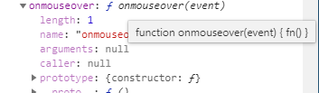

| 事件种类       | 新建Envet实例(数字化动作)（el方法的参数  对象格式 谁去做）   | 为DOM元素的事件的书写处理函数（el方法的函数体  做什么） | 派发事件（el的函数体）             |
| -------------- | ------------------------------------------------------------ | ------------------------------------------------------- | ---------------------------------- |
| **原生事件**   | 浏览器会自动实例化对象event 并注入到global.event             | 三种方式可以为DOM元素的事件的书写处理函数见下边de代码   | 鼠标键盘点击 或el.dispatchEvent(e) |
| **自定义事件** | `event1=new  Event('build' )`或<br />`var evt = document.createEvent('Event');                evt.initEvent(type,true,true);` | el.addEventListener( 'build',function(){ })             | el.dispatchEvent(e)                |

# DOM的事件

## dom事件(方法)和event对象的关系

```js
el.onclick=event=>{}//onclick方法做什么   event 谁去做做参数
```

## 为dom事件(方法)补充函数体

三种方式为DOM元素的事件的书写处理函数

```html
<!--方式1，
双引号里可以放任何语句,
this===当前dom对象
优势可以自定义传参
-->
<button onmouseover="fn()" id="btn">btn</button>


<script>

  function fn() {
    //event 其实是window全局变量,注意不是global
    console.log(window.event)
  }
  const el = document.getElementById('btn')


  //方式2
    el.onmouseout = fn


    //方式3
    el.addEventListener('click', fn, false)
    setTimeout(() => {
            el.removeEventListener("click", fn, false);  //有效！
        }, 3000
    )

</script>

```




# Event

事件动作的数字化

## 创建实例化对象

1 浏览器会自动实例化对象event 并注入到global.event

2 `event1=new  Event('build' )`

## 实例化对象


### 常量

| 静态变量        | 描述                                 | DOM  |
| --------------- | ------------------------------------ | ---- |
| CAPTURING-PHASE | 当前事件阶段为捕获阶段(1)            | 1    |
| AT-TARGET       | 当前事件是目标阶段,在评估目标事件(1) | 2    |
| BUBBLING-PHASE  | 当前的事件为冒泡阶段 (3)             | 3    |

### 属性

| 属性                                                         | 描述                                           | DOM  |
| ------------------------------------------------------------ | ---------------------------------------------- | ---- |
| [bubbles](https://www.runoob.com/jsref/event-bubbles.html)   | 返回布尔值，指示事件是否是起泡事件类型。       | 2    |
| [cancelable](https://www.runoob.com/jsref/event-cancelable.html) | 返回布尔值，指示事件是否可拥可取消的默认动作。 | 2    |
| [currentTarget](https://www.runoob.com/jsref/event-currenttarget.html) | 返回其事件监听器触发该事件的元素。             | 2    |
| eventPhase                                                   | 返回事件传播的当前阶段。                       | 2    |
| [target](https://www.runoob.com/jsref/event-target.html)     | 返回触发此事件的元素（事件的目标节点）。       | 2    |
| [timeStamp](https://www.runoob.com/jsref/event-timestamp.html) | 返回事件生成的日期和时间。                     | 2    |
| [type](https://www.runoob.com/jsref/event-type.html)         | 返回当前 Event 对象表示的事件的名称。          | 2    |

### 方法

| 方法              | 描述                                     | DOM  |
| ----------------- | ---------------------------------------- | ---- |
| initEvent()       | 初始化新创建的 Event 对象的属性。        | 2    |
| preventDefault()  | 通知浏览器不要执行与事件关联的默认动作。 | 2    |
| stopPropagation() | 不再派发事件。                           | 2    |


# 触发DOM事件

### 原生事件+键盘鼠标触发

鼠标键盘触发

### 原生事件+程序触发

```html

<button id="click">Click me!</button>

<script type="text/javascript">
window.onload = function () {
  var btn = document.querySelector('#click')
  //绑定事件
  btn.addEventListener('click', function (e) {
    alert('okk!')
  }, false)

  var e = new Event('click')
  btn.dispatchEvent(e)
  console.log(e)
}
</script>


```

### 自定义事件+程序触发

dispatchEvent() 方法给节点分派(分给)一个==合成事件==。

##### 第1种方式：

document.creatEvent-------evt.initEvent--------el.dispatchEvent

1. createEvent（eventType）

该方法将创建一种新的事件类型，该类型由参数 *eventType* 指定。注意，该参数的值不是要创建的事件接口的名称，而是定义那个接口的 DOM 模块的名称。

参数：dom的eventType 共5种类型：
  Events ：包括所有的事件.

```js
     HTMLEvents：包括 'abort', 'blur', 'change', 'error', 'focus', 'load', 'reset', 'resize', 'scroll', 'select',
                  'submit', 'unload'. 事件
     UIEevents ：包括 'DOMActivate', 'DOMFocusIn', 'DOMFocusOut', 'keydown', 'keypress', 'keyup'.
                 间接包含 MouseEvents.
     MouseEvents：包括 'click', 'mousedown', 'mousemove', 'mouseout', 'mouseover', 'mouseup'.
     MutationEvents:包括 'DOMAttrModified', 'DOMNodeInserted', 'DOMNodeRemoved',
                   'DOMCharacterDataModified', 'DOMNodeInsertedIntoDocument',
                   'DOMNodeRemovedFromDocument', 'DOMSubtreeModified'.
```

```js
 
  onload 事件会在页面或图像加载完成后立即发生
    支持onload事件的标签 <body>, <frame>, <frameset>, <iframe>, , <link>, <script>
 
  window.onload = function () {
  // 当页面加载完成执行
  // 当页面完全加载所有内容（包括图像、脚本文件、CSS 文件等）执行
}
```

```js
//## ==onunload==


window.onunload = function () {
  // 当用户退出页面时执行
}


```


2. 在createEvent后必须初始化，为大家介绍5种对应的初始化方法

>  HTMLEvents 和 通用 Events：
>      **initEvent**( 'type', bubbles, cancelable )
>   UIEvents ：
>       **initUIEvent**( 'type', bubbles, cancelable, windowObject, detail )
>   MouseEvents：
>       **initMouseEvent**( 'type', bubbles, cancelable, windowObject, detail, screenX, screenY,
>           clientX, clientY, ctrlKey, altKey, shiftKey, metaKey, button, relatedTarget )
>   MutationEvents ：
>       **initMutationEvent**( 'type', bubbles, cancelable, relatedNode, prevValue, newValue, attrName, attrChange )


3. dispatchEvent(eventObj),

​       btn.dispatchEvent(eventObj ) 触发谁的事件

​       eventObj 参数是一个描述事件的 ActionScript 对象

==还可用自定义函数控制谁触发==


在调用 dispatchEvent() 方法之前，必须在代码中对其进行声明，此外，还必须创建一个事件对象以传递给 dispatchEvent()。该事件对象包含侦听器可用来处理该事件的有关信息。


```js
var rect={   dispatch : function(el ,type){

        try{

            if(el.dispatchEvent){

                var evt = document.createEvent('Event');

                evt.initEvent(type,true,true);

                el.dispatchEvent(evt);

            }else if(el.fireEvent){

                el.fireEvent('on'+type);

            }

        }catch(e){};

    }};
```

##### 第2种方式

new Event-------------el.dispatchEvent(newEvent )

```html
<meta charset="UTF-8">
<div id="app">

</div>

<script type="text/javascript">
/* 创建一个事件对象，名字为newEvent，类型为build */
var newEvent = new Event('build', { bubbles: true, cancelable: true, composed: true })

/* 给这个事件对象创建一个属性并赋值 */
newEvent.name = '新的事件！'

/* 建立事件处理函数 */
app.addEventListener('build', function () {
  alert('你触发了自定义事件！' + newEvent.name)
}, false)

/* 触发自定义事件 */
app.dispatchEvent(newEvent)
console.log(newEvent)
</script>

```

-