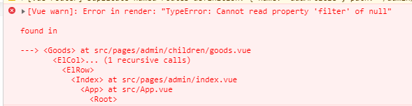

[^1]:分裂
[^2]: 剪接 
[^3]: n 一部分

# Array的静态函数

###  Array.isArray( )判断是否数组类型

```js
   1. Array.isArray(arr)
   2. arr instanceof Array //操作符不用.和括号
   3. arr.instructor=Array
   4. Array.prototype.isprototypeof(arr)
```

###  Array.of静态函数创建数组

```javascript
 Array.of（1）  //[1]
 Array.of（1，2，3）//[1,2,3]
```

### Array.from类数组转数组

```javascript
let ArrayLike = { 0 : "a", 1 : "b", 2 : "c" ,length:3};
Array.from(ArrayLike)
```

```
Array.from('abc')
```


# Array.prototype

##### 栈方法修改数组(只有此组改变原数组)

###### push  pop  unshift shift

```
    const arr = [1, 2, 3, 4]
          arr2=arr.push(5)//arr2函数返回值 arr是被影响的值
    console.log(arr)// [1,2,3,4,5]
    console.log(arr2) // 5

```

###### splice[^2]任意位置增删改

```javascript
const arr = [1, 2, 3, 4]
arr2=arr.splice(1,1,'a','b')
console.log(arr)//[1,'a','b',3,4]
console.log(arr2)//[2]
//在位置2开始删除1项插入'a','b',函数返回删除的1项[2]

```

##### 和string相同/相似的方法(包含和索引 合并和截取)

###### length

```
const arr=[1,2,3]
console.log(arr.length)
```

###### includes

```
 arr.includes(1)  //判断arr是否包含1 返回boolen,

 arr.includes({a:1})  //不能判断深层次包含
```

###### indexOf()

```
1. arr.indexOf(1)  //从前往后数第一个值为1的索引
2. arr.lastindexOf(1) //从后往前数第一个值为1的索引
3. arr.indexOf({a: 10}) //无法使用,返回-1,要用find
```

###### lastIndexOf()

```js
const arr=[1,2,3]
console.log(arr.lastIndexOf(2))
```

###### slice[^3] 截取

```
instance.slice（1，4）\\截取数组2到5不包含5

instance.slice（-3，-1）\\倒数第4到倒数第2不包含4
```

###### contact

```
//arr和类数组拥有
     const arr = [1, 2, 3], arr2 = [1,2,4, 5]
    allarry=arr.concat(arr2)
    console.log(arr) //[1,2,3]
    console.log(allarry) //[1,2,3,4,5]

```

###### fill() /padStart(7,'111111')填充数组(改变原数组)

```
 instance.fill(’qsl’,1,4) //填充qsl在位置2到5不包含5
```

##### 数组和字符串互转

###### join转字符串

```
[1, 2, 3, 4].join('-')
```
   _split[^1] 字符串转数组_

```javascript
'1234'.split('')
```
##### 数组迭代方法(不改变原数组)

###### every判断所有项符合某条件 返回boolen

```
 Array.prototype.every((item,index,self) => {})
```

###### some判断是否有符合某条件的项 返回boolen

```
 Array.prototype.some((item,index,self) => {})
 
```

###### map映射—>按照某条件返回数组

```
  Array.prototype.map((item,index,self) => {})
```

###### filter过滤—>符合某条件的元素 返回数组

```
 Array.prototype.filter((item,index,self) => {})
```

​           *数组去重*

```
const arr=["apple","banner","pear","banner","aaa"]
arr = arr.filter((item,index,self)=>{
       return self.indexOf(item) === index
      })
```

###### forEach对每一项操作

```
 Array.prototype.forEach((item,index,self) => {})
```

###### find数组搜索

```
arr.find(function(item, index, self) { return item>1 }) //查找第一个值
```
###### findindex搜索第一个符合条件的索引
```
arr.findindex(function(item, index, self) { return item > 9 }) //查找第一个索引
```

​             _已知id：2 ,获得{id:2,b:2}的索引_

```
arr=[{a:1,id:1},{b:2,id:2},{b:2,id:3}]
 const index =arr.findIndex((item,index,arr)=>{return item.id===3})
```

###### sort排序

从大到小

```
 Array.prototype.sort((a,b)=>b-a)
```
###### reverse反转
```
Array.prototype.reverse()//反转
```

###### reduce

```
array.reduce((total, item, index, self) => res += item, initialValue)

total：上一次调用回调返回的值，或者是提供的初始值（initialValue）

item：数组中正在处理的元素

index：数据中正在处理的元素索引，如果提供了 initialValue ，从0开始；否则从1开始

self： 调用 reduce 的数组

initialValue：可选项，其值用于第一次调用 callback 的第一个参数。如果没有设置初始值，则将数组中的第一个元素作为初始值。空数组调用reduce时没有设置初始值将会报错。

```

```html
<script>
    let array = [
        {
            name: 'apple',
            price: 10
        }, {
            name: 'banana',
            price: 9
        }
    ];
     //全局变量
    let sumprice = 0;
    
    for (let index = 0; index < array.length; index++) {
        const element = array[index];
        sumprice += element.price;
    }
    console.log('for example sumprice',sumprice);

    /*
        reduce 语法实现
        total    必需。初始值, 或者计算结束后的返回值。
        currentValue    必需。当前元素
        currentIndex    可选。当前元素的索引
        arr    可选。当前元素所属的数组对象。
    */
    sumprice = array.reduce(function (total, item, index, self) {
        return total + currentValue.price;
    }, 0);
    console.log('for reduce sumprice',sumprice);
</script>
```


###### _ _proto__

```js
__proto__:Object.prototype
```

# 实例的 in属性(真实数据结构)


### _ _proto__

```
__proto__:Array.proto
```

### ownProperty

```javascript
['leng','0','1']
```

##### keys(EnumerableProperty()

```javascript
['0','1']
```

# 应用

##### 利用js找出数组中最大值

1.es6拓展运算符...

```
Math.max(...arr)
```

2.es5 apply(与方法1原理相同)

```
Math.max.apply(null,arr)
```

3.for循环

```
let max = arr[0];
for (let i = 0; i < arr.length - 1; i++) {
    max = max < arr[i+1] ? arr[i+1] : max
}
```

4.数组sort()

```
arr.sort((num1, num2) => {
    return num1 - num2 < 0
})
arr[0]
```

5.数组reduce

```
arr.reduce((num1, num2) => {
    return num1 > num2 ? num1 : num2}
)
```


# 错误

### null,undefine 报错的解决方法

数组的方法的主题必须是数组 若为null,undefine就不是数组会报错



解决方法1 先判断是否爲数组

```
if(Array.isArray(arr)){

arr.filter(..)
}

```

解决方法2 ., ||

```
const arr=null

const _arr=arr||[]

const arr2=_arr.filter(..)

```


