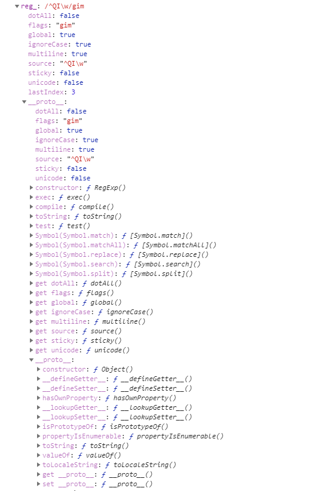

# RegExp

### RegExp.prototype

##### test( )  /  exec( )

见上方gmi修饰符

若reg.test判定为true, reg.exe(str)才不是undefined

```javascript
reg.test判定为true, reg.exe(str)才不是undefined
```


#  RegExp的实例化

## 构造函数新建对象

```js
var reg = new RegExp('hello','g');   //代替/hello/g
```

## 字面量新建对象

### 匹配字符

####  转意字符匹配(单字符)

```
 . 代表任意字符   \. 表示真实的.

\n   换行  ~next

\t   制表 tab制表符

\r   回车  ~return

\s   空格  ~space

\S   非空格

\d   数字  ~[英]digit

\D   非数字

\w   字符 ( 字母 ，数字，下划线_ )   //[英]word

\W   非字符

```

#### 自定义匹配(单字符)

#####  [ - ] 自定义匹配范围

[a-z A-Z]匹配英文大小写

[0-3]匹配0，1，2，3

[0-9]+ 匹配数字（注意后面有 +，不可以为空）

##### [ ^  ]排除后的范围匹配

[  ^ ]表示排除  [ ^  \s ]

[^ 0-3 ]匹配 4，5，6，7，8，9

### $ ^匹配位置

匹配输入字符串的结尾位置。

```js
var str = 'lei is shilei'

const reg = /lei$/

console.log(reg.test(str)) //true
console.log(reg.exec(str)) //["lei", index: 10, input: "lei is shilei", groups: undefined]

```

如果设置了 RegExp 对象的 Multiline 属性，则 $ ^也匹配 '\n' 或 '\r'。

```js
  var str = 'qinshilei\nqinshilei'

  const reg = /lei$/mg

  console.log(reg.test(str)) //true

  console.log(reg.exec(str)) //["lei", index: 16, input: "qinshilei↵qinshilei", groups: undefined]
```

### ?+*{}  匹配次数

##### ?
 runo? 可以匹配 run 或者 runo，? 问号代表前面的字符最多只可以出现一次（0次、或1次）。**

##### +
 runoo+b，可以匹配 runoob、runooob、runoooooob 等，+ 号代表前面的字符必须至少出现一次（1次或多次）。
##### *
 runoo * b，可以匹配 runob、runoob、runoooooob 等，* 号代表字符可以不出现，也可以出现一次或者多次（0次、或1次、或多次）。

##### *+的贪婪模式和?的懒惰模式

###### 贪婪模式* +

" * "限定符和" + "限定符都是__贪婪的__，因为它们会尽可能多的匹配文字，

如：``如果用正则匹配src中内容非懒惰模式匹配`/src=".*"/`

匹配结果是：`src="test.jpg" width="60px" height="80px"`意思是从="往后匹配，直到最后一个 **"** 匹配结束

###### 懒惰模式正则?

在它们的后面加上一个?就可以实现非贪婪或最少匹配。

`/src=".*?"/`

结果：`src="test.jpg"`因为匹配到第一个 **"** 就结束了一次匹配。不会继续向后匹配。因为他懒惰嘛。

```
const str = ``

const reg = /src=".*?"/

console.log(reg.test(str))
console.log(reg.exec(str))

```

##### {}自定义次数

{}一般用来表示匹配的长度，

\s{3} 表示匹配三个空格，

\s{1,3}表示匹配一到三个空格。

o{,3}

(a|b){3,}

### ( )分组捕获

##### 1.分组

_多字符_(abc)

一个分组中可以像上面这样有一个具体的表达式，这样可以优雅地表达一个重复的字符串

```
/(ha){3}/
/hahaha/
```

_或操作_（a|b）

```
（a|b）匹配a或者b
```

##### 2.捕获,捕获值赋值到reg.exec('xxx')[1]

   ```js
const str = 'qinshilei\nqinshiwei'

    const reg = /qin/
    const reg_ = /^QIn/gmi


    console.log(str.match(reg)) //["qin", index: 0, input: "qinshilei_qinshiwei", groups: undefined],匹配第一个符合正则的字符串
    console.log(str.match(reg_))//["qin", "qin"] ,可以用于知道匹配的数量
   ```

 *访问捕获的内容*

1. reg.exec('xxx')[1]

```js
    const reg = /(doubi) is a doubi/
    const arr=reg.exec('doubi is a doubi')
    console.log(arr)// [0: "doubi is a doubi" 1: "doubi"]
```
2. 可以通过global变量RegExp.$1访问,

``` js
    console.log(RegExp.$1 )//doubi,记忆窍门:和$1===reg.exec('xxx')[1}
```

3. 在表达式里通过/1访问

```js

   const reg = /(doubi) is a \1/
    console.log(reg.exec('doubi is a doubi'))// [0: "doubi is a doubi" 1: "doubi"]
    console.log(RegExp.$1 )//doubi

```

### (?)

##### (?:)分组不捕获

只起到分组的作用 不捕获

```js

  const reg = /kid is (?:doubi){2}/
  const str='kid is doubidoubi'

  console.log(reg.test(str))// true
  console.log(reg.exec(str))// [0:kid is doubidoubi]


```

##### (?=)  分组不捕获前瞻

1.分组 2 .前瞻往前看一下是否有相等的值,有则reg.test( )返回true

```js
//开头就前瞻
const reg = /^(?=haha)/
const str = "hahaha"

console.log(reg.test(str))//true
```

```js
const reg = /kid is a (?=doubi)/
console.log(reg.exec('kid is a doubi'))// [0:kid is a ]  不捕获的话数组的第2个键值为空
```

#####  (?!)  分组不捕获前瞻否定

1.分组 2.往前看一下是否有不相等的值,有则reg.test( )返回true

```js

    const reg = /kid is a (?!doubi)/

    console.log(reg.test('kid is a doubi')) // false
    console.log(reg.test('kid is a shabi')) // true
    console.log(reg.exec('kid is a doubi'))// null
    console.log(reg.exec('kid is a shabi'))// ['0':"kid is a"]
```

#####   (?<=)分组不捕获后瞻

1.分组 2 .后瞻往后看一下是否有相等的值,有则reg.test( )返回true

```js
 const reg = /(?<=doubi)\sme/

  console.log(reg.test('kid is a doubi me')) // true
  console.log(reg.test('kid is a shabi me')) // false
  console.log(reg.exec('kid is a doubi me'))// [" ma", index: 14, input: "kid is a doubi ma", groups: undefined]
  console.log(reg.exec('kid is a shabi me'))// null
```

##### (?<!) 分组不捕获后瞻否定

1.分组 2 .后瞻往后看一下是否有不相等的值,有则reg.test( )返回true

```js
  const reg = /(?<!doubi)\sme/

  console.log(reg.test('kid is a doubi me')) // false
  console.log(reg.test('kid is a shabi me')) // true
  console.log(reg.exec('kid is a doubi me'))// null
  console.log(reg.exec('kid is a shabi me'))// [" me", index: 14, input: "kid is a shabi me", groups: undefined]
```

### gmi修饰符:

new  RegExp)( )的参数

/g [英]globe: 全局匹配

/m [英]multi-line :多行匹配

/i  [英]ignoreCase:对大小写不敏感

```javascript
    const str = 'qinshilei\nqinshiwei'

    const reg = /qin/
    const reg_ = /^QIn/gmi


    console.log(str.match(reg)) //["qin", index: 0, input: "qinshilei_qinshiwei", groups: undefined],匹配第一个符合正则的字符串
    console.log(str.match(reg_))//["qin", "qin"] ,可以用于知道匹配的数量


    console.log(str.replace(reg, 'wang')) //wangshilei↵qinshiwei
    console.log(str.replace(reg_, 'wang'))//wangshilei↵wangshiwei
    console.log(str.replace(reg, item => item.toUpperCase())) //QINshilei↵qinshiwei
    console.log(str.replace(reg_, item => item.toUpperCase()))//QINshilei↵QINshiwei


    console.log(str.search(reg)) //0
    console.log(str.search(reg_))//0   //**唯一\g修饰符无效的,search到第一个词就停止


    console.log(reg.test(str))//true
    console.log(reg_.test(str))//true


    console.log(reg.exec(str))//["qin", index: 0, input: "qinshilei↵qinshiwei", groups: undefined]  ,和str.match(reg)返回结果相同
    console.log(reg_.exec(str))//["qin", index: 10, input: "qinshilei↵qinshiwei", groups: undefined]//匹配最后一个匹配,而不是所有
```


## RegExp的实例化对象键值对




### _ _proto__

```
__proto__：RegExp.prototype
```

### ownProperty

```js
console.log(reg.hasOwnProperty('lastIndex'))//true
console.log(Object.getOwnPropertyNames(reg))//["lastIndex"] 记录test exec匹配的字符串的最后一位的索引
```
##### ennumberable

只包含一些用户自定义的key

```js
console.log(reg.propertyIsEnumerable('lastIndex'))//false
console.log(Object.keys(reg))//[]
```
# 应用

``` js
匹配中文：[\u4e00-\u9fa5]
行首行尾空格：^\s*|\s*$
Email：^\w+@[a-z0-9]+(\.[a-z]+){1,3}$
网址：[a-zA-z]+://[^\s]*
QQ号：[1-9][0-9]{4,9}
邮政编码：[1-9]\d{5}
身份证：[1-9]\d{14}|[1-9]\d{17}|[1-9]\d{16}x

```


```js
   //str.replace(reg,fn(item){})替换网址
   function replaceReg(reg, str) {
        return str.replace(reg, function (item) {
            return `<a href="item">${item}</a>`;
        })
    }

    var reg = /http:\/\/[\w-]*(\.[\w-]*)+/ig;
    var str = '将一个用户输入的一段文字中的url替换成可以点击的link地址http://www.baidu.com';
    document.write(replaceReg(reg, str));

```


