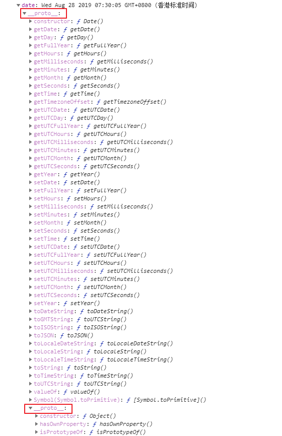

# new  Date(i？:string|number)

```js
const dataObj=new Date()//返回当前时间对象,字面量为Tue Sep 03 2019 20:30:41 GMT+0800 (香港标准时间)
```
```js
const dataObj=new Date('2017-05-03')//字面量为Wed May 03 2017 00:00:00 GMT+0800 (香港标准时间)
```
```js
const dataObj=new Data(msTimeStamp:nuber)//Wed May 03 2017 00:00:00 GMT+0800 (香港标准时间)
const dataObj=new Data(secondTimeStamp*1000:number)//Wed May 03 2017 00:00:00 GMT+0800 (香港标准时间)
```


#  实例化对象




# 时间对象转为字符串和格式调整

### Object.prototype.toLocaleDateString.call(d:Date):String

```
dataObj.toLocaleDateString()  //2017-05-03
```

### String.prototype.replace.call(str:String,reg：RegExp ):string  字符串再调整格式

```

```

# Date对象转为时间戳(数字类型)

```
dateObj-0 强制转化
Object.prototype.valueOf.call(d:Date):Number;
Date.prototype.getTime.call(d:Date):Numbe；
Date.parse(d:Data):Numbe；;//精确到s最后三位为0
```


