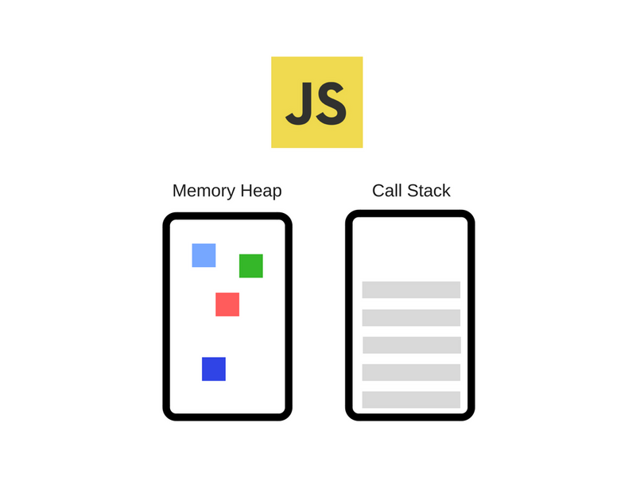
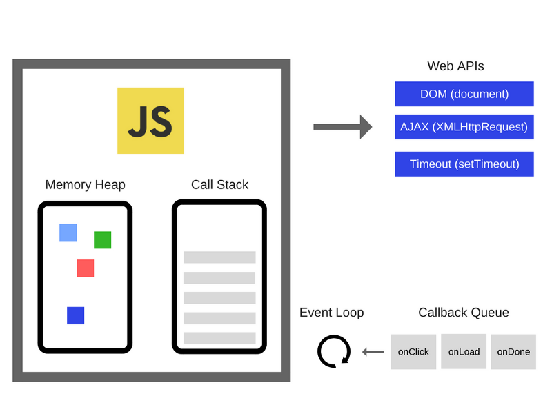
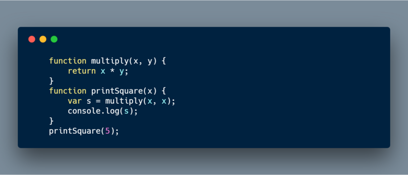
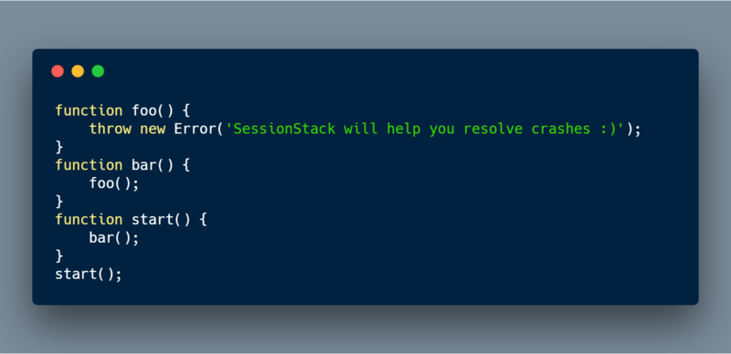
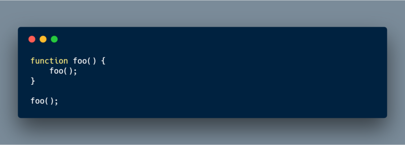
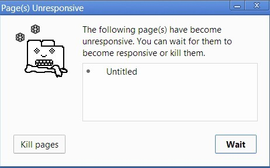
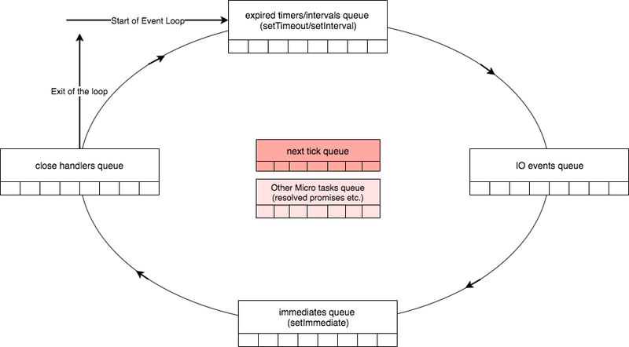

# 概述

几乎每个人都已经听说过 V8 引擎，大多数人都知道 JavaScript 是单线程的，或者它使用的是回调队列。

在本文中，我们将详细介绍这些概念，并解释 JavaScrip 实际如何运行。通过了解这些细节，你将能够适当地利用所提供的 API 来编写更好的、非阻塞的应用程序。

如果您对JavaScript还比较陌生，那么本文将帮助您理解为什么JavaScript与其他语言相比如此“怪异”。

如果你是一个有经验的JavaScript开发人员，希望它能让您对每天使用的JavaScript运行时的实际工作方式有一些新的见解。

# JavaScript引擎

JavaScript引擎的一个流行示例是Google的V8引擎。例如，在Chrome和Node.js中使用V8引擎，下面是一个非常简化的视图：



V8引擎由两个主要部件组成:

- emory Heap(内存堆) 
- Call Stack(调用堆栈) 

# Runtime(运行时)

有些浏览器的 API 经常被使用到(比如说：setTimeout)，但是，这些 API 却不是引擎提供的。那么，他们是从哪儿来的呢？事实上这里面实际情况有点复杂。



所以说我们还有很多引擎之外的 API，我们把这些称为浏览器提供 API 称为 Web API，比如说 DOM、AJAX、setTimeout等等。

然后我们还拥有如此流行的事件循环和回调队列。

**代码部署后可能存在的BUG没法实时知道，事后为了解决这些BUG，花了大量的时间进行log 调试，这边顺便给大家推荐一个好用的BUG监控工具 [Fundebug](https://www.fundebug.com/)。**

# 调用栈

JavaScript是一种单线程编程语言，这意味着它只有一个调用堆栈。因此，它一次只能做一件事。

调用栈是一种数据结构，它记录了我们在程序中的位置。如果我们运行到一个函数，它就会将其放置到栈顶，当从这个函数返回的时候，就会将这个函数从栈顶弹出，这就是调用栈做的事情。

来个栗子：



当程序开始执行的时候，调用栈是空的，然后，步骤如下：


每一个进入调用栈的都称为调用帧。

这能清楚的知道当异常发生的时候堆栈追踪是怎么被构造的，堆栈的状态是如何的，让我们看一下下面的代码：



如果这发生在 Chrome 里(假设这段代码实在一个名为 foo.js 的文件中)，那么将会生成以下的堆栈追踪：


"堆栈溢出"，当你达到调用栈最大的大小的时候就会发生这种情况，而且这相当容易发生，特别是在你写递归的时候却没有全方位的测试它。我们来看看下面的代码：



当引擎开始执行这段代码时，它首先调用函数“foo”。然而，这个函数是递归的，并且在没有任何终止条件的情况下开始调用自己。因此，在执行的每一步中，相同的函数都会被一次又一次地添加到调用堆栈中，如下所示：


然而，在某些时候，调用堆栈中的函数调用数量超过了调用堆栈的实际大小，浏览器决定采取行动，抛出一个错误，它可能是这样的:


在单个线程上运行代码很容易，因为你不必处理在多线程环境中出现的复杂场景——例如死锁。
但是在一个线程上运行也非常有限制，由于 JavaScript 只有一个调用堆栈，当某段代码运行变慢时会发生什么?

# 并发与事件循环

当调用堆栈中的函数调用需要花费大量时间来处理时会发生什么情况? 例如，假设你希望在浏览器中使用JavaScript进行一些复杂的图像转换。

你可能会问-为什么这是一个问题?问题是，==当调用堆栈有函数要执行时，浏览器实际上不能做任何其他事情——它被阻塞了，这意味着浏览器不能呈现==，它不能运行任何其他代码，它只是卡住了，如果你想在应用中使用流畅的页面效果，这就会产生问题。

而且这不是唯一的问题，一旦你的浏览器开始处理调用栈中的众多任务，它可能会停止响应相当长一段时间。大多数浏览器都会这么做，报一个错误，询问你是否想终止 web 页面。



# [带你彻底弄懂Event Loop]

## 前言

我在学习浏览器和NodeJS的Event Loop时看了大量的文章，那些文章都写的很好，但是往往是每篇文章有那么几个关键的点，很多篇文章凑在一起综合来看，才可以对这些概念有较为深入的理解。

于是，我在看了大量文章之后，想要写这么一篇博客，不采用官方的描述，结合自己的理解以及示例代码，用最通俗的语言表达出来。希望大家可以通过这篇文章，了解到Event Loop到底是一种什么机制，浏览器和NodeJS的Event Loop又有什么区别。如果在文中出现书写错误的地方，欢迎大家留言一起探讨。

（PS：说到Event Loop肯定会提到Promise，我根据Promise A+规范自己实现了一个简易Promise库，[源码](https://github.com/leocoder351/my-promise)放到Github上，大家有需要的可以当做参考，后续我也会也写一篇博客来讲Promise，如果对你有用，就请给个Star吧~）

## 正文

### Event Loop是什么

**event loop是一个执行模型，在不同的地方有不同的实现。浏览器和NodeJS基于不同的技术实现了各自的Event Loop。**

- 浏览器的Event Loop是在[html5的规范](https://www.w3.org/TR/html5/webappapis.html#event-loops)中明确定义。
- NodeJS的Event Loop是基于libuv实现的。可以参考Node的[官方文档](https://nodejs.org/en/docs/guides/event-loop-timers-and-nexttick/)以及libuv的[官方文档](http://docs.libuv.org/en/v1.x/design.html)。
- libuv已经对Event Loop做出了实现，而HTML5规范中只是定义了浏览器中Event Loop的模型，具体的实现留给了浏览器厂商。

### 宏队列和微队列

**宏队列，macrotask，也叫tasks。** 一些异步任务的回调会依次进入macro task queue，等待后续被调用，这些异步任务包括：

- setTimeout
- setInterval
- setImmediate (Node独有)
- requestAnimationFrame (浏览器独有)
- I/O
- UI rendering (浏览器独有)

**微队列，microtask，也叫jobs。** 另一些异步任务的回调会依次进入micro task queue，等待后续被调用，这些异步任务包括：

- process.nextTick (Node独有)
- Promise
- Object.observe
- MutationObserver

（注：这里只针对浏览器和NodeJS）

### 浏览器的Event Loop

我们先来看一张图，再看完这篇文章后，请返回来再仔细看一下这张图，相信你会有更深的理解。


这张图将浏览器的Event Loop完整的描述了出来，我来讲执行一个JavaScript代码的具体流程：

1. 执行全局Script同步代码，这些同步代码有一些是同步语句，有一些是异步语句（比如setTimeout等）；
2. 全局Script代码执行完毕后，调用栈Stack会清空；
3. 从微队列microtask queue中取出位于队首的回调任务，放入调用栈Stack中执行，执行完后microtask queue长度减1；
4. 继续取出位于队首的任务，放入调用栈Stack中执行，以此类推，直到直到把microtask queue中的所有任务都执行完毕。**注意，如果在执行microtask的过程中，又产生了microtask，那么会加入到队列的末尾，也会在这个周期被调用执行**；
5. microtask queue中的所有任务都执行完毕，此时microtask queue为空队列，调用栈Stack也为空；
6. 取出宏队列macrotask queue中位于队首的任务，放入Stack中执行；
7. 执行完毕后，调用栈Stack为空；
8. 重复第3-7个步骤；
9. 重复第3-7个步骤；
10. ......

**可以看到，这就是浏览器的事件循环Event Loop**

这里归纳3个重点：

1. 宏队列macrotask一次只从队列中取一个任务执行，执行完后就去执行微任务队列中的任务；
2. 微任务队列中所有的任务都会被依次取出来执行，知道microtask queue为空；
3. 图中没有画UI rendering的节点，因为这个是由浏览器自行判断决定的，但是只要执行UI rendering，它的节点是在执行完所有的microtask之后，下一个macrotask之前，紧跟着执行UI render。

好了，概念性的东西就这么多，来看几个示例代码，测试一下你是否掌握了:

```
console.log(1);

setTimeout(() => {
  console.log(2);
  Promise.resolve().then(() => {
    console.log(3)
  });
});

new Promise((resolve, reject) => {
  console.log(4)
  resolve(5)
}).then((data) => {
  console.log(data);
})

setTimeout(() => {
  console.log(6);
})

console.log(7);
```

这里结果会是什么呢？运用上面了解到的知识，先自己做一下试试看。

```
// 正确答案
1
4
7
5
2
3
6
```

你答对了吗？

我们来分析一下整个流程：

------

- 执行全局Script代码

------

**Step 1**

```
console.log(1)
```

Stack Queue: [console]

Macrotask Queue: []

Microtask Queue: []

> 打印结果：
> 1

**Step 2**

```
setTimeout(() => {
  // 这个回调函数叫做callback1，setTimeout属于macrotask，所以放到macrotask queue中
  console.log(2);
  Promise.resolve().then(() => {
    console.log(3)
  });
});
```

Stack Queue: [setTimeout]

Macrotask Queue: [callback1]

Microtask Queue: []

> 打印结果：
> 1

**Step 3**

```
new Promise((resolve, reject) => {
  // 注意，这里是同步执行的，如果不太清楚，可以去看一下我开头自己实现的promise啦~~
  console.log(4)
  resolve(5)
}).then((data) => {
  // 这个回调函数叫做callback2，promise属于microtask，所以放到microtask queue中
  console.log(data);
})
```

Stack Queue: [promise]

Macrotask Queue: [callback1]

Microtask Queue: [callback2]

> 打印结果：
> 1
> 4

**Step 5**

```
setTimeout(() => {
  // 这个回调函数叫做callback3，setTimeout属于macrotask，所以放到macrotask queue中
  console.log(6);
})
```

Stack Queue: [setTimeout]

Macrotask Queue: [callback1, callback3]

Microtask Queue: [callback2]

> 打印结果：
> 1
> 4

**Step 6**

```
console.log(7)
```

Stack Queue: [console]

Macrotask Queue: [callback1, callback3]

Microtask Queue: [callback2]

> 打印结果：
> 1
> 4
> 7

------

- 好啦，全局Script代码执行完了，进入下一个步骤，从microtask queue中依次取出任务执行，直到microtask queue队列为空。

------

**Step 7**

```
console.log(data) // 这里data是Promise的决议值5
```

Stack Queue: [callback2]

Macrotask Queue: [callback1, callback3]

Microtask Queue: []

> 打印结果：
> 1
> 4
> 7
> 5

------

- 这里microtask queue中只有一个任务，执行完后开始从宏任务队列macrotask queue中取位于队首的任务执行

------

**Step 8**

```
console.log(2)
```

Stack Queue: [callback1]

Macrotask Queue: [callback3]

Microtask Queue: []

> 打印结果：
> 1
> 4
> 7
> 5
> 2

但是，执行callback1的时候又遇到了另一个Promise，Promise异步执行完后在microtask queue中又注册了一个callback4回调函数

**Step 9**

```
Promise.resolve().then(() => {
  // 这个回调函数叫做callback4，promise属于microtask，所以放到microtask queue中
  console.log(3)
});
```

Stack Queue: [promise]

Macrotask v: [callback3]

Microtask Queue: [callback4]

> 打印结果：
> 1
> 4
> 7
> 5
> 2

------

- 取出一个宏任务macrotask执行完毕，然后再去微任务队列microtask queue中依次取出执行

------

**Step 10**

```
console.log(3)
```

Stack Queue: [callback4]

Macrotask Queue: [callback3]

Microtask Queue: []

> 打印结果：
> 1
> 4
> 7
> 5
> 2
> 3

------

- 微任务队列全部执行完，再去宏任务队列中取第一个任务执行

------

**Step 11**

```
console.log(6)
```

Stack Queue: [callback3]

Macrotask Queue: []

Microtask Queue: []

> 打印结果：
> 1
> 4
> 7
> 5
> 2
> 3
> 6

------

- 以上，全部执行完后，Stack Queue为空，Macrotask Queue为空，Micro Queue为空

------

Stack Queue: []

Macrotask Queue: []

Microtask Queue: []

> 最终打印结果：
> 1
> 4
> 7
> 5
> 2
> 3
> 6

因为是第一个例子，所以这里分析的比较详细，大家仔细看一下，接下来我们再来一个例子：

```
console.log(1);

setTimeout(() => {
  console.log(2);
  Promise.resolve().then(() => {
    console.log(3)
  });
});

new Promise((resolve, reject) => {
  console.log(4)
  resolve(5)
}).then((data) => {
  console.log(data);
  
  Promise.resolve().then(() => {
    console.log(6)
  }).then(() => {
    console.log(7)
    
    setTimeout(() => {
      console.log(8)
    }, 0);
  });
})

setTimeout(() => {
  console.log(9);
})

console.log(10);
```

最终输出结果是什么呢？参考前面的例子，好好想一想......

```
// 正确答案
1
4
10
5
6
7
2
3
9
8
```

相信大家都答对了，这里的关键在前面已经提过：

**在执行微队列microtask queue中任务的时候，如果又产生了microtask，那么会继续添加到队列的末尾，也会在这个周期执行，直到microtask queue为空停止。**

注：当然如果你在microtask中不断的产生microtask，那么其他宏任务macrotask就无法执行了，但是这个操作也不是无限的，拿NodeJS中的微任务process.nextTick()来说，它的上限是1000个，后面我们会讲到。

浏览器的Event Loop就说到这里，下面我们看一下NodeJS中的Event Loop，它更复杂一些，机制也不太一样。

### NodeJS中的Event Loop

#### libuv

先来看一张libuv的结构图：


#### NodeJS中的宏队列和微队列

NodeJS的Event Loop中，执行宏队列的回调任务有**6个阶段**，如下图：


各个阶段执行的任务如下：

- **timers阶段**：这个阶段执行setTimeout和setInterval预定的callback
- **I/O callback阶段**：执行除了close事件的callbacks、被timers设定的callbacks、setImmediate()设定的callbacks这些之外的callbacks
- **idle, prepare阶段**：仅node内部使用
- **poll阶段：获取新的I/O事件**，适当的条件下node将阻塞在这里
- **check阶段**：执行setImmediate()设定的callbacks
- **close callbacks阶段**：执行socket.on('close', ....)这些callbacks

**NodeJS中宏队列主要有4个**

由上面的介绍可以看到，回调事件主要位于4个macrotask queue中：

1. Timers Queue
2. IO Callbacks Queue
3. Check Queue
4. Close Callbacks Queue

这4个都属于宏队列，但是在浏览器中，可以认为只有一个宏队列，所有的macrotask都会被加到这一个宏队列中，但是在NodeJS中，不同的macrotask会被放置在不同的宏队列中。

**NodeJS中微队列主要有2个**：

1. Next Tick Queue：是放置process.nextTick(callback)的回调任务的
2. Other Micro Queue：放置其他microtask，比如Promise等

在浏览器中，也可以认为只有一个微队列，所有的microtask都会被加到这一个微队列中，但是在NodeJS中，不同的microtask会被放置在不同的微队列中。

具体可以通过下图加深一下理解：



大体解释一下NodeJS的Event Loop过程：

1. 执行全局Script的同步代码
2. 执行microtask微任务，先执行所有Next Tick Queue中的所有任务，再执行Other Microtask Queue中的所有任务
3. 开始执行macrotask宏任务，共6个阶段，从第1个阶段开始执行相应每一个阶段macrotask中的所有任务，注意，这里是所有每个阶段宏任务队列的所有任务，在浏览器的Event Loop中是只取宏队列的第一个任务出来执行，每一个阶段的macrotask任务执行完毕后，开始执行微任务，也就是步骤2
4. Timers Queue -> 步骤2 -> I/O Queue -> 步骤2 -> Check Queue -> 步骤2 -> Close Callback Queue -> 步骤2 -> Timers Queue ......
5. 这就是Node的Event Loop

**关于NodeJS的macrotask queue和microtask queue，我画了两张图，大家作为参考：**


好啦，概念理解了我们通过几个例子来实战一下：

第一个例子

```
console.log('start');

setTimeout(() => {          // callback1
  console.log(111);
  setTimeout(() => {        // callback2
    console.log(222);
  }, 0);
  setImmediate(() => {      // callback3
    console.log(333);
  })
  process.nextTick(() => {  // callback4
    console.log(444);  
  })
}, 0);

setImmediate(() => {        // callback5
  console.log(555);
  process.nextTick(() => {  // callback6
    console.log(666);  
  })
})

setTimeout(() => {          // callback7              
  console.log(777);
  process.nextTick(() => {  // callback8
    console.log(888);   
  })
}, 0);

process.nextTick(() => {    // callback9
  console.log(999);  
})

console.log('end');
```

请运用前面学到的知识，仔细分析一下......

```
// 正确答案
start
end
999
111
777
444
888
555
333
666
222
```

------

------

> **更新 2018.9.20**

上面这段代码你执行的结果可能会有多种情况，原因解释如下。

- setTimeout(fn, 0)不是严格的0，一般是setTimeout(fn, 3)或什么，会有一定的延迟时间，当setTimeout(fn, 0)和setImmediate(fn)出现在同一段同步代码中时，就会存在两种情况。
- **第1种情况**：同步代码执行完了，Timer还没到期，setImmediate回调先注册到Check Queue中，开始执行微队列，然后是宏队列，先从Timers Queue中开始，发现没回调，往下走直到Check Queue中有回调，执行，然后timer到期（只要在执行完Timer Queue后到期效果就都一样），timer回调注册到Timers Queue中，下一轮循环执行到Timers Queue中才能执行那个timer 回调；**所以，这种情况下，setImmediate(fn)回调先于setTimeout(fn, 0)回调执行**。
- **第2种情况**：同步代码还没执行完，timer先到期，timer回调先注册到Timers Queue中，执行到setImmediate了，它的回调再注册到Check Queue中。 然后，同步代码执行完了，执行微队列，然后开始先执行Timers Queue，先执行Timer 回调，再到Check Queue，执行setImmediate回调；**所以，这种情况下，setTimeout(fn, 0)回调先于setImmediate(fn)回调执行**。
- 所以，在同步代码中同时调setTimeout(fn, 0)和setImmediate情况是不确定的，但是如果把他们放在一个IO的回调，比如readFile('xx', function () {// ....})回调中，那么IO回调是在IO Queue中，setTimeout到期回调注册到Timers Queue，setImmediate回调注册到Check Queue，IO Queue执行完到Check Queue，timer Queue得到下个周期，所以setImmediate回调这种情况下肯定比setTimeout(fn, 0)回调先执行。

综上，这个例子是不太好的，setTimeout(fn, 0)和setImmediate(fn)如果想要保证结果唯一，就放在一个IO Callback中吧，上面那段代码可以把所有它俩同步执行的代码都放在一个IO Callback中，结果就唯一了。

更新结束

------

------

你答对了吗？我们来一起分析一下：

- 执行全局Script代码，先打印**start**，向下执行，将setTimeout的回调callback1注册到Timers Queue中，再向下执行，将setImmediate的回调callback5注册到Check Queue中，接着向下执行，将setTimeout的回调callback7注册到Timers Queue中，继续向下，将process.nextTick的回调callback9注册到微队列Next Tick Queue中,最后一步打印**end**。此时，各个队列的回调情况如下：

**宏队列**

Timers Queue: [callback1, callback7]

Check Queue: [callback5]

IO Callback Queue： []

Close Callback Queue: []

**微队列**

Next Tick Queue: [callback9]

Other Microtask Queue: []

> 打印结果
> start
> end

- 全局Script执行完了，开始依次执行微任务Next Tick Queue中的全部回调任务。此时Next Tick Queue中只有一个callback9，将其取出放入调用栈中执行，打印**999**。

**宏队列**

Timers Queue: [callback1, callback7]

Check Queue: [callback5]

IO Callback Queue： []

Close Callback Queue: []

**微队列**

Next Tick Queue: []

Other Microtask Queue: []

> 打印结果
> start
> end
> 999

- 开始依次执行6个阶段各自宏队列中的所有任务，先执行第1个阶段Timers Queue中的所有任务，先取出callback1执行，打印**111**，callback1函数继续向下，依次把callback2放入Timers Queue中，把callback3放入Check Queue中，把callback4放入Next Tick Queue中，然后callback1执行完毕。再取出Timers Queue中此时排在首位的callback7执行，打印**777**，把callback8放入Next Tick Queue中，执行完毕。此时，各队列情况如下：

**宏队列**

Timers Queue: [callback2]

Check Queue: [callback5, callback3]

IO Callback Queue： []

Close Callback Queue: []

**微队列**

Next Tick Queue: [callback4, callback8]

Other Microtask Queue: []

> 打印结果
> start
> end
> 999
> 111
> 777

- 6个阶段每阶段的宏任务队列执行完毕后，都会开始执行微任务，此时，先取出Next Tick Queue中的所有任务执行，callback4开始执行，打印**444**，然后callback8开始执行，打印**888**，Next Tick Queue执行完毕，开始执行Other Microtask Queue中的任务，因为里面为空，所以继续向下。

**宏队列**

Timers Queue: [callback2]

Check Queue: [callback5, callback3]

IO Callback Queue： []

Close Callback Queue: []

**微队列**

Next Tick Queue: []

Other Microtask Queue: []

> 打印结果
> start
> end
> 999
> 111
> 777
> 444
> 888

- 第2个阶段IO Callback Queue队列为空，跳过，第3和第4个阶段一般是Node内部使用，跳过，进入第5个阶段Check Queue。取出callback5执行，打印**555**，把callback6放入Next Tick Queue中，执行callback3，打印**333**。

**宏队列**

Timers Queue: [callback2]

Check Queue: []

IO Callback Queue： []

Close Callback Queue: []

**微队列**

Next Tick Queue: [callback6]

Other Microtask Queue: []

> 打印结果
> start
> end
> 999
> 111
> 777
> 444
> 888
> 555
> 333

- 执行微任务队列，先执行Next Tick Queue，取出callback6执行，打印**666**，执行完毕，因为Other Microtask Queue为空，跳过。

**宏队列**

Timers Queue: [callback2]

Check Queue: []

IO Callback Queue： []

Close Callback Queue: []

**微队列**

Next Tick Queue: [callback6]

Other Microtask Queue: []

> 打印结果
> start
> end
> 999
> 111
> 777
> 444
> 888
> 555
> 333

- 执行第6个阶段Close Callback Queue中的任务，为空，跳过，好了，此时一个循环已经结束。进入下一个循环，执行第1个阶段Timers Queue中的所有任务，取出callback2执行，打印**222**，完毕。此时，所有队列包括宏任务队列和微任务队列都为空，不再打印任何东西。

**宏队列**

Timers Queue: []

Check Queue: []

IO Callback Queue： []

Close Callback Queue: []

**微队列**

Next Tick Queue: [callback6]

Other Microtask Queue: []

> 最终结果
> start
> end
> 999
> 111
> 777
> 444
> 888
> 555
> 333
> 666
> 222

以上就是这道题目的详细分析，如果没有明白，一定要多看几次。

------

下面引入Promise再来看一个例子：

```
console.log('1');

setTimeout(function() {
    console.log('2');
    process.nextTick(function() {
        console.log('3');
    })
    new Promise(function(resolve) {
        console.log('4');
        resolve();
    }).then(function() {
        console.log('5')
    })
})

new Promise(function(resolve) {
    console.log('7');
    resolve();
}).then(function() {
    console.log('8')
})
process.nextTick(function() {
  console.log('6');
})

setTimeout(function() {
    console.log('9');
    process.nextTick(function() {
        console.log('10');
    })
    new Promise(function(resolve) {
        console.log('11');
        resolve();
    }).then(function() {
        console.log('12')
    })
})
```

大家仔细分析，相比于上一个例子，这里由于存在Promise，所以Other Microtask Queue中也会有回调任务的存在，执行到微任务阶段时，先执行Next Tick Queue中的所有任务，再执行Other Microtask Queue中的所有任务，然后才会进入下一个阶段的宏任务。明白了这一点，相信大家都可以分析出来，下面直接给出正确答案，如有疑问，欢迎留言和我讨论。

```
// 正确答案
1
7
6
8
2
4
9
11
3
10
5
12
```

#### setTimeout 对比 setImmediate

- setTimeout(fn, 0)在Timers阶段执行，并且是在poll阶段进行判断是否达到指定的timer时间才会执行
- setImmediate(fn)在Check阶段执行

两者的执行顺序要根据当前的执行环境才能确定：

- 如果两者都在主模块(main module)调用，那么执行先后取决于进程性能，顺序随机
- 如果两者都不在主模块调用，即在一个I/O Circle中调用，那么setImmediate的回调永远先执行，因为会先到Check阶段

#### setImmediate 对比 process.nextTick

- setImmediate(fn)的回调任务会插入到宏队列Check Queue中
- process.nextTick(fn)的回调任务会插入到微队列Next Tick Queue中
- process.nextTick(fn)调用深度有限制，上限是1000，而setImmedaite则没有

### 总结

1. 浏览器的Event Loop和NodeJS的Event Loop是不同的，实现机制也不一样，不要混为一谈。
2. 浏览器可以理解成只有1个宏任务队列和1个微任务队列，先执行全局Script代码，执行完同步代码调用栈清空后，从微任务队列中依次取出所有的任务放入调用栈执行，微任务队列清空后，从宏任务队列中只取位于队首的任务放入调用栈执行，注意这里和Node的区别，只取一个，然后继续执行微队列中的所有任务，再去宏队列取一个，以此构成事件循环。
3. NodeJS可以理解成有4个宏任务队列和2个微任务队列，但是执行宏任务时有6个阶段。先执行全局Script代码，执行完同步代码调用栈清空后，先从微任务队列Next Tick Queue中依次取出所有的任务放入调用栈中执行，再从微任务队列Other Microtask Queue中依次取出所有的任务放入调用栈中执行。然后开始宏任务的6个阶段，每个阶段都将该宏任务队列中的所有任务都取出来执行（注意，这里和浏览器不一样，浏览器只取一个），每个宏任务阶段执行完毕后，开始执行微任务，再开始执行下一阶段宏任务，以此构成事件循环。
4. MacroTask包括： setTimeout、setInterval、 setImmediate(Node)、requestAnimation(浏览器)、IO、UI rendering
5. Microtask包括： process.nextTick(Node)、Promise、Object.observe、MutationObserver

