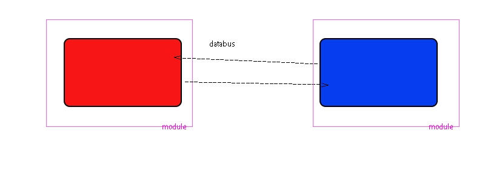

# 作用域隔离和暴漏

### 块作用域

```js
{
leti=1
}

```

### 函数作用域

```js
function fn(){
let i=1
}
```

### 文件作用域

1. 文件作用域造就了页面级的局部变量,vue就是如此

1. export.js在函数自己的文件作用域里运行

1. export.js函数的自由变量在自己的作用域里取值

# 通信

### 向下级块作用域通信

```js
    //global作用域暴漏---------------------
    let i = 1

    function fn(n) {
        console.log(n)
    }

   
    {
         //下级块作用域----------------------
        i = 10
        fn(i + 10)

    }
```


### 全局变量通信

##### global.variable

向下级函数作用域通信

```js
var i=1 ; global.i=1 
window.session
window.cookie
window.history
```

##### 声明全局变量但不注入global节省内存

###### 文件作用域暴漏-import声明全局作用域变量

```js
//export.js

export let i = 1
//在自己的文件作用域运行 修改自由变量
export function fn(n) {
    i = n * 2
    console.log(i)
}
console.log(123)
```

```js
//import.js
//import声明全局变量,还执行export.js文件作用域里的代码
import {i, fn} from './export'

    fn(10)

```

###### const let 

```
const i=1
```

###### 函数作用域闭包暴漏---const声明全局作用域变量

```js
    function f() {

        let i = 1
        console.log(123)
        function fn(n) {
            console.log(n)
        }

        //闭包暴漏---------------------------
        return {i, fn}
    }


  //cosnt声明全局变量,还执行了f函数里的代码
    const obj = f()

    function f1() {

        obj.fn(obj.i + 10)

    }

    f1()
```


| 闭包                           | 文件作用域                                 |
| ------------------------------ | ------------------------------------------ |
| const 声明变量 const obj = f() | import 声明变量 import obj from './export' |
| 声明的同时执行函数里的代码     | 声明的同时执行了文件作用域里的代码         |

##### 全局变量不注入global,而注入到对象的key里,方便使用

```js
improt store from ‘./export’

const obj1={
      function fn(){ this.store},
     store
}

```


### 靠回调函数通信

形参变量,默认形参undifine

# vue通信

### 组件内通信

```js
data(){
return{value:''}
}
```


### 组件间通信

#####  同父的组件(包括原生组件) 


##### 跨父子通信(this.$store=new Vuex())本质是全局变量通信

###### 1. 通过公共的爷爷通信(传值传参)

###### 2. 通过vuex通信,$store 注入到每个组件里,vue监听Store更新到视图


```
   let store = {
        state: undefined,
        setState(i) {
            this.state = i
        }
    }

    class Vm {
        constructor(a, b) {
            this.a = a;
            this.b = b;
            this.$store = store
        }
    }

    let vm = new Vm(1, 2)
    vm.$store.setState(3)

    let vm2 = new Vm(10, 20)
    vm2.$store.setState(30)

```

###### 3. databus通信(本质是回调)


##### 跨路由通信(通过浏览器history栈通信)


