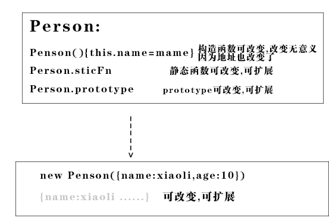

[[toc]]


<style>h3{font-weight:bolder}</style>

# 如何封装函数


###  相同的部分成函数语句,不同的部分成为参数
```javascript

const Koa = require('koa')
const app = new Koa()
app.use((ctx, next) => { //1,2 不同的地方 ,其他相同的地方
    ctx.body = '1',
        next()
    ctx.body += 2
})
app.use((ctx, next) => {
    ctx.body += '3',
        next()
    ctx.body += 4
})
app.use((ctx, next) => {
    ctx.body += '5',
        next()
    ctx.body += 6
})
app.listen(3000)
console.log(":3000")

```
封装

```javascript
const Koa = require('koa')
const app = new Koa()

function callback(m, n) { //m,n 不用的地方

    return (ctx, next) => { //函数体相同的地方
        if (!ctx.body) {
            ctx.body = m
        }else {
            ctx.body += m
        }


        next()
        ctx.body += n
    }

}

app.use(callback('1', '2'))
app.use(callback('3', '4'))
app.use(callback('5', '6'))
app.listen(3000)


```
进一步封装

```javascript
const Koa = require('koa')
const app = new Koa()

function fn(m, n) { //m,n 不用的地方

    app.use((ctx, next) => { //函数体相同的地方
        if (!ctx.body) {
            ctx.body = m
        } else {
            ctx.body += m
        }
        next()
        ctx.body += n
    })

}

fn('1', '2')
fn('3', '4')
fn('5', '6')
app.listen(3000)


```
### 语义分离

无语义代码

```javascript
   function f() {
        let i = 0
        i++
        i *= 50
        console.log(i)
    }

    f()
```
语义分离了 但是未解耦
```
  function add() {
        let i = 0
        i++
        return i
    }

    function chengfa() {
    //这里耦合了
        let i = add()
        i *= 50
        console.log(i)
    }

    chengfa()
```

### 解耦和内聚
##### 对上边代码进一步加工做到了解耦
```javascript
    function add() {
        let i = 0
        i++
        return i
    }

    function chengfa(i) {

        i *= 50
        console.log(i)
    }
let i= add()
    chengfa(i)
```

##### vue组件解耦

耦合代码

```html
<script src="https://cdn.bootcss.com/vue/2.5.17-beta.0/vue.js"></script>
<div id="app">
    <!--点击改变value的值,value改变dom自动更新-->
    <ul>
        <li v-for="item in 4" @click="value=item" :class="value===item?'active':''">
           <button>{{item}}</button>
        </li>
    </ul>
    <br>
    {{value}}
</div>

<script>
    const vm = new Vue({
        el: '#app',
        data() {
            return {
                value: 1
            }
        }
    })

</script>

<style>
    .active {
        color: red;
    }

</style>
```
组件解耦(本质是函数)

```html
<script src="https://cdn.bootcss.com/vue/2.5.17-beta.0/vue.js"></script>
<div id="app">
    <!--点击改变value的值,value改变dom自动更新-->
    <cl v-model="value"></cl>
    <br>
    {{value}}
</div>

<script>
    const cl = {
        template: ` <ul>
                        <li v-for="item in 4"
                         @click="$emit('input',item)"
                         :class="item===value?'active':''">
                           <button> {{item}}</button>
                        </li>
                       </ul>`,
        props: ['value']
    }
    const vm = new Vue({
        el: '#app',
        data() {
            return {
                value: 1
            }
        },
        components: {cl}
    })

</script>

<style>
    .active {
        color: red;
    }

</style>
```
组件slot解耦
```html
<script src="https://cdn.bootcss.com/vue/2.5.17-beta.0/vue.js"></script>
<div id="app">
    <!--value是变量媒介,v-model参数-->
    <cl v-model="value">

        <template scope="{item}">
            <button>
                {{item}}
            </button>
        </template>
    </cl>
    {{value}}
</div>

<script>
    const cl = {
        template: ` <ul>
                        <li v-for="item in 4"
                         @click="$emit('input',item)"
                         :class="item===value?'active':''"
                       >
                     <!--    // item是变量媒介 scope是参数-->
                       <slot :item="item">


                      </slot>

                        </li>
                       </ul>`,
        props: ['value']
    }
    const vm = new Vue({
        el: '#app',
        data() {
            return {
                value: 1
            }
        },
        components: {cl}
    })

</script>

<style>
    .active {
        color: red;
    }

</style>

```

##### vue插件解耦

```html
<div id="app">
    <!--＃１　v-bｉｎｄ允许子组件使用-->
    <cl :msg="msg">
        <!--＃３　scope允许下级ｄｏｍ使用数据-->
        <template scope="{xx}">
            <!--＃４　对ｆｉｌｅｔｅｒ对｛｛｝｝最终处理-->
            {{xx|tocase(1)}}
        </template>
    </cl>

</div>
<script src="https://cdn.bootcss.com/vue/2.5.17-beta.0/vue.js"></script>
<script>
    const cl = {

        template: '<div> <slot :xx="msg.a"></slot></div>',
        props: ['msg']
    }
    const vm = new Vue({
        el: '#app',
        data: {
            msg: {a: 'msg'}
        },
        filters: {
            tocase(value, n) {
                return value.toUpperCase() + 1
            }
        },
        components: {
            cl
        }
    })
</script>


```

##### route-view 和组件之间解耦

```html
<script src="https://cdn.bootcss.com/vue/2.5.17-beta.0/vue.js"></script>
<script src="https://cdn.bootcss.com/vue-router/3.0.1/vue-router.min.js"></script>
<div id="app">

    <ul>
        <li v-for="item in 4">
            <!--传数据给$router-->
            <router-link :to="{path:`/${item}`}">

                {{item}}
            </router-link>

        </li>
    </ul>
    <!--读取组件信息-->
    <router-view></router-view>
</div>

<script>
    const mycomponent = {
        template: `<div>{{id}}</div>`,
        props: ['id']
    }
    const router = new VueRouter({
        linkActiveClass: 'active',
        routes: [

            {
                path: '/:id',
                name: 'id',
                // 路由解耦，parame作为组件mycomponent的属性值
                props: true,
                component:mycomponent
            }]
    })
    const vm = new Vue({
        el: '#app',
        router,
        data() {
            return {
                value: 1
            }
        }
    })

</script>

<style>
    .active {
        color: red;
    }

</style>
```


# 强类型和弱类型
1.强类型指的是每个变量和对象都必须具有声明类型，他们是在编译的时候就确定类型的数据，在执行时类型不能更改；
弱类型在执行的时候才会确定类型， 

```javascript
   var dog = 1 //数字类

    class Dog { //dog类
        constructor(age, color) {
            this.age = age
            this.color = color
        }

        cry() {
            console.log('汪汪汪')
        }

    }

    dog = new Dog(12, 'red') //变量类型可变

    console.log(dog)

    function cry(dog) { //函数参数也不用检查类型
        dog.cry()
    }

    cry(dog)
    
```


2.强类型安全，而且效率高。弱类型相比而言不安全 
如:强类型 的DataSet 
提高运行效率。 

# 面向对象的思想

### 面向對象的好處

1. 维护简单
面向对象程序设计的一个特征就是模块化。实体可以被表示为类以及同一名字空间中具有相同功能的类，可以在名字空间中添加一个类而不影响该名字空间的其他成员。这种特征为程序的维护提供了便捷性。

2. 可扩充性
如果有一个具有某一种功能的类，就可以扩充这个类，创建一个具有扩充功能的类。

3. 代码重用
功能是被封装在类中的，类是作为一个独立实体而存在的，因此可以很简单的提供类库，使代码得以重复使用。


### 类是概念

类:一类事物,比如数字类 , 字符串类, 对象类->数组类,动物类 ->狗类


类:同类型 同class -> 定义构造函数Person

实例化对象: const xiaoli=new Person()

实例化对象属于类型: xiaoli是Person类型的


### 类的三要素

1. 封装

2. 继承

3. 多态


### 类的实例化

##### 返回一类事物的一个实例


 
```javascript
//  像某个型号汽车建设蓝图,生产这个型号的汽车蓝图
  const car1=new SangtanaCar001()
```


##### js类生成实例化对象也可以扩展

因为js是一种动态语言,计算时间才确定类型


### 静态函数和实例的函数

静态函数适合所有实例用的工具函数
```javascript
Dog.Create({id:1})
Dog.find({id:1})
Dog.remove({id:2})
dog.update({id:3})
```
实例方法适合个例用的方法

```javascript

const dog=new Dog({id:5})

// 实例方法适合个例用的方法

instance.showInfo

```


# js创建类

### 原型链


### 1.封装

函数封装, 私有变量不允许实例化对象访问,静态函数不允许子类继承


```javascript

function Person(name, age) {
    this.name = name;
    var age = age;// 在实例中无法被调用
}
var p1 = new Person("Bob", 20);
console.log(p1) // Person ->{name: "Bob"}  无法访问到age属性，这就叫被封（装）起来了。

```

访问封装属性的方法--特权方法

```javascript
function Person(age) {
    var age = age;// 私有变量
    this.showAge = function() {// 特权方法
        console.log(age);
    };
}
var p1 = new Person(20);// 新建对象p1
p1.showAge();// -> 20  这个20是闭包，在闭包笔记处会详解。
// 如果不理解闭包，按照我自己的思路很难去解释：
// 为什么这个函数体里面存了一份age的数据。

```
但是如果使用prototype来写的函数，无法访问私有变量

```javascript
Person.prototype.myAge = function() {
    console.log(age);
};
var p1 = new Person(20);// 新建对象p1
p1.myAge();// 报错 age is not defined

```

其实这也印证了：闭包就是函数里面包函数，由于prototype是通过函数名，指到其他内存空间独立的函数体，因此没法取得闭包的作用域变量。


### 2.继承和extend

将类的相同之处取出封装成独立的类

本质修改代码,对原始的蓝图进行修改,产生新型号汽车的蓝图,用于生成新的汽车

```javascript
class StangtanaCar1000{
//一些代码
}

class StangtanaCar2000 extends StangtanaCar1000{
   //另外一些代码
    
}
```
##### 组合构造函数模式和原型模式

###### 本质

本质是一种浅copy机制获得新对象

copy原型链 

构造函数改变对象


```javascript

    //模拟new new都做了什么
    var obj = new Object();
    obj.__proto__ = Person.prototype;
    var res = Person.call(obj, 'xiaohong', 12)// 改变obj的值

    if (typeof res === Object) {//判断function的返回值 若返回值为对象 person就为这个返回值了 构造函数废了
        person = res
    }
    else { //如果返回值为undefine或者基础变量 构造函数成功
        person = obj

    }


```


###### 作用:
控制参数返回对象

```javascript
//1.直接生成对象,无构造函数参与
obj={a:1,b:2}
obj=new Object({a:1,b:2})
//2.构造函数版生成对象,构造函数参与

function Fn(a,b) {
  this.a=a;
  this.b=b
}
Fn.prototype={c:3} //固定部分

obj=new Fn()
```

###### 构造函数和普通函数

```javascript

 /*此处为实例化对象封装了若干属性和函数*/
    function Person(name, age) {
        this.name = name
        this.age = age
        this.sayName = function () {
            console.log('我的名字叫:' + this.name);
        }


    }


    // 更改构造函数: 更改构造函数一定放到最前面,因为改变了变量Person内存地址

    Person = function (name, age) {
        this.name = name + 1111
        this.age = age + 100
        this.sayName = function () {
            console.log('我的名字叫:' + this.name + 1111);
        }

        return 10
    }


    //为封装一些原型方法
    Person.prototype = {
        //protype.sayName被构造里的sayName覆盖
        sayName() {
            console.log('my name:' + this.name);
            console.log('protype.sayName(){}的this', this)
        },
        addage() {
            this.age++ //通过this改变age

        },
        returnMoutAge() {
            return this.age - 1
        }

    }


    /*扩展静态函数和静态变量*/
    Person.nameUpperCase = function (i) {
        console.log(i.toUpperCase())
    }
    Person.title = '静态函数类'


    //扩展原型方法
    Person.prototype.$store = {
        name: 2,
        setName(name) {
            console.log(this)
            this.name = name
        }
    }


    //new 创立新实例 构造函数运行在这个对象上 Person.call(obj, 'xiaohong', 12)
    xiaoli = new Person('xiaoli', 11, "设计师")
    xiaoli.sayName()
    xiaoli.addage()
    xiaoli.$store.setName('小莉')
    console.log(xiaoli)


    //不改变实例xiaoli的属性 函数有返回值,类似arr的迭代函数
    const i = xiaoli.returnMoutAge()
    console.log(i)


    //运行静态函数
    Person.nameUpperCase('abc')


    //当普通函数使用 ,添加变量到了window--------------------------------------------------------------------------------------------
   const m= Person('xiaowang', 12)
    console.log(m,name, age)


    //模拟new new都做了什么---------------------------------------------------------------------------------------------------------

    //因为这部所以对象的都是构造函数建立出来的
    var obj = new Object();
    obj.__proto__ = Person.prototype;


    // 改变obj的值
    var res = Person.call(obj, 'xiaohong', 12)


    /*  判断Person的返回值 若返回值为对象 person=构造函数的返回值,
       变成了类似另外一种函数了
       function f() {
           return {a,b}
       }
       */
    if (typeof res === Object) {
        person = res
    }
    //如果返回值为undefine或者基础变量 person=被构造函数改变的对象obj
    else {
        person = obj

    }
    console.log(person)
```


###### 构造函数和对象的关系


* new Fn() 生成新的对象实例

```javascript 1.8

    //模拟new new都做了什么
    var obj = new Object();
    obj.__proto__ = Person.prototype;
    var res = Person.call(obj, 'xiaohong', 12)// 改变obj的值

    if (typeof res === Object) {//判断function的返回值 若返回值为对象 person就为这个返回值了 构造函数废了
        person = res
    }
    else { //如果返回值为undefine或者基础变量 构造函数成功
        person = obj

    }


```

* 函数属于对象类型

``` javascript
funcion fn(a,b){

return a+b
}

fn.a=1
fn.b=2

```

``` javascript
const fn=new Function('a', 'b', 'return a + b');

```

``` javascript
fn instaceof Objcet===true
```


###### __构造函数未传参的参数和普通函数一样默认undefine__

vue对象的默认属性的值undefined构造函数调用new button(),实参传值给形参未赋值的形参为undefine

###### [实例]模拟vue构造函数

```javascript
//store实例化
    const store = {
        counter: 0,
        add(n) {
            this.counter += n
        }
    }


    //组件构造器产生组件Person的工厂函数
    class Person {
        constructor({beforeCreate, created, store, data, methods, computed, watch, callbackProp, props, $father}) {
            beforeCreate()
            for (let item in data) {
                this[item] = data[item]

            }
            if (props) {
                for (let item of props) {
                    this[item] = $father[item]

                }
            }
            for (let item in methods) {

                this[item] = methods[item]
            }

            //计算属性和watch
            for (let item in {...computed, ...watch}) {
                Object.defineProperty(this, `${item}`, {
                    get: computed.com,
                    set: function () {
                        console.log('触发watch')
                    }
                })
            }

            this.$store = store

            created()
        }
    }

    //实例化组件,切换路由操作,出发这个构造函数运行-------------------------------------
    const father = new Person({
        data: {
            name: 'father',
            age: 18,
            hometownProp: 'china',
            callbackProp: function (n) {
                console.log(this.age = n)
            },
        },

        store,
        beforeCreate() {
            console.log('beforeCreateg钩子:对象将要建立')
        },
        created() {
            console.log('created钩子:对象建立了')
        },


    })


    const child = new Person({
        data: {
            name: '小黑',
            age: 2
        },
        computed: {
            com: function () {
                return this.name + this.age
            },

        },
        props: ['hometownProp', 'callbackProp']
        ,
        methods: {
            $emit(n) {
                this.callbackProp.call(this.$father, n)
            }
        },

        beforeCreate() {
            console.log('对象将要建立')
        },
        created() {
            console.log('对象建立了')
        },
        store,
        $father: father


    })

    //标签嵌套
    father.$children = child
    child.$father = father


    //onlick等事件回调才运行--------------------------------------------------------------
    child.$emit(10)
    child.$father.sex = '男'


    //onclick等事件驱动提交store负荷
    father.$store.add(10)

    console.log(father)
    console.log(child)

    document.getElementById('#app').innerHTML = child.com


```


###### [实例]构造实现$father

```javascript

    var test=new function (){

        var self=this
        this.Name="test"
        this.subTest=new function(parent=self){
            this.Name="test1"
            this.parent=this
            this.PName=function(){return parent.Name}
        }
        this.subTest.parent=this
    }
    console.log(test)

    alert(test.subTest.PName())
```


###### js弱类型 构造函数的键值对一切可变




##### 多重继承

```javascript
   function Person() {}
    Person.prototype = {
        name: 'grandfather',
        run: function () {
            console.log('run')
        }
    }

    function Man() {}
    Man.prototype = new Person()
    Man.prototype.superClass = new Person()
    Man.prototype.name = 'father'
    Man.prototype.run = function () {
        console.log('run2')
    }

    function Son() {}
    Son.prototype = new Man()
    Son.prototype.superClass = new Man()
    Son.prototype.name = 'iwen3'
    Son.prototype.run = function () {
        console.log('run3')
    }
    var xiaomin = new Son()
    console.log(xiaomin.superClass)
    console.log(xiaomin.superClass.superClass)
```

##### 多重继承2

```javascript
    function M1() {
        this.hello = 'hello';
    }

    function M2() {
        this.world = 'world';
    }

    function S() {
        M1.call(this);
        M2.call(this);
    }

    // 继承 M1
    S.prototype = Object.create(M1.prototype);
    // 继承链上加入 M2
    Object.assign(S.prototype, M2.prototype);

    // 指定构造函数
    S.prototype.constructor = S;

    var s = new S();
    s.hello // 'hello'
    s.world // 'world'

```

##### 对象冒充方法 

```javascript

function Stu() {
    this.name = "学生";
}
Stu.prototype.free = function() {
    console.log("free");
};
function MidStu() {
    this.stu = Stu;// 将Stu函数体赋值给stu;

    /*
     * 执行stu里面的函数体
     * 就相当于执行了这句话 ：this.name = "学生";
     */
    this.stu();// 通过对象冒充，来实现继承。
delete this.stu;// 删除对象的引用。
}

var stu1 = new MidStu();
console.log(stu1);  // 拥有这个属性 this.name = "学生";
stu1.free(); //prototype的free这个属性不存在
```
##### 寄生继承

```javascript
    function object(o) {
        function F(){}
        F.prototype = o;
        return new F();
    }

    function createAnother(original) {
        // 通过调用函数创建一个新对象
        var clone = object(original);
        // 以某种方式来增强这个对象
        clone.sayHi = function() {
            alert("hi");
        }

        return clone;
    }

    var person = {
        name: "Bert",
        friends: ["Shelby", "Court", "Van"]
    };

    var anotherPerson = createAnother(person);
    console.log(anotherPerson)
    anotherPerson.sayHi(); // Hi

```

##### 寄生组合继承


apply 使用实例
```javascript

    function f(a, b) {
        console.log(a + b)
        this.i = a + b
    }


    obj2 = {
        fn() {
            //f用fn的this, this===obj2
            f.apply(this, arguments)// 参数里加入了this
        }
    }

    obj2.fn(1, 2)
```

继承

```javascript
 function Person(name) {
        this.name = name || "default name"; //1
        this.className = "person"
    }

    Person.prototype.getName = function () {
        console.log(this.name)
    }


    //Man的构造函数
    function Man(name) {
        //new Man调用时,this===new Objcet()
        Person.apply(this, arguments) //使用Person函数做构造函数
    }
    //main的原型
    Man.prototype = new Person();


    //初始化
    var xiaoming = new Man("xiaoming");

    console.log(xiaoming)
```


### 3.多态


##### 基本概念

一个函数适用于不同对象，返回不同的值

同一个实现接口，使用不同的实例而执行不同的操作。比如：打印机可以看作是父类，黑白打印机、彩色打印机是他的两个子类。父类打印机中的方法“打印”在每个子类中有各自不同的实现方式，比如对黑白打印机执行打印操作后，打印效果是黑白的，而对彩色打印机进行打印操作后，打印效果是彩色的。

同一操作作用于不同的对象，可以有不同的解释，产生不同的执行结果。换句话说，给不同的对象发送同一个消息的时候，这些对象会根据这个消息分别给出不同的反馈。（某某百科）
本质上也就如题主说描述的“将‘做什么’和‘谁去做以及怎样去做’分开”，归根结底就是先消除不同对象的耦合关系。


js在计算时间才确定变量类型

静态语言的函数规定的有参数类型,只有规定的参数类型才可以用此函数,把做什么和谁去做分开

##### 本质:一种解耦机制做什么和谁去做分类:

做什么:函数

谁去做: 函数参数类型(需要强类型语言表现)

```javascript
//这个并非多态,只是函数语义分离
    var googleMap = {
        show: function () {
            console.log('开始渲染谷歌地图');
        }
    };
    var renderMap = function () {
        googleMap.show();
    };
    renderMap(); // 输出：开始渲染谷歌地图


// 多态:一个函数使用不同的对象,但是js不用建立父类和超类就可以构造对象
 

var googleMap = {
    show: function(){
        console.log( '开始渲染谷歌地图' );
    }
};
var baiduMap = {
    show: function(){
        console.log( '开始渲染百度地图' );
    }
};
var renderMap = function( type ){
    if ( type === 'google' ){
        googleMap.show();
    }else if ( type === 'baidu' ){
        baiduMap.show();
    }
};
renderMap( 'google' ); // 输出：开始渲染谷歌地图
renderMap( 'baidu' ); // 输出：开始渲染百度地图

//可扩展多态


var googleMap = {
    show: function(){
        console.log( '开始渲染谷歌地图' );
    }
};
var baiduMap = {
    show: function(){
        console.log( '开始渲染百度地图' );
    }
};
var renderMap = function( map ){ //ts会对map进行判断,省去条件语句,把做什么和谁去做分类
    
    map.show()
};
renderMap( 'google' ); // 输出：开始渲染谷歌地图
renderMap( 'baidu' ); // 输出：开始渲染百度地图

var gaode = {
    show: function(){
        console.log( '开始渲染高德地图' );
    }
};

renderMap( 'gaode' );

```
##### 超类实现多态覆盖

强类型的语言先建立类 然后实例化,所以要超类实现
```javascript

// 继承
class People {
  constructor(name, age) {
    this.name = name
    this.age = age
  }
  eat() {
    console.log(`${this.name} eat something`)
  }
  speak() {
    console.log(`My name is ${this.name}, age ${this.age}`)
  }
}

class Student extends People {
  constructor(name, age, number) {
    super(name, age)
    this.number = number
  }
  study() {
    console.log(`${this.name} study`)
  }
}

let xiaoming = new Student('xiaoming', 10, 'A1')
xiaoming.study()
console.log(xiaoming.number)
let xiaohong = new Student('xiaohong', 11, 'A2')
xiaohong.study()


// 多态
class People {
  constructor(name) {
    this.name = name
  }
  saySomething() {

  }
}
class A extends People {
  constructor(name) {
    super(name)
  }
  saySomething() {
    console.log('I am A')
  }
}
class B extends People {
  constructor(name) {
    super(name)
  }
  saySomething() {
    console.log('I am B')
  }
}
let a = new A('a')
a.saySomething()
let b = new B('b')
b.saySomething()

```


##### 多态实现实例：

js不受类的约束,随意建立对象,所以不用超类实现


所谓多态，就是指一个引用类型在不同情况下的多种状态。在java中多态是指通过指向父类的引用，来调用在不同子类中实现的方法。
js实际上是无态的，是一种动态语言，一个变量的类型是在运行的过程中由js引擎来决定的，所以说js天生就支持多态。


```javascript

  // 主人类
    function Master() {
        // 主人玩耍动物
        this.feed = function(animal) { //如果是强类型语言 这里是会自动判断的,参数类型决定必须animal去做
            console.log("主人玩耍" + animal.name);
            console.log("类:" + animal.constructor);
        };
    }

    // 猫类
    function Cat(name) {
        this.name = name;
    }

    // 狗类
    function Dog(name) {
        this.name = name;
    }

    var cat = new Cat("小猫咪");
    var dog = new Dog("小狗狗");
    var master = new Master();

    master.feed(cat);
    master.feed(dog);
    // 这样做的优点在于Master不需要改变，如果要扩展加入其它的动物，
    // 只需要加一个猴子类就好了
```

一个引用(类型)在不同情况下的多种状态。也可以理解成：多态是指通过指向父类的引用，来调用在不同子类中实现的方法。

```javascript
// Master类 
function Master(name){ 
    this.nam=name; 
    //方法[给动物喂食物] 
} 
//原型法添加成员函数 
Master.prototype.feed=function (animal,food){ 
    window.alert("给"+animal.name+" 喂"+ food.name); 
} 
function Food(name){ 
    this.name=name; 
} 
//鱼类 
function Fish(name){ 
    this.food=Food; 
    this.food(name); 
} 
//骨头 
function Bone(name){ 
    this.food=Food; 
    this.food(name); 
} 
function Peach(name){ 
    this.food=Food; 
    this.food(name); 
} 
//动物类 
function Animal(name){ 
    this.name=name; 
} 
//猫猫 
function Cat(name){ 
    this.animal=Animal; 
    this.animal(name); 
} 
//狗狗 
function Dog(name){ 
    this.animal=Animal; 
    this.animal(name); 
} 
//猴子 
function Monkey(name){ 
    this.animal=Animal; 
    this.animal(name); 
} 
var cat=new Cat("猫"); 
var fish=new Fish("鱼"); 

var dog=new Dog("狗"); 
var bone=new Bone("骨头"); 

var monkey=new Monkey("猴"); 
var peach=new Peach("桃"); 

//创建一个主人 
var master=new Master("zs"); 
master.feed(dog,bone); 
master.feed(cat,fish); 
master.feed(monkey,peach);


```


# ec6-class
class的本质是创造一类的若干对象的构造函数,类是构造函数的语法糖

``` javascript
 Class={
    staticFn:()=>{...}
    protorype:{
               instaceFn(){}
               }


   }

Class.staticFn:()

Class.protorype.instaceFn()
```
```javascript

 class Point {
        static staticFn() {
            console.log('staticFn')
        }

        constructor(x, y) {
            this.x = x;
            this.y = y;
        }

        get value() {
            console.log('Getting the current value!');
            return this.x;
        }

        toString() {
            return '(' + this.x + ', ' + this.y + ')';
        }
    }

    const point = new Point(1, 2)

    console.log(point)

    class Point_extend extends Point {


        cs() {
            console.log('cs')
        }
    }

    //类能继承静态函数
    Point_extend.staticFn()

    const point_extend = new Point_extend(10, 20)

    console.log(point_extend)

```

# typescript-class 

typescript-class

# 设计模式

