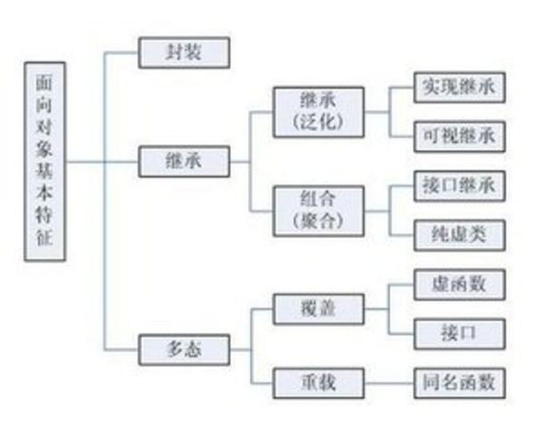
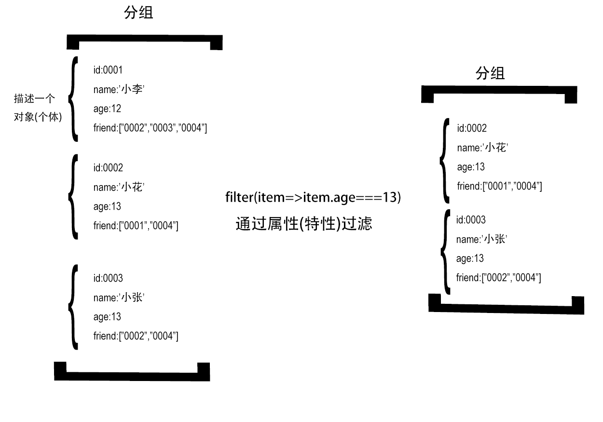
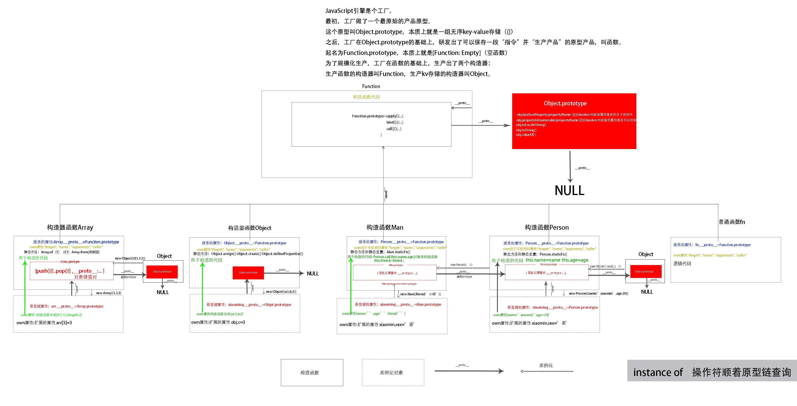
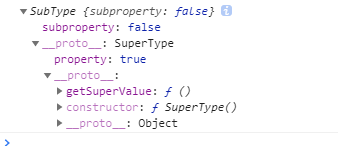
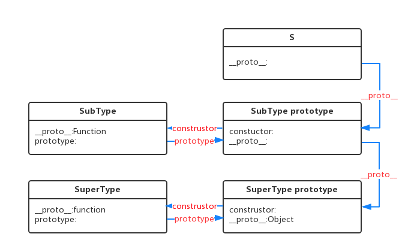
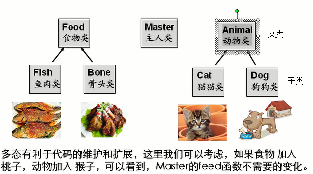
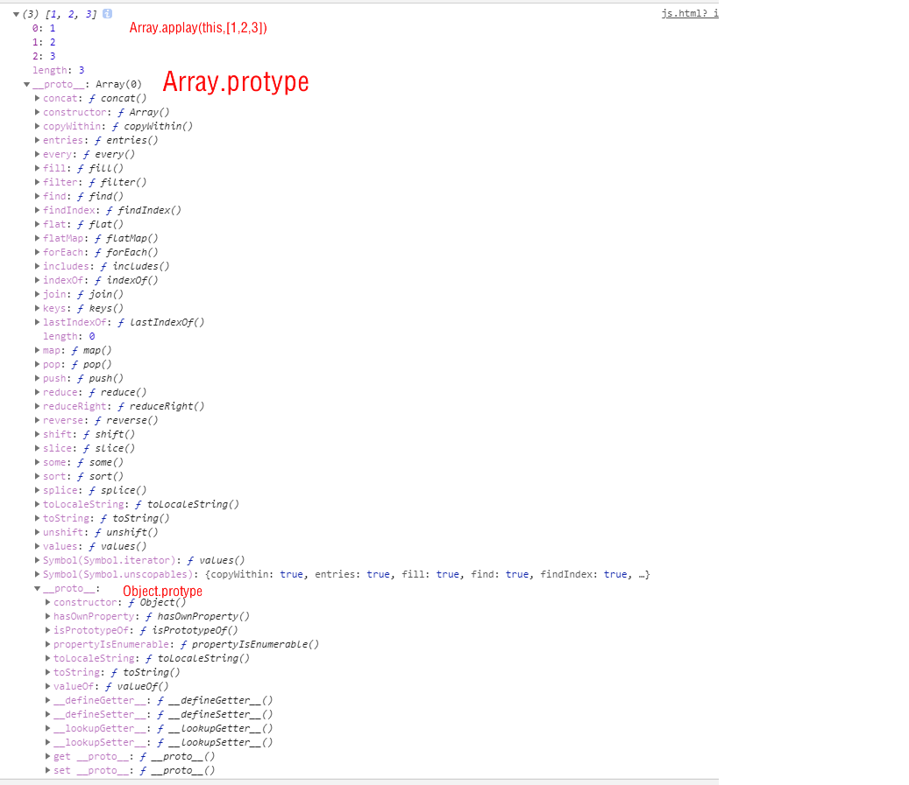

# 标识符命名(已整理)

### 命名表达语义和类型

##### String:第一属性

```		
title
name
```

##### Number类:定义数量

###### 名词

`total age`

###### 形容词+名词

`minNum, maxNum  aveCount`

##### 返回Boolen值的函数:定义判断

###### 下边的动词前缀+名词

| 动词 | 含义                         | 返回值                                                |
| ---- | ---------------------------- | ----------------------------------------------------- |
| can  | 判断是否可执行某个动作(权限) | 函数返回一个布尔值。true：可执行；   false：不可执行  |
| has  | 判断是否含有某个值           | 函数返回一个布尔值。true：含有此值；false：不含有此值 |
| is   | 判断是否为某个值             | 函数返回一个布尔值。true：为某个值；false：不为某个值 |

###### 其他的动词

```
done 在事情完成之前把done设为false,完成之后设为true 
error 在错误发生之前把error设为false,在已经发生时设为true 
found 在没有找到的时候把found设为false,一旦找到就设为true（在一个数组中查找某个值，在文件中搜寻某员工的ID等） 
success或者ok 操作失败为false，操作成功时为true  
disabled
clearable
```

##### Funcion类:定义动作

###### 单个动词

```
get 获取/set 设置,
add 增加/remove 删除
create 创建/destory 移除
start 启动/stop 停止
open 打开/close 关闭,
read 读取/write 写入
load 载入/save 保存,
create 创建/destroy 销毁
begin 开始/end 结束,
backup 备份/restore 恢复
import 导入/export 导出,
split 分割/merge 合并
inject 注入/extract 提取,
attach 附着/detach 脱离
bind 绑定/separate 分离,
view 查看/browse 浏览
edit 编辑/modify 修改,
select 选取/mark 标记
copy 复制/paste 粘贴,
undo 撤销/redo 重做
insert 插入/delete 移除,
add 加入/append 添加
clean 清理/clear 清除,
index 索引/sort 排序
find 查找/search 搜索,
increase 增加/decrease 减少
play 播放/pause 暂停,
launch 启动/run 运行
compile 编译/execute 执行,
debug 调试/trace 跟踪
observe 观察/listen 监听,
build 构建/publish 发布
input 输入/output 输出,
encode 编码/decode 解码
encrypt 加密/decrypt 解密,
compress 压缩/decompress 解压缩
pack 打包/unpack 解包,
parse 解析/emit 生成
connect 连接/disconnect 断开,
send 发送/receive 接收
download 下载/upload 上传,
refresh 刷新/synchronize 同步
update 更新/revert 复原,
lock 锁定/unlock 解锁
check out 签出/check in 签入,
submit 提交/commit 交付
push 推/pull 拉,
expand 展开/collapse 折叠
begin 起始/end 结束,
start 开始/finish 完成
enter 进入/exit 退出,
abort 放弃/quit 离开
obsolete 废弃/depreciate 废旧,
collect 收集/aggregate 聚集
```

```
//表单方法动词
reset 
submit
clear
validation
```

###### 动词+名词(动宾结构)

常用动词前缀

| 动词 | 含义                         | 返回值 |
| ---- | ------------------- | --------------------- |
| get  | 获取某个值                   | 函数返回一个非布尔值                                  |
| set  | 设置某个值                   | 无返回值、返回是否设置成功或者返回链式对象            |
| load | 加载某些数据                 | 无返回值或者返回是否加载完成的结果                    |

```
getGoods
setTable
```

vue模块网络请求函数的动词和后端的名词一致

```
getGoods() getGoodss(/)
postGoods() 
delGoods() 
patchGoods()   //更新某些字段
putGoods()    //更新所有字段
```

*注:后端路由*

```
router
  .get('/goods/:_id', goods.get)
  .get('/goodss', goods.gets)
  .post('/goods',  goods.post)
  .del('/goods',  goods.del)
  .del('/Goodss',  goods.dels)
  .patch('/goods',  goods.patch)

```

###### 对象.动词

```
Dog.update(conditions, update, callback)
```

##### Object:定义一个实例

###### 名词

produce, news

###### 名词+名词

修饰性名词+名词 

偏正短语(定语+主语)

```
customGoods
```

ui名词+名词

偏正短语(定语+主语),

```
tableData
formValue
```

###### 形容词+名词

偏正短语(定语+主语),

```
imp: important重要的
init： initialization初始化、最初的
con：content内容 

```

##### Array :定义一组实例

###### 名词+s

```
goodss
```

### 命名表达性质

##### 类

首字母大写

##### 类的私有变量

```
_name
```

##### 实例的方法

```javascript
$store
```

##### 常量  (全部大写)

```
const MAX_COUNT = 10;
const URL = 'http://www.foreverz.com';
```

##### 全局变量

```
g_color
```

### 命名表达类型


变量命名类型	| 变量命名前缀
---|---
array 数组	| a
boolean 布尔值 |	b
function 函数	|fn
int 整型 |	i
float 浮点数	| l
object 对象|	o
regular 正则	 |r
string 字符串	 |s

### 注释

1. 多行注释

- 说明：以 /* 开头， */ 结尾
- 语法：/* 注释说明 */
- 使用方法：若开始/*和结束*/都在一行，推荐采用单行注释。若至少三行注释时，第一行为/*，最后行为*/，其他行以*开始，并且注释文字与*保留一个空格。

示例:

```
/*
* 代码执行到这里后会调用setTitle()函数
* setTitle()：设置title的值
*/
setTitle();
```

1. 函数(方法)注释

- 说明：函数(方法)注释也是多行注释的一种，但是包含了特殊的注释要求，参照JSDoc
- 语法：

```
/** 
* 函数说明 
* @关键字 
*/
```

常用注释关键字：(只列出一部分，并不是全部)

| 注释名   | 语法                                      | 含义                 | 示例                                         |
| -------- | ----------------------------------------- | -------------------- | -------------------------------------------- |
| @param   | @param 参数名 {参数类型} 描述信息         | 描述参数的信息       | @param name {String} 传入名称                |
| @return  | @return {返回类型} 描述信息               | 描述返回值的信息     | @return {Boolean} true:可执行;false:不可执行 |
| @author  | @author 作者信息 [附属信息：如邮箱、日期] | 描述此函数作者的信息 | @author 张三 2015/07/21                      |
| @version | @version XX.XX.XX                         | 描述此函数的版本号   | @version 1.0.3                               |
| @example | @example 示例代码                         | 演示函数的使用       | @example setTitle(‘测试’)                    |

```
/**
* 合并Grid的行
* @param grid {Ext.Grid.Panel} 需要合并的Grid
* @param cols {Array} 需要合并列的Index(序号)数组；从0开始计数，序号也包含。
* @param isAllSome {Boolean} ：是否2个tr的cols必须完成一样才能进行合并。true：完成一样；false(默认)：不完全一样
* @return void
* @author polk6 2015/07/21 
* @example
* _________________                             _________________
* |  年龄 |  姓名 |                             |  年龄 |  姓名 |
* -----------------      mergeCells(grid,[0])   -----------------
* |  18   |  张三 |              =>             |       |  张三 |
* -----------------                             -  18   ---------
* |  18   |  王五 |                             |       |  王五 |
* -----------------                             -----------------
*/
function mergeCells(grid: Ext.Grid.Panel, cols: Number[], isAllSome: boolean = false) {
  // Do Something
}
```

- 不要保存 this 的引用。使用 Function#bind。

```
// bad
function () {
  var self = this;
  return function () {
    console.log(self);
  };
}

// bad
function () {
  var that = this;
  return function () {
    console.log(that);
  };
}

// bad
function () {
  var _this = this;
  return function () {
    console.log(_this);
  };
}

// good
function () {
  return function () {
    console.log(this);
  }.bind(this);
}
```

- 给函数命名。这在做堆栈轨迹时很有帮助。

```
// bad
var log = function (msg) {
  console.log(msg);
};

// good
var log = function log(msg) {
  console.log(msg);
};
```

- 如果你的文件导出一个类，你的文件名应该与类名完全相同。

```
// file contents
class CheckBox {
  // ...
}
module.exports = CheckBox;

// in some other file
// bad
var CheckBox = require('./checkBox');

// bad
var CheckBox = require('./check_box');

// good
var CheckBox = require('./CheckBox');
```


# js网上的命名规范(未整理)

### 1. 目的

提高代码可预测性和可维护性的方法是使用命名约定，这就意味着采用一致的方法来对变量和函数进行命名。

### 2. 变量名

变量名包括全局变量，局部变量，类变量，函数参数

### 3. 构造函数（类）命名

首字母大写，驼峰式命名。

JS中没有类，但是可以用new调用构造函数：var man = new Person();

### 4. 普通变量命名

首字母小写，驼峰式命名，匈牙利命名

如：nCheckCount 表示整形的数值

### 5. 匈牙利命名法

匈牙利命名法语法：变量名＝类型＋对象描述

- 类型指变量的类型
- 对象描述指对象名字全称或名字的一部分，要求有明确含义，命名要容易记忆容易理解。

提示: 虽然JavaScript变量表面上没有类型，但是JavaScript内部还是会为变量赋予相应的类型

| JavaScript变量起名类型  | 变量命名前缀 | 举例                |
| ----------------------- | ------------ | ------------------- |
| Array 数组              | a            | aList，aGroup       |
| Boolean 逻辑            | b            | bChecked，bHasLogin |
| Function 函数           | f            | fGetHtml，fInit     |
| Integer 数字            | n            | nPage，nTotal       |
| Object 对象             | o            | oButton，oDate      |
| Regular Expression 正则 | r            | rDomain，rEmail     |
| String 字符             | s            | sName，sHtml        |

### 6. 其他前缀规范

可根据团队及项目需要增加

- $：表示Jquery对象例如：$Content，$Module，一种比较广泛的Jquery对象变量命名规范。
- fn：表示函数例如：fnGetName，fnSetAge；和上面函数的前缀略有不同，改用fn来代替，个人认为fn能够更好的区分普通变量和函数变量。

### 7. 例外情况

以根据项目及团队需要，设计出针对项目需要的前缀规范，从而达到团队开发协作便利的目的。

- 作用域不大临时变量可以简写，比如：str，num，bol，obj，fun，arr。
- 循环变量可以简写，比如：i，j，k等。
- 某些作为不允许修改值的变量认为是常量，全部字母都大写。例如：COPYRIGHT，PI。常量可以存在于函数中，也可以存在于全局。必须采用全大写的命名，且单词以_分割，常量通常用于ajax请求url，和一些不会改变的数据。

### 8. 函数命名

普通函数：首字母小写，驼峰式命名，统一使用动词或者动词+名词形式

例如：fnGetVersion()，fnSubmitForm()，fnInit()；涉及返回逻辑值的函数可以使用is，has，contains等表示逻辑的词语代替动词，例如：fnIsObject()，fnHasClass()，fnContainsElment()。

内部函数：使用_fn+动词+名词形式，内部函数必需在函数最后定义。

例如：

```
function fnGetNumber(nTotal) {
    if (nTotal < 100) {
        nTotal = 100;
    }
    return _fnAdd(nTotal);

    function _fnAdd(nNumber) {
        nNumber++;
        return nNumber;
    }
}
alert(fGetNumber(10)); //alert 101
```

对象方法与事件响应函数：对象方法命名使用fn+对象类名+动词+名词形式；

例如： fnAddressGetEmail()，

事件响应函数：fn+触发事件对象名+事件名或者模块名

例如：fnDivClick()，fnAddressSubmitButtonClick()

函数方法常用的动词：


### 9. 变量命名例子

- 为什么需要这样强制定义变量前缀？正式因为javascript是弱语言造成的。在定义大量变量的时候，我们需要很明确的知道当前变量是什么属性，如果只通过普通单词，是很难区分的。普通代码var checked = false; var check = function() { return true; } /** some code **/ if(check) {//已经无法很确切知道这里是要用checked还是check()从而导致逻辑错误 //do some thing } 规范后代码var bChecked = false; var fnCheck = function() { return true; } /** some code **/ if(bChecked) { // do some thing } if(fnCheck()) { // do other thing }
- 如何标明私有方法或私有属性？var person = { getName: function () { return this._getFirst() + ' ' + this._getLast(); }, _getFirst: function () { //... }, _getLast: function (){ //... } }; 在这个例子中，getName()以为这这是API的一个公开的方法，而_getFirst()和_getLast()意味着这是一个私有函数。尽管他们都是普通的公开方法，但是使用下划线前缀的表示方法可以提醒使用person对象的用户，告诉他们这些方法在其他地方不能确保一定能够正常工作，不能直接调用。
- 总结：下面是一些使用下划线约定的变量使用下划线结尾来表明是私有变量，例如name_和getElements_()。使用一个下划线前缀来表示受保护属性，使用两个下划线前缀来表示私有属性。

# 表达式的语义化

```javascript
//定义动作
const callback = require('../callback')
//定义实例
const Dog = require('../../model/Dog')
//定义条件
const conditions = {name: '小黑'}; //也不能指定id创建
//定义动词
const update = {$set: {age: 100}};

//定义实例的属性和方法:------------------------------------------------------

//狗.更新	(当名字叫小黑时)
Dog.update(conditions, update, callback)

// 小黑保存
xiaohei.save(callback)
//小黑的年纪
xiaohei.age

```

# 语句语义化

### 定义变量

描述一个名词实例

```
//变量声明===描述名词
const conditions = {name: '小黑'}; //也不能指定id创建
const update = {$set: {age: 100}};
```

### 条件语句

表示选择

```
if(){}
else( ){}
```


#  函数封装:

## 如何封装

| 描述       | 普通函数 | 构造函数                                           |
| ---------- | -------- | -------------------------------------------------- |
| 相同的部分 | 函数语句 | 属性语句,例如this.mame=name<br />prototype原型方法 |
| 不同的部分 | 函数参数 | 对象的属性值                                       |

```javascript
//原始js
const Koa = require('koa')
const app = new Koa()
app.use((ctx, next) => { //1,2 不同的地方 ,其他相同的地方
    ctx.body = '1',
        next()
    ctx.body += 2
})
app.use((ctx, next) => {
    ctx.body += '3',
        next()
    ctx.body += 4
})
app.use((ctx, next) => {
    ctx.body += '5',
        next()
    ctx.body += 6
})
app.listen(3000)
console.log(":3000")

```
函数封装

```javascript
const Koa = require('koa')
const app = new Koa()

function callback(m, n) { //m,n 不用的地方

    return (ctx, next) => { //函数体相同的地方
        if (!ctx.body) {
            ctx.body = m
        }else {
            ctx.body += m
        }


        next()
        ctx.body += n
    }

}

app.use(callback('1', '2'))
app.use(callback('3', '4'))
app.use(callback('5', '6'))
app.listen(3000)


```
进一步封装

```javascript
const Koa = require('koa')
const app = new Koa()

function fn(m, n) { //m,n 不用的地方

    app.use((ctx, next) => { //函数体相同的地方
        if (!ctx.body) {
            ctx.body = m
        } else {
            ctx.body += m
        }
        next()
        ctx.body += n
    })

}

fn('1', '2')
fn('3', '4')
fn('5', '6')
app.listen(3000)


```
## 函数的解耦和内聚

### 解耦(通过函数封装和函数参数传值实现)

##### 语义分离解耦

无语义代码

```javascript
   function f() {
        let i = 0
        i++
        i *= 50
        console.log(i)
    }

    f()
```
语义分离了 但是未解耦
```
  function add() {
        let i = 0
        i++
        return i
    }

    function chengfa() {
    //这里耦合了
        let i = add()
        i *= 50
        console.log(i)
    }

    chengfa()
```
通过参数解耦(参数是自动声明的变量)

```javascript
    function add() {
        let i = 0
        i++
        return i
    }

    function chengfa(i) {

        i *= 50
        console.log(i)
    }
    let i= add()
    chengfa(i)
```

##### 功能分离

```javascript

    //负责相加
    function add(a, b) {
        return a + b
    }

    //负责打印
    function print(data) {
        console.log(data)
    }

    const data = add(1, 2)
    print(data)

```

##### 复杂条件语句表达式分离出来

```javascript
var getPrice = function( price ){
 var date = new Date();
 if ( date.getMonth() >= 6 && date.getMonth() <= 9 ){ // 夏天
 return price * 0.8;
 }
 return price;
}; 

```
分离
```javascript

var isSummer = function(){
 var date = new Date();
 return date.getMonth() >= 6 && date.getMonth() <= 9;
};
var getPrice = function( price ){
 if ( isSummer() ){ // 夏天
 return price * 0.8;
 }
 return price;
}; 
```

##### component解耦(本质是构造函数解耦)

耦合代码

```html
<script src="https://cdn.bootcss.com/vue/2.5.17-beta.0/vue.js"></script>
<div id="app">
    <!--点击改变value的值,value改变dom自动更新-->
    <ul>
        <li v-for="item in 4" @click="value=item" :class="value===item?'active':''">
           <button>{{item}}</button>
        </li>
    </ul>
    <br>
    {{value}}
</div>

<script>
    const vm = new Vue({
        el: '#app',
        data() {
            return {
                value: 1
            }
        }
    })

</script>

<style>
    .active {
        color: red;
    }

</style>
```
组件解耦(本质是构造函数封装复用)

```html
<script src="https://cdn.bootcss.com/vue/2.5.17-beta.0/vue.js"></script>
<div id="app">
    <!--点击改变value的值,value改变dom自动更新-->
    <cl v-model="value"></cl>
    <br>
    {{value}}
</div>

<script>
    const cl = {
        template: ` <ul>
                        <li v-for="item in 4"
                         @click="$emit('input',item)"
                         :class="item===value?'active':''">
                           <button> {{item}}</button>
                        </li>
                       </ul>`,
        props: ['value']
    }
    const vm = new Vue({
        el: '#app',
        data() {
            return {
                value: 1
            }
        },
        components: {cl}
    })

</script>

<style>
    .active {
        color: red;
    }

</style>
```
<slot/>组件 (本质也是函数)

```html
<script src="https://cdn.bootcss.com/vue/2.5.17-beta.0/vue.js"></script>
<div id="app">
    <!--value是变量媒介,v-model参数-->
    <cl v-model="value">

        <template scope="{item}">
            <button>
                {{item}}
            </button>
        </template>
    </cl>
    {{value}}
</div>

<script>
    const cl = {
        template: ` <ul>
                        <li v-for="item in 4"
                         @click="$emit('input',item)"
                         :class="item===value?'active':''"
                       >
                     <!--    // item是变量媒介 scope是参数-->
                       <slot :item="item">


                      </slot>

                        </li>
                       </ul>`,
        props: ['value']
    }
    const vm = new Vue({
        el: '#app',
        data() {
            return {
                value: 1
            }
        },
        components: {cl}
    })

</script>

<style>
    .active {
        color: red;
    }

</style>

```

##### filter 本质也是函数封装

```html
<script src="https://cdn.bootcss.com/vue/2.5.17-beta.0/vue.js"></script>
<div id="app">
  <!--value是变量媒介,v-model参数-->
  <cl v-model="value" :data="10">

    <template scope="{item}">
      <button>
        {{item|mark(2)}}
      </button>
    </template>
  </cl>
  {{value}}
</div>

<script>
  const cl = {
    template: ` <ul>
                        <li v-for="item in data"
                         @click="$emit('input',item)"
                         :class="item===value?'active':''"
                       >
                     <!--    // item是变量媒介 scope是参数-->
                       <slot :item="item">


                      </slot>

                        </li>
                       </ul>`,
    props: ['value', 'data']
  }
  const vm = new Vue({
    el: '#app',
    data() {
      return {
        value: 1
      }
    },
    components: {cl},
    filters: {
      mark(value, n) {
        return `-${value}-`
      }
    }
  })

</script>

<style>
  .active {
    color: red;
  }

</style>

```

##### v-direct本质也是函数封装

```html
<body>
<meta charset="UTF-8">
<script src="https://cdn.bootcss.com/vue/2.5.17-beta.0/vue.js"></script>
<link href="https://cdn.bootcss.com/animate.css/3.7.0/animate.css" rel="stylesheet">
<div id="app">
    <input v-focus type="text">

</div>


</body>
<script>
    Vue.directive('focus', {
        // 当被绑定的元素插入到 DOM 中时……
        inserted: function (el) {
            // 聚焦元素
            el.focus()
        }
    })
    var vm = new Vue({
        el: "#app",
        data: {msg: 1},
    });


</script>


```

##### < route-view />组件和页面组件之间解耦

```html
<script src="https://cdn.bootcss.com/vue/2.5.17-beta.0/vue.js"></script>
<script src="https://cdn.bootcss.com/vue-router/3.0.1/vue-router.min.js"></script>
<div id="app">

    <ul>
        <li v-for="item in 4">
            <!--传数据给$router-->
            <router-link :to="{path:`/${item}`}">

                {{item}}
            </router-link>

        </li>
    </ul>
    <!--读取组件信息-->
    <router-view></router-view>
</div>

<script>
    const mycomponent = {
        template: `<div>{{id}}</div>`,
        props: ['id']
    }
    const router = new VueRouter({
        linkActiveClass: 'active',
        routes: [

            {
                path: '/:id',
                name: 'id',
                // 路由解耦，parame作为组件mycomponent的属性值
                props: true,
                component:mycomponent
            }]
    })
    const vm = new Vue({
        el: '#app',
        router,
        data() {
            return {
                value: 1
            }
        }
    })

</script>

<style>
    .active {
        color: red;
    }

</style>
```
### 内聚

内聚性的实现：把经常一起变化的部分（联动）放在一起；

## 函数代码优化

### 合并条件语句里的重复语句

```javascript
//原始语句    
function PrintPage(currPage) {
        if (currPage <= 0) {
            currPage = 1
            console.log(currPage)
        } else if (currPage > 10) {
            currPage = 10
            console.log(currPage)
        } else {
            console.log(currPage)
        }

    }
```


```js
   //合并条件语句
   function PrintPage_(currPage) {
        if (currPage <= 0) {
            currPage = 1

        } else if (currPage > 10) {
            currPage = 10
        }
        console.log(currPage)
    }

    PrintPage_(11)
```


# 面向对象的思想

### 面向对象的优点

1. 维护简单
面向对象程序设计的一个特征就是模块化。实体可以被表示为类以及同一名字空间中具有相同功能的类，可以在名字空间中添加一个类而不影响该名字空间的其他成员。这种特征为程序的维护提供了便捷性。

2. 可扩充性
如果有一个具有某一种功能的类，就可以扩充这个类，创建一个具有扩充功能的类。

3. 代码重用
功能是被封装在类中的，类是作为一个独立实体而存在的，因此可以很简单的提供类库，使代码得以重复使用。



### 类是概念

##### 强类型语言和弱类型语言

| 强类型                                                       | 弱类型                                  |
| ------------------------------------------------------------ | --------------------------------------- |
| 强类型指的是每个变量和对象都必须声明类型，在编译时类型不能更改； | 不同提前声明,编译时才确定类型           |
| 强类型语言的函数声明时编译时会检查参数类型,把做什么和谁去做分开 | 弱类型函数没有类型检查,好像谁都可以去做 |
| 安全，效率高                                                 | 不安全                                  |


```javascript
   var dog = 1 //数字类

    class Dog { //dog类
        constructor(age, color) {
            this.age = age
            this.color = color
        }

        cry() {
            console.log('汪汪汪')
        }

    }

    dog = new Dog(12, 'red') //变量类型可变

    console.log(dog)

    function cry(dog) { //函数参数也不用检查类型
        dog.cry()
    }

    cry(dog)
    
```

##### 动态语言和静态语言

静态类型语言在编译时便已确定变量的类型，编辑器能提前报错

动态类型语言的变量类型要到程序运行的时候，待变量被赋予某个值之后，才会具有某种类型,程序检测报错

有共同属性和共同功能的一类事物

##### 类:class,实例的种类

-  数字类 ,->数字实例123
-   字符串类,->字符串实例'ab'
-   对象类->数组类->数组实例[1,2,3]
-    动物类 ->人类->小李

##### 定义类:

```
class Person(){

....

}
```

##### 类的实例化

###### 返回一类事物的一个实例

```javascript
//新建一个人的信息
const xiaoli=new Person()
```

###### 实例属于什么类型: 

xiaoli是人类型的

###### 对象/数组描述一个对象/一组对象



##### 继承的

本质是在不破坏原代码的基础上修改代码,代码复用机制

对原始的蓝图进行修改,产生新型号汽车的蓝图,用于生成新的汽车

```javascript
class StangtanaCar1000{
//一些代码
}

class StangtanaCar2000 extends StangtanaCar1000{
   //另外一些代码  
}
```

# class封装和继承

## ec5封装和继承

### 如何封装构造函数:构造函数的设计


##### 静态方法和原型方法

静态函数是适合所有实例用的工具函数

```javascript
Dog.Create({id:1})
Dog.find({id:1})
Dog.remove({id:2})
dog.update({id:3})
```

实例方法适合个例用的方法

```javascript
const dog=new Dog({id:5})
// 实例方法适合个例用的方法
instance.showInfo
```


### 封装

```javascript
(function(){
//私有变量和私有函数
var privateVariable = 10;
function privateFunction(){
return false;
}
//构造函数
MyObject = function(){
};
//公有方法
 MyObject.publicMethod=funciton(){ }
 //特权方法
MyObject.prototype.publicMethod = function(){
privateVariable++;
return privateFunction();
};
})();
```

### 继承

##### js继承

[](./3.tif)


### 继承方式

##### 原型链

###### **原型继承实例**

```js
  function SuperType() {
    this.property = true;
  }

  SuperType.prototype.getSuperValue = function () {
    return this.property;
  };

  function SubType() {
    this.subproperty = false;
  }

  //继承了SuperType
  SubType.prototype = new SuperType();

//实例化
  const i = new SubType()
  console.log(i)
```



###### **断裂的原型链**

```js
  function SuperType() {
    this.property = true;
  }

  SuperType.prototype.getSuperValue = function () {
    return this.property;
  };

  function SubType() {
    this.subproperty = false;
  }

  //继承了SuperType
  SubType.prototype = new SuperType();
  
//prototype赋值了新地址
  SubType.prototype = {
    getSubValue: function () {
      return this.subproperty;
    },
    someOtherMethod: function () {
      return false;
    }
  };
  const i=new SubType()
  console.log(i)
```

以上代码展示了刚刚把SuperType 的实例赋值给原型，紧接着又将原型替换成一个对象字面量而导致的问题。由于现在的原型包含的是一个Object 的实例，而非SuperType 的实例，因此我们设想中的原型链已经被切断——SubType 和SuperType 之间已经没有关系了。


```js
//  正确写法
function SuperType() {
    this.property = true;
  }

  SuperType.prototype.getSuperValue = function () {
    return this.property;
  };

  function SubType() {
    this.subproperty = false;
  }

  //继承了SuperType
  SubType.prototype = new SuperType();


  //不更改地址
  SubType.prototype.getSubValue = function () {
    return this.subproperty;
  }
  
  const i = new SubType()
  console.log(i)
```


###### **原型链的问题**

原型链虽然很强大，可以用它来实现继承，但它也存在一些问题。其中，最主要的问题来自包含引用类型值的原型。想必大家还记得，我们前面介绍过包含引用类型值的原型属性会被所有实例共享；而这也正是为什么要在构造函数中，而不是在原型对象中定义属性的原因。在通过原型来实现继承时，原型实际上会变成另一个类型的实例。于是，原先的实例属性也就顺理成章地变成了现在的原型属性了。下列代码可以用来说明这个问题。

```js
  function SuperType() {
    this.colors = ["red", "blue", "green"];
  }


  function SubType() {
  }

  //继承了SuperType
  SubType.prototype = new SuperType(); //["red", "blue", "green"];


  var instance1 = new SubType();//{__proto__:{color:["red", "blue", "green"]}}
  instance1.colors.push("black"); //添加属性会更改所有protype,这就不方便了,所以要加入构造函数
  console.log(instance1.colors); //"red,blue,green,black"


  var instance2 = new SubType();
  console.log(instance2.colors); //"red,blue,green,black"
```

##### 构造函数寄生继承

###### 解决原型链的问题

在解决原型中包含引用类型值所带来问题的过程中，开发人员开始使用一种叫做借用构造函数（constructor stealing）的技术（有时候也叫做伪造对象或经典继承）。这种技术的基本思想相当简单，即在子类型构造函数的内部调用超类型构造函数。别忘了，函数只不过是在特定环境中执行代码的对象，因此通过使用apply()和call()方法也可以在（将来）新创建的对象上执行构造函数，如下所示：

```js
function SuperType(){
this.colors = ["red", "blue", "green"];
}
function SubType(){
//继承了SuperType
SuperType.call(this);
}
var instance1 = new SubType();
instance1.colors.push("black");
alert(instance1.colors); //"red,blue,green,black"
var instance2 = new SubType();
alert(instance2.colors); //"red,blue,green"
```

代码中加粗的那一行代码“借调”了超类型的构造函数。通过使用call()方法（或apply()方法也可以），我们实际上是在（未来将要）新创建的SubType 实例的环境下调用了SuperType 构造函数。这样一来，就会在新SubType 对象上执行SuperType()函数中定义的所有对象初始化代码。结果，SubType 的每个实例就都会具有自己的colors 属性的副本了。
###### 传递参数

相对于原型链而言，借用构造函数有一个很大的优势，即可以在子类型构造函数中向超类型构造函数传递参数。看下面这个例子。

  ```js
  function SuperType(name){
  this.name = name;
  }
  function SubType(){
  //继承了SuperType，同时还传递了参数
  SuperType.call(this, "Nicholas");
  //实例属性
  this.age = 29;
  }
  var instance = new SubType();
  alert(instance.name); //"Nicholas";
  alert(instance.age); //29
  ```

###### 借用构造函数的问题

如果仅仅是借用构造函数，那么也将无法避免构造函数模式存在的问题——__方法都在构造函数中定义，因此函数复用就无从谈起了。__而且，在超类型的原型中定义的方法，对子类型而言也是不可见的，结果所有类型都只能使用构造函数模式。考虑到这些问题，借用构造函数的技术也是很少单独使用的。

##### 组合模式 (构造函数寄生继承+原型链)

```javascript
  function SuperType(name){
    this.name = name;
    this.colors = ["red", "blue", "green"];
  }
  SuperType.prototype.sayName = function(){
    console.log(this.name);
  };
  function SubType(name, age){
//继承属性
    SuperType.call(this, name);
    this.age = age;
  }

  //继承方法
  SubType.prototype = new SuperType();
  SubType.prototype.constructor = SubType;
  SubType.prototype.sayAge = function(){
    console.log(this.age);
  };

  var instance1 = new SubType("Nicholas", 29);
  console.log(instance1)
  instance1.colors.push("black");
  console.log(instance1.colors); //"red,blue,green,black"
  instance1.sayName(); //"Nicholas";
  instance1.sayAge(); //29


  var instance2 = new SubType("Greg", 27);
  console.log(instance2)
  console.log(instance2.colors); //"red,blue,green"
  instance2.sayName(); //"Greg";
  instance2.sayAge(); //27
```

##### 原型式继承(加速了辅助构造函数)

道格拉斯·克罗克福德在2006 年写了一篇文章，题为Prototypal Inheritance in JavaScript （JavaScript
中的原型式继承）。在这篇文章中，他介绍了一种实现继承的方法，这种方法并没有使用严格意义上的
构造函数。他的想法是借助原型可以基于已有的对象创建新对象，同时还不必因此创建自定义类型。为
了达到这个目的，他给出了如下函数。

```js
function object(o){
function F(){}
F.prototype = o;
return new F();
}
```

在object()函数内部，先创建了一个临时性的构造函数，然后将传入的对象作为这个构造函数的
原型，最后返回了这个临时类型的一个新实例。从本质上讲，object()对传入其中的对象执行了一次
浅复制。来看下面的例子。


```js
var person = {
name: "Nicholas",
friends: ["Shelby", "Court", "Van"]
};
var anotherPerson = object(person);
anotherPerson.name = "Greg";
anotherPerson.friends.push("Rob");
var yetAnotherPerson = object(person);
yetAnotherPerson.name = "Linda";
yetAnotherPerson.friends.push("Barbie");
alert(person.friends); //"Shelby,Court,Van,Rob,Barbie"
```
克罗克福德主张的这种原型式继承，要求你必须有一个对象可以作为另一个对象的基础。如果有这么
一个对象的话，可以把它传递给object()函数，然后再根据具体需求对得到的对象加以修改即可。在这
个例子中，可以作为另一个对象基础的是person 对象，于是我们把它传入到object()函数中，然后该
函数就会返回一个新对象。这个新对象将person 作为原型，所以它的原型中就包含一个基本类型值属性
和一个引用类型值属性。这意味着person.friends 不仅属于person 所有，而且也会被anotherPerson
以及yetAnotherPerson 共享。实际上，这就相当于又创建了person 对象的两个副本。
ECMAScript 5 通过新增Object.create()方法规范化了原型式继承。这个方法接收两个参数：一
个用作新对象原型的对象和（可选的）一个为新对象定义额外属性的对象。在传入一个参数的情况下，

Object.create()与object()方法的行为相同。

```
var person = {
name: "Nicholas",
friends: ["Shelby", "Court", "Van"]
};
var anotherPerson = Object.create(person);
anotherPerson.name = "Greg";
anotherPerson.friends.push("Rob");
var yetAnotherPerson = Object.create(person);
yetAnotherPerson.name = "Linda";
yetAnotherPerson.friends.push("Barbie");
alert(person.friends); //"Shelby,Court,Van,Rob,Barbie"
PrototypalInheritanceExample02.htm
```

Object.create()方法的第二个参数与Object.defineProperties()方法的第二个参数格式相
同：每个属性都是通过自己的描述符定义的。以这种方式指定的任何属性都会覆盖原型对象上的同名属
性。例如：

Object.create()方法的第二个参数与Object.defineProperties()方法的第二个参数格式相
同：每个属性都是通过自己的描述符定义的。以这种方式指定的任何属性都会覆盖原型对象上的同名属
性。例如：

```js
var person = {
name: "Nicholas",
friends: ["Shelby", "Court", "Van"]
};
var anotherPerson = Object.create(person, {
name: {
value: "Greg"
}
});
alert(anotherPerson.name); //"Greg"
PrototypalInheritanceExample03.htm
```

支持Object.create()方法的浏览器有IE9+、Firefox 4+、Safari 5+、Opera 12+和Chrome。
在没有必要兴师动众地创建构造函数，而只想让一个对象与另一个对象保持类似的情况下，原型式
继承是完全可以胜任的。不过别忘了，包含引用类型值的属性始终都会共享相应的值，就像使用原型模
式一样。

支持Object.create()方法的浏览器有IE9+、Firefox 4+、Safari 5+、Opera 12+和Chrome。
在没有必要兴师动众地创建构造函数，而只想让一个对象与另一个对象保持类似的情况下，原型式
继承是完全可以胜任的。不过别忘了，包含引用类型值的属性始终都会共享相应的值，就像使用原型模
式一样。

>  和原型链的不同是只取prototype部分,除去构造函数部分

理想状态,但不是所有的浏览器都支持__ proto __,完整实例

```js
 var person = {
    name: "Nicholas",
    friends: ["Shelby", "Court", "Van"]
  };


  var anotherPerson={__proto__ : person,}

   anotherPerson.name = "Greg";
  anotherPerson.friends.push("Rob");
  console.log(anotherPerson.friends) //["Shelby", "Court", "Van",'rob']

  var yetAnotherPerson={__proto__ : person}
  yetAnotherPerson.name = "Linda";
  yetAnotherPerson.friends.push("Barbie");
  console.log(yetAnotherPerson.friends); //["Shelby,Court,Van,Rob,Barbie"]
  console.log(anotherPerson.friends) //["Shelby,Court,Van,Rob,Barbie"]
```

原型式继承完整实例

```javascript
//在object()函数内部，先创建了一个临时性的构造函数，然后将传入的对象作为这个构造函数的原型，最后返回了这个临时类型的一个新实例。从本质上讲，object()对传入其中的对象执行了一次
  
function object(o){
    function F(){}
    F.prototype = o;
    return new F();
  }

  var person = {
    name: "Nicholas",
    friends: ["Shelby", "Court", "Van"]
  };


  var anotherPerson = object(person); //{__proto__:{name: "Nicholas",  friends: ["Shelby", "Court", "Van"]}   }
  anotherPerson.name = "Greg";
  anotherPerson.friends.push("Rob");
  console.log(anotherPerson.friends) //["Shelby", "Court", "Van",'rob']

  var yetAnotherPerson = object(person);//{__proto__:{name: "Nicholas",  friends: ["Shelby", "Court", "Van"]}   }
  yetAnotherPerson.name = "Linda";
  yetAnotherPerson.friends.push("Barbie");
  console.log(yetAnotherPerson.friends); //"Shelby,Court,Van,Rob,Barbie"

```
es6Object.create替代完整实例

```js
  var person = {
    name: "Nicholas",
    friends: ["Shelby", "Court", "Van"]
  };

  var anotherPerson = Object.create(person); //{__proto__:{name: "Nicholas",  friends: ["Shelby", "Court", "Van"]}   }
  anotherPerson.name = "Greg";
  anotherPerson.friends.push("Rob");

  var yetAnotherPerson = Object.create(person);{__proto__:{name: "Nicholas",  friends: ["Shelby", "Court", "Van"]}   }
  yetAnotherPerson.name = "Linda";
  yetAnotherPerson.friends.push("Barbie");
  alert(person.friends); //"Shelby,Court,Van,Rob,Barbie"
```

##### 寄生继承  (对辅助函数进行了寄生好处是可以对原型进一步修改) 

寄生式（parasitic）继承是与原型式继承紧密相关的一种思路，并且同样也是由克罗克福德推而广
之的。寄生式继承的思路与寄生构造函数和工厂模式类似，即创建一个仅用于封装继承过程的函数，该
函数在内部以某种方式来增强对象，最后再像真地是它做了所有工作一样返回对象。以下代码示范了寄
生式继承模式。

```js
function createAnother(original){
var clone = object(original); //通过调用函数创建一个新对象
clone.sayHi = function(){ //以某种方式来增强这个对象
alert("hi");
};
return clone; //返回这个对象
}
```

在这个例子中，createAnother()函数接收了一个参数，也就是将要作为新对象基础的对象。然
后，把这个对象（original）传递给object()函数，将返回的结果赋值给clone。再为clone 对象
添加一个新方法sayHi()，最后返回clone 对象。可以像下面这样来使用createAnother()函数：

在这个例子中，createAnother()函数接收了一个参数，也就是将要作为新对象基础的对象。然
后，把这个对象（original）传递给object()函数，将返回的结果赋值给clone。再为clone 对象
添加一个新方法sayHi()，最后返回clone 对象。可以像下面这样来使用createAnother()函数：

```js
var person = {
name: "Nicholas",
friends: ["Shelby", "Court", "Van"]
};
var anotherPerson = createAnother(person);
anotherPerson.sayHi(); //"hi"
```

这个例子中的代码基于person 返回了一个新对象——anotherPerson。新对象不仅具有person
的所有属性和方法，而且还有自己的sayHi()方法。
在主要考虑对象而不是自定义类型和构造函数的情况下，寄生式继承也是一种有用的模式。前面示
范继承模式时使用的object()函数不是必需的；任何能够返回新对象的函数都适用于此模式。

这个例子中的代码基于person 返回了一个新对象——anotherPerson。新对象不仅具有person
的所有属性和方法，而且还有自己的sayHi()方法。
在主要考虑对象而不是自定义类型和构造函数的情况下，寄生式继承也是一种有用的模式。前面示
范继承模式时使用的object()函数不是必需的；任何能够返回新对象的函数都适用于此模式。

>  使用寄生式继承来为对象添加函数，会由于不能做到函数复用而降低效率；这一点与构造函数模式类似。

完整实例

```javascript
    function object(o) {
        function F(){}
        F.prototype = o;
        return new F();
    }

    function createAnother(original) {
        // 通过调用函数创建一个新对象
        var clone = object(original);
        // 以某种方式来增强这个对象
        clone.sayHi = function() {
            alert("hi");
        }

        return clone;
    }

    var person = {
        name: "Bert",
        friends: ["Shelby", "Court", "Van"]
    };

    var anotherPerson = createAnother(person);
    console.log(anotherPerson)
    anotherPerson.sayHi(); // Hi

```

克罗克福德主张的这种原型式继承，要求你必须有一个对象可以作为另一个对象的基础。如果有这么
一个对象的话，可以把它传递给object()函数，然后再根据具体需求对得到的对象加以修改即可。在这
个例子中，可以作为另一个对象基础的是person 对象，于是我们把它传入到object()函数中，然后该
函数就会返回一个新对象。这个新对象将person 作为原型，所以它的原型中就包含一个基本类型值属性
和一个引用类型值属性。这意味着person.friends 不仅属于person 所有，而且也会被anotherPerson
以及yetAnotherPerson 共享。实际上，这就相当于又创建了person 对象的两个副本。

###### Object.create()

ECMAScript 5 通过新增Object.create()方法规范化了原型式继承。这个方法接收两个参数：一
个用作新对象原型的对象和（可选的）一个为新对象定义额外属性的对象。在传入一个参数的情况下，
Object.create()与object()方法的行为相同。

```js
var person = {
name: "Nicholas",
friends: ["Shelby", "Court", "Van"]
};
var anotherPerson = Object.create(person);
anotherPerson.name = "Greg";
anotherPerson.friends.push("Rob");
var yetAnotherPerson = Object.create(person);
yetAnotherPerson.name = "Linda";
yetAnotherPerson.friends.push("Barbie");
alert(person.friends); //"Shelby,Court,Van,Rob,Barbie"
```


Object.create()方法的第二个参数与Object.defineProperties()方法的第二个参数格式相同：每个属性都是通过自己的描述符定义的。以这种方式指定的任何属性都会覆盖原型对象上的同名属性。
例如：

同：每个属性都是通过自己的描述符定义的。以这种方式指定的任何属性都会覆盖原型对象上的同名属
性。例如：

```js
var person = {
    name: "Nicholas",
    friends: ["Shelby", "Court", "Van"]
  };

  var otherPerson = Object.create(person)
  console.log(otherPerson) //{__proto__:person}

  var anotherPerson = Object.create(person, {
    name: {
      value: "Greg"
    }
  });
  console.log(anotherPerson) //{name:Greg,__proto__:person}

```

支持Object.create()方法的浏览器有IE9+、Firefox 4+、Safari 5+、Opera 12+和Chrome。
在没有必要兴师动众地创建构造函数，而只想让一个对象与另一个对象保持类似的情况下，原型式
继承是完全可以胜任的。不过别忘了，包含引用类型值的属性始终都会共享相应的值，就像使用原型模
式一样。

##### 寄生式组合继承

前面说过，组合继承是JavaScript 最常用的继承模式；不过，它也有自己的不足。组合继承最大的
问题就是无论什么情况下，都会调用两次超类型构造函数：一次是在创建子类型原型的时候，另一次是
在子类型构造函数内部。没错，子类型最终会包含超类型对象的全部实例属性，但我们不得不在调用子
类型构造函数时重写这些属性。再来看一看下面组合继承的例子。

组合继承实例:

```js
function SuperType(name){
this.name = name;
this.colors = ["red", "blue", "green"];
}
SuperType.prototype.sayName = function(){
alert(this.name);
};

function SubType(name, age){
SuperType.call(this, name); //第二次调用SuperType()
this.age = age;
}
//掺杂了其他属性
SubType.prototype = new SuperType(); //第一次调用SuperType()
SubType.prototype.constructor = SubType; //补充原型
SubType.prototype.sayAge = function(){ //补充原型
alert(this.age);
};


const i = new SubType('xiaoli', 20)
console.log(i)

```

加粗字体的行中是调用SuperType 构造函数的代码。在第一次调用SuperType 构造函数时，
SubType.prototype 会得到两个属性：name 和colors；它们都是SuperType 的实例属性，只不过
现在位于SubType 的原型中。当调用SubType 构造函数时，又会调用一次SuperType 构造函数，这
一次又在新对象上创建了实例属性name 和colors。于是，这两个属性就屏蔽了原型中的两个同名属
性。图6-6 展示了上述过程。
如图6-6 所示，有两组name 和colors 属性：一组在实例上，一组在SubType 原型中。这就是调
用两次SuperType 构造函数的结果。好在我们已经找到了解决这个问题方法——寄生组合式继承。
所谓寄生组合式继承，即通过借用构造函数来继承属性，通过原型链的混成形式来继承方法。其背
后的基本思路是：不必为了指定子类型的原型而调用超类型的构造函数，我们所需要的无非就是超类型
原型的一个副本而已。本质上，就是使用寄生式继承来继承超类型的原型，然后再将结果指定给子类型
的原型。寄生组合式继承的基本模式如下所示。

```js
function inheritPrototype(subType, superType){
var prototype = object(superType.prototype); //创建对象
prototype.constructor = subType; //增强对象
subType.prototype = prototype; //指定对象
}
```

这个示例中的inheritPrototype()函数实现了寄生组合式继承的最简单形式。这个函数接收两
个参数：子类型构造函数和超类型构造函数。在函数内部，第一步是创建超类型原型的一个副本。第二
步是为创建的副本添加constructor 属性，从而弥补因重写原型而失去的默认的constructor 属性。
最后一步，将新创建的对象（即副本）赋值给子类型的原型。这样，我们就可以用调用inherit-
Prototype()函数的语句，去替换前面例子中为子类型原型赋值的语句了，例如：

```js
 function object(o) {
    //F是一个类似SuperType的函数,去掉了this构造语句,只保留原型
    function F() {
    }
    F.prototype = o;

    return new F();//返回实例化对象{__proto__=superType.protype},这样绕一圈为因为有的浏览器不支持__proto__
  }


  function SuperType(name) {
    this.name = name;
    this.colors = ["red", "blue", "green"];
  }

  SuperType.prototype.sayName = function () {
    alert(this.name);
  };

  function SubType(name, age) {
    SuperType.call(this, name);
    this.age = age;
  }

  //此处用了寄生继承
  function inheritPrototype(subType, superType) {
//不是所有浏览器都支持__proto__,不能直接设置subtype.__proto--=Supertype.protype,所以使用object()
    var prototype = object(superType.prototype); //设置原型为{__proto__=superType.protype}
    prototype.constructor = subType;// 补充原型 {__proto__=superType.protype,constructor:SuperType}
    subType.prototype = prototype;
  }

  inheritPrototype(SubType, SuperType);//传入传输数据调用


  //弱类型可以再补充原型{__proto__=superType.protype,constructor:SuperType,sayAge(){}}
  SubType.prototype.sayAge = function () {
    alert(this.age);
  };

  const i = new SubType('xiaoli', 20)
  console.log(i)
```


使用Object.create

先看一个例子：

```js
  function SuperType(name) {
    this.name = name;
    this.colors = ["red", "blue", "yellow"];
  }

  SuperType.prototype.sayName = function () {
    console.log(this.name);
  };

  function SubType(name,age) {
    //构造函数寄生继承
    SuperType.call(this, name);
    this.age = age;
  }

  function inheritPrototype(SuperType, SubType) {
    //原型继承
    SubType.prototype = Object.create(SuperType.prototype);
    SubType.prototype.constructor = SubType;

  }

  inheritPrototype(SuperType, SubType);
  var s1 = new SubType("xiaoming",12);
  console.log(s1)
  s1.sayName()
```

　　这个代码中有一个Object.create(supertype)函数，这个函数是ECMAScript 6为了规范原型式继承而提出的一个方法，与下面这个方法是等价的：

```js
function object(o){
    function f(){}
    f.prototype = o;
    return new f();
}
```

　　这个方法做了什么工作呢？如下图所示：


　　object(o)方法的工作就是：

- 创建一个构造函数f
- 使该构造函数的prototype指针指向参数
- 创建f对象的一个实例，幷返回

　　在该函数调用完以后，f的构造函数便会销毁，所以整个函数的工作就是让一个对象的__proto__指针指向参数。

　　继续回到寄生组合式继承，第二行代码:

```js
var prototype = Object.create(SuperType.prototype);
```

　　使得新创建的prototype对象的__proto__指针指向SuperType的原型对象。再看第三四行：

```js
prototype.constructor = SubType;
SubType.prototype = prototype;
```

　　将这个prototype对象的construstor指针指向SubType的构造函数，幷将SubType的构造函数的prototype指针指向这个prototype对象，所以inheritPrototype的工作就是使SubType继承于SuperType(也就是SubType的原型对象的__proto__指针指向SuperType的原型对象)，如下图所示。　　

**


## class封装和继承

class的本质是创造一类的若干对象的构造函数,类是构造函数的语法糖

```javascript
 Class={
    staticFn:()=>{...}
    protorype:{
               instaceFn(){}
               }


   }

Class.staticFn:()

Class.protorype.instaceFn()
```

```javascript
 class Point {
        static staticFn() {
            console.log('staticFn')
        }

        constructor(x, y) {
            this.x = x;
            this.y = y;
        }

        get value() {
            console.log('Getting the current value!');
            return this.x;
        }

        toString() {
            return '(' + this.x + ', ' + this.y + ')';
        }
    }

    const point = new Point(1, 2)

    console.log(point)

    class Point_extend extends Point {


        cs() {
            console.log('cs')
        }
    }

    //类能继承静态函数
    Point_extend.staticFn()

    const point_extend = new Point_extend(10, 20)

    console.log(point_extend)

```

###### 模拟vue构造函数

```javascript
//store实例化
    const store = {
        counter: 0,
        add(n) {
            this.counter += n
        }
    }


    //组件构造器产生组件Person的工厂函数
    class Person {
        constructor({beforeCreate, created, store, data, methods, computed, watch, callbackProp, props, $father}) {
            beforeCreate()
            for (let item in data) {
                this[item] = data[item]

            }
            if (props) {
                for (let item of props) {
                    this[item] = $father[item]

                }
            }
            for (let item in methods) {

                this[item] = methods[item]
            }

            //计算属性和watch
            for (let item in {...computed, ...watch}) {
                Object.defineProperty(this, `${item}`, {
                    get: computed.com,
                    set: function () {
                        console.log('触发watch')
                    }
                })
            }

            this.$store = store

            created()
        }
    }

    //实例化组件,切换路由操作,出发这个构造函数运行-------------------------------------
    const father = new Person({
        data: {
            name: 'father',
            age: 18,
            hometownProp: 'china',
            callbackProp: function (n) {
                console.log(this.age = n)
            },
        },

        store,
        beforeCreate() {
            console.log('beforeCreateg钩子:对象将要建立')
        },
        created() {
            console.log('created钩子:对象建立了')
        },


    })


    const child = new Person({
        data: {
            name: '小黑',
            age: 2
        },
        computed: {
            com: function () {
                return this.name + this.age
            },

        },
        props: ['hometownProp', 'callbackProp']
        ,
        methods: {
            $emit(n) {
                this.callbackProp.call(this.$father, n)
            }
        },

        beforeCreate() {
            console.log('对象将要建立')
        },
        created() {
            console.log('对象建立了')
        },
        store,
        $father: father


    })

    //标签嵌套
    father.$children = child
    child.$father = father


    //onlick等事件回调才运行--------------------------------------------------------------
    child.$emit(10)
    child.$father.sex = '男'


    //onclick等事件驱动提交store负荷
    father.$store.add(10)

    console.log(father)
    console.log(child)

    document.getElementById('#app').innerHTML = child.com


```

模拟vue构造实现$father

```javascript
    var test=new function (){

        var self=this
        this.Name="test"
        this.subTest=new function(parent=self){
            this.Name="test1"
            this.parent=this
            this.PName=function(){return parent.Name}
        }
        this.subTest.parent=this
    }
    console.log(test)

    alert(test.subTest.PName())
```


## 多态

### **定义:**

一个函数传入不同的对象做参数，返回不同的值

### **本质:**

一种解耦机制,把做什么(函数体,相同部分)和谁去做(强类型语言检查参数类型 ,不同部分)解耦:

| 解耦   | 多态函数           |
| ------ | ------------------ |
| 做什么 | 函数体[相同部分]   |
| 谁去做 | 函数参数[不同部分] |

### class实现多态

##### 模仿强类型语言 通过超类实现多态覆盖


```javascript

    class Person {
        constructor(name) {
            this.name = name
        }

        saySomething() {

        }
    }

    class Man extends Person {
        constructor(name) {
            super(name)
        }

        saySomething() {
            console.log('I am Man')
        }
    }

    class Woman extends Person {
        constructor(name) {
            super(name)
        }

        saySomething() {
            console.log('I am Woman')
        }
    }

    let man = new Man('a')
    let woman = new Woman('b')


    function saySex(pepole) { //ts这里会检查参数类型,指定谁去做
        if(pepole instanceof Person) //js模仿类型检测
        pepole.saySomething()
    }

    saySex(man)
    saySex(woman)

    //好处是不用重写saySex, 继承Person的其他子类容易扩展

    class Yao extends Person {
        constructor(name) {
            super(name)
        }

        saySomething() {
            console.log('I am yao')
        }
    }

    let yao=new Yao('yao')
    saySex(yao) //好处saySex不用重写

```

### ec5多态

##### 鸭辩模型

鸭子类型（duck typing）如果它走起路来像鸭子，叫起来也是鸭子，那么它就是鸭子。
只关注对象的行为，不关注对象本身面向接口编型 ，而不是面向实现编程，是设计模式中最重要的思想。代码演示：

```js
                var duck = {
                     duckSinging:function(){
                             console.log('呱呱呱');
                     }
                }
                alert('duck');

                var chicken = {
                     duckSinging:function(){
                             console.log('呱呱呱');
                     }
                }
                alert('chicken');

                var chior = [];

                var joinChior = function(animal){
                     if (animal && typeof animal.duckSinging === 'function') { //typeof就是判断参数是什么类型的实例                
                             chior.push(animal);
                             console.log('恭喜你加入合唱团');
                             console.log('当前已募集'+chior.length+'只鸭子');
                     }
                }
                joinChior(duck);
                joinChior(duck);
                joinChior(chicken);
```

##### 弱类型语言实现多态

语义分离
```javascript
//这个并非多态,只是函数语义分离
    var googleMap = {
        show: function () {
            console.log('开始渲染谷歌地图');
        }
    };
    var renderMap = function () {
        googleMap.show();
    };
    renderMap(); // 输出：开始渲染谷歌地图
```

 多态:一个函数用于不同的对象

```javascript
var googleMap = {
    show: function(){
        console.log( '开始渲染谷歌地图' );
    }
};
var baiduMap = {
    show: function(){
        console.log( '开始渲染百度地图' );
    }
};
var renderMap = function( type ){
    //像什么就让它去做
    if ( type === 'google' ){
        googleMap.show();
    }else if ( type === 'baidu' ){
        baiduMap.show();
    }
};
renderMap( 'google' ); 
renderMap( 'baidu' ); 

```
可扩展多态:js不用建立父类和超类就可以构造对象

```javascript
    var googleMap = {
        show: function(){
            console.log( '开始渲染谷歌地图' );
        }
    };
    var baiduMap = {
        show: function(){
            console.log( '开始渲染百度地图' );
        }
    };
    var renderMap = function( map ){ //ts会对map进行判断,省去条件语句,把做什么(本函数)和谁去做(参数类型)分类,从而出去if判断
       if(map.show instanceof Function){//js模仿类型检测
           map.show()
       }

    };
    renderMap( 'google' );
    renderMap( 'baidu' );

    //添加新类和实例化对象
    var gaode = {
        show: function(){
            console.log( '开始渲染高德地图' );
        }
    };

    //好处是不用重写reader
    renderMap( 'gaode' );
```

##### 多态实现实例





```javascript


function Food(name){ 
    this.name=name; 
} 
//鱼类 
function Fish(name){ 
    this.food=Food; 
    this.food(name); 
} 
//骨头 
function Bone(name){ 
    this.food=Food; 
    this.food(name); 
} 
//---------------------------------------------------
//动物类 
function Animal(name){ 
    this.name=name; 
} 
//猫猫 
function Cat(name){ 
    this.animal=Animal; 
    this.animal(name); 
} 
//狗狗 
function Dog(name){ 
    this.animal=Animal; 
    this.animal(name); 
} 

var cat=new Cat("猫"); 
var fish=new Fish("鱼"); 

var dog=new Dog("狗"); 
var bone=new Bone("骨头"); 

//-----------------------------------------------------------------
// Master类 
function Master(name){ 
    this.nam=name; 
   
} 

Master.prototype.feed=function (animal,food){ //ts会对amimal和food检查,做什么(本函数)和谁去做(参数类型)分开
     if(animal instaceof Animal && food instance Food){// js模仿类型检测
    window.alert("给"+animal.name+" 喂"+ food.name); 
    }
} 
//创建一个主人 
var master=new Master("zs"); 
master.feed(dog,bone); 
master.feed(cat,fish);

// ------------------后期扩展----------------------------------------

//猴子 
function Monkey(name){ 
    this.animal=Animal; 
    this.animal(name); 
} 

// 桃子
function Peach(name){ 
    this.food=Food; 
    this.food(name); 
} 


var monkey=new Monkey("猴"); 
var peach=new Peach("桃"); 

 // 这样做的优点在于扩展Monkey,Peach时, Master和父类 Animal Food不需要改变

master.feed(monkey,peach);


```

# 实例化对象

### 生成对象

#####  Construct的键值对也一切可变


###### Construct

Construct的内存地址可变,但是变了就没意义了

######  Construct.prototype

可以被实例化对象访问,可以用call作用于实例化对象

```javascript
const arr=[10,2,3]
arr.sort((a,b)=>a-b)//arr调用sort,this===arr; 回调参数做参数
Array.prototype.sort.call(arr,(a,b)=>a-b)//call(arr ),this===arr;回调参数做参数
```

###### Construct.stitacFn

可以给实例化会对象使用

##### new Construct( )

实例

```js
  function Person(name, age) {
    this.name = name;
    this.age = age
    // return {name: name}
  }

  Person.prototype.sayName = function () {
    console.log(this.name)
  }

  //new------------------------------
  const xiaoming = new Person('xiaoming', 12)
  console.log(xiaoming)

  //new原理------------------------------------------
  let obj = {}
  obj.__proto__ = Person.prototype
  let res = Person.apply(obj, ['xiaohong', 13])
  if (typeof res === Object) {
    obj = res
  }

  //作为普通函数使用--------------
  Person('xiaobai', 14)  //等价于Person.apply(window,['xiaobai', 14])
//prototype函数作为普通函数使用------

Person.protype.sayname.call(xiaoming) //本质 先this==xiaoming,后运行函数sayName
```

 构造函数未传参的参数和普通函数一样默认undefine

```
vue对象的默认属性的值undefined构造函数调用new button(),实参传值给形参未赋值的形参为undefine
```

不可枚举的ownProperty

```js
    function Fn(name, age) {
        this.name = name;
        //设置ownProperty
        Object.defineProperty(this, 'age', {
            configurable: false,//不可删除
            enumerable: false,//不可枚举
            writable: true,//可读性
            value: age//value,可写
        })
    }

    const i = new Fn('小女', 21)
    console.log(Object.keys(i))
```

模仿new原理

```js
//模仿new  
  let obj = {}
  obj.__proto__ = Array.prototype
  const res = Array.call(obj, 1, 2, 3)
  if (typeof res === obj) {//true
    obj = res
  } 
  console.log(obj)
```



其他的

```js
new Object({a:1})
new Function('a,b','a+b')
new Array(1,2,3)
new RegExp(/\w/,'ig')
//------------------------
new String('hello');   等价于      const str=new Object('hello')
//----------------------
new Vue()
```

##### 字面量

用于新建对象和控制台打印(等同于new Construct())

```js
const obj={a:1}
function fn(){}
const arr=[1,2,3]
const reg=/\w/ig
//----------------
const str='hello'
//----------------
<div id='app'></div>
```

```js
console.log(obj)//{a:1}
console.log(fn)//fn(){}
console.log(arr)//[1,2,3]
console.log(reg)// /\w/ig
//----------------
console.log(str)//hello
//----------------
console.log(document.getElmentById())//<div id='app'></div>

```

##### Object.creat(Array.prototype,{.....})

creat原理

```js
  const i=o(Array.prototype)
  console.log(i)//{__proto__:Array.prototype}
```

```js
  const fn=Object.create(Function.prototype,{
    "a":{value :1,congigurable :false,enumerable :true,writable:true},
    "b":{value :2,congigurable :false,enumerable :true,writable:true},
    "c":{value :3,congigurable :false,enumerable :true,writable:true}
  })
  console.log(fn.__proto__)//Function.prototype
  console.log(fn.a)//输出 1
  console.log(fn.b)//输出 2
  console.log(fn.c)//输出 3


  const arr=Object.create(Array.prototype,{
    "a":{value :1,congigurable :false,enumerable :true,writable:true},
    "b":{value :2,congigurable :false,enumerable :true,writable:true},
    "c":{value :3,congigurable :false,enumerable :true,writable:true}
  })
  console.log(arr.__proto__)//Array.prototype
  console.log(arr.a)//输出 1
  console.log(arr.b)//输出 2
  console.log(arr.c)//输出 3


  const reg=Object.create(RegExp.prototype,{
    "a":{value :1,congigurable :false,enumerable :true,writable:true},
    "b":{value :2,congigurable :false,enumerable :true,writable:true},
    "c":{value :3,congigurable :false,enumerable :true,writable:true}
  })
  console.log(reg.__proto__)//RegExp.prototype
  console.log(reg.a)//输出 1
  console.log(reg.b)//输出 2
  console.log(reg.c)//输出 3


  const str=Object.create(String.prototype,{
    "a":{value :1,congigurable :false,enumerable :true,writable:true},
    "b":{value :2,congigurable :false,enumerable :true,writable:true},
    "c":{value :3,congigurable :false,enumerable :true,writable:true}
  })
  console.log(str.__proto__)//String.prototype
  console.log(str.a)//输出 1
  console.log(str.b)//输出 2
  console.log(str.c)//输出 3
```

### 实例对象都是键值对

都是`{prop:'',fn(){},__proto__}`的形式,

对象<=>键值对<=>引用类型

```js
                                         Functon

                                            ↓
    String               (Object)                   Array               (Vue,nuxt,Koa)   
      ↓new                  ↓ new                    ↓new                     ↓new                   
 {0:'a',__Proto__}    {a:1,__proto__}      {0:1,length:1.__proto__}    {...,__proto__ }

```

### 控制台打印字面量和真实键值对


### 对象的内存地址赋值给变量

##### 赋值给自由变量

```js
const obj={a:1}
function fn(){}
const arr=[1,2,3]
const reg=/\w/ig
//----------------------
const str=new String('hello') 
//----------------------
const el=document.getElmentById()
const vm=new Vue({})

```

```js
    //1.函数的定义
    function sum1(a1,b1){
        return a1+b1;
    }
    sum1.age = 100;
    console.log(sum1(1,1));//2
    console.log( sum1.age )


    var sum2 = function(a1,b1){
        return a1+b1;
    };
    console.log(sum2(1,1));//2
    console.log(sum2)


    var sum3 = new Function("a1,b1","return a1+b1;");
    console.log({sum3})
    sum3.age = 100;
    console.log(sum3(1,1));//2
    console.log(sum3.age);//100

```

es6语法的错觉

```js
    data = {
        a: 1,
       function  () {
            console.log(123)

        }
    }


//上面等价于

    data = {
        a: 1,
       function: function  () {
            console.log(123)

        }
    }

```

##### 赋值给参数

作为vue构造函数参数

```
new Vue({el:'#app'})
```

作为回调函数的参数

```
Array.sort((a,b)=>a-b)
```

作为promise构造函数的参数

```javascript
new Promise((resolve,reject)=>{resolve(1)})
```

##### 赋值给this

obj.fn(){}

fn.call(obj)

### 函数类型的对象和()计算产生返回值


```
function fn(){}()
fn()
new Funciton()
```

### 判断对象类型

##### type of 

```js
const b=true
const n=1
function f() {

}
const arr=[1,2]

console.log(typeof b,typeof n, typeof f,typeof arr) //boolean number function object
```

##### instance of xxx

<a href="./3.png"></a>


### js弱类型语言,变量类型可变

添加修改删除访问own属性<=>增加和删除构造函数语句<=>类型可变

##### 添加属性

###### 1. obj.a

obj.a添加可枚举key  键都是字符串obj.a或者obj[' ']

```javascript
obj={

        'fn'() {
            console.log('fn')
        },
        '0'(){
            console.log(0)
        }

}
obj[”a”]
obj.a等价于 obj[”a”]
obj[’0’]
obj[0]  等价于 obj[’0’]
const i='color'  obj[i+'primary'],变量做键值[i+'primary']返回字符串
   

 //数组
arry[0]
arry['0']


 //类数组对象
let ArrayLike = { 0 : "a", 1 : "b", 2 : "c" ,length:3};
ArrayLike[2]
ArrayLike['2']


 //字符串(类数组)


let str = 'abc'

str[1]
str['1']


//先定义obj 才能用obj.a,没赋值默认都是undifine


   let obj = {}//要先定义obj再设置obj.a才行

    console.log(obj.a)
    console.log(obj.b)
    console.log(obj.c)


//arr=[] 才能用arr[0],没赋值默认都是undifine


  let arr=[]
  console.log( arr[0],arr[1])
```

###### 2. Object.defineProperty()添加属性

 键值也是字符串

```
    obj = {a: 1, b: 2}

    Object.defineProperty(obj, 'c', {//可以改变其他属性的值，可以把其他属性的值赋值给自己
        configurable: false,
        enumerable: true,
        set: function () {
            this.a = 0
        },
        get: function () {
            return this.b
        }

    })
    obj.c = 3 //set触发tis.a=0
    console.log(obj)//除非get
```

```
 obj = {a: 1, b: 2, c: 3}
    Object.defineProperty(obj, 'd', {
        configurable: false,
        enumerable: false,
        writable: true,
        value: 4
    })

```


##### 删除属性

```
delate(obj.a)
```

##### 属性赋值

obj['a']可赋值普通类型或者地址类型

##### 属性访问表达式

obj['a'],obj和'a'计算后的返回值(普通类型或者地址类型)

### 实例间的通信

等同于两个对象内的函数通信

# 文件作用域的封装

### 如何封装

| 描述                 |                                                  |      |
| -------------------- | ------------------------------------------------ | ---- |
| 重复使用的方法和属性 | __解耦成模块:__比如axios对象                     |      |
| 使用一次的属性和方法 | __内聚:__比如 vue实例的elementui表单验证规则对象 |      |

### *.vue ,  *.js封装成文件作用域,vue运行构造函数时间调用

```
export default{
async data(){ return{}},
data(){ return{}},
methods:{}

}
```


# 封装后的作用域和通信

##  作用域

| .                                  | 块作用域             | 函数作用域                                | global            |
| ---------------------------------- | -------------------- | ----------------------------------------- | ----------------- |
| 隔离变量类型                       | const let            | const let var                             | 全局变量          |
|                                    |                      |                                           |                   |
| 作用域内声明自由变量               | √                    | √                                         | √                 |
| 参数                               | x                    | fn( p1,callback),作为数据的入口和出口     | x                 |
| 传入this变量(引用其他的对象的类型) | 继承函数作用域的this | 箭头函数继承this,<br />普通函数如传入this | window和undefined |
| 作用域链                           | √                    | √                                         | √                 |
|                                    |                      |                                           |                   |
| 返回关键字                         | do(浏览器未支持)     | return i (一般用于计算)                   | x                 |
| 返回值                             | 浏览器未支持         | const res=fn(p1)                          | x                 |


## 全局作用域之间通信关联


|                                               | 闭包作用域模仿全局作用域 | 文件作用域(exprot{i,fn})     |
| --------------------------------------------- | ------------------------ | ---------------------------- |
| 暴露关键字                                    | return{i,n}              | exprort{I,fn }               |
| 引入暴露值到其他作用域                        | const {i,refn}=fn()      | import {i,fn}from './export' |
| 接口类型   (i会随着expor.js里的i的改变而改变) |                          | √                            |
| 暴漏赋值的同时执行代码                        | √                        | √                            |

## 封装后作用域间通信

### 靠全局变量通信(一般用于文件间)

###### 1. global.xxx

向下级函数作用域通信

```js
var i=1 ; global.i=1 
window.session
window.cookie
window.history
```

###### 2.进化版:声明全局变量但不注入global节省内存

import声明全局作用域变量 不注入global,估计为了节省内存

```js
//#1  export.js

export let i = 1
//在自己的文件作用域运行 修改自由变量
export function fn(n) {
    i = n * 2
    console.log(i)
}
console.log(123)
```

```js
//#2  import.js
//import声明全局变量,还执行export.js文件作用域里的代码
import {i, fn} from './export'

    fn(10)

```

```
const i=1
```

###### 3.进化版+注入,把const import声明的全局变量,再批量注入到对象的key里,通过`this`调用

```js
improt store from ‘./export’

const obj1={
      function fn(){ this.store},
     store
}

```

### 靠参数通信

本质就是函数参数变量赋值,实参赋值给形参变量,默认形参undefined		

参数 i 的函数数据的入口

参数callback作为函数数据的出口

return是函数的计算值


**例:**

```js
// 参数1 为数据入口,参数2为数据出口
Dog.find({name:'小黑'},(err,res)=>{console.log(res)})

```

```js
//vue父子通信
<man :name:"name" @say="fn"></man>
```

## 应用:vue通信

| __使用场景__ | 组件内部通信用     | 父子通信                   | 相应路由变化传少量数值,$route变化,然后引发异步数据或者相应的vuex数据 | 一般用于全局变量,<br />所有组件公用数据,每个组件都可以对此数据__增删改查__ |
| ------------ | ------------------ | -------------------------- | ------------------------------------------------------------ | ------------------------------------------------------------ |
| __本质__     | this.key做全局变量 | fn(I,callback)做入口和出口 | global.route变量做全局变量                                   | $store变量做全局变量                                         |

### 组件内通信 this全局变量

```js
data(){
return{value:''}
}
```


### 父子组件通信

**本质**  本质是回调函数 


### vuex全局配置文件

**本质:**是全局变量通信

建立$store,

通过mixin把$store的地址注入到每个组件里, 

每个组件通过this.$store通信 

 vue监听$store变化,{{$store.state.xxx}}更新到视图


```js
   let store = {
        state: undefined,
        setState(i) {
            this.state = i
        }
    }

    class Vm {
        constructor(a, b) {
            this.a = a;
            this.b = b;
            this.$store = store
        }
    }

    let vm = new Vm(1, 2)
    vm.$store.setState(3)

    let vm2 = new Vm(10, 20)
    vm2.$store.setState(30)

```

### ui组件间通信

**本质:**databus通信(本质估计是回调函数)


```js
  Vue.prototype.$eventBus = new Vue() //$eventBus在一个组件

  Vue.component('cl1', {
    data() {
      return {value: ''}
    },
    template: `<ul><li v-for="item in 10" @click="$eventBus.$emit('sent',item)">{{item}}</li></ul>`

  })
  Vue.component('cl2', {
    data() {
      return {value: ''}
    },
    template: `<div>{{value}}</div>`,
    mounted() {

      this.$eventBus.$on('sent', res => {
        this.value = res
      })
    }

  })

  const vm = new Vue({
    el: '#app',


  })

```

### 页面组件通信

**本质**是global.history变量,通过浏览器history栈通信


# 设计模式


