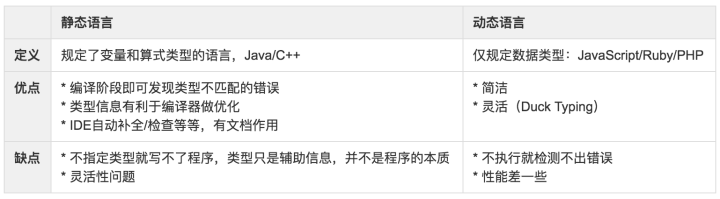
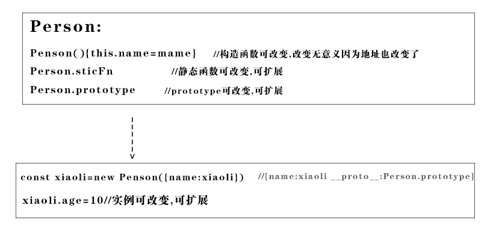

# 标识符命名

### 命名表达语义

变量名是最好的的注释

```js
   methods:{ 
       _autoPlay() {//自动播放
          this.mark++;
          if (this.mark === this.images.length) {
          this.mark = 0;
           return }
                   },
        play() {this.time = setInterval(this._autoPlay, 3000);} //设置每个3s自动播放
   }
```

##### 数据类String Object

###### 名词

goods

###### 名词+名词

```
goodsColor
```

ui名词+名词

```
tableData
tableTitle
formValue
```

###### 形容词+名词

```
info：information 信息
imp: important重要的
init： initialization初始化、最初的
con：content内容 

```

##### Array 

###### 名词+s

```
goodss
```

##### Number类

###### 名词

`total`

###### 形容词+名词

`minNum, maxNum  aveCount`

##### Boolen判断类

###### 一切词性都有

```
done 在事情完成之前把done设为false,完成之后设为true 
error 在错误发生之前把error设为false,在已经发生时设为true 
found 在没有找到的时候把found设为false,一旦找到就设为true（在一个数组中查找某个值，在文件中搜寻某员工的ID等） 
success或者ok 操作失败为false，操作成功时为true  
disabled
clearable
```

##### Funcion类

###### 动词

常用动词

```
get 获取/set 设置,
add 增加/remove 删除
create 创建/destory 移除
start 启动/stop 停止
open 打开/close 关闭,
read 读取/write 写入
load 载入/save 保存,
create 创建/destroy 销毁
begin 开始/end 结束,
backup 备份/restore 恢复
import 导入/export 导出,
split 分割/merge 合并
inject 注入/extract 提取,
attach 附着/detach 脱离
bind 绑定/separate 分离,
view 查看/browse 浏览
edit 编辑/modify 修改,
select 选取/mark 标记
copy 复制/paste 粘贴,
undo 撤销/redo 重做
insert 插入/delete 移除,
add 加入/append 添加
clean 清理/clear 清除,
index 索引/sort 排序
find 查找/search 搜索,
increase 增加/decrease 减少
play 播放/pause 暂停,
launch 启动/run 运行
compile 编译/execute 执行,
debug 调试/trace 跟踪
observe 观察/listen 监听,
build 构建/publish 发布
input 输入/output 输出,
encode 编码/decode 解码
encrypt 加密/decrypt 解密,
compress 压缩/decompress 解压缩
pack 打包/unpack 解包,
parse 解析/emit 生成
connect 连接/disconnect 断开,
send 发送/receive 接收
download 下载/upload 上传,
refresh 刷新/synchronize 同步
update 更新/revert 复原,
lock 锁定/unlock 解锁
check out 签出/check in 签入,
submit 提交/commit 交付
push 推/pull 拉,
expand 展开/collapse 折叠
begin 起始/end 结束,
start 开始/finish 完成
enter 进入/exit 退出,
abort 放弃/quit 离开
obsolete 废弃/depreciate 废旧,
collect 收集/aggregate 聚集
```

常用表单方法

```
reset 
submit
clear
validation
```

对象方法可以一个动词对象本身就是描述性名词

```
Dog.update(conditions, update, callback)
```

###### 动词+名词

| 动词 | 含义                         | 返回值                                                |
| ---- | ---------------------------- | ----------------------------------------------------- |
| can  | 判断是否可执行某个动作(权限) | 函数返回一个布尔值。true：可执行；false：不可执行     |
| has  | 判断是否含有某个值           | 函数返回一个布尔值。true：含有此值；false：不含有此值 |
| is   | 判断是否为某个值             | 函数返回一个布尔值。true：为某个值；false：不为某个值 |
| get  | 获取某个值                   | 函数返回一个非布尔值                                  |
| set  | 设置某个值                   | 无返回值、返回是否设置成功或者返回链式对象            |
| load | 加载某些数据                 | 无返回值或者返回是否加载完成的结果                    |

```
getGoods
setTable
```

vue模块网络请求函数的动词和后端的名词一致

```
getGoods() getGoodss(/)
postGoods() 
delGoods() 
patchGoods()   //更新某些字段
putGoods()    //更新所有字段
```

注:后端路由

```
router
  .get('/goods/:_id', goods.get)
  .get('/goodss', goods.gets)
  .post('/goods',  goods.post)
  .del('/goods',  goods.del)
  .del('/Goodss',  goods.dels)
  .patch('/goods',  goods.patch)

```


### 命名表达"作用" 

##### 类

首字母大写

##### 全局 

```javascript
globalNumber
g_Number
```

##### 常量  (全部大写)

```
const MAX_COUNT = 10;
const URL = 'http://www.foreverz.com';
```

##### 类的私有变量

```
_name
```


### 命名表达"变量类型"


变量命名类型	| 变量命名前缀
---|---
array 数组	| a
boolean 布尔值 |	b
function 函数	|fn
int 整型 |	i
float 浮点数	| l
object 对象|	o
regular 正则	 |r
string 字符串	 |s

# js命名规范

### 1. 目的

提高代码可预测性和可维护性的方法是使用命名约定，这就意味着采用一致的方法来对变量和函数进行命名。

### 2. 变量名

变量名包括全局变量，局部变量，类变量，函数参数

### 3. 构造函数（类）命名

首字母大写，驼峰式命名。

JS中没有类，但是可以用new调用构造函数：var man = new Person();

### 4. 普通变量命名

首字母小写，驼峰式命名，匈牙利命名

如：nCheckCount 表示整形的数值

### 5. 匈牙利命名法

匈牙利命名法语法：变量名＝类型＋对象描述

- 类型指变量的类型
- 对象描述指对象名字全称或名字的一部分，要求有明确含义，命名要容易记忆容易理解。

提示: 虽然JavaScript变量表面上没有类型，但是JavaScript内部还是会为变量赋予相应的类型

| JavaScript变量起名类型  | 变量命名前缀 | 举例                |
| ----------------------- | ------------ | ------------------- |
| Array 数组              | a            | aList，aGroup       |
| Boolean 逻辑            | b            | bChecked，bHasLogin |
| Function 函数           | f            | fGetHtml，fInit     |
| Integer 数字            | n            | nPage，nTotal       |
| Object 对象             | o            | oButton，oDate      |
| Regular Expression 正则 | r            | rDomain，rEmail     |
| String 字符             | s            | sName，sHtml        |

### 6. 其他前缀规范

可根据团队及项目需要增加

- $：表示Jquery对象例如：$Content，$Module，一种比较广泛的Jquery对象变量命名规范。
- fn：表示函数例如：fnGetName，fnSetAge；和上面函数的前缀略有不同，改用fn来代替，个人认为fn能够更好的区分普通变量和函数变量。

### 7. 例外情况

以根据项目及团队需要，设计出针对项目需要的前缀规范，从而达到团队开发协作便利的目的。

- 作用域不大临时变量可以简写，比如：str，num，bol，obj，fun，arr。
- 循环变量可以简写，比如：i，j，k等。
- 某些作为不允许修改值的变量认为是常量，全部字母都大写。例如：COPYRIGHT，PI。常量可以存在于函数中，也可以存在于全局。必须采用全大写的命名，且单词以_分割，常量通常用于ajax请求url，和一些不会改变的数据。

### 8. 函数命名

普通函数：首字母小写，驼峰式命名，统一使用动词或者动词+名词形式

例如：fnGetVersion()，fnSubmitForm()，fnInit()；涉及返回逻辑值的函数可以使用is，has，contains等表示逻辑的词语代替动词，例如：fnIsObject()，fnHasClass()，fnContainsElment()。

内部函数：使用_fn+动词+名词形式，内部函数必需在函数最后定义。

例如：

```
function fnGetNumber(nTotal) {
    if (nTotal < 100) {
        nTotal = 100;
    }
    return _fnAdd(nTotal);

    function _fnAdd(nNumber) {
        nNumber++;
        return nNumber;
    }
}
alert(fGetNumber(10)); //alert 101
```

对象方法与事件响应函数：对象方法命名使用fn+对象类名+动词+名词形式；

例如： fnAddressGetEmail()，

事件响应函数：fn+触发事件对象名+事件名或者模块名

例如：fnDivClick()，fnAddressSubmitButtonClick()

函数方法常用的动词：


### 9. 变量命名例子

- 为什么需要这样强制定义变量前缀？正式因为javascript是弱语言造成的。在定义大量变量的时候，我们需要很明确的知道当前变量是什么属性，如果只通过普通单词，是很难区分的。普通代码var checked = false; var check = function() { return true; } /** some code **/ if(check) {//已经无法很确切知道这里是要用checked还是check()从而导致逻辑错误 //do some thing } 规范后代码var bChecked = false; var fnCheck = function() { return true; } /** some code **/ if(bChecked) { // do some thing } if(fnCheck()) { // do other thing }
- 如何标明私有方法或私有属性？var person = { getName: function () { return this._getFirst() + ' ' + this._getLast(); }, _getFirst: function () { //... }, _getLast: function (){ //... } }; 在这个例子中，getName()以为这这是API的一个公开的方法，而_getFirst()和_getLast()意味着这是一个私有函数。尽管他们都是普通的公开方法，但是使用下划线前缀的表示方法可以提醒使用person对象的用户，告诉他们这些方法在其他地方不能确保一定能够正常工作，不能直接调用。
- 总结：下面是一些使用下划线约定的变量使用下划线结尾来表明是私有变量，例如name_和getElements_()。使用一个下划线前缀来表示受保护属性，使用两个下划线前缀来表示私有属性。

# 表达式的语义化

```javascript
//定义变量===定义名词---------------------------------------------------
const callback = require('../callback')
const Dog = require('../../model/Dog')
const conditions = {name: '小黑'}; //也不能指定id创建
const update = {$set: {age: 100}};

//定义方法===定义动词-----------------------------------------------

Dog.update(){
    ......
}


//定义表达式:------------------------------------------------------

//狗.更新(当名字叫小黑时)
Dog.update(conditions, update, callback)


// 小黑保存
xiaohei.save(callback)
//小黑的年纪
xiaohei.age

```

# 语句语义化

### 定义变量

描述一个名词

```
//变量声明===描述名词
const conditions = {name: '小黑'}; //也不能指定id创建
const update = {$set: {age: 100}};
```

### 条件语句

表示选择

```
if()elseif()
```


# 函数封装


###  相同的部分封装成函数语句,不同的部分成为参数
```javascript

const Koa = require('koa')
const app = new Koa()
app.use((ctx, next) => { //1,2 不同的地方 ,其他相同的地方
    ctx.body = '1',
        next()
    ctx.body += 2
})
app.use((ctx, next) => {
    ctx.body += '3',
        next()
    ctx.body += 4
})
app.use((ctx, next) => {
    ctx.body += '5',
        next()
    ctx.body += 6
})
app.listen(3000)
console.log(":3000")

```
函数封装

```javascript
const Koa = require('koa')
const app = new Koa()

function callback(m, n) { //m,n 不用的地方

    return (ctx, next) => { //函数体相同的地方
        if (!ctx.body) {
            ctx.body = m
        }else {
            ctx.body += m
        }


        next()
        ctx.body += n
    }

}

app.use(callback('1', '2'))
app.use(callback('3', '4'))
app.use(callback('5', '6'))
app.listen(3000)


```
进一步封装

```javascript
const Koa = require('koa')
const app = new Koa()

function fn(m, n) { //m,n 不用的地方

    app.use((ctx, next) => { //函数体相同的地方
        if (!ctx.body) {
            ctx.body = m
        } else {
            ctx.body += m
        }
        next()
        ctx.body += n
    })

}

fn('1', '2')
fn('3', '4')
fn('5', '6')
app.listen(3000)


```
### 语义分离

无语义代码

```javascript
   function f() {
        let i = 0
        i++
        i *= 50
        console.log(i)
    }

    f()
```
语义分离了 但是未解耦
```
  function add() {
        let i = 0
        i++
        return i
    }

    function chengfa() {
    //这里耦合了
        let i = add()
        i *= 50
        console.log(i)
    }

    chengfa()
```
### 功能分离

```javascript

    //负责相加
    function add(a, b) {
        return a + b
    }

    //负责打印
    function print(data) {
        console.log(data)
    }

    const data = add(1, 2)
    print(data)

```

### 把条件分支语句提炼成函数

```javascript
var getPrice = function( price ){
 var date = new Date();
 if ( date.getMonth() >= 6 && date.getMonth() <= 9 ){ // 夏天
 return price * 0.8;
 }
 return price;
}; 

```
分离
```javascript

var isSummer = function(){
 var date = new Date();
 return date.getMonth() >= 6 && date.getMonth() <= 9;
};
var getPrice = function( price ){
 if ( isSummer() ){ // 夏天
 return price * 0.8;
 }
 return price;
}; 
```

### 合并条件语句里的重复语句

```javascript

    function PrintPage(currPage) {
        if (currPage <= 0) {
            currPage = 1
            console.log(currPage)
        } else if (currPage > 10) {
            currPage = 10
            console.log(currPage)
        } else {
            console.log(currPage)
        }

    }

    function PrintPage_(currPage) {
        if (currPage <= 0) {
            currPage = 1

        } else if (currPage > 10) {
            currPage = 10
        }
        console.log(currPage)
    }

    PrintPage_(11)
```

### 解耦(通过函数封装实现)

##### 对上边代码进一步加工做到了解耦
```javascript
    function add() {
        let i = 0
        i++
        return i
    }

    function chengfa(i) {

        i *= 50
        console.log(i)
    }
let i= add()
    chengfa(i)
```

##### component解耦

耦合代码

```html
<script src="https://cdn.bootcss.com/vue/2.5.17-beta.0/vue.js"></script>
<div id="app">
    <!--点击改变value的值,value改变dom自动更新-->
    <ul>
        <li v-for="item in 4" @click="value=item" :class="value===item?'active':''">
           <button>{{item}}</button>
        </li>
    </ul>
    <br>
    {{value}}
</div>

<script>
    const vm = new Vue({
        el: '#app',
        data() {
            return {
                value: 1
            }
        }
    })

</script>

<style>
    .active {
        color: red;
    }

</style>
```
组件解耦(本质是函数封装)

```html
<script src="https://cdn.bootcss.com/vue/2.5.17-beta.0/vue.js"></script>
<div id="app">
    <!--点击改变value的值,value改变dom自动更新-->
    <cl v-model="value"></cl>
    <br>
    {{value}}
</div>

<script>
    const cl = {
        template: ` <ul>
                        <li v-for="item in 4"
                         @click="$emit('input',item)"
                         :class="item===value?'active':''">
                           <button> {{item}}</button>
                        </li>
                       </ul>`,
        props: ['value']
    }
    const vm = new Vue({
        el: '#app',
        data() {
            return {
                value: 1
            }
        },
        components: {cl}
    })

</script>

<style>
    .active {
        color: red;
    }

</style>
```
<slot/>组件 (本质也是函数)

```html
<script src="https://cdn.bootcss.com/vue/2.5.17-beta.0/vue.js"></script>
<div id="app">
    <!--value是变量媒介,v-model参数-->
    <cl v-model="value">

        <template scope="{item}">
            <button>
                {{item}}
            </button>
        </template>
    </cl>
    {{value}}
</div>

<script>
    const cl = {
        template: ` <ul>
                        <li v-for="item in 4"
                         @click="$emit('input',item)"
                         :class="item===value?'active':''"
                       >
                     <!--    // item是变量媒介 scope是参数-->
                       <slot :item="item">


                      </slot>

                        </li>
                       </ul>`,
        props: ['value']
    }
    const vm = new Vue({
        el: '#app',
        data() {
            return {
                value: 1
            }
        },
        components: {cl}
    })

</script>

<style>
    .active {
        color: red;
    }

</style>

```

##### filter 本质也是函数封装

```html
<script src="https://cdn.bootcss.com/vue/2.5.17-beta.0/vue.js"></script>
<div id="app">
  <!--value是变量媒介,v-model参数-->
  <cl v-model="value" :data="10">

    <template scope="{item}">
      <button>
        {{item|mark(2)}}
      </button>
    </template>
  </cl>
  {{value}}
</div>

<script>
  const cl = {
    template: ` <ul>
                        <li v-for="item in data"
                         @click="$emit('input',item)"
                         :class="item===value?'active':''"
                       >
                     <!--    // item是变量媒介 scope是参数-->
                       <slot :item="item">


                      </slot>

                        </li>
                       </ul>`,
    props: ['value', 'data']
  }
  const vm = new Vue({
    el: '#app',
    data() {
      return {
        value: 1
      }
    },
    components: {cl},
    filters: {
      mark(value, n) {
        return `-${value}-`
      }
    }
  })

</script>

<style>
  .active {
    color: red;
  }

</style>

```

##### v-direct本质也是函数封装

```html
<body>
<meta charset="UTF-8">
<script src="https://cdn.bootcss.com/vue/2.5.17-beta.0/vue.js"></script>
<link href="https://cdn.bootcss.com/animate.css/3.7.0/animate.css" rel="stylesheet">
<div id="app">
    <input v-focus type="text">

</div>


</body>
<script>
    Vue.directive('focus', {
        // 当被绑定的元素插入到 DOM 中时……
        inserted: function (el) {
            // 聚焦元素
            el.focus()
        }
    })
    var vm = new Vue({
        el: "#app",
        data: {msg: 1},
    });


</script>


```

##### < route-view />和组件之间解耦

```html
<script src="https://cdn.bootcss.com/vue/2.5.17-beta.0/vue.js"></script>
<script src="https://cdn.bootcss.com/vue-router/3.0.1/vue-router.min.js"></script>
<div id="app">

    <ul>
        <li v-for="item in 4">
            <!--传数据给$router-->
            <router-link :to="{path:`/${item}`}">

                {{item}}
            </router-link>

        </li>
    </ul>
    <!--读取组件信息-->
    <router-view></router-view>
</div>

<script>
    const mycomponent = {
        template: `<div>{{id}}</div>`,
        props: ['id']
    }
    const router = new VueRouter({
        linkActiveClass: 'active',
        routes: [

            {
                path: '/:id',
                name: 'id',
                // 路由解耦，parame作为组件mycomponent的属性值
                props: true,
                component:mycomponent
            }]
    })
    const vm = new Vue({
        el: '#app',
        router,
        data() {
            return {
                value: 1
            }
        }
    })

</script>

<style>
    .active {
        color: red;
    }

</style>
```
### 内聚

内聚性的实现：把经常一起变化的部分（联动）放在一起；


# 强类型和弱类型

| 强类型                                                       | 弱类型                                   |
| ------------------------------------------------------------ | ---------------------------------------- |
| 强类型指的是每个变量和对象都必须具有声明类型，在编译时类型不能更改； | 编译时才确定类型                         |
| 强类型语言的函数运行时会检查参数类型,把做什么和谁去做分开    | 弱类型在编译的时候才会确定类型确定谁去做 |
| 安全，效率高                                                 | 不安全                                   |



```javascript
   var dog = 1 //数字类

    class Dog { //dog类
        constructor(age, color) {
            this.age = age
            this.color = color
        }

        cry() {
            console.log('汪汪汪')
        }

    }

    dog = new Dog(12, 'red') //变量类型可变

    console.log(dog)

    function cry(dog) { //函数参数也不用检查类型
        dog.cry()
    }

    cry(dog)
    
```

# 动态语言和静态语言

静态类型语言在编译时便已确定变量的类型，而动态类型语言的变量类型要到程序运行的时
候，待变量被赋予某个值之后，才会具有某种类型。

# 面向对象的思想

### 面向对象的编程

1. 维护简单
面向对象程序设计的一个特征就是模块化。实体可以被表示为类以及同一名字空间中具有相同功能的类，可以在名字空间中添加一个类而不影响该名字空间的其他成员。这种特征为程序的维护提供了便捷性。

2. 可扩充性
如果有一个具有某一种功能的类，就可以扩充这个类，创建一个具有扩充功能的类。

3. 代码重用
功能是被封装在类中的，类是作为一个独立实体而存在的，因此可以很简单的提供类库，使代码得以重复使用。


### 类是概念

##### 类:class一类事物,比如

-  数字类 ,->123
-   字符串类,->'ab'
-   对象类->数组类->[1,2,3]
-    动物类 ->狗类->小黄

##### 定义类:

```
function Dog(){

....

}
```

##### 类的实例化

###### 返回一类事物的一个实例

```javascript
const xiaoli=new Dog()
//  像某个型号汽车建设蓝图,生产这个型号的汽车蓝图
  const car1=new SangtanaCar001()
```

###### 实例属于什么类型: 

xiaoli是狗类型的

### 类的三要素

#####  1. 封装

将类的相同属性封装成独立的类

属性的的值===构造函数的参数值

##### 2. 继承

本质修改代码,js弱类型的可以随意更改类

对原始的蓝图进行修改,产生新型号汽车的蓝图,用于生成新的汽车

```javascript
class StangtanaCar1000{
//一些代码
}

class StangtanaCar2000 extends StangtanaCar1000{
   //另外一些代码
    
}
```

##### 3. 多态


一个函数适用于不同对象，返回不同的值

 **本质:**一种解耦机制,强类型语言函数检查参数,把做什么(函数体)和谁去做(强类型语言的函数需要检测参数类型)解耦:


### 静态函数和实例的函数

静态函数适合所有实例用的工具函数
```javascript
Dog.Create({id:1})
Dog.find({id:1})
Dog.remove({id:2})
dog.update({id:3})
```
实例方法适合个例用的方法

```javascript

const dog=new Dog({id:5})

// 实例方法适合个例用的方法

instance.showInfo

```


# js原生面向对象

### 封装

```javascript
(function(){
//私有变量和私有函数
var privateVariable = 10;
function privateFunction(){
return false;
}
//构造函数
MyObject = function(){
};
//公有/特权方法
MyObject.prototype.publicMethod = function(){
privateVariable++;
return privateFunction();
};
})();
```

```javascript
   (function () {
        var name = "";
        Person = function (value) {
            name = value;
        };
        Person.prototype.getName = function () {
            return name;
        };
        Person.prototype.setName = function (value) {
            name = value;
        };
    })();
    var person1 = new Person("Nicholas");
    alert(person1.getName()); //"Nicholas"
    person1.setName("Greg");
    alert(person1.getName()); //"Greg"
    var person2 = new Person("Michael");
    alert(person1.getName()); //"Michael"
    alert(person2.getName()); //"Michael"
```


### 继承


##### 创建实例

###### 构造函数和Object的关系

- Function的实例属于Object类型

```javascript
funcion fn(a,b){

return a+b
}

fn.a=1
fn.b=2

```

```javascript
const fn=new Function('a', 'b', 'return a + b');

```

```javascript
fn instaceof Objcet===true
```


- Function实例, 生成指定格式的Object类型实例

```javascript 1.8
    //模拟new new都做了什么
    var obj = new Object();
    obj.__proto__ = Person.prototype;
    var res = Person.call(obj, 'xiaohong', 12)// 改变obj的值

    if (typeof res === Object) {//判断function的返回值 若返回值为对象 person就为这个返回值了 构造函数废了
        person = res
    }
    else { //如果返回值为undefine或者基础变量 构造函数成功
        person = obj

    }


```

###### new Fn()生成实例

构造函数控制创造对象,成为特定的"类型"结构

```javascript
    //模拟new new都做了什么
    var obj = new Object();
    obj.__proto__ = Person.prototype;
    var res = Person.call(obj, 'xiaohong', 12)// 改变obj的值

    if (typeof res === Object) {//判断function的返回值 若返回值为对象 person就为这个返回值了 构造函数废了
        person = res
    }
    else { //如果返回值为undefine或者基础变量 构造函数成功
        person = obj

    }


```

```javascript

//2.构造函数版生成对象实例,构造函数参控制"类型"-----------------------

function Fn(a,b) {
  //格式固定内容不固定部分
  this.a=a;
  this.b=b
}
Fn.prototype={c:3} //固定部分

obj=new Fn()
```

```javascript
    function Fn(name, age) {
        this.name = name;
        Object.defineProperty(this, 'age', {
            configurable: false,//不可删除
            enumerable: false,//不可枚举
            writable: true,//可读性
            value: age//value,可写
        })
    }

    const i = new Fn('小女', 21)
    console.log(Object.keys(i))
```

###### 构造函数作为普通函数使用

```javascript
 /*此处为实例化对象封装了若干属性和函数*/
    function Person(name, age) {
        this.name = name
        this.age = age
        this.sayName = function () {
            console.log('我的名字叫:' + this.name);
        }


    }


    // 更改构造函数: 更改构造函数一定放到最前面,因为改变了变量Person内存地址

    Person = function (name, age) {
        this.name = name + 1111
        this.age = age + 100
        this.sayName = function () {
            console.log('我的名字叫:' + this.name + 1111);
        }

        return 10
    }


    //为封装一些原型方法
    Person.prototype = {
        //protype.sayName被构造里的sayName覆盖
        sayName() {
            console.log('my name:' + this.name);
            console.log('protype.sayName(){}的this', this)
        },
        addage() {
            this.age++ //通过this改变age

        },
        returnMoutAge() {
            return this.age - 1
        }

    }


    /*扩展静态函数和静态变量*/
    Person.nameUpperCase = function (i) {
        console.log(i.toUpperCase())
    }
    Person.title = '静态函数类'


    //扩展原型方法
    Person.prototype.$store = {
        name: 2,
        setName(name) {
            console.log(this)
            this.name = name
        }
    }


    //new 创立新实例 构造函数运行在这个对象上 Person.call(obj, 'xiaohong', 12)
    xiaoli = new Person('xiaoli', 11, "设计师")
    xiaoli.sayName()
    xiaoli.addage()
    xiaoli.$store.setName('小莉')
    console.log(xiaoli)


    //不改变实例xiaoli的属性 函数有返回值,类似arr的迭代函数
    const i = xiaoli.returnMoutAge()
    console.log(i)


    //运行静态函数
    Person.nameUpperCase('abc')


    //当普通函数使用 ,添加变量到了window-------------------------------------------------
   const m= Person('xiaowang', 12)
    console.log(m,name, age)


    //模拟new new都做了什么------------------------------------------------------------

    //因为这部所以对象的都是构造函数建立出来的
    var obj = new Object();
    obj.__proto__ = Person.prototype;


    // 改变obj的值
    var res = Person.call(obj, 'xiaohong', 12)


    /*  判断Person的返回值 若返回值为对象 person=构造函数的返回值,
       变成了类似另外一种函数了
       function f() {
           return {a,b}
       }
       */
    if (typeof res === Object) {
        person = res
    }
    //如果返回值为undefine或者基础变量 person=被构造函数改变的对象obj
    else {
        person = obj

    }
    console.log(person)
```

 构造函数未传参的参数和普通函数一样默认undefine

```
vue对象的默认属性的值undefined构造函数调用new button(),实参传值给形参未赋值的形参为undefine
```

###### prototype

```javascript
const arr=[10,2,3]
arr.sort((a,b)=>a-b)//arr调用sort,this===arr; 回调参数做参数
Array.prototype.sort.call(arr,(a,b)=>a-b)//call(arr ),this===arr;回调参数做参数
```

###### js弱类型 构造函数的键值对也一切可变




###### js弱类型生成的实例化对象还可以扩展

```js
  const arr = [12, 3]
  arr.a = 10
  console.log({arr})// [12, 3, a: 10]

  
  const reg = /\w/
  reg.a = 10
  /*
    a: 10
    dotAll: (...)
    flags: (...)
    global: (...)
    ignoreCase: (...)
    lastIndex: 0
    multiline: (...)
    source: (...)
    sticky: (...)
    unicode: (...)
    */
  console.log({reg})

```

##### 原型继承

```js
function SuperType(){
this.property = true;
}
SuperType.prototype.getSuperValue = function(){
return this.property;
};
function SubType(){
this.subproperty = false;
}
//继承了SuperType
SubType.prototype = new SuperType();
//使用字面量添加新方法，会导致上一行代码无效
SubType.prototype = {
getSubValue : function (){
return this.subproperty;
},
someOtherMethod : function (){
return false;
}
};
```

以上代码展示了刚刚把SuperType 的实例赋值给原型，紧接着又将原型替换成一个对象字面量而
导致的问题。由于现在的原型包含的是一个Object 的实例，而非SuperType 的实例，因此我们设想
中的原型链已经被切断——SubType 和SuperType 之间已经没有关系了。

###### **原型链的问题**

原型链虽然很强大，可以用它来实现继承，但它也存在一些问题。其中，最主要的问题来自包含引
用类型值的原型。想必大家还记得，我们前面介绍过包含引用类型值的原型属性会被所有实例共享；而
这也正是为什么要在构造函数中，而不是在原型对象中定义属性的原因。在通过原型来实现继承时，原
型实际上会变成另一个类型的实例。于是，原先的实例属性也就顺理成章地变成了现在的原型属性了。
下列代码可以用来说明这个问题。

```js
function SuperType(){
this.colors = ["red", "blue", "green"];
}
function SubType(){
}
//继承了SuperType
SubType.prototype = new SuperType();
var instance1 = new SubType();
instance1.colors.push("black");
alert(instance1.colors); //"red,blue,green,black"
var instance2 = new SubType();
alert(instance2.colors); //"red,blue,green,black"
```

##### 借用构造函数继承

在解决原型中包含引用类型值所带来问题的过程中，开发人员开始使用一种叫做借用构造函数
（constructor stealing）的技术（有时候也叫做伪造对象或经典继承）。这种技术的基本思想相当简单，即
在子类型构造函数的内部调用超类型构造函数。别忘了，函数只不过是在特定环境中执行代码的对象，
因此通过使用apply()和call()方法也可以在（将来）新创建的对象上执行构造函数，如下所示：

```js
function SuperType(){
this.colors = ["red", "blue", "green"];
}
function SubType(){
//继承了SuperType
SuperType.call(this);
}
var instance1 = new SubType();
instance1.colors.push("black");
alert(instance1.colors); //"red,blue,green,black"
var instance2 = new SubType();
alert(instance2.colors); //"red,blue,green"
```

代码中加粗的那一行代码“借调”了超类型的构造函数。通过使用call()方法（或apply()方法
也可以），我们实际上是在（未来将要）新创建的SubType 实例的环境下调用了SuperType 构造函数。
这样一来，就会在新SubType 对象上执行SuperType()函数中定义的所有对象初始化代码。结果，
SubType 的每个实例就都会具有自己的colors 属性的副本了。
###### 1.传递参数

相对于原型链而言，借用构造函数有一个很大的优势，即可以在子类型构造函数中向超类型构造函
数传递参数。看下面这个例子。

  ```js
  function SuperType(name){
  this.name = name;
  }
  function SubType(){
  //继承了SuperType，同时还传递了参数
  SuperType.call(this, "Nicholas");
  //实例属性
  this.age = 29;
  }
  var instance = new SubType();
  alert(instance.name); //"Nicholas";
  alert(instance.age); //29
  ```

###### 2. 借用构造函数的问题

如果仅仅是借用构造函数，那么也将无法避免构造函数模式存在的问题——方法都在构造函数中定
义，因此函数复用就无从谈起了。而且，在超类型的原型中定义的方法，对子类型而言也是不可见的，结
果所有类型都只能使用构造函数模式。考虑到这些问题，借用构造函数的技术也是很少单独使用的。

##### 组合模式

```javascript
  function SuperType(name){
    this.name = name;
    this.colors = ["red", "blue", "green"];
  }
  SuperType.prototype.sayName = function(){
    console.log(this.name);
  };
  function SubType(name, age){
//继承属性
    SuperType.call(this, name);
    this.age = age;
  }
  //继承方法
  SubType.prototype = new SuperType();
  SubType.prototype.constructor = SubType;
  SubType.prototype.sayAge = function(){
    console.log(this.age);
  };
  var instance1 = new SubType("Nicholas", 29);
  console.log(instance1)
  instance1.colors.push("black");
  console.log(instance1.colors); //"red,blue,green,black"
  instance1.sayName(); //"Nicholas";
  instance1.sayAge(); //29
  var instance2 = new SubType("Greg", 27);
  console.log(instance2)
  console.log(instance2.colors); //"red,blue,green"
  instance2.sayName(); //"Greg";
  instance2.sayAge(); //27
```

##### 原型继承式

```javascript

  function object(o){
    function F(){}
    F.prototype = o;
    return new F();
  }
  var person = {
    name: "Nicholas",
    friends: ["Shelby", "Court", "Van"]
  };


  var anotherPerson = object(person);
  anotherPerson.name = "Greg";
  anotherPerson.friends.push("Rob");
  console.log(anotherPerson.friends) //["Shelby", "Court", "Van",'rob']

  var yetAnotherPerson = object(person);
  yetAnotherPerson.name = "Linda";
  yetAnotherPerson.friends.push("Barbie");
  console.log(yetAnotherPerson.friends); //"Shelby,Court,Van,Rob,Barbie"
```
```js
  var person = {
    name: "Nicholas",
    friends: ["Shelby", "Court", "Van"]
  };
  var anotherPerson = Object.create(person);
  anotherPerson.name = "Greg";
  anotherPerson.friends.push("Rob");
  var yetAnotherPerson = Object.create(person);
  yetAnotherPerson.name = "Linda";
  yetAnotherPerson.friends.push("Barbie");
  alert(person.friends); //"Shelby,Court,Van,Rob,Barbie"
```

##### 寄生继承

```javascript
    function object(o) {
        function F(){}
        F.prototype = o;
        return new F();
    }

    function createAnother(original) {
        // 通过调用函数创建一个新对象
        var clone = object(original);
        // 以某种方式来增强这个对象
        clone.sayHi = function() {
            alert("hi");
        }

        return clone;
    }

    var person = {
        name: "Bert",
        friends: ["Shelby", "Court", "Van"]
    };

    var anotherPerson = createAnother(person);
    console.log(anotherPerson)
    anotherPerson.sayHi(); // Hi

```

##### 寄生式组合继承

开发人员普遍认为寄生组合式继承是引用类型最理想的继承范式

```js
function SuperType(name){
this.name = name;
this.colors = ["red", "blue", "green"];
}
SuperType.prototype.sayName = function(){
alert(this.name);
};

function SubType(name, age){
SuperType.call(this, name); //第二次调用SuperType()
this.age = age;
}
SubType.prototype = new SuperType(); //第一次调用SuperType()
SubType.prototype.constructor = SubType;
SubType.prototype.sayAge = function(){
alert(this.age);
};


const i = new SubType('xiaoli', 20)
console.log(i)

```

改良版 调用一次SuperType

```js

 function object(o) {
    //F是一个类似SuperType的函数,去掉了this构造语句,只保留原型
    function F() {
    }
    F.prototype = o;
     
    return new F();//返回实例化对象{__proto__=superType.protype}
  }


  function SuperType(name) {
    this.name = name;
    this.colors = ["red", "blue", "green"];
  }

  SuperType.prototype.sayName = function () {
    alert(this.name);
  };

  function SubType(name, age) {
    SuperType.call(this, name);
    this.age = age;
  }

  function inheritPrototype(subType, superType) {
//不是所有浏览器都支持__proto__,不能直接设置subtype.__proto--=Supertype.protype,所以使用object()
    var prototype = object(superType.prototype); //设置原型为{__proto__=superType.protype}
    prototype.constructor = subType;// 补充原型{__proto__=superType.protype,constructor:SuperType}
    subType.prototype = prototype; 
  }

  inheritPrototype(SubType, SuperType);

  
  //再补充原型{__proto__=superType.protype,constructor:SuperType,sayAge(){}}
  SubType.prototype.sayAge = function () {
    alert(this.age);
  };
  const i = new SubType('xiaoli', 20)
  console.log(i)
```


使用Object.create

寄生组合式继承，是集寄生式继承和组合继承的有点与一身，主要是通过借用构造函数来继承属性，通过原型链的混成形式来继承方法。

　　先看一个例子：

```js
  function SuperType(name) {
    this.name = name;
    this.colors = ["red", "blue", "yellow"];
  }

  SuperType.prototype.sayName = function () {
    console.log(this.name);
  };

  function SubType(name,age) {
      //构造函数寄生继承
    SuperType.call(this, name);
    this.age = age;
  }

  function inheritPrototype(SuperType, SubType) {
      //原型继承
    var prototype = Object.create(SuperType.prototype);
      //protype和constructor设置
    prototype.constructor = SubType;
    SubType.prototype = prototype;
  }

  inheritPrototype(SuperType, SubType);
  var s1 = new SubType("xiaoming",12);
  console.log(s1)
  s1.sayName()
```

　　这个代码中有一个Object.create(supertype)函数，这个函数是ECMAScript 6为了规范原型式继承而提出的一个方法，与下面这个方法是等价的：

```js
function object(o){
    function f(){}
    f.prototype = o;
    return new f();
}
```

　　这个方法做了什么工作呢？如下图所示：


　　object(o)方法的工作就是：

- 创建一个构造函数f
- 使该构造函数的prototype指针指向参数
- 创建f对象的一个实例，幷返回

　　在该函数调用完以后，f的构造函数便会销毁，所以整个函数的工作就是让一个对象的__proto__指针指向参数。

　　继续回到寄生组合式继承，第二行代码:

```js
var prototype = Object.create(SuperType.prototype);
```

　　使得新创建的prototype对象的__proto__指针指向SuperType的原型对象。再看第三四行：

```js
prototype.constructor = SubType;
SubType.prototype = prototype;
```

　　将这个prototype对象的construstor指针指向SubType的构造函数，幷将SubType的构造函数的prototype指针指向这个prototype对象，所以inheritPrototype的工作就是使SubType继承于SuperType(也就是SubType的原型对象的__proto__指针指向SuperType的原型对象)，如下图所示。　　

**

##### class继承

class的本质是创造一类的若干对象的构造函数,类是构造函数的语法糖

```javascript
 Class={
    staticFn:()=>{...}
    protorype:{
               instaceFn(){}
               }


   }

Class.staticFn:()

Class.protorype.instaceFn()
```

```javascript
 class Point {
        static staticFn() {
            console.log('staticFn')
        }

        constructor(x, y) {
            this.x = x;
            this.y = y;
        }

        get value() {
            console.log('Getting the current value!');
            return this.x;
        }

        toString() {
            return '(' + this.x + ', ' + this.y + ')';
        }
    }

    const point = new Point(1, 2)

    console.log(point)

    class Point_extend extends Point {


        cs() {
            console.log('cs')
        }
    }

    //类能继承静态函数
    Point_extend.staticFn()

    const point_extend = new Point_extend(10, 20)

    console.log(point_extend)

```

###### 　模拟vue构造函数

```javascript
//store实例化
    const store = {
        counter: 0,
        add(n) {
            this.counter += n
        }
    }


    //组件构造器产生组件Person的工厂函数
    class Person {
        constructor({beforeCreate, created, store, data, methods, computed, watch, callbackProp, props, $father}) {
            beforeCreate()
            for (let item in data) {
                this[item] = data[item]

            }
            if (props) {
                for (let item of props) {
                    this[item] = $father[item]

                }
            }
            for (let item in methods) {

                this[item] = methods[item]
            }

            //计算属性和watch
            for (let item in {...computed, ...watch}) {
                Object.defineProperty(this, `${item}`, {
                    get: computed.com,
                    set: function () {
                        console.log('触发watch')
                    }
                })
            }

            this.$store = store

            created()
        }
    }

    //实例化组件,切换路由操作,出发这个构造函数运行-------------------------------------
    const father = new Person({
        data: {
            name: 'father',
            age: 18,
            hometownProp: 'china',
            callbackProp: function (n) {
                console.log(this.age = n)
            },
        },

        store,
        beforeCreate() {
            console.log('beforeCreateg钩子:对象将要建立')
        },
        created() {
            console.log('created钩子:对象建立了')
        },


    })


    const child = new Person({
        data: {
            name: '小黑',
            age: 2
        },
        computed: {
            com: function () {
                return this.name + this.age
            },

        },
        props: ['hometownProp', 'callbackProp']
        ,
        methods: {
            $emit(n) {
                this.callbackProp.call(this.$father, n)
            }
        },

        beforeCreate() {
            console.log('对象将要建立')
        },
        created() {
            console.log('对象建立了')
        },
        store,
        $father: father


    })

    //标签嵌套
    father.$children = child
    child.$father = father


    //onlick等事件回调才运行--------------------------------------------------------------
    child.$emit(10)
    child.$father.sex = '男'


    //onclick等事件驱动提交store负荷
    father.$store.add(10)

    console.log(father)
    console.log(child)

    document.getElementById('#app').innerHTML = child.com


```

模拟vue构造实现$father

```javascript
    var test=new function (){

        var self=this
        this.Name="test"
        this.subTest=new function(parent=self){
            this.Name="test1"
            this.parent=this
            this.PName=function(){return parent.Name}
        }
        this.subTest.parent=this
    }
    console.log(test)

    alert(test.subTest.PName())
```


### 多态


##### 模仿强类型语言 通过超类实现多态覆盖


```javascript


    class Person {
        constructor(name) {
            this.name = name
        }

        saySomething() {

        }
    }

    class Man extends Person {
        constructor(name) {
            super(name)
        }

        saySomething() {
            console.log('I am Man')
        }
    }

    class Woman extends Person {
        constructor(name) {
            super(name)
        }

        saySomething() {
            console.log('I am Woman')
        }
    }

    let man = new Man('a')
    let woman = new Woman('b')


    function saySex(pepole) { //ts这里会检查参数类型,指定谁去做
        if(pepole instanceof Person) //js模仿类型检测
        pepole.saySomething()
    }

    saySex(man)
    saySex(woman)

    //好处是不用重写saySex, 继承Person的其他子类容易扩展

    class Yao extends Person {
        constructor(name) {
            super(name)
        }

        saySomething() {
            console.log('I am yao')
        }
    }

    let yao=new Yao('yao')
    saySex(yao) //好处saySex不用重写

```

##### 鸭子模型

鸭子类型（duck typing）如果它走起路来像鸭子，叫起来也是鸭子，那么它就是鸭子。
只关注对象的行为，不关注对象本身面向接口编型 ，而不是面向实现编程，是设计模式中最重要的思想。代码演示：

```js
                var duck = {
                     duckSinging:function(){
                             console.log('呱呱呱');
                     }
                }
                alert('duck');

                var chicken = {
                     duckSinging:function(){
                             console.log('呱呱呱');
                     }
                }
                alert('chicken');

                var chior = [];

                var joinChior = function(animal){
                     if (animal && typeof animal.duckSinging === 'function') { //typeof就是判断参数是什么类型的实例                
                             chior.push(animal);
                             console.log('恭喜你加入合唱团');
                             console.log('当前已募集'+chior.length+'只鸭子');
                     }
                }
                joinChior(duck);
                joinChior(duck);
                joinChior(chicken);
```

##### 弱类型语言实现多态

语义分离
```javascript
//这个并非多态,只是函数语义分离
    var googleMap = {
        show: function () {
            console.log('开始渲染谷歌地图');
        }
    };
    var renderMap = function () {
        googleMap.show();
    };
    renderMap(); // 输出：开始渲染谷歌地图
```

 多态:一个函数用于不同的对象

```javascript
var googleMap = {
    show: function(){
        console.log( '开始渲染谷歌地图' );
    }
};
var baiduMap = {
    show: function(){
        console.log( '开始渲染百度地图' );
    }
};
var renderMap = function( type ){
    //像什么就让它去做
    if ( type === 'google' ){
        googleMap.show();
    }else if ( type === 'baidu' ){
        baiduMap.show();
    }
};
renderMap( 'google' ); 
renderMap( 'baidu' ); 

```
可扩展多态:js不用建立父类和超类就可以构造对象

```javascript
    var googleMap = {
        show: function(){
            console.log( '开始渲染谷歌地图' );
        }
    };
    var baiduMap = {
        show: function(){
            console.log( '开始渲染百度地图' );
        }
    };
    var renderMap = function( map ){ //ts会对map进行判断,省去条件语句,把做什么(本函数)和谁去做(参数类型)分类,从而出去if判断
       if(map.show instanceof Function){//js模仿类型检测
           map.show()
       }

    };
    renderMap( 'google' );
    renderMap( 'baidu' );

    //添加新类和实例化对象
    var gaode = {
        show: function(){
            console.log( '开始渲染高德地图' );
        }
    };

    //好处是不用重写reader
    renderMap( 'gaode' );
```

##### 多态实现实例


```javascript


function Food(name){ 
    this.name=name; 
} 
//鱼类 
function Fish(name){ 
    this.food=Food; 
    this.food(name); 
} 
//骨头 
function Bone(name){ 
    this.food=Food; 
    this.food(name); 
} 
//---------------------------------------------------
//动物类 
function Animal(name){ 
    this.name=name; 
} 
//猫猫 
function Cat(name){ 
    this.animal=Animal; 
    this.animal(name); 
} 
//狗狗 
function Dog(name){ 
    this.animal=Animal; 
    this.animal(name); 
} 

var cat=new Cat("猫"); 
var fish=new Fish("鱼"); 

var dog=new Dog("狗"); 
var bone=new Bone("骨头"); 

//-----------------------------------------------------------------
// Master类 
function Master(name){ 
    this.nam=name; 
   
} 

Master.prototype.feed=function (animal,food){ //ts会对amimal和food检查,做什么(本函数)和谁去做(参数类型)分开
     if(animal instaceof Animal && food instance Food){// js模仿类型检测
    window.alert("给"+animal.name+" 喂"+ food.name); 
    }
} 
//创建一个主人 
var master=new Master("zs"); 
master.feed(dog,bone); 
master.feed(cat,fish);

// ------------------后期扩展----------------------------------------

//猴子 
function Monkey(name){ 
    this.animal=Animal; 
    this.animal(name); 
} 

// 桃子
function Peach(name){ 
    this.food=Food; 
    this.food(name); 
} 


var monkey=new Monkey("猴"); 
var peach=new Peach("桃"); 

 // 这样做的优点在于扩展Monkey,Peach时, Master和父类 Animal Food不需要改变

master.feed(monkey,peach);


```

# typescript-class 


### 接口

接口继承接口

### 泛型

接口包含操作但不包含属性，且它没有对外界可见的关联。
typescript-class

# 设计模式


