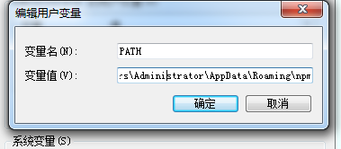

# npm是什么?

npm是基于node的一个打包器插件,

通过npm上传代码到npm仓库 

通过npm i 下载安装线上npm仓库的代码到本地


# 安装npm


### 查看版本

    npm -v

### 升级npm

    npm install npm@latest -g


### 配置npm在os的path



# 创建新项目

```
npm init -y

yarn init -y
```

项目下创建了package.json

# 模块管理

## 安装模块

```
npm i
yarn install
```

## 向项目安装新模块

### 安装cli到全局文件夹

 原理npm install xxx-cli -g 安裝xxx-cli到npm和yarn的目录下，这些目录已经设置了os环境变量Path,所以可以在全局直接使用命令

```
npm install webpack -g 
yarn global add webpack 
```

### 安装cli到项目文件夹并保存模块名到 webpack.json->dependencies{ },打包时间使用

```
npm i nuxt -S //安装并保存到webpack.json生产环境配置
yarn add nuxt 
```

### 安装cli到项目文件夹

安装记录保存到webpack.json的dev{ },打包时间忽略

```js
npm i nuxt -D //安装并保存到webpack.json开发环境配置
yarn add webpack -D
```

### 安装对象模块在项目文件夹

引入module对象,并保存模块名到 webpack.json->dependencies{ },打包时间使用


```
import koa from 'koa'
```
npm会读取"./node_modules/koa/package.json"文件

```
{
  "name": "koa",
  "version": "2.8.1",
  "description": "Koa web app framework",
  "main": "lib/application.js", //真正的koa对象文件
  "scripts": {
    "test": "egg-bin test test",
    "test-cov": "egg-bin cov test",
    "lint": "eslint benchmarks lib test",
    "bench": "make -C benchmarks",
    "authors": "git log --format='%aN <%aE>' | sort -u > AUTHORS"
  },
  }
```

### 安装指定版本

```js
yarn add package-name@1.2.3 //会从 registry 里安装这个包的指定版本。
yarn add package-name@~ 1.2.3 //~ 会匹配最近的小版本依赖包，比如~1.2.3会匹配所有1.2.x版本，但是不包括1.3.0
yarn add package-name@^1.2.3  //  ^ 会匹配最新的大版本依赖包，比如^1.2.3会匹配所有1.x.x的包，包括1.3.0，但是不包括2.0.0
yarn add package-name@*1.2.3  // * 这意味着安装最新版本的依赖包
yarn add package-name@tag     //会安装某个 “tag” 标识的版本比如 beta、next 或者 latest(默认)

```
## 删除模块

```
yarn remove webpack 
npm uninstall webpack -S 
```

## 更新模块版本
```
npm update
yarn upgrade
```

## 自己动手新建cli模块

运行原理: 间接运行了node test.js

### 建立自定义全局cli模块

1. npm init创建项目和package.json

2. 修改package.json文件,设置命令名字

```json
{
  "name": "test",
   "bin": {
    "test": "bin/test.js"
  }
}

```
3. 建立/bin/test.js

```js
#!/usr/bin/env node   //表示依靠node解析本文件

console.log("hello world");
```

4. npm link 命令link到C:\Users\Administrator\AppData\Roaming\npm\, 本质mklink

```
$ npm link
//输出为
// C:\Users\Administrator\AppData\Roaming\npm\test - C:\Users\Administrator\AppData\Roaming\npm\node_modules\test\bin\hello.js
//C:\Users\Administrator\AppData\Roaming\npm\node_modules\test - E:\github-code\test
```

​        手动复制文件夹过去也可以

5. 运行模块

1. 第一种方式命令行  test

2.  第二种局部文件夹 npm run start

   ```json
   //package.json
   {
     "name": "code",
     "version": "1.0.0",
     "description": "",
     "main": "index.js",
     "scripts": {
       "dev": "nuxt",
       }
   }
   ```

   

## 全局运行dos cli程序

### 全局安装过的cli模块,任意目录命令行可以运行安装path下的cli**命令**

`C:\Users\Administrator\AppData\Roaming\Microsoft\Windows\Start Menu\node_modules`已经加入到了OS的环境变量path

```
 npm -v
 
 npm run xxx
  
 node 1.js
 
 webpack  
 
 nodemon xxx
```

### 项目目录命令行运行npm run xxx 

##### 运行组合的cli的原理

package.json设置dev命令

```json
//package.json
{
  "name": "code",
  "version": "1.0.0",
  "description": "",
  "main": "index.js",
  "scripts": {
    "dev": "webpack --mode development&set host="xxx"&nuxt",
    }
}
```

`npm run dev` 时, 

会搜索os全局path下有没有安装webpack set "nuxt" 等程序

匹配到webpack set,没有匹配到nuxt 

去寻找当前目录的`./node_modules/.bin/nuxt.cmd` 执行

*nuxt.cmd的代码如下*:(npm install自动生成的)

```cmd
@IF EXIST "%~dp0\node.exe" (
  "%~dp0\node.exe"  "%~dp0\..\@nuxt\cli\bin\nuxt-cli.js" %*
) ELSE (
  @SETLOCAL
  @SET PATHEXT=%PATHEXT:;.JS;=;%
  node  "%~dp0\..\@nuxt\cli\bin\nuxt-cli.js" %*
)
```

​                    %~dp0\..\@nuxt\cli\bin\nuxt-cli.js文件内容如下:

```js
//表示靠node运行下边的代码
#!/usr/bin/env node

require('../dist/cli.js').run()
  .catch((error) => {
    require('consola').fatal(error)
    require('exit')(2)
  })
```

