# ESLint的用途

- 1.审查代码是否符合编码规范和统一的代码风格；
- 2.审查代码是否存在语法错误；
  **中文网地址 http://eslint.cn/**

# 使用VSCode编译器在Vue项目中的使用

- 在初始化项目时选择是否使用ESLint管理代码(选择Y则默认开启)
  Use ESLint to lint your code? (Y/n)

  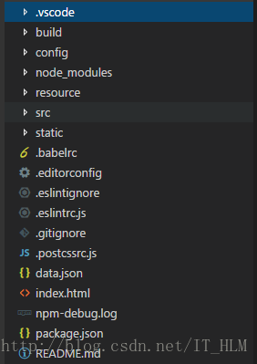

- 默认使用的是此标准https://github.com/standard/standard/blob/master/docs/RULES-zhcn.md

- 以下是对.editorconfig、.eslintignore、.eslintrc.js 文件进行详细解释

### .editorconfig文件（主要用于配置IDE）

规范缩进风格，缩进大小，tab长度以及字符集等,解决不同IDE的编码范设置。**EditorConfig 插件**会去查找当前编辑文件的所在文件夹或其上级文件夹中是否有 .editorconfig 文件。如果有，则编辑器的行为会与 .editorconfig 文件中定义的一致，并且其优先级高于编辑器自身的设置。

```
root = true
# 对所有文件有效  //[*js]只对js文件有效
[*]
#设置编码格式
charset = utf-8
#缩进类型  可选space和tab
indent_style = space
#缩进数量可选整数值2 or 4,或者tab
indent_size = 2
#换行符的格式
end_of_line = lf
# 是否在文件的最后插入一个空行  可选true和false
insert_final_newline = true
# 是否删除行尾的空格  可选择true和false
trim_trailing_whitespace = true
```

### .eslintignore文件（放置需要ESLint忽略的文件，只对.js文件有效）

```
/build/
/config/
/dist/
/src/utils/
/src/router/*.js

```

### .eslintrc.js 文件(用来配置ESLint的检查规则)

```
module.exports = {
    //此项是用来告诉eslint找当前配置文件不能往父级查找
    root: true, 
    //此项是用来指定eslint解析器的，解析器必须符合规则，babel-eslint解析器是对babel解析器的包装使其与ESLint解析
    parser: 'babel-eslint',
    //此项是用来指定javaScript语言类型和风格，sourceType用来指定js导入的方式，默认是script，此处设置为module，指某块导入方式
    parserOptions: {
        sourceType: 'module'
    },
    //此项指定环境的全局变量，下面的配置指定为浏览器环境
    env: {
        browser: true,
    },
    // https://github.com/feross/standard/blob/master/RULES.md#javascript-standard-style
    // 此项是用来配置标准的js风格，就是说写代码的时候要规范的写，如果你使用vs-code我觉得应该可以避免出错
    extends: 'standard',
    // required to lint *.vue files
    // 此项是用来提供插件的，插件名称省略了eslint-plugin-，下面这个配置是用来规范html的
    plugins: [
        'html'
    ],
    // add your custom rules here
    // 下面这些rules是用来设置从插件来的规范代码的规则，使用必须去掉前缀eslint-plugin-
    // 主要有如下的设置规则，可以设置字符串也可以设置数字，两者效果一致
    // "off" -> 0 关闭规则
    // "warn" -> 1 开启警告规则
    //"error" -> 2 开启错误规则
    // 了解了上面这些，下面这些代码相信也看的明白了
  rules: {
    // allow async-await
    'generator-star-spacing': 'off',
    // allow debugger during development
    'no-debugger': process.env.NODE_ENV === 'production' ? 'error' : 'off',
    // js语句结尾必须使用分号
    'semi': ['off', 'always'],
    // 三等号
    'eqeqeq': 0,
    // 强制在注释中 // 或 /* 使用一致的空格
    'spaced-comment': 0,
    // 关键字后面使用一致的空格
    'keyword-spacing': 0,
    // 强制在 function的左括号之前使用一致的空格
    'space-before-function-paren': 0,
    // 引号类型
    "quotes": [0, "single"],
    // 禁止出现未使用过的变量
    // 'no-unused-vars': 0,
    // 要求或禁止末尾逗号
    'comma-dangle': 0
  }
}
```

- **“off” 或 0 - 关闭规则**
- **“warn” 或 1 - 开启规则**
- **“error” 或 2 - 开启规则**

# 如何在老项目中加入ESlint

#### 1. 在目录中添加.editorconfig、.eslintrc.js、.eslintignore这三个文件

#### 2. 在package.json的”devDependencies”中加入ESlint所需要的包

```
    "babel-eslint": "^7.1.1",
    "eslint": "^3.19.0",
    "eslint-config-standard": "^10.2.1",
    "eslint-friendly-formatter": "^3.0.0",
    "eslint-loader": "^1.7.1",
    "eslint-plugin-html": "^3.0.0",
    "eslint-plugin-import": "^2.7.0",
    "eslint-plugin-node": "^5.2.0",
    "eslint-plugin-promise": "^3.4.0",
    "eslint-plugin-standard": "^3.0.1",
```

#### 3. 在bulid/webpack.base.conf.js文件中加入ESlint规则并生效

```
//  在module的rules中加入
  module: {
    rules: [
      {
        test: /\.(js|vue)$/,
        loader: 'eslint-loader',
        enforce: 'pre',
        include: [resolve('src'), resolve('test')],
        options: {
          formatter: require('eslint-friendly-formatter'),
          // 不符合Eslint规则时只警告(默认运行出错)
          // emitWarning: !config.dev.showEslintErrorsInOverlay
        }
      },
    ]
  }
```

#### 4. 重新bulid代码运行,完美生效!!!!!!

------

## 推荐三个VSCode插件

- ESLint (只支持高亮显示js文件)
- EditorConfig
- Typings(代码错误提示)

## 常见的报错

- 文件末尾存在空行(eol-last)
  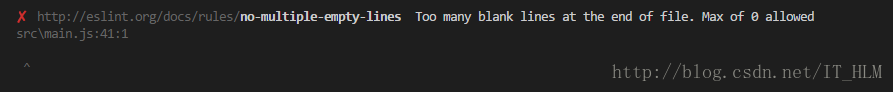
- 缺少分号(‘semi’: [‘error’,’always’])
  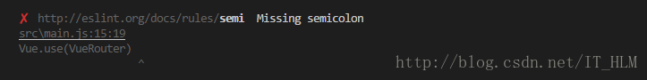
- 关键字后面缺少空格
  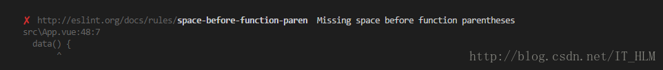
- 字符串没有使用单引号(’quotes’: [1, ’single’])
  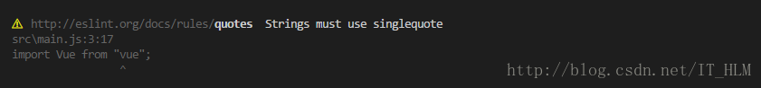
- 缩进错误
  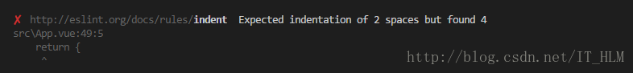
- 没有使用全等(eqeqeq)
  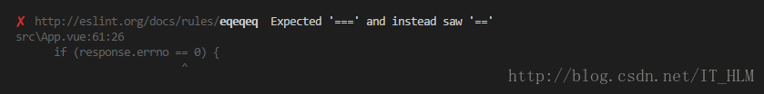
- 导入组件却没有使用
  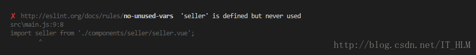
- new了一个对象却没有赋值给某个常量(可以在该实例前添加此代码/*eslint-disable no-new*/忽略ESLint的检查)
  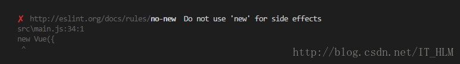
- 超过一行空白行(no-multiple-empty-lines)
  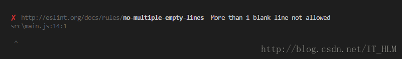
- 注释符 // 后面缩进错误(lines-around-comment)
  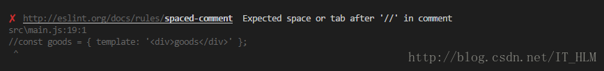

## VScode用户配置

```
{
    "workbench.startupEditor": "newUntitledFile",
    // 以下是按照ESLint格式化代码
    "vetur.format.defaultFormatter.js": "vscode-typescript",
    "javascript.format.insertSpaceBeforeFunctionParenthesis": true,
    "editor.quickSuggestions": {
      "strings": true
    },
    "editor.tabSize": 2,
    "eslint.validate": [
      "javascript",
      "javascriptreact",
      "html",
      "vue",
      {
        "language": "html",
        "autoFix": true
      }
    ],
    // "files.autoSave": "onFocusChange",
    // "vetur.validation.template": false,
    // // 防止格式化代码后单引号变双引号
    // "prettier.singleQuote": true,
    "files.autoSave": "afterDelay",
    "files.autoSaveDelay": 1500,
    // "git.confirmSync": false
    // 配置是否从更新通道接收自动更新。更改后需要重启。
    "update.channel": "none"
}
```


 


# 常见错误

### webstorm提示TypeError: this.cliEngine is not a constructor

 修改这个文件/Applications/WebStorm.app/Contents/plugins/JavaScriptLanguage/languageService/eslint/bin/eslint-plugin.js 

```js

// this.cliEngine = require(packagePath + "lib/cli-engine");
this.cliEngine = require(packagePath + "lib/cli-engine").CLIEngine;
```

