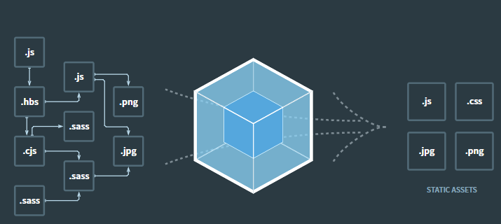
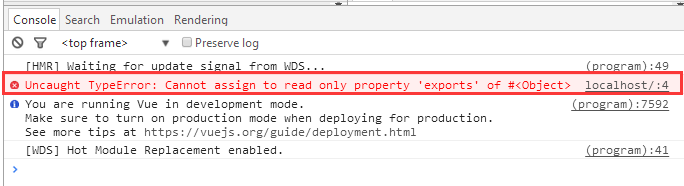
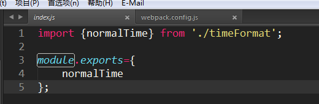
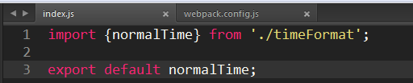
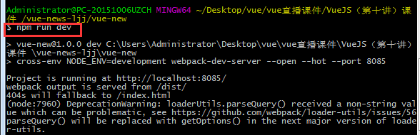

# webpack是什么

### 本质

首先是npm项目的一个模块

### 作用





#  全局安装 webpack, webpack-cli模块

    npm install webpack webpack-cli webpack-dev-server -g

### 版本

     webpack -v


### webpack命令

webpack开发环境打包

```
webpack --mode=development
```

webpack生产环境打包

```
webpack --mode=production
```

# webpack模块配置

见code

# 项目配置 npm-package.json 

### npm run xxx 运行webpack脚本

 ```
  "scripts": {
    "test": "echo \"Error: no test specified\" && exit 1",
    "build": "webpack --mode development",
    "dev": "webpack-dev-server --inline --mode development"
  }
 ```

### 目标浏览器配置表

通过浏览器过滤的思路实现,默认是兼容所有最新版本

```javascript
{// package.json
  "browserslist": [ // 注意：是一个数组对象
    "> 1%",
    "last 2 versions"
  ] }
```

| 例子                         | 说明                                                         |
| :--------------------------- | :----------------------------------------------------------- |
| `> 1%`                       | 全球超过1%人使用的浏览器                                     |
| `> 5% in US`                 | 指定国家使用率覆盖                                           |
| `last 2 versions`            | 所有浏览器兼容到最后两个版本根据[CanIUse.com](https://www.jianshu.com/p/CanIUse.com)追踪的版本<br />例如:追踪的IE最新版本为11,向后兼容两个版本即为10、11 |
| `Firefox ESR`                | 火狐最新版本                                                 |
| `Firefox > 20`               | 指定浏览器的版本范围                                         |
| `not ie <=8`                 | 方向排除部分版本                                             |
| `Firefox 12.1`               | 指定浏览器的兼容到指定版本                                   |
| `unreleased versions`        | 所有浏览器的beta测试版本                                     |
| `unreleased Chrome versions` | 指定浏览器的测试版本                                         |
| `since 2013`                 | 2013年之后发布的所有版本                                     |

**筛选后查询,验证：**

`npx browserslist` 打印出所有浏览器版本支出情况，

**为什么需要browserslist：**
根据提供的目标浏览器的环境来，智能添加css前缀，js的polyfill垫片,来兼容旧版本浏览器，而不是一股脑的添加。避免不必要的兼容代码，以提高代码的编译质量。

**共享使用browserslist的组件：**

| 组件名                                    | 功能                                  |
| :---------------------------------------- | :------------------------------------ |
| Autoprefixer                              | postcss添加css前缀组件                |
| bable-preset-env                          | 编译预设环境 智能添加polyfill垫片代码 |
| eslint-plugin-compat                      |                                       |
| stylelint-no-unsupported-browser-features |                                       |
| postcss-normalize                         |                                       |
| 等等...                                   |                                       |

# 错误

### Vue的报错：Uncaught TypeError: Cannot assign to read only property 'exports' of object '#<Object>'

 

1.运行一下以前的一个Vue+webpack的 vue仿新闻网站  小项目，报错

由于自己vue学习不深入，老是这个报错，找了好久（确切的说是整整一下午^...^）才找到原因 -v-

Uncaught TypeError: Cannot assign to read only property 'exports' of object '#<Object>'

 

 

2.点开错误的文件，标注错误的地方是这样的一段代码：




就是module.exports;

3.同过谷歌查找，和论坛各种搜索:

原因如下：The code above is ok. You can mix `require` and `export`. You can‘t mix `import` and `module.exports`.

翻译过来就是说，代码没毛病，在webpack打包的时候，可以在js文件中混用require和export。但是不能混用import 以及module.exports。

因为webpack 2中不允许混用import和module.exports,

解决办法就是统一改成ES6的方式编写即可.



 

```
import {normalTime} from './timeFormat';

export default normalTime;
```

 

4.再次运行：



### webpack报错：Module parse failed: Unexpected character '�' (1:0)

图片未添加url-loader

```js
module: {
        rules: [

            {
                test: /\.(png|jpg|gif|jpeg)/,
                use: [

                    {
                        //url-loader会将引入的图片编码，生成dataURl
                        //url-loader在node_moudles中使用file-loader
                        loader: "url-loader",
                        options: {
                            name: '[name].[ext]',
                            limit: 10 * 1000,
                            outputPath: './img',
                            //可选项加前缀
                           // publicPath: 'http://cdn.baidu.com',
                        }, //默认单位为b,


                    },


                ]
            }
        ]
    },
```

