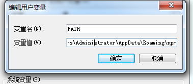

# npm是什么?

>npm是node自带的一个打包器插件,

>通过npm上传代码到npm仓库 

>通过npm下载安装线上npm仓库的代码到本地


# 安装npm


##### 版本

    npm -v

##### 升级

    npm install npm@latest -g


##### 配置npm的path



# 创建模块和package.json

    npm init
    npm init -y 默认


# 通过npm安装模块和运行模块

###  全局安装和运行cli模块
> 原理npm install xxx-cli -g 安裝xxx-cli到npm和yarn的目录下，这些目录已经设置了环境变量Path

全局安装cli模块,

```
yarn global add webpack 
npm install webpack -g 
```
全局运行的dos命令

```
 webpack  nodemon xxx
```


### 局部安装和运行cli模块


局部安装cli模块
```
npm i nuxt

yarn add webpack 

npm i nuxt -S //安装并保存到webpack.json生产环境配置


npm i xxx@latest  //安装最后一个版本

```
局部安裝到開發模式

```

npm i nuxt -D //安装并保存到webpack.json开发环境配置

yarn add webpack -D
```

局部运行cli模块
```
 npm run xxx  运行局部安装的cli模块
 "dev": "cross-env NUXT_HOST=0.0.0.0 NUXT_PORT=3333 nuxt",
"dev2": "nuxt"
 npm run dev

```

 
```
    "dev2": "set NODE_ENV=production node 1.js"  
     npm run dev
```


### 二次安装写好的webpack.json
```
npm i
```


# 局部安装和引入对象模块(只能局部)
```
import axios from 'axios'//npm会自动搜索

```


# 删除模块

```
 yarn remove webpack # yarn
npm uninstall webpack --save # npm 可以指定 --save | --save-dev
```

# 更新模块
```
 npm update

yarn upgrade
```


# npm link 自定义全局命令 

我们可以新建一个项目目录叫做test，然后进入该目录下npm init一路执行回车，最后在项目目录下新建一个bin文件夹，创建一个hello.js文件，然后写上：
```
#!/usr/bin/env node   //寻找node解释器

console.log("hello world");
```

修改package.json文件：

设计全局命令

```json
{
  "name": "test",
   "bin": {
    "test": "bin/hello.js"
  }
}

```
然后执行 npm link 命令：

```
$ npm link

// C:\Users\Administrator\AppData\Roaming\npm\test -> C:\Users\Administrator\AppData\Roaming\npm\node_modules\test\bin\hello.js
//C:\Users\Administrator\AppData\Roaming\npm\node_modules\test -> E:\github-code\test
```

