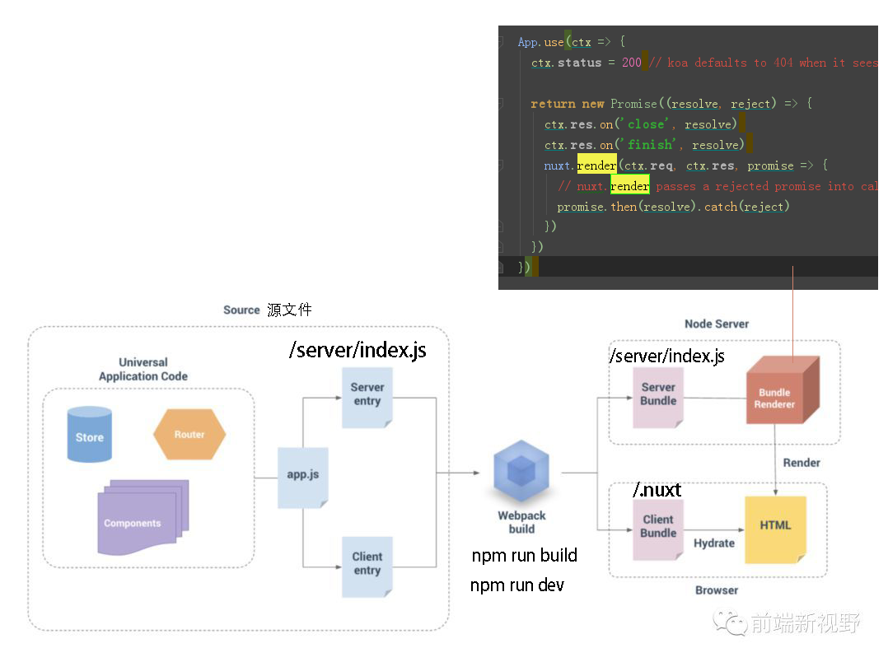
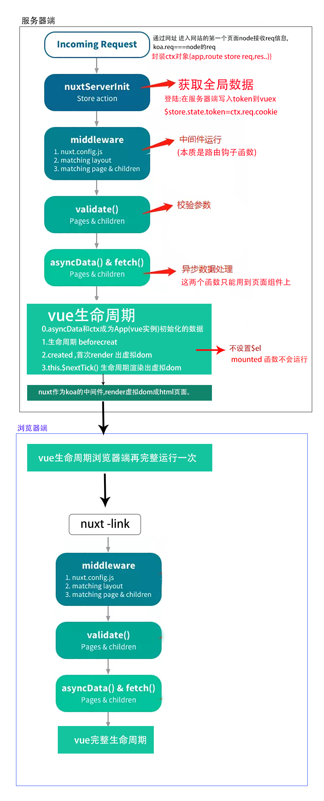
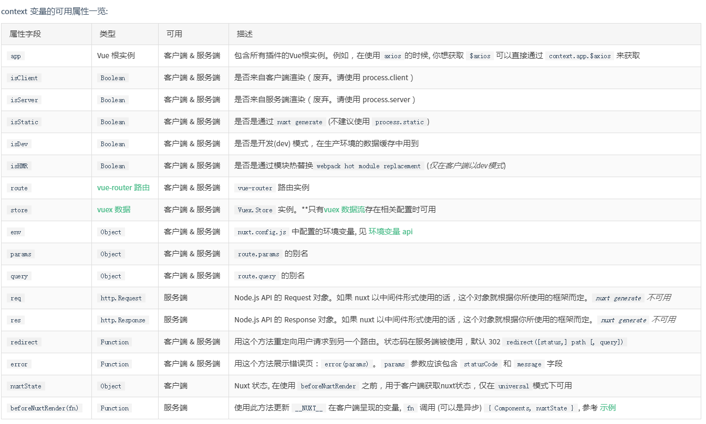
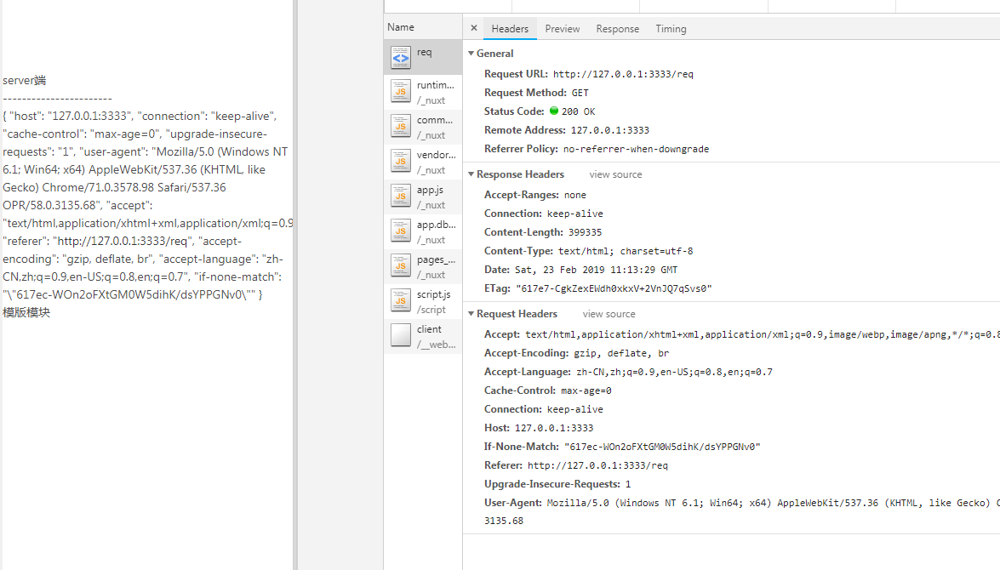
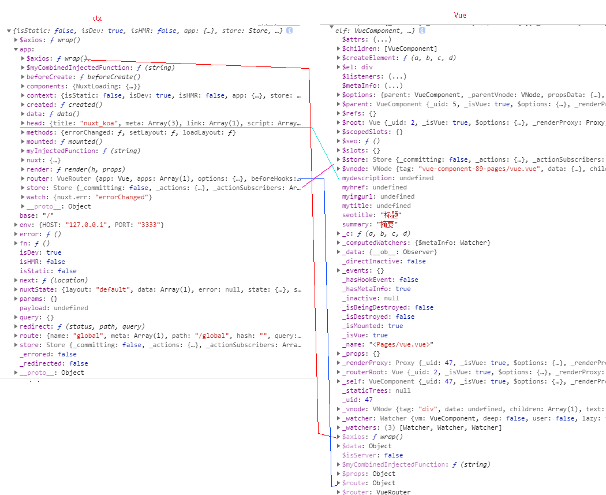
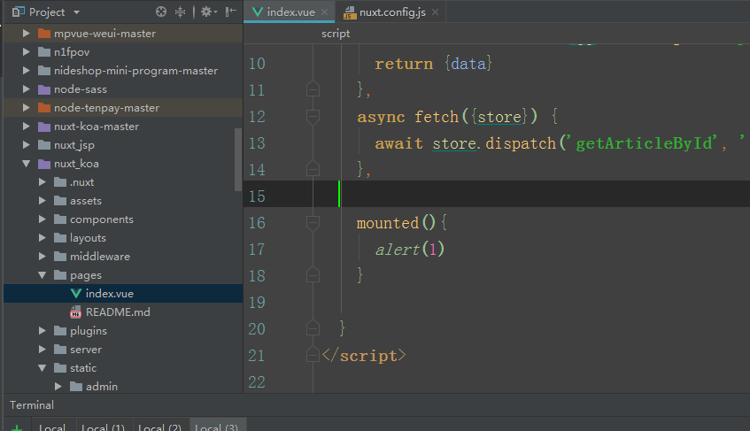
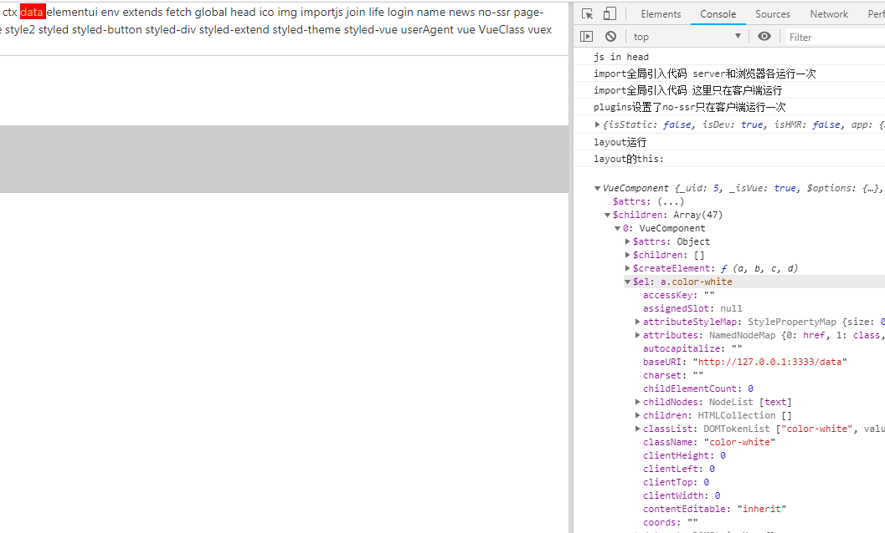
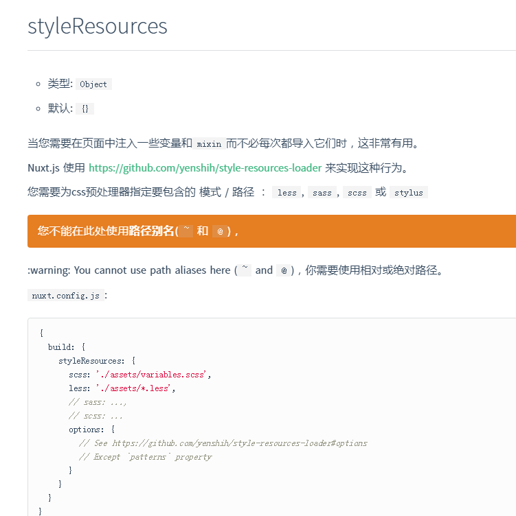

[[_toc_]]
# 安装
<!--
koa版

    vue init nuxt/koa nuxt
普通版

    vue init nuxt-community/starter-template <project-name>
-->


```
$ npx create-nuxt-app <项目名>

```


# nuxt流程




# 生命周期




# 详解流程


### 上下文对象(函数回调的参数)

有些键值在客户端存在有些在服务端存在



##### ctx.req.headers




### 把自定义数据注入到上下文对象
##### ctx.xxx注入

```

export default(ctx)=> {
//新建函数挂载在app上 app.fn
//   console.log(ctx)

  ctx.userAgent = process.server
    ? ctx.req.headers["user-agent"] //当是服务器进程时:从客户端的请求链接总获得userAgent
    : navigator.userAgent;            //当是浏览器端时:从浏览器对象中获得浏览器uA


```


##### nuxt.config.js 注入到ctx.env(只能注入变量)

```

  env: {
    HOST: process.env.HOST ,
    PORT: 3333,

```
#####  inject联合注入到實例

```
export default ({ app }, inject) => {
  inject('myCombinedInjectedFunction', (string) => console.log('app联合注入', string))
  //注入到了 app  vm vm.store
}
```
### vuex nuxtServerInit 方法


在服务器端运行vuex,因为在服务器端,所以浏览器缓存中获得token , 改用从req中获得数据

```
actions: {
  nuxtServerInit ({ commit,dispatch }, { req }) {
    if (req.session.user) {
   //如果已登陆过可以通过req拿到request的文件头,文件头里有session信息以及token
      commit('user', req.session.user)
    }
  }
}
```


nuxtServerInit 方法接收的上下文对象和 fetch 的一样，但不包括 context.redirect() 和 context.error()。
### 中间件路由钩子

##### 不同位置的中间件执行顺序

1.nuxt.config.js  //进入每个路由前使用的代码


```

module.exports = {
  mode: 'universal',
  router: {
    //当前流和上级栏目
    linkActiveClass: 'active',
    //进入每个路由前使用中间件
    middleware: 'route'
  },

```

2.匹配布局
```` 
export default {
  middleware: 'auth',
````
3.匹配页面 进入页面前使用的代码

```` 
export default {
  middleware: 'auth',
````

/middleware/auth.js

````

export default function ({ store, error, redirect, req }) {
  if (!store.state.token) {
    redirect('/login')
  }
}

````

### 路由参数校验 

Nuxt.js 可以让你在动态路由组件中定义参数校验方法。

举个例子： pages/users/_id.vue

```
export default {
  validate ({ params }) {
    // 必须是number类型
    return /^\d+$/.test(params.id)
  }
}
```
如果校验方法返回的值不为 true或Promise中resolve 解析为false或抛出Error ， Nuxt.js 将自动加载显示 404 错误页面或 500 错误页面。

想了解关于路由参数校验的信息，请参考 页面校验API。
### 读取page目录下的vue文件

##### page-> fetch()只能填充vuex

如果页面组件设置了 fetch 方法，它会在组件每次加载前被调用__（在服务端或切换至目标路由之前）__。

    fetch({ store, params }){}


##### page-> asyncData()可以填充vuex和data 

在服务器端调用asyncData时，您可以访问用户请求的req和res对象。


```
export default {
  async asyncData ({ req, res }) {
    // 请检查您是否在服务器端
    // 使用 req 和 res
    if (process.server) {
     return { host: req.headers.host }
    }

    return {}
  }
}


```


```
   async asyncData({store}) {

  await store.dispatch('getBanners', '')

    }
```

### header设置

##### nuxt.config.js公共header,本质估计是mixin

```
  head: {
    title: pkg.name,
    meta: [
      {charset: 'utf-8'},
      {name: 'viewport', content: 'width=device-width, initial-scale=1'},
      {hid: 'description', name: 'description', content: pkg.description}
    ],
    link: [
      {rel: 'icon', type: 'image/x-icon', href: '/favicon.ico'}
    ],
    script: [
      {src: '/script/script.js'}]

  }

```

##### 页面page.vue和head

```

< template>
  <h1>{{ title }}</h1>
< /template>

< script>
export default {
  data () {
    return {
      title: 'Hello World!'
    }
  },
  head () {
    return {
      title: this.title,
      meta: [
        { hid: 'description', name: 'description', content: 'My custom description' }
      ]
    }
  }
}
< /script>


```


### ctx数据作为vue实例app的初始化数据




### app(服务器上的vue根实例)的生命周期:

```

  beforeCreated
  created钩子
  首次render,$nexttick(),
  不运行组件内的mounted等其他钩子函数

```

### nuxt作为koa的中间件,render虚拟dom成html页面。

```
nuxt.render()
```

###  代码下载到浏览器重新开始走一遍vue的生命周期


##### mouted()后可以用windows方法




### 点击nuxt-link 进入其他页面

点击链接的页面都是在客户端运行此时跟普通的spa没什么区别了vue使用的是对象,全局变量注入vue对象的键值,使用this调用

```
export default {
  watchQuery: ['page']
}
````
### 浏览器端-路由钩子检验

validate()

### asyncData函数的异步请求


### 浏览器端Vue生命周期

__asyncData请求完成后__,才开始vue的生命周期(这点和vuecli不同)


# 插件


### 全局插件注入和局部插件注入


##### 全局运行
nuxt.config.js里包含的代码都是全局的,相当于vue的main.js 打开网站就会调用

##### 局部运行

局部页面的组件 指令 函数 过滤器 放到vue构造器里(切换到当前路由才会建立vue对象运行)


### 设置插件只在服务器或者只在客户端运行

```
export default {
  plugins: [
    { src: '~/plugins/both-sides.js' },  //both
    { src: '~/plugins/client-only.js', mode: 'client' },
    { src: '~/plugins/server-only.js', mode: 'server' }
  ]
}

```

### 判断设备运行代码


#####  if (process.server)

```
 if (process.server) {}
```


#####  if (process.client)

```
 if (process.client) {}
```


# 按需加载element插件和css

##### 1下载依赖：
	先下载element-ui

        npm install element-ui --save

 	
##### 2 创建插件配置文件
安装好以后，按照nuxt.js中的规则，你需要在 plugins/ 目录下创建相应的插件文件

在文件根目录创建(或已经存在)plugins/目录，创建名为：element-ui.js的文件，内容如下：
	
	import Vue from 'vue'

	import { Button } from 'element-ui'    //引入Button按钮

	export default ()=>{
   	 Vue.use(Button)
	}
##### 3引入插件


	plugins:[
	'~/plugins/element-ui'
	]

 ssr:false  只在客户端用
	
	
	plugins:[
   	 {
        src:'~/plugins/element-ui',
        ssr:false    //只在客户端用
  	  }
	]

##### 4配置babel选项配置按需加载

如果使用按需引入，必须安装babel-plugin-component(官网有需要下载说明，此插件根据官网规则不	同，安装插件不同)

	
````
npm install babel-plugin-component --save-dev
````


在nuxt.config.js中，配置在build选项中，规则为官网规则：

````
	build: {


  babel: {
      "plugins": [["component", 
        {
          "libraryName": "element-ui",
           "styleLibraryName":"theme-chalk" //默认css分散包,按需加载,~theme"为element et sass生成工具的目录
         
        }
     ]]
    },


 	}
````


##### 5. element的sass编译器
解压`theme-chalk-master`到nuxt的根目录


修改gulpfile.js

````

gulp.task('compile', function() {
  return gulp.src('./src/*.scss')
    .pipe(sass.sync())
    .pipe(autoprefixer({
      browsers: ['ie > 9', 'last 2 versions'],
      cascade: false
    }))
    .pipe(cssmin())
    .pipe(gulp.dest('../theme')); //这里修改必须是根目录下theme不知道是谁的坑
});

gulp.task('copyfont', function() {
  return gulp.src('./src/fonts/**')
    .pipe(cssmin())
    .pipe(gulp.dest('../theme/fonts'));//这里修改必须是根目录下theme不知道是谁的坑
});

gulp.task('build', ['compile', 'copyfont']);

````

生成css命令

`npm run build `


# 根组件

### layout所有组件的父组件




-----
# webpack选项


### less支持(需要安装) 

```
devDependencies": {
    "less": "^3.8.1",
    "less-loader": "^4.1.0",
```
### less全局变量




### 全局css
需要安装 cnpm i css-loader -S

```

css: [
    './assets/css/index.css',
  ]
```
### build打包钩子函数

```
build: {
    postcss: {
      preset: {
        features: {
          customProperties: false
        }
      }
    },
    loaders: {
      imgUrl: {limit: 20 * 1000},
    },
    /*
    ** You can extend webpack config here
    */
    extend(config, {isClient}) {

      if (isClient) {
        console.log('客户端打包时运行')

      }
    }

  }
```

-----


# 配置主机和端口


linux永久设置系统变量HOST, NODE_ENV

```
见linux教程 
```

nuxt.config.js配置context.env 注入到上下文对形象


```
//context里注入的env,機器設置永久的HOST環境變量,則個地方才方便
  env: {
    HOST: process.env.HOST ,
    PORT: 3333

  },

```

axios使用

```
export default function ({$axios,redirect,env}) {
  let axios = $axios;
  // 基本配置

   axios.defaults.baseURL = `http://${env.HOST}:${env.PORT}/api`;
   
```

server/index.js使用

```
let config = require('../nuxt.config.js')
const host= config.env.HOST
const port= config.env.PORT
```


----------------


# nuxt vuecli修改axios地址 再打包上传


```
  env: {
    HOST: 47.107.170.105,
    PORT: 3333

  },

```

# 线上pm2运行

```
 pm2 start npm --name "demo" -- run start

 package.json->    "start": "cross-env NODE_ENV=production node server/index.js",

```

```
NODE_ENV=production pm2 start server/index.js
```

```
NODE_ENV=production pm2 start pm2.json

```
