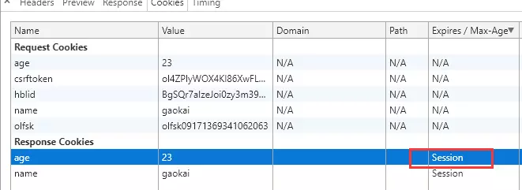
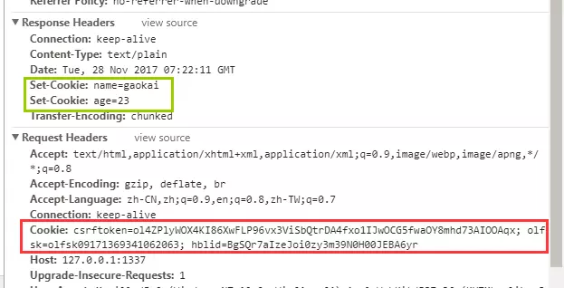
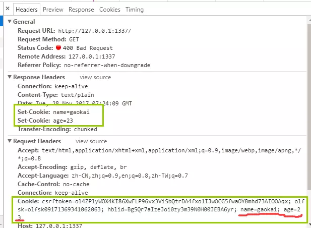
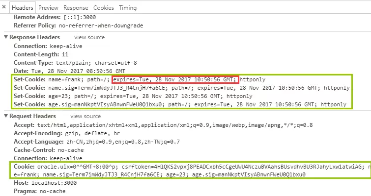
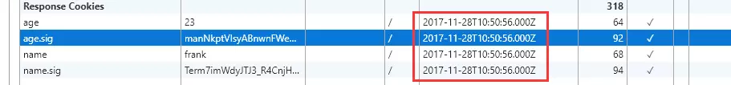

朴灵大神的《深入浅出nodejs》中对cookie进行了很精辟的讲解：

> 由于HTTP是无状态协议，所以需要cookie来区分用户之间的身份。最新规范RFC6265中，定义cookie是一个由浏览器和服务器共同协作实现的规范。
> Cookie的处理分为以下几步：
> 1.服务器向客户端发送cookie（我说怎么前端很少会用到cookie...）
> 2.浏览器将Cookie保存（后端设置expires或者maxAge，cookie有效期由后端来决定，默认为session）
> 3.之后每次浏览器都会讲Cookie发向服务器。（有效期内是这样）

客户端发送的Cookie在请求报文的Cookie字段中，我们可以使用curl来构造这个字段，如下所示：

```
curl -v -H "Cookie:foo=bar;baz=val" "http://127.0.0.1:1337/path?foo=bar&foo=baz"
```

构建失败，不过由此催生出一个有趣的问题。

**1.后端如何生成cookie（后端原生nodejs）**
搭建一个http服务器，并且手动生成cookie，保存到浏览器。

```jsx
var http = require('http')
http.createServer(function(req,res){
    res.setHeader('Set-Cookie',['name=frank','age=23'])
    res.writeHead(400,{'Content-Type':'text/plain'});
    res.end('Hello World\n')
}).listen(1337,'127.0.0.1')
```




expires/Max-Age 字段为此cookie超时时间。若设置其值为一个时间，那么当到达此时间后，此cookie失效。不设置的话默认值是Session，意思是cookie会和session一起失效。当浏览器关闭(不是浏览器标签页，而是整个浏览器) 后，此cookie失效。

**2.浏览器如何将cookie保存？（根据后端设置决定保存与否，需要在cookie有效期内）**
根据expires/MAX-AGE来保存。
现在的cookie生存周期只是一个session，也就是整个浏览器会话（单个tab标签页关闭Cookie依旧保存）
首次建立会话，只有response headers中有cookie.





第二次建立会话，request headers中也有cookie




**3.如何设置expires？（后端设置，koa2，基于cookie.js模块）**
可能需要依赖redis，可能需要 koa2。
先不管redis，使用koa2来修改cookie有效时间。
~~先尝试原生方式，没有原生方式。~~
koa2方式成功。








cookie有效期已经不再是session了。

代码如下：

```csharp
const setCookie = ctx => {
    data = ctx.request.body;
    ctx.response.body = "Cookie设置成功"
    ctx.cookies.set('name', 'frank', { signed: true ,maxAge:7200000});
    ctx.cookies.set('age', 23, { signed: true ,maxAge:7200000});
    ctx.body = 'Hello World';
  };
app.use(route.get('/set', setCookie))
```

既然设置了cookie，服务器如何清除cookie呢？
我们清除的是浏览器上的cookie，让cookie过期就好。
设置cookie的值为空，并且设置cookie的maxAge为0，或者Expires设置为当前时间前的一个时间，例如当前时间1毫秒前Date.now()-1。
koa2框架清除cookie的具体操作代码为：

```csharp
const deleteCookie = ctx =>{
    ctx.response.body = "Cookie删除成功"
    ctx.cookies.set('name','',{signed:false,maxAge:0})
    ctx.cookies.set('age','',{signed:false,maxAge:0})
    ctx.body = "Hello orld"
}
app.use(route.get('/delete',deleteCookie)
```

完整的**koa2设置cookie，清除cookie**代码示例如下：

```csharp
const koa = require('koa');
const app = new koa();
app.keys = ['im a newer secret', 'i like turtle'];
// app.keys = new KeyGrip(['im a newer secret', 'i like turtle'], 'sha256');
const route = require('koa-route');
const setCookie = ctx => {
    data = ctx.request.body;
    ctx.response.body = "Cookie设置成功"
    ctx.cookies.set('name', 'frank', { signed: true ,maxAge:7200000});
    ctx.cookies.set('age', 23, { signed: true ,maxAge:7200000});
    ctx.body = 'Hello World';
  };
app.use(route.get('/set', setCookie))
const deleteCookie = ctx =>{
    ctx.response.body = "Cookie删除成功"
    ctx.cookies.set('name','',{signed:false,maxAge:0})
    ctx.cookies.set('age','',{signed:false,maxAge:0})
    ctx.body = "Hello orld"
}
app.use(route.get('/delete',deleteCookie))
app.listen(3000);
```

That it !