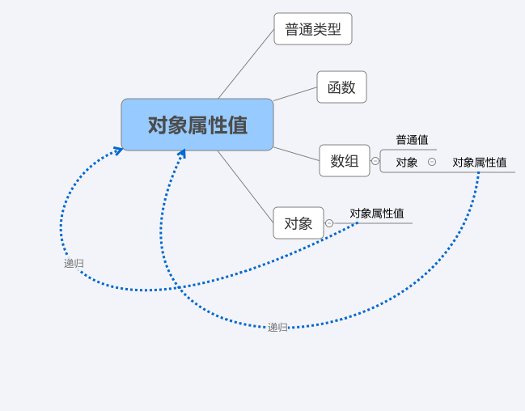

# 对象的key值



Vue.component

```js
Vue.component('my-component', {
  props: {
//1基本类型当对象的属性值----------------------------------------
    // 基础的类型检查 (`null` 和 `undefined` 会通过任何类型验证)
    propA: Number,
    // 多个可能的类型
      
//2数组当对象的属性值---------------------------------------------------    
    propB: [String, Number],
    // 必填的字符串
      
//3对象当对象的属性值---------------------------------------------------    
    propC: {
      type: String,
      required: true
    },
    // vue组件属性为普通类型
    propD: {
      type: Number,
      default: 100
    },
            
    // vue组件属性为对象类型
    propE: {
      type: Object,
      // 对象或数组默认值必须从一个工厂函数获取      
      default: function () {
        return { message: 'hello' }
      }
    },
    // 自定义验证函数
    propF: {
        //4 函数做属性值------------------------------------------------------------------------
      validator: function (value) {
        // 这个值必须匹配下列字符串中的一个
        return ['success', 'warning', 'danger'].indexOf(value) !== -1
      }
    }
  }
})
```

data/computed

```js

data:{msg:1},
//----------------
data(){
   return{msg:1}
}

computed:{
//4 函数做属性值------------------------------------------------------------------------
    name(){
        
        return this.firstName+this.lastName
    }
    
    
}
```

路由解耦属性

```js
//路由解耦
<meta charset="utf-8">
<script src="https://cdn.bootcss.com/vue/2.5.17-beta.0/vue.js"></script>
<script src="https://cdn.bootcss.com/vue-router/3.0.1/vue-router.min.js"></script>

<div id="app">
    <h1>Route props</h1>
    <ul>
        <li>
            <router-link to="/">/</router-link>
        </li>
        <li>
            <router-link to="/hello/you">/hello/you</router-link>
        </li>
        <li>
            <router-link to="/static">/static</router-link>
        </li>
        <li>
            <router-link to="/dynamic/1">/dynamic/1</router-link>
        </li>

    </ul>

    <hr>

    <router-view class="red" attr="自定义属性"></router-view>
</div>


<script>


    function dynamicPropsFn(route) {
        const now = new Date()
        return {
            name: (now.getFullYear() + parseInt(route.params.years)) + '!'
        }
    }


    const Hello = {
        template: `<div>
                       <p>
                        name:<b>{{name}}</b> <br>
                        attrs: {{$attrs}}
                        </p>
                    </div>`,
        props: {
            name: {
                type: String,
                default: 'Vue!'
            }
        }
    }


    const router = new VueRouter({
        mode: 'history',

        routes: [
//1普通值做属性值-----------------------------------
            {path: '/', component: Hello}, // No props, no nothing        
            {path: '/hello/:name', component: Hello, props: true}, // Pass route.params to props
//2对象做属性值-----------------------------------               
            {path: '/static', component: Hello, props: {name: 'world'}}, // static values
//3函数当属性值------------------- 函数生成props作为router-view的属性------------------------------
            {path: '/dynamic/:years', component: Hello, props: dynamicPropsFn}, // custom logic for mapping between route and props
        ]
    })

    new Vue({
        router

    }).$mount('#app')

</script>

<style>
    .hello {
        color: red
    }
</style>

```

```js
  //router嵌套
  const router = new VueRouter({
      mode:'history',
      routes: [{//配置最顶级的<route-view/>
        path: '/fa/',
        name: 'fa',
        component: fa, //默认值
        children: [ //每个children对应一个<route-view/>
          {
            path: '/cs',
            name: 'cs',
            component: cs,
          }
        ]
      },

      ]
    }
  )
```

