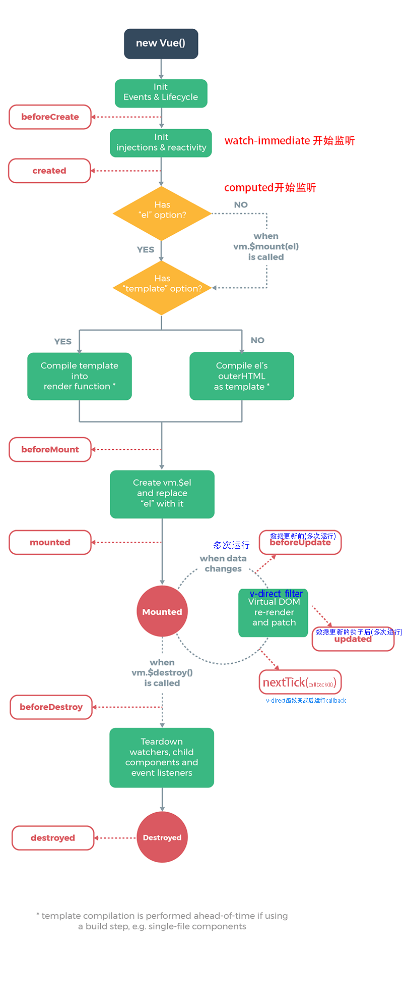

-------------------
# 钩子函数

### 生命周期触发一次的钩子函数

1. beforeCreated  
1. created  初始化数据  进行ajax请求异步数据的获取、
1. beforeMount
1. mounted   dom操作，不能处理异步请求的接口数据
1. destroyed


### vue里的键值变化触发多次的函数
> 大前提:键值必须是注入到vue对象里的键值发生变化
>
> 例如: 
>
> * data,props,computed
>
> * 注入到vue实例中$route $store
>
> * Object(vm,{a:1}),   vm.b

0. v-direct,render,filter 

1. beforeUpdate,
2.  updated  任何数据的更新，如果要做统一的业务逻辑处理
  
2. watch, 数据改变开始自动触发 监听具体数据变化，并做相应的处理
3. computed 多个数据生成一个数据,或替代模版里的复杂的表达式

4. $nextTick() dom异步渲染完成好触发


-------------------
# event触发的函数

```
methods
```


