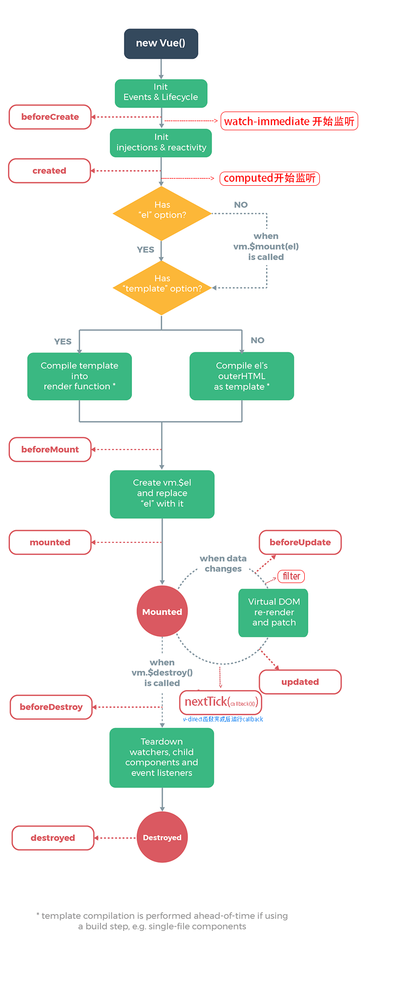

# 钩子函数



-------------------
### 1.1 生命周期触发一次的钩子函数

1. beforeCreated  
1. created  初始化数据  进行ajax请求异步数据的获取、
1. beforeMount
1. mounted   dom操作，不能处理异步请求的接口数据
1. destroyed


### 1.2 vue里的键值变化触发多次的函数
> 大前提:键值必须是注入到vue对象里的键值发生变化
>
> 例如: 
>
> * data,props,computed
>
> * vm.$route, vm.$store
>
> * Object(vm,{a:1}),   vm.a

1. v-direct,filter
2. beforeUpdate,
3. updated  任何数据的更新，如果要做统一的业务逻辑处理
4. $nextTick() dom异步渲染完成好触发
5. watch, 数据改变开始自动触发 监听具体数据变化，并做相应的处理
6. computed 多个数据生成一个数据,或替代模版里的复杂的表达式

##### watch和computed

| watch        | computed       |
| ------------ | -------------- |
| 监听一个数据 | 监听多个数据   |
| 可运行函数   | 注入字段到实例 |

本质

   ```
   <template>
   
   {{msg}}
   <template>
   
   compute:{
   msg:funcution{
   return this.a+this.b=this.c}
   }
   ```

   ```
   const obj = {
       a: 1,
       b: 2,
       c: 3,
   }
   
   Object.defineProperty(obj, 'd', {
       get: function () {
           return this.a + this.b + this.c
       },
       set:function () {
           console.log('watch')
       }
   
   })
   
   console.log(obj.d)
   obj.d=10
   ```

#  监听数据触发指令函数  

###    默认基本值 和对象已有键值的变化

vue默认支持默认

### 监听对象添加新的键值

Vue.prototype.$set()

### 监听Array

##### 变异方法

Vue 包含一组观察数组的变异方法，所以它们也将会触发视图更新。这些方法如下：

- `push()`
- `pop()`
- `shift()`
- `unshift()`
- `splice()`
- `sort()`
- `reverse()`

你打开控制台，然后用前面例子的 `items` 数组调用变异方法：`example1.items.push({ message: 'Baz' })` 。

##### 替换数组

变异方法 (mutation method)，顾名思义，会改变被这些方法调用的原始数组。相比之下，也有非变异 (non-mutating method) 方法，例如：`filter()`, `concat()` 和 `slice()` 。这些不会改变原始数组，但**总是返回一个新数组**。当使用非变异方法时，可以用新数组替换旧数组：

```
example1.items = example1.items.filter(function (item) {
  return item.message.match(/Foo/)
})
```

你可能认为这将导致 Vue 丢弃现有 DOM 并重新渲染整个列表。幸运的是，事实并非如此。Vue 为了使得 DOM 元素得到最大范围的重用而实现了一些智能的、启发式的方法，所以用一个含有相同元素的数组去替换原来的数组是非常高效的操作。

##### 注意事项

由于 JavaScript 的限制，Vue 不能检测以下变动的数组：

1. 当你利用索引直接设置一个项时，例如：`vm.items[indexOfItem] = newValue`
2. 当你修改数组的长度时，例如：`vm.items.length = newLength`

举个例子：

```javascript
var vm = new Vue({
  data: {
    items: ['a', 'b', 'c']
  }
})
vm.items[1] = 'x' // *不是响应性的
vm.items.length = 2 // *不是响应性的
```

为了解决第一类问题，以下两种方式都可以实现和 `vm.items[indexOfItem] = newValue` 相同的效果，同时也将触发状态更新：

```javascript
// Vue.set
Vue.set(vm.items, indexOfItem, newValue)
// Array.prototype.splice
vm.items.splice(indexOfItem, 1, newValue)
```

你也可以使用 [`vm.$set`](https://vuejs.org/v2/api/#vm-set) 实例方法，该方法是全局方法 `Vue.set` 的一个别名：

```
vm.$set(vm.items, indexOfItem, newValue)
```

为了解决第二类问题，你可以使用 `splice`：

```
vm.items.splice(newLength)
```


