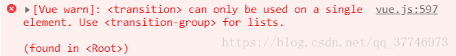
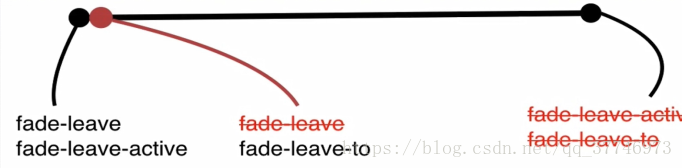

# 使用场景
> Vue 提供了 transition 的封装组件，在下列情形中，可以给任何元素和组件添加进入/离开过渡

```
条件渲染 (使用 v-if)
条件展示 (使用 v-show)
动态组件
路由切换

```
>注意：

>transition标签中只能包裹一个元素，否则会报错：



#过渡原理：
>在动画执行的过程中，vue在不同时刻向标签上动态的增加与删除一些class属性，实现动画过渡的效果。

>

--------------

> 当元素从隐藏到显示的过程中，其过程如下图所示：

>


#过渡的类名：


>在进入/离开的过渡中，会有 6 个 class 切换。

>v-enter：定义进入过渡的开始状态。在元素被插入之前生效，在元素被插入之后的下一帧移除。

>v-enter-active：定义进入过渡生效时的状态。在整个进入过渡的阶段中应用，在元素被插入之前生效，在过渡/动画完成之后移除。这个类可以被用来定义进入过渡的过程时间，延迟和曲线函数。

>v-enter-to: 2.1.8版及以上 定义进入过渡的结束状态。在元素被插入之后下一帧生效 (与此同时 v-enter 被移除)，在过渡/动画完成之后移除。

>v-leave: 定义离开过渡的开始状态。在离开过渡被触发时立刻生效，下一帧被移除。

>v-leave-active：定义离开过渡生效时的状态。在整个离开过渡的阶段中应用，在离开过渡被触发时立刻生效，在过渡/动画完成之后移除。这个类可以被用来定义离开过渡的过程时间，延迟和曲线函数。

>v-leave-to: 2.1.8版及以上 定义离开过渡的结束状态。在离开过渡被触发之后下一帧生效 (与此同时 v-leave 被删除)，在过渡/动画完成之后移除。


# code

```
 <style>
        .fade-enter{
            opacity: 0;
        }
        .fade-enter-active{
            transition: opacity 1s;
        }
        .fade-leave-to{
            opacity: 0;
        }
        .fade-leave-active{
            transition: opacity 1s;
        }

```