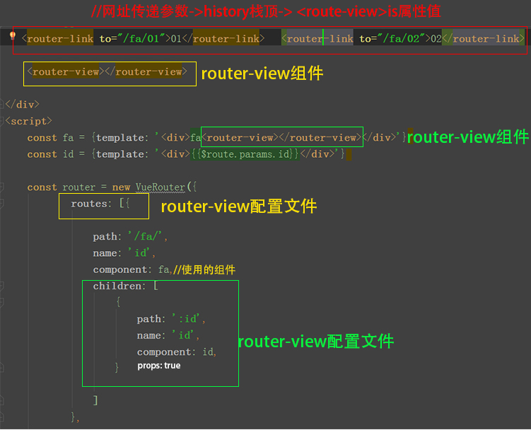
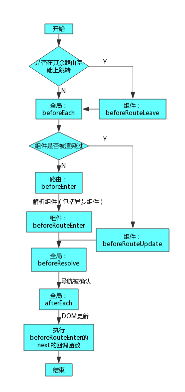

<meta charset="utf-8">

# 父子路由关系

父子关系和普通父子关系一样也是携带关系  


|         |路由           | 动态组件     |  
         ---|---|---     
标签      |< route-view/>  |< component />
设置组件参数| history栈的值|is的值     
组件生命周期|切换运行distroyed|切换运行distroyed
keeplive | 可用            |可用         


# 创建路由实例 const router=new Router({})





# router 钩子函数:





##### 路由守卫  router.beforeEach

```

  router.beforeEach((to, from, next) => {//路由的声明周期 进入路由时间的钩子函数
        console.log(from)//要离开路由的$route信息
        console.log(to)//要加载的路由的$route信息

        if (to.meta.admin === true) {
            console.log('需要admin授权')
        }
        next()
    })

```


# $router=router
路由实例router 挂载在vue实例的$router子键上

# 向history栈顶推入网址

### </ router-link>


### $router.push()

$router.push方法向$router栈注入栈顶元素

```
this.$router.push({
                    name: 'chatList'
                }, () => {
                    this.$router.push({name: 'chatRoom'})
                })
```


原生
```

history.pushState({state: 1}, "newtitle","1.html?b=1")
```


### $router.go()


 
```
$router.go(-1)//返回上一个$router也是使用方法

```

```
   goBack() {
                    window.$router.length > 1
                        ? this.$router.go(-1)       //this.$router类似一个数组,倒数第1个是现在的地址路径,寻找倒数第2个地址路径,此路径会在浏览器地址栏显示
                        : this.$router.push('/')  //类似向this.$router数组push一个路径 此路径会在浏览器地址栏显示
                }
```
原生
```
history.go(-1)

```


-------------------------------------


# < router-view />组件属性


##### 显示什么父子组件:
网址:path决定

##### 组件属性(路由解构) : 
 网址:param query 


----------------------------------------

# $route注入了当前的路由信息


* name或path

*  meta元信息(popstate) 

*  param query


# 路由建立和销毁页面组件实例 为了节省内存

```
created(){}

distroyed(){}


```

# < keep-alive > 


```

<keep-alive>
    <router-view></router-view>
</keep-alive>
```


```
取消了 destroy(){} 和 created(){}

增加了激活和失活的钩子函数deactivated activated

```

# 异步加载路由

在切换到当前当前页面路由时,才从服务器下载当前组件的代码,节省网速

# 路由流配置加active
```
    const router = new VueRouter({
        linkActiveClass :'active',})
```


    


# VUE 路由参数变化页面内容不刷新

### 原因
出现这种情况是因为的路由参数获取写路由绑定组件的生命周期的created钩子函数里,相同路由参数改变后并没有销毁和重建，

### 解决方法
##### 1.watch监听路由'$route对象是否变化


```
watch: {
  // 方法1
  '$route' (to, from) { //监听路由是否变化
    if(this.$route.params.articleId){// 判断条件1  判断传递值的变化
      //获取文章数据
    }
  } 
   //方法2
  '$route'(to, from) {
    if (to.path == "/page") {  /// 判断条件2  监听路由名 监听你从什么路由跳转过来的
       this.message = this.$route.query.msg     
    }
  }  
}
```

##### 2.添加key属性


```

<router-view :key=this.route.query.a />

```


