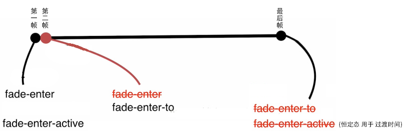
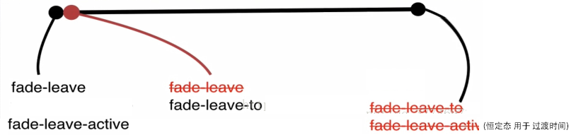

# 原生css transition

```
添加和消除类的会触发动画 
transition添加过渡效果
```

# < transition />使用场景

```
模块渲染 (使用 v-if)
隐藏显示 (使用 v-show)
动态组件
路由切换
```


# < transition />过渡原理

```html
  <transition name="fade" mode="out-in">
        <p v-if="show">hello</p>
    </transition>
```
```css

        .fade-enter,.fade-leave-to{
            /* 进入时消除类fade-enter,动画就出现了 */
            opacity: 0;
        }
        .fade-enter-active,.fade-leave-active{
            transition: all 1s;
        }
   
```
模块创建或者显示时间触发


模块销毁或者隐藏时间触发




# < transition-group />

 transition标签中只能包裹一个元素，否则会报错：
 

# < transition />使用animal.css

任意状态触发添加animite的动画类,

并不需要过渡效果,所以不用添加过渡类 fade-enter-active fade-leave-active

### 渲染和销毁添加不同动画class

```html
<link href="https://cdn.jsdelivr.net/npm/animate.css@3.5.1" rel="stylesheet" type="text/css">
<script src="https://cdn.bootcss.com/vue/2.5.17-beta.0/vue.js"></script>

<div id="example-3">
    <button @click="show = !show">
        Toggle render
    </button>

    <transition
            enter-active-class="animated tada"
            leave-active-class="animated bounceOutRight"
    >
        <p v-if="show">hello</p>
    </transition>
</div>

<script>

    new Vue({
        el: '#example-3',
        data: {
            show: true
        }
    })
</script>
```

### hover添加和删除 动画class

```html
<meta charset="utf-8">
<script src="https://cdn.bootcss.com/vue/2.5.17-beta.0/vue.js"></script>
<script src="https://cdn.bootcss.com/vuex/3.0.1/vuex.js"></script>
<script src="https://cdn.bootcss.com/axios/0.18.0/axios.min.js"></script>
<script src="https://cdn.bootcss.com/vue-router/3.0.1/vue-router.min.js"></script>
<script src="https://cdn.bootcss.com/element-ui/2.4.0/index.js"></script>
<link href="https://cdn.bootcss.com/element-ui/2.4.0/theme-chalk/index.css" rel="stylesheet">
<link href="https://cdn.jsdelivr.net/npm/animate.css@3.5.1" rel="stylesheet" type="text/css">
<div id="app">

    <button :class="{bounceOutRight:isOUt}" class="animated" @mouseover="isOUt=!isOUt">btn</button>
</div>

<script>
    new Vue({
        el: '#app',
        data: {
            isOUt: false
        }
    })
</script>

```

