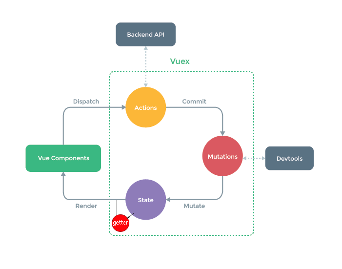

# vuex代码
```html

<!DOCTYPE html>
<html lang="en">
<head>
    <meta charset="UTF-8">
    <title>Title</title>
    <script src="https://cdn.bootcss.com/vue/2.5.17-beta.0/vue.js"></script>
    <script src="https://cdn.bootcss.com/vuex/3.0.1/vuex.js"></script>
</head>
<body>
<div id="app">
    <input type="text" v-model="this.$store.state.count">
    <h3>{{$store.state.count}}</h3>
    <h3>
        {{ $store.getters.counta}}
    </h3>

    <div>
        <span>conmmit</span>
        <button @click="$store.commit('add',1)">+</button>
        <button @click="$store.commit('reduce',1)">-</button>

    </div>

    <div>
        <span>dispatch</span>
        <button @click="$store.dispatch('addAction',20)">+</button>
        <button @click="$store.dispatch('reduceAction',10)">-</button>

    </div>


    <button @click="$store.state.fn()">{{$store.state.fn}}</button>

</div>
<script>

    const store = new Vuex.Store({
   
        strict: false,
        state: {
            count: 10,

            fn() {
                    console.log(1)
                }
        },

        getters: {
            counta: function (state) {
                return state.count + 9;
            }
        },

        mutations: {

            add(state, n) {
                state.count += n;
            },
            reduce(state, n) {
                state.count -= n;
            }
        },
        actions: {
            addAction(context, n) {
                setTimeout(() => context.commit('add', n), 1000)
            },
            reduceAction({commit}, n) {
                commit('reduce', 10 + n)
            }
        }
       
    })

    const vm = new Vue({
        el: '#app',
        store,
        created() {
            this.$store.dispatch('addAction', 20)
        }
    })
</script>

</body>
</html>

```

对比$emit,都是回调函数

```
this.$emit("input",data)

< div input="fn(event,data)"></div>

```


# store对象


# ctx对象


# 本质

本质是一个对象做全局变量-通过全局mixin加入每个组件


# 作用

1.  vuex作用可以替代本地的config.js
2. vuex可以从后端获取异步收据然后和本地的config.js数据融合

# 使用场景

被不同非父子组件多次用到的数据

# 限用场景

往后端传送数据, 麻烦不直观

