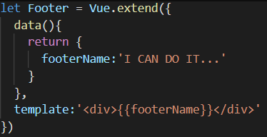
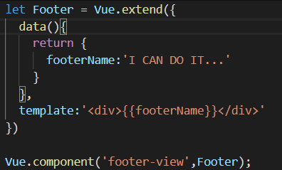
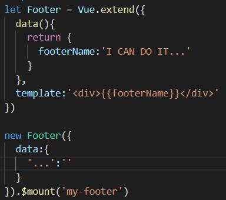

# 组件封装(类)

**解藕:**

组件化化是如表格和表单本来可以写在一起分开,tab和tab-pane本来可以写在一起的分开,

解藕的作用模块尽量小,越小的越方便复用

**内聚封装:**

模块化组件化标签化:把一个逻辑的dom  css  js逻辑  数据状态 封装在一起,简化成标签

# 实例化

| dom                                        | vue                                                          | 函数                                                         |
| ------------------------------------------ | ------------------------------------------------------------ | ------------------------------------------------------------ |
| HTMLDivElement是div的父类                  | Vue是Cl的父类 confi                                          | function Cl(type){this.type=type}<br />Cl.prototype=Vue.prototype |
| <div></div>是构造函数div实例化             | <cl></cl>       构造函数Cl实例化                             | Cl( )                                                        |
|                                            | props:{msg:{default:'msg'}}<br />构造函数Cl参数的默认值<br /> | function Cl(type="default"){this.type=type}                  |
|                                            | prop检查                                                     | 类似ts的函数参数类型检测                                     |
|                                            | Cl子组件里有局部btn组件                                      | function Cl(type){<br />this.type=type<br /><br />function Btn(){.......}<br /> Btn( )<br />} |
|                                            | Cl子组件里有全局ui组件btn                                    | global.Btn=funciont(){...}<br />function Cl(type){<br />this.type=type<br /> Btn( )<br />} |
|                                            | Cl组件有slot                                                 | function Cl(type,slot){this.type=type<br /><br />slot(p)<br /> }<br />Cl('default',function slot(p){<br />this.p=p}) |
|                                            | proviede/project                                             | function Fa({enable}){<br /><br />function Cl(enable){<br /><br />this.enable=able}<br />} |
|                                            | CL子组件里的data变量                                         | function Cl(type){this.type=type<br /><br />var data=msg<br /> btn( )} |
| <div style=""/>的属性就是构造函数div的参数 | <cl type="default"/>的属性是构造函数Cl的参数                 | new Cl("defalt")                                             |

## 组件标签<=>new Cl( )

```html
<cl age='age' @fn='fn'></cl>
```

```html
<script src="https://cdn.bootcss.com/vue/2.5.17-beta.0/vue.js"></script>

<div id="app">


</div>

<script>

    const VueComponent = Vue.component('cl', {
        template: `<div>{{prop}}</div>`,
        props: {prop: {default: 10}}
    })
    const vm = new Cl({props: {prop: {default: 100}}})

    const dom = vm.$mount().$el
    document.getElementById('app').appendChild(dom)
</script>

<style>
    .red {
        color: red;
    }
</style>

```

##  组件标签的属性和方法<=>new Cl({属性,方法})

### 父标签的自定义属性

`prop`

##### 访问

子组件可以通过this.xxx或者this.$props.xxx访问

##### 作用:

   1. 数据父传子  

   2. 组件属性不可以给 slot用`不要被父子组件的属性传递和v-for误导了`

### 父标签自定义事件

`@click='fn'`

##### 访问

子组件里通过 this.$listeners访问,不包含.native

子组件里通过$emit( )触发

不包含构造函数的回调参数类型的参数 

##### 作用:

子传父

### 父标签默认自带属性

1. class

2. style

3. attr

##### 访问

父标签添加会落在子组件最外层dom上, attr可以通过this.$attr访问
### 自定义组件的dom嵌套,本质也是回调函数做参数

##### this.$slots

```vue
<!--父-->
<cl>
     <!--Cl构造函数的参数-->

<template v-slot.xxx='{...value}'></template>

</cl>
```

```html

<!--子-->
<template>
    <div>
        <!--回调函数-->
      <slot value='value'></slot>  
    </div>
</template>

<script>
//子访问父标签的数据
this.$slots.default
</script>

```

### privide/inject访问上级dom的组件的数据

```html
<meta charset="utf-8">
<script src="https://cdn.bootcss.com/vue/2.5.17-beta.0/vue.js"></script>

<style>
  form {
    border: 1px solid #0bb20c
  }
</style>
<div id="app">

  <!--  <input type="text" disabled>-->

  <l-input disabled>

  </l-input>

  <l-form >
    <l-form-item disabled>
      <l-input>

      </l-input>

    </l-form-item>

  </l-form>
</div>
<script>


  Vue.component('LInput', {
    template: '<input :disabled="_disable" :value="null"/>',
    inject: {
      lForm: {default: {}},
      lFormItem: {default: {}}
    }, //引入父级的父级的父级的变量
    props: {disabled: Boolean},
    computed:{
      _disable(){
        return this.disabled||this.lFormItem.disabled||this.lForm.disabled
      }

    }
  })

  Vue.component('LFormItem', {
    template: '<label for="name"> name: <slot></slot></label>',
    provide() {
      return {
        lFormItem: this
      };
    },
    props: {disabled: Boolean},
  })

  Vue.component('LForm', {
    template: '<form> <slot></slot></form>',
    provide() {
      return {
        lForm: this
      };
    },
    props: {disabled: Boolean}
  })


  const vm = new Vue({
    el: '#app',
    data: {},
  })
</script>

```

# `__proto__:Vue.prototype`

### vue.extend与vue.component的区别和联系

这篇文章主要介绍了vue.extend与vue.component的区别和联系，本文通过实例代码给大家介绍的非常详细，具有一定的参考借鉴价值 ,需要的朋友可以参考下

如果大家只顾开发，对基础知识不了解，在今后的解决问题过程中，也是个大问题，今天小编抽空对基础概念给大家屡一下，用于大家日后学习。

Vue.extend({})简述：使用vue.extend返回一个子类构造函数，也就是预设部分选项的vue实例构造器。

后可使用vue.component进行实例化、或使用`new extendName().$mount(''+el)`方式进行实例化（从而实现模拟组件）。



`Vue.component({})`简述：不多介绍了。。。用于生成全局组件

### 使用：

　　1，Vue.component使用Vue.extend生成的构造函数：



　　2，实例化构造函数从而模拟组件：



### **vue.extend与vue.component的区别总结**

在Vue.js中，Vue本身是一个constructor。

Vue.extend() 是一个继承于方法的 class，参数是一个包含组件选项的对象。它的目的是创建一个Vue的子类并且返回相应的 constructor。

而vue.component()实际上是一个类似于Vue.directive() 和 Vue.filter()的注册方法，它的目的是给指定的一个constructor一个String类型的ID，

之后Vue.js可以把它用作模板，实际上当你直接传递选项给vue.component()的时候，它会在背后调用Vue.extend()。

Vue.js支持两种不同的API模型：一种是基于类的，命令式的，Backbone 类型的API；另一种是基于标记语言的，声明式的，Web组件类型的API。

如果还是困惑的话，可以想象你是怎么创建通过new Image()或者 标签创建 image元素的就知道了。

这两种方法都对指定的类型很有用，Vue.js提供这两者只是为了更好的灵活性。

**下面看下vue.extend，new vue 和vue.component的区别**

extend 是构造一个组件的语法器. 你给它参数 他给你一个组件 然后这个组件

你可以作用到Vue.component 这个全局注册方法里， 也可以在任意vue模板里使用apple组件

```
var apple = Vue.extend({ …. }) Vue.component(‘apple',apple)
```

你可以作用到vue实例或者某个组件中的components属性中并在内部使用apple组件

```
new Vue({ components:{ apple:apple } })
```

vue.component 你可以创建 ，也可以取组件 例如下

```
var apple = Vue.component(‘apple') `而new vue 是新建一个vue对象 所以可以理解为`new vue < vue.extand < vue.component
```

