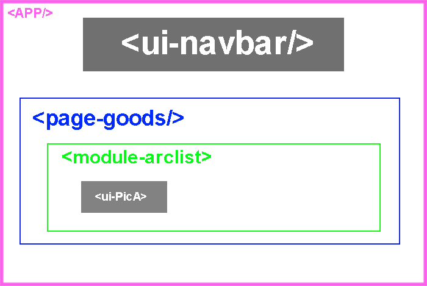

# 组件的分类

| 按功能分   | vue-cli                                                      | nuxt                                                         |
| ---------- | ------------------------------------------------------------ | ------------------------------------------------------------ |
| 布局组件   | app                                                          | layout                                                       |
| 页面组件   | router构造器里fa和children                                   | 普通目录嵌套生成构造器配置                                   |
| 页面组件   | router构造器里fa,children嵌套和<keep-alive><router-view prop='123' name="top"/><keep-alive> | 特殊目录嵌套生成构造器配置+ <nuxt-child  prop="123" keep-alive :keep-alive-props="{ exclude: ['modal'] }"/> |
| 模块组件   |                                                              |                                                              |
| ui组件     |                                                              |                                                              |
| 无状态组件 | style-component                                              | style-component                                              |

