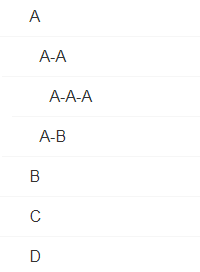

# vue中组件name的作用

我们在写vue项目的时候会遇到给组件命名
这里的name非必选项，看起来好像没啥用处，但是实际上这里用处还挺多的

```
 export default {
      name:'xxx'
}
```

**1.当项目使用keep-alive时，可搭配组件name进行缓存过滤**
举个例子：
我们有个组件命名为detail,其中dom加载完毕后我们在钩子函数mounted中进行数据加载

```
export default {
    name:'Detail'
}，
mounted(){
   this.getInfo();
}，
methods:{
   getInfo(){
          axios.get('/xx/detail.json',{
              params:{
                id:this.$route.params.id  
              }
          }).then(this.getInfoSucc)
     }
 }
```

因为我们在App.vue中使用了keep-alive导致我们第二次进入的时候页面不会重新请求，即触发mounted函数。
有两个解决方案,一个增加activated()函数,每次进入新页面的时候再获取一次数据。
还有个方案就是在keep-alive中增加一个过滤，如下图所示：

```
  <div id="app"> 
    <keep-alive exclude="Detail">
      <router-view/>
    </keep-alive>
  </div>12345
```

**2.DOM做递归组件时**
比如说detail.vue组件里有个list.vue子组件，递归迭代时需要调用自身name

list.vue:

```
  <div>
        <div v-for="(item,index) of list" :key="index">
            <div>
                <span class="item-title-icon"></span>
                {{item.title}}
            </div>
            <div v-if="item.children" >
               <detail-list :list="item.children"></detail-list>
            </div>
        </div>
  </div>

<script>
export default {
    name:'DetailList',//递归组件是指组件自身调用自身
    props:{
        list:Array
    }
}
</script>
 list数据：
  const list = [{
          "title": "A",
          "children": [{
            "title": "A-A",
            "children": [{
              "title": "A-A-A"
            }]
          },{
                "title": "A-B"
          }]
        }, {
          "title": "B"
        }, {
          "title": "C"
        }, {
          "title": "D"
        }]
```

迭代的结果如下：


**3.当你用vue-tools时**
vue-devtools调试工具里显示的组见名称是由vue中组件name决定的
