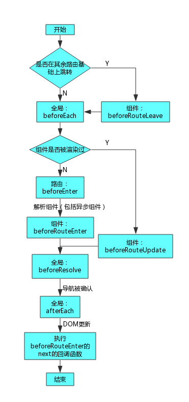

# router 钩子函数:




路由守卫  router.beforeEach

```javascript
  router.beforeEach((to, from, next) => {//路由的声明周期 进入路由时间的钩子函数
        console.log(from)//要离开路由的$route信息
        console.log(to)//要加载的路由的$route信息

        if (to.meta.admin === true) {
            console.log('需要admin授权')
        }
        next()
    })

```

