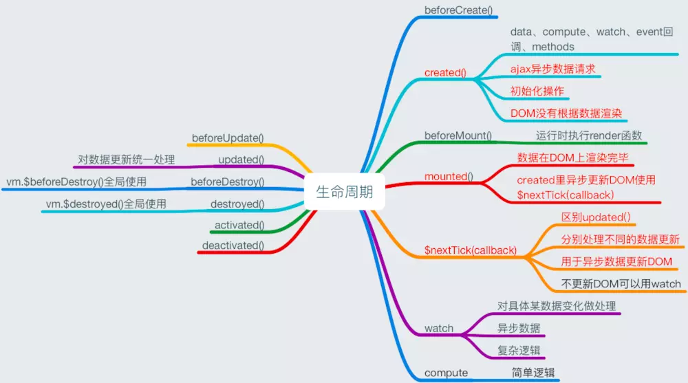

# 缓存机制

未注入到vue实例的数据/Vue.prototype.xxx  为缓存机制


# 依赖机制

vue实例的叶子节点为依赖机制

### vm.obj/vm....obj  为对象类型

| vm.obj的变化                                                | 是否能监听到 |
| ----------------------------------------------------------- | ------------ |
| vm.obj.a=xxx /Object.assign( vm.obj,{}) 修改vm已有键值      | √            |
| vm.obj.a=xxx,/Object.assign( vm.obj,{}) 添加vm的新键值      | x            |
| Vue.ptototype.$set(vm.obj,'a',xxx),修改vm的已有键值         | √            |
| Vue.ptototype.$set(vm.obj,'a',xxx),添加vm的新键值           | √            |
| vm.obj={new... }改变vm.obj地址 **注:vm.obj 是vm已有的键值** | √            |

vm.....obj    vm.$store.state  也遵从上面的规则

### vm.arr /vm....arr为数组类型

| vm.arr的变化                                                 | 是否能监听到 |
| ------------------------------------------------------------ | ------------ |
| 通过vm.arr[0]/Object.assign( vm.arr,[])  改变vm.arr已有键值  | x            |
| 通过vm.arr[1]/Object.assign( vm.arr,[ ]) 添加vm.arr的新键值  | x            |
| Vue.ptototype.$set(vm.arr,0,xxx),$set修改vm的已有键值        | √            |
| Vue.ptototype.$set(vm.arr,1,xxx),$set添加vm的键值            | √            |
| ==vm.push pop shift unshift... 改变已有键值和添加新键值==    | √            |
| vm.arr=vm.arr.foreach(()=>{ })   改变vm.arr地址  **注:vm.arr 是vm已有的键值** | √            |

vm....arr    vm.$store.state.arr  也遵从上面的规则

##### vm.arr[index]

> Array添加的新键值,和非枚举属性length不可被监听

由于 JavaScript 的限制，Vue 不能检测以下变动的数组：

1. 当你利用索引直接设置一个项时，例如：`vm.arr[indexOfItem] = newValue`
2. 当你修改数组的长度时，例如：`vm.arr.length = newLength`

举个例子：

```javascript
var vm = new Vue({
  data: {
    arr: ['a', 'b', 'c']
  }
})
vm.arr[1] = 'x' // *不是响应性的
vm.arr.length = 2 // *不是响应性的
```

为了解决第一类问题，以下两种方式都可以实现和 `vm.arr[indexOfItem] = newValue` 相同的效果，同时也将触发状态更新：

```javascript
// Vue.set
Vue.set(vm.arr, indexOfItem, newValue)
// Array.prototype.splice
vm.arr.splice(indexOfItem, 1, newValue)
```

你也可以使用 `vm.$set` 实例方法，该方法是全局方法 `Vue.set` 的一个别名：

```
vm.$set(vm.arr, indexOfItem, newValue)
```

为了解决第二类问题，你可以使用 `splice`：

```
vm.arr.splice(newLength)
```

##### 数组的栈方法是变异方法

Vue 包含一组观察数组的变异方法，所以它们也将会触发视图更新。这些方法如下：

- `vm.arr.push()`
- `vm.arr.pop()`
- `vm.arr.shift()`
- `vm.arr.unshift()`
- `vm.arr.splice()`
- `vm.arr.sort()`
- `vm.arr.reverse()`

你打开控制台，然后用前面例子的 `arr` 数组调用变异方法：`vm.arr.push({ message: 'Baz' })` 。

##### 替换数组地址-数组迭代方法

> 本质是通过改更地址进行监听
>
> 函数的迭代方法要通过更改地址实现

变异方法 (mutation method)，顾名思义，会改变被这些方法调用的原始数组。相比之下，也有非变异 (non-mutating method) 方法，例如：`filter()`, `concat()` 和 `slice()` 。这些不会改变原始数组，但**总是返回一个新数组**。当使用非变异方法时，可以用新数组替换旧数组：

```js
vm.arr = vm.arr.filter(function (item) {
  return item.message.match(/Foo/)
})
```

你可能认为这将导致 Vue 丢弃现有 DOM 并重新渲染整个列表。幸运的是，事实并非如此。Vue 为了使得 DOM 元素得到最大范围的重用而实现了一些智能的、启发式的方法，所以用一个含有相同元素的数组去替换原来的数组是非常高效的操作。


# 生命周期函数





### vue里的生命周期是什么？

vue实例从创建到销毁的过程称之为vue的生命周期

### vue的生命周期各阶段都做了什么？

`beforeCreate` 实例创建前：这个阶段实例的data、methods是读不到的
`created` 实例创建后：这个阶段已经完成了数据观测(data observer)，属性和方法的运算， watch/event 事件回调。mount挂载阶段还没开始，$el 属性目前不可见，数据并没有在DOM元素上进行渲染
`beforeMount`：在挂载开始之前被调用：相关的 render 函数首次被调用。
`mounted`：el选项的DOM节点 被新创建的 vm.$el 替换，并挂载到实例上去之后调用此生命周期函数。此时实例的数据在DOM节点上进行渲染
`beforeUpdate`：数据更新时调用，但不进行DOM重新渲染，在数据更新时DOM没渲染前可以在这个生命函数里进行状态处理
`updated`：这个状态下数据更新并且DOM重新渲染，当这个生命周期函数被调用时，组件 DOM 已经更新，所以你现在可以执行依赖于 DOM 的操作。当实例每次进行数据更新时updated都会执行
`beforeDestory`：实例销毁之前调用。
`destroyed`：Vue 实例销毁后调用。调用后，Vue 实例指示的所有东西都会解绑定，所有的事件监听器会被移除，所有的子实例也会被销毁。

### 使用场景

#### `created`：

进行ajax请求异步数据的获取、初始化数据

#### `mounted`：

挂载元素内dom节点的获取

#### `$nextTick`：

针对单一事件更新数据后立即操作dom

#### `updated`：

任何数据的更新，如果要做统一的业务逻辑处理

#### `watch`：

监听具体数据变化，并做相应的处理

#### computed/watch/method

##### computed

###### 不使用 computed 

通过简单的字符串拼接可以响应式变化

```js
import Vue from 'vue'

new Vue({
  el: '#app',
  template: `
    <div>
      <span>Name: {{firstName + ' ' + lastName}}</span>
    </div>
  `,
  data: {
    firstName: 'Jokcy',
    lastName: 'Lou'
  }
})
```

###### 使用 computed可以响应式变化

```js
new Vue({
  el: '#root',
  template: `
    <div>
      <span>Name: {{name}}</span>
    </div>
  `,
  data: {
    firstName: 'Jokcy',
    lastName: 'Lou'
  },
  computed: {
    name () {
      return `${this.firstName} ${this.lastName}`
    }
  }
})
```

###### 使用 methods替代优化

显示结果和使用 computed 相同适用于不监听的 提高性能

```js
new Vue({
  el: '#root',
  template: `
    <div>
      <span>Name: {{name}}</span>
      <span>Name: {{getName()}}</span>
    </div>
  `,
  data: {
    firstName: 'Jokcy',
    lastName: 'Lou'
  },
  computed: {
    name () {
      return `${this.firstName} ${this.lastName}`
    }
  },
  methods: {
    getName () {
      return `${this.firstName} ${this.lastName}`
    }
  }
})
```

如果使用computed,当我们改变 number 时，整个应用会重新渲染，vue 会被数据重新渲染到 dom 中。这时，如果我们使用 getName 方法，随着渲染，方法也会被调用，而 computed 不会重新进行计算，从而**性能开销比较小**。当新的值需要大量计算才能得到，缓存的意义就非常大。

如果 computed 所**依赖的数据发生改变时，计算属性才会重新计算**，并进行缓存；当改变其他数据时，computed 属性 并不会重新计算，从而提升性能。

当我们拿到的值需要进行一定处理使用时，就可以使用 computed。

```js
import Vue from 'vue'

new Vue({
  el: '#root',
  template: `
    <div>
      <p>Name: {{name}}</p>
      <p>Name: {{getName()}}</p>
      <p>Number: {{number}}</p>
      <p><input type="text" v-model="number"/></p>
      <p>FirsName: <input type="text" v-model="firstName"/></p>
      <p>LaseName: <input type="text" v-model="lastName"/></p>
    </div>
  `,
  data: {
    firstName: 'Jokcy',
    lastName: 'Lou',
    number: 0
  },
  computed: {
    name () {
      console.log('new name')
      return `${this.firstName} ${this.lastName}`
    }
  },
  methods: {
    getName () {
      console.log('getName invoked')
      return `${this.firstName} ${this.lastName}`
    }
  }
})
```

###### computed set 不推荐

通过 computed 的 set 方法，可以进行设置的操作。

如下例，通过改变 name 的值，也可以改变 computed 属性 name 所以来的 firstName 和 lastName 的值。

**不推荐这样做**，一般 computed 属性数据是根据多重数据组合成的新的数据，组合容易，但拆开重新设置并不容易

```js
  new Vue({
    el: '#app',
    template: `
    <div>
      <p>Name: <input type="text" v-model="name"/></p>
      <p>{{firstName+lastName}}</p>
    </div>
  `,
    data: {
      firstName: 'Jokcy',
      lastName: 'Lou',
    },
    computed: {
      name: {
        get () {
          console.log('get')
          return `${this.firstName} ${this.lastName}`
        },
        set (name) {
          const names = name.split(' ')
          this.firstName = names[0]
          this.lastName = names[1]
        }
      }
    }})
```

##### watch

例如，监听 firstName 数据，并根据改变得到的新值，进行某些操作。

```js
new Vue({
  template: `
    <div>
      <p>FullName: {{fullName}}</p>
      <p>FirsName: <input type="text" v-model="firstName"/></p>
    </div>
  `,
  data: {
    firstName: 'Jokcy',
    lastName: 'Lou',
    fullName: ' '
  },
  watch: {
    firstName (newName, oldName) {
      this.fullName = newName + ' ' + this.lastName
    }
  }
})
```

注意：上例中，初始 fullName 是没有值的，只有当数据改变时，才会显示。因为 **watch 的方法默认是不会执行的**，只有当监听数据变化，才会执行。

###### immerdiate 属性

通过声明 **immediate 选项为 true**，可以立即执行一次 handler。

```js
watch: {
    firstName: {
      handler (newName, oldName) {
        this.fullName = newName + ' ' + this.lastName
      },
      immediate: true
    }
  },
```

watch 并不适用于显示某一个数据以及数据的拼装等。**watch 用在监听数据变化，做某些指令操作（给后台发数据请求）**

###### deep属性

不使用 deep 时，当我们改变 obj.a 的值时，watch不能监听到数据变化，**默认情况下，handler 只监听属性引用的变化，也就是只监听了一层，但改对象内部的属性是监听不到的**。

```js
new Vue({
  template: `
    <div>
      <p>Obj.a: <input type="text" v-model="obj.a"/></p>
    </div>
  `,
  data: {
    obj: {
      a: '123'
    }
  },
  watch: {
    obj: {
      handler () {
        console.log('obj.a changed')
      },
      immediate: true
      // deep: true
    }
  }
})
```

通过使用 deep: true 进行深入观察，这时，我们监听 obj，会把 obj 下面的属性层层遍历，都加上监听事件，这样做，**性能开销也会变大**，只要修改 obj 中任意属性值，都会触发 handler。

###### 如何优化？

在字符串中，写 obj 深入的属性调用，vue 会层层解析，找到 a，并进行监听。

```js
watch: {
    'obj.a': {
      handler () {
        console.log('obj.a changed')
      },
      immediate: true
      // deep: true
    }
  }
```

##### computed/watch 本质

```js
   <template>
   {{msg}}
   <template>
   
   computed:{
   msg:funcution{
   return this.a+this.b=this.c}
   }
```

```js
   const obj = {
       a: 1,
       b: 2,
       c: 3,
   }
   
   Object.defineProperty(obj, 'd', {
       get: function () {
           return this.a + this.b + this.c
       },
       set:function () {
           console.log('watch')
       }
   
   })
   
   console.log(obj.d)
   obj.d=10
```

目的解藕

```js
  var i=1
  console.log(i+10*15+100)

  function computed(){
    return i+10*15+100
  }
  console.log(computed())
```

##### watch和computed和method使用场景

|              | watch                      | computed                                                     | method                    |
| ------------ | -------------------------- | ------------------------------------------------------------ | ------------------------- |
| **机制**     | 依赖机制/监听vm的一个key值 | 依赖机制/监听vm里的多个key值                                 | 缓存机制/取任何数据       |
| **使用场景** | 监听key值变化触发函数      | 1.多个key值生成一个新的key值,2替代模版里的复杂的表达式(解藕)  3.可注入字段到实例 | 节省内存,触发事件才才运行 |

*注意*

不要在 computed 或 watch 钩子函数中，去修改所依赖的数据的值，尤其是 computed；如果这样做，可能导致一个无线循环的触发。+