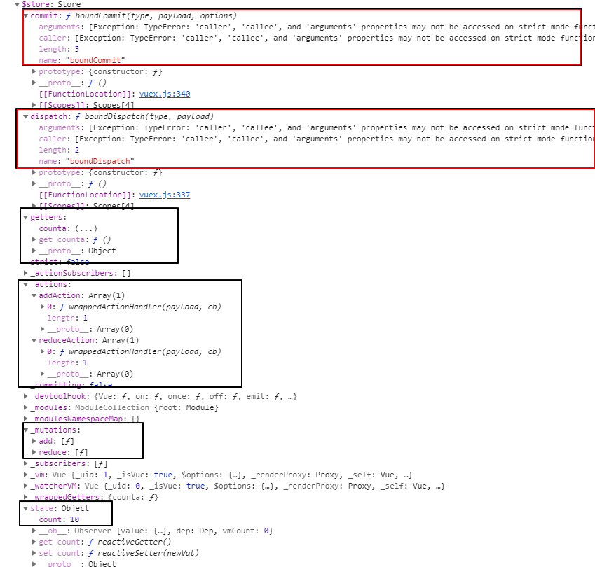
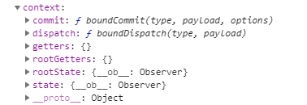

# 本质

本质是一个对象做全局变量

# store对象



# ctx对象做参数 




# vuex代码
### 构造器代码
```

const store = new Vuex.Store({
        state: {
            count: 10
        },

        getters: {
            counta: function (state) {
                return state.count + 9;
            }
     
        },

        mutations: {
       

            add(state, n) {
                state.count += n;
            },
            reduce(state, n) {
                state.count -= n;
            }
        },
        actions: {
      

            addAction(context,n) { //回调函数


             
                context.commit('add', n)//第二个回调函数
                

         /* 伪代码
           function commit(mymutation, n) {mymutation(state, n)}
      
           */        
            },
            
            reduceAction({commit}, n) {  

                commit('reduce', 10 + n)

         
            }
        }
        ,
        strict: false
    })

    const vm = new Vue({
        el: '#app',
        store
    })

```


### html代码

```


    <input type="text" v-model="this.$store.state.count">
    <h3>{{$store.state.count}}</h3>
    <h3>
        {{ $store.getters.counta}}
    </h3>

    <div>
        <span>conmmit</span>

  


        <button @click="$store.commit('add',1)">+</button>
        <button @click="$store.commit('reduce',1)">-</button>
        
   


    </div>

    <div>
        <span>dispatch</span>

              

        <button @click="$store.dispatch('addAction',20)">+</button> <!--模板里省去了this,分析时间加上-->
        <button @click="$store.dispatch('reduceAction',10)">-</button>
        
   <!--@伪代码
                function  dispatch(myaction, n) {
                    myaction(contex, n)}
                   -->


    </div>


```

# 对比$emit

```
this.$emit("input",data)

< div input="fn(event,data)"></div>

```

# vuex作用可以替代config.js


