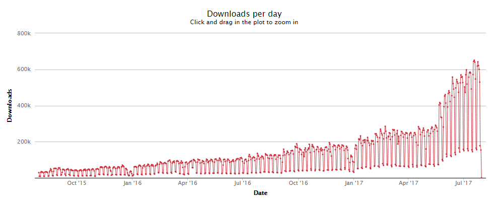
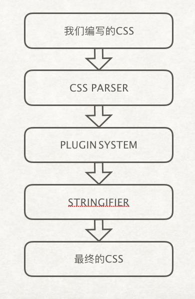
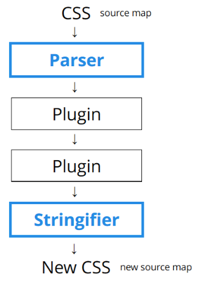
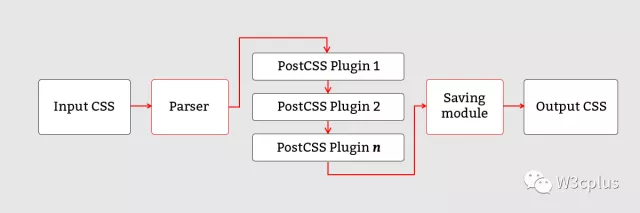

## PostCSS介绍

[PostCSS](https://github.com/postcss/postcss)是一个利用JS插件来对CSS进行转换的工具，这些插件非常强大，强大到无所不能。其中，[Autoprefixer](https://github.com/postcss/autoprefixer)就是众多PostCSS插件中最流行的一个。

截至目前（2017年7月）PostCSS已经有**超过200**个插件，你可以[插件列表](https://github.com/postcss/postcss/blob/master/docs/plugins.md)查找有没有你所需要的插件。如果你想自己写个插件，据说这是一个不错的主意，而且非常简单（前提掌握node.js，不过我还没学会呢），你可以试着[搞点事](https://github.com/postcss/postcss/blob/master/docs/writing-a-plugin.md)。

看到这里，你可能没有发现它的强大之处，甚至我自己都没有被我翻译的这段官方文字所打动。~~因为没(wǒ)有(yě)对(bù)比(tài)就(huì)没(yòng)有(zhè)伤(wán)害(yì)。~~好了，是时候启动装逼模式了。

维基百科，阿里巴巴，谷歌，Wordpress，Twitter等网站均有使用，大佬们都在用你有什么理由不跟上步伐。

再来看看这张PostCSS下载数量的npm-stat统计表（数据证明一切）：

  

学习PostCSS之前需要了解一些事情：

1. PostCSS插件的处理方式类似那些CSS预处理器，而非预处理器和后处理器（[PostCSS is Not a *Pre-*processor and Not a *Post-*processor either](https://webdesign.tutsplus.com/tutorials/postcss-deep-dive-what-you-need-to-know--cms-24535)）
2. PostCSS is Not “Future Syntax”（不是新式/未来语法？不知道怎么翻译）
3. PostCSS本身并非整理或优化CSS的工具
4. PostCSS可以完成很多意想不到的事情，例如用[postcss-rtl](https://github.com/vkalinichev/postcss-rtl)恶搞一下?

那么它还有一些特性，例如创建了一个插件功能极强的生态系统，具有模块化需要什么用什么（[precss](https://github.com/jonathantneal/precss)就是一个集成了类似SASS很多方法的包），相比其他的CSS预处理器它的优势主要体现在以下几个方面：

1. 拥有极高的处理性能（[3倍以上的处理速度](https://github.com/postcss/benchmark)）
2. 你既可以写正常的CSS，也可以结合LESS或者SASS一起编写
3. 对Source Map支持更好
4. 他的插件真的太多太强大太便利了

其他对比SASS和LESS的区别在于他们内置了大量的方法，而也许你只需要用到几个变量而已，大材小用。而PostCSS则可制定个人需求的一套解决方案（仅安装需要的插件）。这也就是他高性能的主要原因。几乎SASS和LESS有的功能全都有！

总之好处太多了。这里就不一一列举了。迫不及待的你已经等不及安装使用了吧。

## PostCSS安装及使用

PostCSS一般是结合自动化工具使用，如果要单独使用可以安装[PostCSS CLI](https://github.com/postcss/postcss-cli)，这里我先对PostCSS CLI的安装使用讲解下。Windows下安装（文中操作全部基于WINDOWS环境）：

~~`npm i -g postcss-cli`~~或者`npm i --save-dev postcss-cli`

CLI是否建议全局安装?（这样包括其对应的插件都要全局了？如果不全局就失去了CLI的意义了？）。全局安装完成后，试着输入PostCSS，出现以下结果，说明安装OK


不过我个人习惯仅安装在项目中，于是我没有选择安装CLI，而是直接在项目中安装PostCSS，`npm i --save-dev postcss`，我这里有个[例子](https://github.com/whidy/postcss-study)可以看看

接下来，我们还做不了什么，我们需要安装一些插件配合PostCSS，例如，我现在安装一个autoprefixer

`npm install --save-dev autoprefixer`，并参考例子中的[style01.css](https://github.com/whidy/postcss-study/blob/master/src/style01.css)，我要通过PostCSS对它进行处理。这里两个方法：

1. 通过

   ```
   cd node_modules/.bin/
   ```

   进入node_modules/.bin/目录内再执行

   `postcss ../../src/style01.css -o ../../dist/output_style01.css -u autoprefixer`

2. 通过修改package.json中的scripts，增加一条postcss命令

   `"postcss:style01": "postcss ./src/style01.css -o ./dist/output_style01.css -u autoprefixer"`

   然后再回到根目录（postcss-study目录）下执行

   `npm run postcss:style01`

两者效果相同，当然我倾向于后者啦。完成后一条鲜亮的绿色的让人安全感十分强列的提示语出现了*√ Finished ...*前面还有个sweet的勾勾，请看编译后的[output_style01.css](https://github.com/whidy/postcss-study/blob/master/dist/output_style01.css)聪明的你一定能举一反三的。做出更多惊奇的事情的~

另外我们可以同样的采用Parser插件来编译样式文件（当然我实际上是不会用sugarss的，如果你习惯用sass请安装[postcss-scss](https://github.com/postcss/postcss-scss)），我的[DEMO](https://github.com/whidy/postcss-study)里面请参考[style02.sss](https://github.com/whidy/postcss-study/blob/master/src/style02.sss)文件的编译。这里就不多说了。

> 还有一种预先写好配置文件，这个就稍微先进一些，也不会看起来很乱。我们创建一个**[postcss.config.js](https://github.com/whidy/postcss-study/blob/master/postcss.config.js)**文件：
>
> ```
> module.exports = {
>   parser: 'sugarss',
>   plugins: [
>     require('autoprefixer')
>   ]
> }
> ```
>
> 不过这种经过我个人测试，**仅适用于全局安装了PostCSS-CLI和sugarss的情况**下再该配置文件目录下执行`postcss ./src/style02.sss -o ./dist/test.css`命令就好了。这里个人不是很推荐。关于CLI下的一些方法暂时就不多说了，如有错误请各位大佬指正~?

## PostCSS主要插件说明和介绍

官方对于插件根据用途做了分类，主要有以下几个类别：

解决全局CSS问题

使用未来的CSS语法

编写可读性更好的CSS

用于图片和字体

CSS语法检查

其他

以上内容主要是用来熟悉一下PostCSS的。接下来说点实际的，如何利用PostCSS结合自动化工作在项目中使用。

## PostCSS结合Webpack应用

关于webpack基础配置的相关内容这里就不多说了~前面已有大神写了有兴趣可以[膜拜一下](http://git.oschina.net/janking/Infinite-f2e/issues/IDOHZ)。

我们先来创建一个项目目录，结构如下：（style0*.css作为我测试的文件，后面可能增加）

```
|– dist
|– src
| |– images
| | |– postcss-00.png
| | |– postcss-01.png
| – index.js
| – index.html
| – style04.sss
|– postcss.config.js
|– webpack.config.js
|– package.json
```

接下来安装依赖包：

```
npm i -D postcss-loader style-loader css-loader webpack webpack-dev-server
```

然后修改已下文件，请仔细阅读?

package.json

```
"scripts": {
  "start": "webpack-dev-server",
  "build": "webpack"
},
```

先来个简单的试试：

webpack.config.js

```
var path = require('path');
module.exports = {
  entry: {
    index: path.resolve(__dirname, 'src/index.js')
  },
  output: {
    filename: '[name].js',
    path: path.resolve(__dirname, 'dist')
  },
  module: {
    rules: [{
      test: /\.sss$/,
      exclude: /node_modules/,
      use: [{
          loader: 'style-loader',
        },
        {
          loader: 'css-loader',
          options: {
            importLoaders: 1,
          }
        },
        {
          loader: 'postcss-loader'
        }
      ]
    }]
  },
  devServer: {
    contentBase: __dirname,
    compress: true,
    port: 9000,
    inline: true,
    hot: true,
    host: '0.0.0.0',
    disableHostCheck: true
  }
}
```

postcss.config.js

```
module.exports = {
  parser: 'sugarss',
  plugins: [
    require('precss'),
    require('autoprefixer')
  ]
}
```

读完了应该发现此刻运行肯定会出错的~因为还没有安装其他跟PostCSS相关的插件呢，于是继续安装：

```
npm i -D sugarss precss autoprefixer
```

（插件简单介绍，[sugarss](https://github.com/postcss/sugarss)是比较特别的css语法，我尚未了解到这样写的好处，仅供大家学习参考。[precss](https://github.com/jonathantneal/precss)功能就很强悍了，类似sass的一些功能。[autoprefixer](https://github.com/postcss/autoprefixer)就不用多说啦！）

index.html

```
<!DOCTYPE html>
<html lang="en">
<head>
  <meta charset="UTF-8">
  <meta name="viewport" content="width=device-width, initial-scale=1.0">
  <meta http-equiv="X-UA-Compatible" content="ie=edge">
  <title>这是一个用于PostCSS测试的页面</title>
</head>
<body>
  <div class="test">
    <p class="multiline">this is a container</p>
  </div>
  <script src="../dist/index.js"></script>
</body>
</html>
```

style04.sss

```
$blue: #056ef0

.test 
  box-sizing: border-box
  padding: 50px
  border: 10px solid $blue
  width: 200px
  height: 200px

.multiline,
.selector
  box-shadow: 1px 0 9px rgba(0, 0, 0, .4),
              1px 0 3px rgba(0, 0, 0, .6)
```

基本工作大功告成，开两个终端跑两条命令试试看。

```
npm run start
npm run build
```

一切运行OK，接下来访问[http://localhost](http://localhost/):9000/src/，看起来也都还不错。当然写到这里只是介绍了如何结合webpack使用PostCSS。而实际项目应用中，我目前还在探索更多实用的插件，构建一个基本可以替代SASS，LESS等

参考文献：

[webpack官方说明：postcss-loader](https://webpack.js.org/loaders/postcss-loader/)

## PostCSS结合Gulp应用

Gulp我用的很少，不是很熟悉，这里结合官方一些和自己尝试的DEMO进行说明。

我基于之前的代码来继续补充内容。

安装Gulp相关的包：

```
npm run i -D gulp gulp-postcss gulp-sourcemaps
```

增加Gulp配置文件[gulpfile.js](https://github.com/whidy/postcss-study/blob/master/gulpfile.js)，页面[index2.html](https://github.com/whidy/postcss-study/blob/master/src/index2.html)，样式[style05.css](https://github.com/whidy/postcss-study/blob/master/src/style05.css)，修改package.json的script如下：

[gulpfile.js](https://github.com/whidy/postcss-study/blob/master/gulpfile.js)

```
var postcss = require('gulp-postcss');
var gulp = require('gulp');

gulp.task('css', function () {
  var postcss = require('gulp-postcss');
  var sourcemaps = require('gulp-sourcemaps');

  return gulp.src('src/style05.css')
    .pipe(sourcemaps.init())
    .pipe(postcss([require('precss'), require('autoprefixer')]))
    .pipe(sourcemaps.write('.'))
    .pipe(gulp.dest('dist/'));
});
```

[index2.html](https://github.com/whidy/postcss-study/blob/master/src/index2.html)

```
<!DOCTYPE html>
<html lang="en">
<head>
  <meta charset="UTF-8">
  <meta name="viewport" content="width=device-width, initial-scale=1.0">
  <meta http-equiv="X-UA-Compatible" content="ie=edge">
  <title>这是一个用于PostCSS测试的页面(gulp)</title>
  <link href="../dist/style05.css" rel="stylesheet">
</head>
<body>
  <div class="test">
    <p class="box">this is a box</p>
    <p class="box">this is another box</p>
  </div>
</body>
</html>
```

[style05.css](https://github.com/whidy/postcss-study/blob/master/src/style05.css)

```
/* gulp下测试 */
$blue: #056ef0;
.test {
  display: flex;
  color: $blue;
  .box {
    flex: 1;
  }
}
```

[package.json](https://github.com/whidy/postcss-study/blob/master/package.json)的scripts部分如下

```
"scripts": {
  "start": "webpack-dev-server",
  "build": "webpack",
  "gulp": "gulp css"
},
```

一切就绪后，我们来执行伟大的命令了：

```
npm run gulp
```

我的电脑等待了约1.26s~1.29s，提示finish啦~

和之前相同，我这里依旧采用了webpack-dev-server启动的服务器（当然这个又依赖webpack配置，除非你将配置直接写入package.json内），那么你当然也可以使用其他自己喜欢的服务器（例如[http-server](https://github.com/indexzero/http-server)），我们依旧先启动服务器npm run start，然后访问本地[http://localhost](http://localhost/):9000/src/index2.html就可以看到效果了。或者你也可以直接去看dist目录内生成出来的style05.css文件，一切都是那么美好~

## PostCSS学习心得及总结

因为这次学习，纯粹是根据“教科书”来学，来讲解的，因此也就没有什么真正的精髓，我也是才开始接触PostCSS，文中有错误之处还请指正。我希望以后在项目中尽可能的用好PostCSS，再次带来一篇简短而有力的文章分享给大家。因时间和精力有限希望这篇文章能给大家带来些帮助。目前能想到的，还有一些未来需要补充的内容包括：

1. sourcemaps
2. 是否有移动端基于PostCSS的自适应解决方案
3. 自己写个可能会比较实用的插件
4. 结合[postcss-sass](https://github.com/AleshaOleg/postcss-sass)究竟有什么好处
5. postcss对图片和字体等资源文件处理

暂时想到这些，如果你还有一些想到的欢迎在下面留言哦?

> 其他参考文献汇总：
>
> **[PostCSS Deep Dive](https://webdesign.tutsplus.com/series/postcss-deep-dive--cms-889)**（强烈推荐！我看完了才发现有部分译文：[PostCSS深入学习](http://www.w3cplus.com/PostCSS/postcss-deep-dive-what-you-need-to-know.html)）
>
> [PostCSS深入学习: PostCSS和Sass、Stylus或LESS一起使用](https://www.w3cplus.com/PostCSS/using-postcss-together-with-sass-stylus-or-less.html)
>
> [PostCSS 是个什么鬼东西？](https://segmentfault.com/a/1190000003909268)
>
> [PostCSS一种更优雅、更简单的书写CSS方式](http://www.cnblogs.com/givebest/p/4771154.html)
>
> [PostCSS及其常用插件介绍](http://www.css88.com/archives/7317)
>
> [PostCSS – A Comprehensive Introduction](https://www.smashingmagazine.com/2015/12/introduction-to-postcss/)
>
> http://www.cnblogs.com/terrylin/p/5229169.html
>
> 相当不错的PPT形式
>
> https://ai.github.io/about-postcss/en/
>
> postcss的优势
>
> [From Sass to PostCSS](https://pawelgrzybek.com/from-sass-to-postcss/)
>
> [PostCSS – Sass Killer or Preprocessing Pretender?](https://ashleynolan.co.uk/blog/postcss-a-review)

## 其他

## PostCSS常用插件介绍

继上一次[PostCSS学习指南（一）](https://segmentfault.com/a/1190000010926812)后，渐渐开始在项目中应用。

这次决定主要讲解一些个人认为非常有帮助的PostCSS插件。

> 本期主要介绍以下几个插件和几个坑
>
> 1. [autoprefixer](https://github.com/postcss/autoprefixer)
> 2. [postcss-partial-import](https://github.com/jonathantneal/postcss-partial-import)
> 3. [postcss-advanced-variables](https://github.com/jonathantneal/postcss-advanced-variables)
> 4. [cssnano](http://cssnano.co/)
> 5. [postcss-px2rem](https://github.com/songsiqi/px2rem-postcss)
> 6. [precss](https://github.com/jonathantneal/precss)
> 7. [postcss-nesting](https://github.com/jonathantneal/postcss-nesting)和[postcss-nested](https://github.com/postcss/postcss-nested)
> 8. 坑( ఠൠఠ )ﾉ

### [autoprefixer](https://github.com/postcss/autoprefixer)

这个就不用多说了，必装插件之一。方便的写规范的css，它会为你提供非常[完整的hack兼容方案](https://github.com/postcss/autoprefixer/tree/master/lib/hacks)的。当然这里需要了解一下的是，它的大部分兼容数据来源[Can I Use](http://caniuse.com/)，另外一个稍微需要了解的插件配置参数就是[browsers](https://github.com/postcss/autoprefixer#options)，比如这样写：

```
module.exports = {
  plugins: [
    require('autoprefixer')({ browsers: 'last 2 versions' })
  ]
}
```

关于这个参数的详细介绍可以看看[Browserslist Queries](https://github.com/ai/browserslist#queries)，文中说了，强烈建议将查询写入package.json（后面会告诉你为何要写在这里），而非配置postcss.config.js中autoprefixer的browsers参数。所以此处建议写法如下：

postcss.config.js

```
module.exports = {
  plugins: [
    require('autoprefixer');
  ]
}
```

package.json内增加如下示例

```
"browserslist": [
  "> 1%",
  "last 2 versions"
]
```

这里我对着官方文档简单说一下数组内的值对应的含义：

- `last 2 versions`: 每个浏览器中最新的两个版本。
- `> 5%` or `>= 5%`: 全球浏览器使用率大于5%或大于等于5%（上例中则是1%）。

其他的一些参数简单介绍：

- `ie 6-8`: 选择包含ie6-8的版本。
- `Firefox > 20`: 火狐版本号大于20。

还有很多不一一列举，这里的配置还是很详细的，一般来说最省事的就是不加参数，按照默认即可。

需要配置的话，就在package.json里面添加`browserslist`参数，这样其他插件也能够从中获取到项目将要兼容的版本，目前包含以下几个插件会读取改配置：

- [Autoprefixer](https://github.com/postcss/autoprefixer)
- [babel-preset-env](https://github.com/babel/babel-preset-env) (no config support, only tool option)
- [eslint-plugin-compat](https://github.com/amilajack/eslint-plugin-compat)
- [stylelint-no-unsupported-browser-features](https://github.com/ismay/stylelint-no-unsupported-browser-features)
- [postcss-normalize](https://github.com/jonathantneal/postcss-normalize)

关于autoprefixer的介绍差不多就这些了~

### [postcss-partial-import](https://github.com/jonathantneal/postcss-partial-import)

这个没啥好说的，也是很容易理解的插件，就是让你的css文件支持`@import`，支持W3C的写法也支持SASS那种写法，这里就不多说啦。

### [postcss-advanced-variables](https://github.com/jonathantneal/postcss-advanced-variables)

同样的，像SASS那样可以自定义变量并进行引用，用法也十分简单，相信大家一定不用点开[官方文档](https://github.com/jonathantneal/postcss-advanced-variables)也会用的~（你肯定还是点开了哈哈哈~你这叫胡开链接综合症，生怕错过了啥内容。）

### [cssnano](http://cssnano.co/)

很显然这个插件作者比较高调，[github的cssnano](https://github.com/ben-eb/cssnano)上面是没有什么说明和介绍的，当然官方也写得很详细了。这个插件给我的感觉就是css代码压缩工具（实际上它集成了很多强化的功能，表面上看起来是压缩实际上进行了相当多处理，可以看看这个表格[Optimisations](http://cssnano.co/guides/optimisations/)），他的配置建议采用[默认配置](http://cssnano.co/guides/presets/)，除非你知道你在做什么。

当然我在测试使用中遇到了一点点问题，关于cssnano和autoprefixer结合使用，或者说是postcss.config.js插件引入顺序有关的造成输出不同的问题？我暂时还在研究，先看代码：

testcssnano.css

```
.test {
  -moz-border-radius: 10px;
  border-radius: 10px;
  display: flex;
}
```

postcss.config.js（第一种）

```
module.exports = {
  plugins: [
    require('cssnano')({
      preset: 'default',
    }),
    require('autoprefixer')
  ]
}
```

输出结果：

```
.test{border-radius:10px;display:flex}
```

postcss.config.js（第二种）

```
module.exports = {
  plugins: [
    require('autoprefixer'),
    require('cssnano')({
      preset: 'default',
    })
  ]
}
```

输出结果：

```
.test{border-radius:10px;display:-webkit-box;display:-ms-flexbox;display:flex}
```

问题一，如果手写`-moz-`，cssnano会清除，可见[示例](http://cssnano.co/optimisations/autoprefixer/)，当然或许这个属性在火狐已经支持不需前缀所以，就被去掉了。

问题二，如果在配置文件中，cssnano在autoprefixer之前引用，假设根据webpack的loader执行顺序规则相同的话，大概postcss.config.js中的插件也是这样由下而上依次执行，因此，在第一种例子中，css代码先被autoprefixer处理，然后再执行cssnano清除了那些多余的前缀代码？大致可分解为：

第一步autoprefixer处理结果：

```
.test {
  -moz-border-radius: 10px;
  border-radius: 10px;
  display: flex;
  display: -webkit-box;
  display: -ms-flexbox;
}
```

第二步cssnano处理结果：

```
.test{border-radius:10px;display:flex}
```

**可是我要遗憾的告诉大家。。。这个可能是错误的结论！！！**

因为我将第一步的结果作为初始css，将postcss.config.js中仅引用一个cssnano插件来执行的结果如下：

```
.test{border-radius:10px;display:flex;display:-webkit-box;display:-ms-flexbox}
```

因此，这个问题就来了。。。cssnano确实将`-moz-`去掉，但是他并没有处理其他的关于display的兼容代码。

于是我再做了一个测试：

我将css代码改为：

```
.test {
  -webkit-transform: scale(.5) translate(10, 20);
  -moz-transform: scale(.5) translate(10, 20);
  -ms-transform: scale(.5) translate(10, 20);
  -o-transform: scale(.5) translate(10, 20);
  transform: scale(.5) translate(10, 20);
}
```

而postcss.config.js还是同时引入cssnano和autoprefixer，经过测试，无论谁先谁后输出结果均为：

```
.test{-webkit-transform:scale(.5) translate(10,20);transform:scale(.5) translate(10,20)}
```

如果css代码改为：

```
.test {
  transform: scale(.5) translate(10, 20);
}
```

postcss.config.js同时引入cssnano和autoprefixer，

第一种cssnano在前结果：

```
.test{transform:scale(.5) translate(10,20)}
```

第二种autoprefixer在前结果：

```
.test{-webkit-transform:scale(.5) translate(10,20);transform:scale(.5) translate(10,20)}
```

结果又不一样，不知道看到这里大家晕了没有。

**根据观察，postcss.config.js的插件执行顺序是有要求的，至少在同时使用cssnano和autoprefixer的时候，cssnano一定要在autoprefixer之后，否则autoprefixer可能会失效！**

另外cssnano和autoprefixer都会对很旧的兼容写法进行精简，例如上文有一段有很多个transform属性的css代码，autoprefixer会（根据browserslist）剔除其他的。

至于顺序问题，我后面继续进行研究！

### [postcss-px2rem](https://github.com/songsiqi/px2rem-postcss)

做移动端，适配是个头疼的问题，不过我目前还是使用想对稳定的方案[flexible](https://github.com/huainanhai/flexible)，那么就需要用rem来做主要的单位，这里不说适配问题只说这个插件，一般移动端，设计师给的设计稿都是750px宽，你只需要下面这样设置，就可以直接在代码里面写你在PSD量的像素值了，这真是太令人激动了！

```
require('postcss-px2rem')({
  remUnit: 75,
  threeVersion: true
})
```

因为这个postcss-px2rem又是来源于[px2rem](https://github.com/songsiqi/px2rem)的，所以详细的说明见[px2rem](https://github.com/songsiqi/px2rem#cli-tool)，我这里写了两个参数，一个remUnit，这个对应的是每rem对应的px值，既然750px，就写75啦，不知道这样理解对不对。另一个threeVersion则对应三个不同dpr下的大小，这个比较少用，需要注意的是处理这些参数，是否转换rem都和注释有关，这里就不细说了，看看文档就好~当然这里也埋下一个坑，等下会提到。

### [precss](https://github.com/jonathantneal/precss)

这就是个大杂烩，主要是为了满足SASS开发者的习惯，继承了很多插件，本篇前后文都有提及precss内的部分插件，如果并不是全部用到，我建议还是一个个手动安装所需插件来进行配置，这东西，配好了以后也就不会经常改动了，而且个人认为用大杂烩很容易出现一些坑，又很难排查，例如下面两个插件，大家仔细看看。

另外还有几个插件，建议安装（当然如果你完全不知道干啥的可以忽略）：

1. [postcss-mixins](https://github.com/postcss/postcss-mixins) 一个和SASS的mixins用法相同的插件
2. [postcss-atroot](https://github.com/OEvgeny/postcss-atroot) 让你的嵌套css处于根部，官方有个bar.css的@import的例子很棒，可以看看举一反三
3. [postcss-extend](https://github.com/travco/postcss-extend) 有相同结构却有那么一点点不同的区别，用这个可以方便的统一管理相同部分样式代码

其他的一些我个人觉得不常用或者说实用意义不大所以就没有写出来了。

### [postcss-nesting](https://github.com/jonathantneal/postcss-nesting)和[postcss-nested](https://github.com/postcss/postcss-nested)

这两个也是从precss里面拿出来的，就是仿SASS的嵌套css写法用。为啥把这两个放一起写，因为他们长的太像了。只看名字鬼知道他们的区别，然而他们都被加入到precss里面去了。据precss介绍，他们两个的区别是：

- [postcss-nesting](https://github.com/jonathantneal/postcss-nesting): W3C nested selectors
- [postcss-nested](https://github.com/postcss/postcss-nested): Sass-like nested selectors

光看这两行我是看不懂到底是个啥玩意，难道第一个是符合W3C规范的嵌套选择？粗略看了下两个插件的说明文档，没看出没啥区别。行，那手动写代码来一个个试试。先安装[postcss-nesting](https://github.com/jonathantneal/postcss-nesting)，编译试试，哗嚓一片红。。。咋回事，我们先看看代码片段。

```
.catis-list {
  padding: 0 50px;
  overflow: hidden;
  li {
    list-style: none;
    float: left;
    margin-top: 38px;
    width: 113px;
    &:not(:nth-child(4n)) {
      margin-right: 66px;
    }
    .iconfont {
      font-size: 100px;
      line-height: 100px;
      color: #506071;
      display: block;
      text-align: center;
    }
    .cati-name {
      font-size: 28px;
      line-height: 40px;
      display: block;
      color: #999;
      text-align: center;
    }
  }
}
```

看似SASS写法没有任何问题。可是它提示的报错信息让人看不大懂

```
ERROR in ./src/style/index.css
Module build failed: ModuleBuildError: Module build failed: Error: undefined:783:6: property missing ':'
    at error (D:\webProjects\mobileweb\node_modules\css\lib\parse\index.js:62:15)
    at declaration (D:\webProjects\mobileweb\node_modules\css\lib\parse\index.js:223:33)
    at declarations (D:\webProjects\mobileweb\node_modules\css\lib\parse\index.js:252:19)
```

啥玩意missing了个冒号嘛。。。改来改去都不对。索性拿来官方的实例。才看清楚。原来每个嵌套的样式前面都需要一个`&`（注意符号后面有个空格），实际上应该如下才对：

```
.catis-list {
  padding: 0 50px;
  overflow: hidden;
  & li {
    list-style: none;
    float: left;
    margin-top: 38px;
    width: 113px;
    &:not(:nth-child(4n)) {
      margin-right: 66px;
    }
    & .iconfont {
      font-size: 100px;
      line-height: 100px;
      color: #506071;
      display: block;
      text-align: center;
    }
    & .cati-name {
      font-size: 28px;
      line-height: 40px;
      display: block;
      color: #999;
      text-align: center;
    }
  }
}
```

这里面有一段用到伪类其中&符号后面是没有空格的，是正确的。编译后的结果：

```
.catis-list {
  padding: 0 0.666667rem;
  overflow: hidden;
}

.catis-list li {
  list-style: none;
  float: left;
  margin-top: 0.506667rem;
  width: 1.506667rem;
}

.catis-list li:not(:nth-child(4n)) {
  margin-right: 0.88rem;
}

.catis-list li .iconfont {
  font-size: 1.333333rem;
  line-height: 1.333333rem;
  color: #506071;
  display: block;
  text-align: center;
}

.catis-list li .cati-name {
  font-size: 0.373333rem;
  line-height: 0.533333rem;
  display: block;
  color: #999;
  text-align: center;
}
```

那么这样就没有问题了。和官方的说明的是一样的，但是另一方面，如果每次都要写&加空格，那岂不是很麻烦，习惯写SASS的兄弟们肯定不愿意这样做啦。

那么我要说的就是另一个插件[postcss-nested](https://github.com/postcss/postcss-nested)，如precss所述，这个的确是SASS-LIKE了。当然我暂时还不太明白为何precss要收入两个nest插件（为了满足不同开发人员的习惯？）。我们修改postcss.config.js使用postcss-nested，并重新修改样式代码之前第一段，再次编译执行，一切OK，那么**结论就是，如果仅习惯于SASS的嵌套写法，安装postcss-nested插件即可~**

### 坑( ఠൠఠ )ﾉ

1. 最后来说说我遇到的坑，除了刚才说的cssnano和autoprefixer同时使用需要注意顺序问题。还有另一个顺序研究，就是确定好将要使用的插件后，在postcss.config.js中配置插件require顺序还是有讲究的，这里我个人观察的确还是**从上往下**的（至于是不是每个插件轮流处理完文件后挨个执行我尚不确定），比如说，`postcss-partial-import`这个理应是第一个引入的，你若是把它放在最后面，而css代码中第一行就用了`@import`那肯定会报错！所以，建议根据css代码的写法来决定你的执行顺序。

2. postcss-nested插件是大部分SASS开发者所喜爱的，但是你在css文件中用sass写法会遇到以下几个问题：

   1. csslint，css文件不支持嵌套，变量等写法，如果你将文件模式改为sass，注释的方式会变成`//`，而非`/* comments */`，当然你可以手写`/* ... */`这样的注释，但是用快捷键进行注释会很痛苦。

      这里有个小技巧，让项目所有css文件均为sass模式下编辑，在项目settings.json添加：

      ```
      "files.associations": {
        "*.css": "scss"
      }
      ```

      当然你若是想要支持`//`注释也是可以的，请再安装[postcss-scss](https://github.com/postcss/postcss-scss)插件，我这里不多说这个了，因为我已经决定手写注释了?

   2. 你手写注释没有问题，然而编译出来的东西会出问题，你样式中最后一行如果将注释写在花括号内部，它转换出来的代码，注释会在外部，这是个大坑，因为在使用postcss-px2rem的时候，那注释来控制是否转换的功能就失效了。我文字描述可能让人迷糊，所以看看代码：

      例如CSS部分代码：

      ```
      .test {
        color:#999;
        border:1px solid #ddd; /* no */
        .inner {
          color:#333;
        }
      }
      ```

      转换后：

      ```
      .test {
        color:#999;
        border:0.13333rem solid #ddd;
      }
      /* no */
      .test .inner {
        color:#333;
      }
      ```

      而不是我想要的：

      ```
      .test {
        color:#999;
        border:1px solid #ddd;
      }
      .test .inner {
        color:#333;
      }
      ```

      理论上是应该输出我想要的结果，却没有输出正确，错误的将1px的border转成rem，原因就是先执行的postcss-nested将注释弄在外部后，postcss-px2rem无法识别到它的规则了。

      我一开始也是装了precss后发现该问题，后来查了很久才发现是这个插件的问题。同时也发现了这个人其实已经提过issue了[Wrong location of comment of the last declaration in a nested rule definition](https://github.com/jonathantneal/precss/issues/53)只是没人解决。

      而我临时处理的方法就是只好将要注释的那段代码不要写在最后一行了。如下：

      ```
      .test {
        border:1px solid #ddd; /* no */
        color:#999;
        .inner {
          color:#333;
        }
      }
      ```

      可能有时候并不会有两个样式给border垫底，如果只有一行border的样式，就只能这样：

      ```
      .test {
        .inner {
          color:#333;
        }
        border:1px solid #ddd; /* no */
      }
      ```

      这样倒是可以了，不过看起来很奇怪，所以如果你使用和我相同的处理方式时，务必注意此点（写完本文时我似乎发现了更好的解决方案，等确认了没有问题后，放在下一期来写~）。

## 利用PostCSS解决移动端REM适配问题

上一期有提到结合[postcss-px2rem](https://github.com/songsiqi/px2rem-postcss)插件来处理移动端适配的方案，以及相关的避坑方法，之后总觉得这个解决方案问题太多，也就诞生了另一套方案**运用[postcss-pxtorem](https://github.com/cuth/postcss-pxtorem)插件来进行处理**。

**那么这期番外篇讲的就是postcss-px2rem和postcss-pxtorem的利弊了。**

题外话，其实我也很好奇，为什么postcss-px2rem没有被收录在PostCSS[插件列表](https://github.com/postcss/postcss/blob/master/docs/plugins.md)中，难道是因为收录者认为postcss-pxtorem可以取代它？不过两者各有利弊，就看开发者的喜好了。

因为之前关于postcss-px2rem使用方法和可能存在的问题说的太多了，这次主要介绍postcss-pxtorem（截至2017年8月30日，我试过查找关于该插件的中文资料，完全没有）的基本功能和个人使用一些感受。

首先，我们用这个插件为了就是要rem统治世界。然而，有些场景并不合适，比如1px边框问题，我们希望并不转换这个边框。（以前都说文字大小不建议转换rem，我实在找不到有力证据在当前前端开发环境下保留字体大小的px值，因此此处不做处理）

**这两个插件处理忽略某些样式的转换方式是怎样的呢？**

postcss-px2rem通过注释解决。

postcss-pxtorem通过配置规则和单位使用`Px`或`PX`来解决。

**另外，这两个插件各有什么优势呢？**

postcss-px2rem可以生成根据dpr值不同的多个选择器，官方主要用它来做字体大小的适配。以及多个版本的css文件。

postcss-pxtorem则有强大的转换规则来适应不同的场景，下文将进行详细介绍。

因此个人现在倾向于使用postcss-pxtorem，至于是否有坑，还有待考究。接下来，开始介绍以下postcss-pxtorem的使用方法。

采用[postcss-pxtorem](https://github.com/cuth/postcss-pxtorem)避免了postcss-nested注释问题,具体配置大致如下

```
require('postcss-pxtorem')({
  rootValue: 75,
  unitPrecision: 5,
  propList: ['*'],
  selectorBlackList: [],
  replace: true,
  mediaQuery: false,
  minPixelValue: 12
})
```

假设设计稿750宽，这里设置简单说明一下（没说的是我还没弄明白或者是不重要的?）：

- rootValue为75，说是对根元素大小进行设置。可能类似[px2rem](https://www.npmjs.com/package/px2rem)中的remUnit参数吧

- unitPrecision为5，起初我真不知道这个官方说的*The decimal numbers to allow the REM units to grow to.*是啥意思，搞了半天才观察出来，原来是**转换成rem后保留的小数点位数**。。。

- propList是一个存储哪些将被转换的属性列表，这里设置为`['*']`全部，假设需要仅对边框进行设置，可以写`['*', '!border*']`意思是排除带有border的属性，当然这里会有一个问题，也许有时候不想对border其他样式处理例如`border-radius`所以也不是很好。

- selectorBlackList则是一个对css选择器进行过滤的数组，比如你设置为`['fs']`，那例如`fs-xl`类名，里面有关px的样式将不被转换，这里也支持正则写法。

- minPixelValue是一个非常不错的选项，我设置了12，意思是所有小于12px的样式都不被转换，那么border之类的属性自然会保留px值了。而刚才提到的border-radius如果为了创造圆形等特殊较大圆弧时则还是会转换成rem，来配合对应的width和height（当然，你也可以用继承width或者height的变量来设置radius）。

  > 需要注意的是，以下情况并不会保留为px！
  >
  > ```
  > .test-radius {
  >   width:20px;
  >   height:20px;
  >   border-radius: calc(@width / 2);
  >   background-color:#ccc;
  > }
  > ```
  >
  > 根据反复测试，calc运算是来自cssnano插件，然而[cssnano](http://cssnano.co/)有必要放在最后执行，所以无法满足计算后的10px在进行pxtorem转换，不过这种情况也是比较合理的。假设width和height转换为rem，而圆角是px，个人感觉不可避免的会造成圆形错误的情况（是否有可能改圆角px值实际上永远大于转换后的rem的50%？有待考究！），所以这种情况暂时就不考虑了，让其单位均保持一致即可。

写到这里我又陷入了沉思，因为有个问题不明白了。根据postcss.config.js配置cssnano是在最后面，pxtorem是在其前面，那么如何做到对此段样式转换的顺序。

这段代码应该先是postcss-property-lookup对@width进行处理，然后进行calc(@width / 2)计算，最后对px检测转换，再进行cssnano压缩。而实际上有点诡异。**难道postcss.config.js中插件的执行顺序并非单纯的从上而下！**希望不久的将来这个疑问将被解决，或者我也怀疑postcss官方文档实际有指出，只是个人英文能力较差被我忽略掉了?。

另一方面，关于此段CSS在画圆上有一些需要注意的，其实这里如果写圆用50%即可，我发现某些情况下（可能是圆形很小）如果按照除以2的写法转换成rem似乎不圆，所以在现代开发来看移动端画圆就50%了！所以上例仅做测试好了~

额外阅读，关于[border-radius](https://caniuse.com/#search=border-radius)的一些事项。

对了忘了说了，css样式代码中将px写成`Px`或者`PX`他也不会转换成rem的~

最后附上我实际应用场景的[demo](https://github.com/whidy/mobileweb/tree/pxtorem方案)，仅供大家测试使用。

## 图解PostCSS的插件执行顺序

> 文章其实是一系列的早就写完了. 才发现忘了发在SegmentFault上面, 最早发布于[https://gitee.com/janking/Inf...](https://gitee.com/janking/Infinite-f2e/issues/IEVRD)

这次我继续研究PostCSS的插件的执行顺序。

之前有研究过做过假设，在插件列表中，PostCSS的插件执行顺序自上而下，一切看起来似乎是没有任何问题的。

我也看过有关PostCSS解析器的相关文章，有以下一些收获：



摘自：[PostCSS 是个什么鬼东西？](https://segmentfault.com/a/1190000003909268)

当然这张图并没有对Plugin System进行解释。

再有：



摘自：[深入PostCSS Web设计](http://www.w3cplus.com/preprocessor/postcss-book.html)



摘自：[写CSS的姿势](https://mp.weixin.qq.com/s/2CgHH0gwyUNkLcGgmICtfw)

这两张图则应该是说明了我之前的假设，插件中的执行顺序**自上而下**。

但是这些资料不明不白的，我决定进一步阅读相关文章找出真相，不过研究过程中，我也依然深思这样一个问题，也许我本不应该纠结这个，因为或许根本没有意义？或者这个工作方式并非与PostCSS本身有关？

于是我又把之前收集的PostCSS的文章翻了一遍，我们再来一个个过一遍。

### POSTCSS PLUGIN INSTALLATION EXAMPLE

先来看看一片来自smashingmagazine的这段[POSTCSS PLUGIN INSTALLATION EXAMPLE](https://www.smashingmagazine.com/2015/12/introduction-to-postcss/#postcss-plugin-installation-example)

> In the array, we can include the necessary `require` statements that return the plugins and that are then called immediately. If you would like to read more about this concept, look through “[Functions as First-Class Citizens in JavaScript](http://ryanchristiani.com/functions-as-first-class-citizens-in-javascript/)” by Ryan Christiani.

会不会跟这个有关呢，我先埋个伏笔。

### PostCSS Quickstart Guide: Exploring Pluginsd

再来看看另一篇[PostCSS Quickstart Guide: Exploring Pluginsd](https://webdesign.tutsplus.com/tutorials/postcss-quickstart-guide-exploring-plugins--cms-24566)的**Plugin Execution Sequence**中这段

> One of the main considerations you have to make when loading up the array of PostCSS plugins is the order in which you run them. You’ll have to pause and think through your list, determining if one plugin might need to run after another in order to do what you want it to.

鄙人译：*有一个非常重要的需要考虑的一点是，当你在加载PostCSS插件数组中顺序就是你执行他们的顺序。因此你有必要好好在这个插件列表这下功夫思考一下，来确定你想要的一个接一个的插件执行顺序。*

原文第一句话很复杂，所以英语不好的理解起来可能有些费劲，姑且可以分成以下几段分别翻译再合并One of the main considerations you have to make when loading up the array of PostCSS plugins is the order in which you run them.

然后这段原文后也有示例，大家可以自己看看加深理解和认识。并且也有一个小结论：

> The load order for plugins is something that will change with each set of plugins, so you may find you just need to do a little experimentation sometimes to get everything working together nicely.

鄙人译：*你所设置的每个插件都会被加载的插件顺序所影响，因此强烈建议你在某些情况下多做些测试来让你的插件们运行的更加完美~*

好了看到这里，其实答案大致已经揭晓，也许你觉得这不是很自然的从上而下么，为何作者要纠结这么久还写了这么一篇长篇大论的文章。如果你还没看过之前我为何纠结这个顺序问题，可以看看:

## 结论

其实，关于顺序的疑问我觉得差不多就此打住，也许其中的确有些奇怪的现象，但是这个基本不影响或者说没有追究其根本的意义，或许真要打破沙锅问到底就要发邮件给PostCSS作者了。而作为普通开发人员，也许没有必要花太多精力去研究这个，我们知道PostCSS插件的顺序一般来说是从上往下执行的，不要犯低级的顺序错误（例如import写在列表末尾），大部分场景都会得到我们想要的结果了

（突然想起来了，前面埋了个伏笔其实跟它没啥关系，所以不多做文章了~不过作为课外阅读，多了解下也是棒棒哒！）