# bios定时开机

首先在启动计算机时，按“Delete”键进入BIOS界面。 

在BIOS设置主界面中选择“Power Management Setup”菜单，进入电源管理窗口。 

默认情况下，“Automatic Power Up(定时开机，有些机器选项为Resume By Alarm，或者Power alarm)”选项是关闭的，将光标移到该项，用PageUp或PageDown翻页键将“Disabled”改为“Enabled”，而后在“Date (of Month) Alarm”和“Time (hh:mm:ss) Alarm”中分别设定开机的日期和时间。

# 设备管理器(驱动)

其实是驱动管理


# 硬盘

### BIOS/MBR UEFI/GPT关系与区别-资料整理

##### 关系

关于 BIOS/MBR UEFI/GPT他们之间的关系一直比较疑惑，

首先一点前提 BIOS UEFI 是一类，是控制硬件，引导启动的；MBR GPT是硬盘的分区定义.。 后者分别是前者的升级版。

第一个问题：他们死者之间能相互搭配吗？比如GPT MBR能搭配启动吗？

1、传统的主板就是传统 BIOS，可在使用 MBR 分区表的硬盘（俗称 MBR磁盘，就是传统常用的模式）上安装32或64位操作系统。同时也支持使用 GUID 分区表的硬盘（俗称GPT磁盘），**但该硬盘上不能安装操作系统。**

2、新型主板使用 UEFI BIOS，只能在使用 GUID 分区表的硬盘（俗称GPT磁盘）上安装64位操作系统。同时也支持 MBR 磁盘，**但该硬盘上不能安装操作系统**。因此，无论主板是传统 BIOS，还是 UEFI BIOS，都可以同时使用 GPT 磁盘与 MBR 磁盘，但要安装操作系统，就有明确的区别：传统 BIOS 的主板只能使用 MBR 磁盘安装操作系统；UEFI BIOS 的主板只能在 GPT 磁盘上安装64位操作系统。另外，XP不能识别 GPT 磁盘，这与主板 BIOS 无关。

第二个问题：GPT 分区是什么？

**全局唯一标识分区表**（**[GUID](https://zh.wikipedia.org/wiki/GUID) Partition Table**，[缩写](https://zh.wikipedia.org/wiki/缩写)：**GPT**）是一个实体[硬盘](https://zh.wikipedia.org/wiki/硬盘)的[分区表](https://zh.wikipedia.org/wiki/分区表)的结构布局的标准。它是[可扩展固件接口](https://zh.wikipedia.org/wiki/可扩展固件接口)（[EFI](https://zh.wikipedia.org/wiki/EFI)）标准（被[Intel](https://zh.wikipedia.org/wiki/Intel)用于替代个人计算机的[BIOS](https://zh.wikipedia.org/wiki/BIOS)）的一部分，被用于替代[BIOS](https://zh.wikipedia.org/wiki/BIOS)系统中的一32bits来存储逻辑块地址和大小信息的[主引导记录](https://zh.wikipedia.org/wiki/主開機紀錄)（MBR）分区表。对于那些扇区为512字节的磁盘，[MBR](https://zh.wikipedia.org/wiki/MBR)分区表不支持容量大于2.2[TB](https://zh.wikipedia.org/wiki/Terabyte)（2.2×1012[字节](https://zh.wikipedia.org/wiki/字节)）[[1\]](https://zh.wikipedia.org/wiki/GUID磁碟分割表#cite_note-UEFIDrivePartitionFAQ-1)的[分区](https://zh.wikipedia.org/wiki/分区)，然而，一些硬盘制造商（诸如希捷和西部数据）注意到这个局限性，并且将他们的容量较大的磁盘升级到4KB的[扇区](https://zh.wikipedia.org/wiki/扇区)，这意味着MBR的有效容量上限提升到16 TiB。 这个看似“正确的”解决方案，在临时地降低人们对改进磁盘分配表的需求的同时，也给市场带来关于在有较大的块（[block](https://zh.wikipedia.org/w/index.php?title=Block&action=edit&redlink=1)）的设备上从BIOS启动时，如何最佳的划分磁盘分区的困惑。GPT分配64bits给逻辑块地址，因而使得最大分区大小在264-1个扇区成为可能。对于每个扇区大小为512字节的磁盘，那意味着可以有9.4[ZB](https://zh.wikipedia.org/wiki/ZB)（9.4×1021字节）或8 [ZiB](https://zh.wikipedia.org/wiki/ZiB)个512字节（9,444,732,965,739,290,426,880字节或18,446,744,073,709,551,615（264-1）个扇区×512（29）字节每扇区）[[1\]](https://zh.wikipedia.org/wiki/GUID磁碟分割表#cite_note-UEFIDrivePartitionFAQ-1)[[2\]](https://zh.wikipedia.org/wiki/GUID磁碟分割表#cite_note-Redmondmag64bitQuestion-2)。

第三个问题：mbr gpt 分区数量？

**mbr：只支持4个主分区或三个主分区和一个扩展分区，扩展分区下可以有多个逻辑分区。扩展分区中逻辑驱动器的引导记录是链式的。每一个逻辑分区都有一个和MBR结构类似的\**扩展引导记录\**(EBR)，其分区表的第一项指向该逻辑分区本身的引导扇区，第二项指向下一个逻辑驱动器的EBR，分区表第三、第四项没有用到。**

**gpt：GPT，\**全局唯一标识分区表(GUID Partition Table)\**，与MBR最大4个分区表项的限制相比，GPT对分区数量没有限制，但
\**Windows最大仅支持128个GPT分区，GPT可管理硬盘大小达到了18EB\**。只有\**基于UEFI平台的主板才支持GPT分区引导启\**动。下面是windowsgpt分区图：**

 

**[](https://zh.wikipedia.org/wiki/File:GUID_Partition_Table_Scheme.svg)**

 

GPT分区表的结构。此例中，每个逻辑块（LBA）为512字节，每个分区的记录为128字节。负数的LBA地址表示从最后的块开始倒数，−1表示最后一个块。

 

第四个问题：efi msr分区是什么？

ESP分区：EFI system partition，该分区用于采用了EFI BIOS的电脑系统，用来启动操作系统。分区内存放引导管理程序、驱动程序、
系统维护工具等。如果电脑采用了EFI系统，或当前磁盘用于在EFI平台上启动操作系统，则应建议ESP分区。
MSR分区：即微软保留分区，是GPT磁盘上用于保留空间以备用的分区，例如在将磁盘转换为动态磁盘时需要使用这些分区空间。


第五个问题：GPT分区标志

GPT硬盘结构：
GPT硬盘在“保护MBR”450字节偏移处设置“EE”标志标明本硬盘为GPT

第六个问题：gpt分区在硬盘中的格式

| 起始字节 | 长度   | 内容                                                         |
| -------- | ------ | ------------------------------------------------------------ |
| 0        | 8字节  | 签名（"EFI PART", 45 46 49 20 50 41 52 54）                  |
| 8        | 4字节  | 修订（在1.0版中，值是00 00 01 00）                           |
| 12       | 4字节  | 分区表头的大小（单位是字节，通常是92字节，即5C 00 00 00）    |
| 16       | 4字节  | 分区表头（第0－91字节）的[CRC32](https://zh.wikipedia.org/wiki/CRC32)校验，在计算时，把这个字段作为0处理，需要计算出分区序列的CRC32校验后再计算本字段 |
| 20       | 4字节  | 保留，必须是0                                                |
| 24       | 8字节  | 当前LBA（这个分区表头的位置）                                |
| 32       | 8字节  | 备份LBA（另一个分区表头的位置）                              |
| 40       | 8字节  | 第一个可用于分区的LBA（主分区表的最后一个LBA + 1）           |
| 48       | 8字节  | 最后一个可用于分区的LBA（备份分区表的第一个LBA − 1）         |
| 56       | 16字节 | 硬盘GUID（在[类UNIX](https://zh.wikipedia.org/wiki/類UNIX)系统中也叫[UUID](https://zh.wikipedia.org/wiki/UUID)） |
| 72       | 8字节  | 分区表项的起始LBA（在主分区表中是2）                         |
| 80       | 4字节  | 分区表项的数量                                               |
| 84       | 4字节  | 一个分区表项的大小（通常是128）                              |
| 88       | 4字节  | 分区序列的CRC32校验                                          |
| 92       | *      | 保留，剩余的字节必须是0（对于512字节LBA的硬盘即是420个字节） |

主分区表和备份分区表的头分别位于硬盘的第二个扇区（LBA 1）以及硬盘的最后一个扇区。备份分区表头中的信息是关于备份分区表的。

**分区表项（LBA 2–33）**

GPT分区表使用简单而直接的方式表示分区。一个分区表项的前16字节是分区类型[GUID](https://zh.wikipedia.org/wiki/GUID)。例如，[EFI系统分区](https://zh.wikipedia.org/w/index.php?title=EFI系统分区&action=edit&redlink=1)的GUID类型是`{C12A7328-F81F-11D2-BA4B-00A0C93EC93B}`。接下来的16字节是该分区唯一的GUID（这个GUID指的是该分区本身，而之前的GUID指的是该分区的类型）。再接下来是分区起始和末尾的64位LBA编号，以及分区的名字和属性。

| 起始字节 | 长度   | 内容                                                         |
| -------- | ------ | ------------------------------------------------------------ |
| 0        | 16字节 | 分区类型GUID                                                 |
| 16       | 16字节 | 分区GUID                                                     |
| 32       | 8字节  | 起始LBA（[小端序](https://zh.wikipedia.org/wiki/小端序)）    |
| 40       | 8字节  | 末尾LBA                                                      |
| 48       | 8字节  | 属性标签（如：`60`表示“只读”）                               |
| 56       | 72字节 | 分区名（可以包括36个[UTF-16](https://zh.wikipedia.org/wiki/UTF-16)（小端序）字符） |


**第七个问题：分区类型GUID**

| 相关操作系统                                                 | 分区类型                                                     | [GUID](https://zh.wikipedia.org/wiki/GUID)[[1\]](https://zh.wikipedia.org/wiki/GUID磁碟分割表#endnote_guidord) |
| ------------------------------------------------------------ | ------------------------------------------------------------ | ------------------------------------------------------------ |
| *（None）*                                                   | 未使用                                                       | `00000000-0000-0000-0000-000000000000`                       |
| MBR分区表                                                    | `024DEE41-33E7-11D3-9D69-0008C781F39F`                       |                                                              |
| [EFI系统分区](https://zh.wikipedia.org/w/index.php?title=EFI系统分区&action=edit&redlink=1) | `C12A7328-F81F-11D2-BA4B-00A0C93EC93B`                       |                                                              |
| [BIOS引导分区](https://zh.wikipedia.org/w/index.php?title=BIOS引导分区&action=edit&redlink=1) | `21686148-6449-6E6F-744E-656564454649`                       |                                                              |
| [Windows](https://zh.wikipedia.org/wiki/Microsoft_Windows)   | 微软保留分区                                                 | `E3C9E316-0B5C-4DB8-817D-F92DF00215AE`                       |
| 基本数据分区[[2\]](https://zh.wikipedia.org/wiki/GUID磁碟分割表#endnote_linwina) | `EBD0A0A2-B9E5-4433-87C0-68B6B72699C7`                       |                                                              |
| [逻辑软盘管理工具](https://zh.wikipedia.org/w/index.php?title=逻辑软盘管理工具&action=edit&redlink=1)元数据分区 | `5808C8AA-7E8F-42E0-85D2-E1E90434CFB3`                       |                                                              |
| 逻辑软盘管理工具数据分区                                     | `AF9B60A0-1431-4F62-BC68-3311714A69AD`                       |                                                              |
| Windows恢复环境                                              | `DE94BBA4-06D1-4D40-A16A-BFD50179D6AC`                       |                                                              |
| [IBM通用并行文件系统](https://zh.wikipedia.org/w/index.php?title=IBM通用并行文件系统&action=edit&redlink=1)（GPFS）分区 | `37AFFC90-EF7D-4e96-91C3-2D7AE055B174`                       |                                                              |
| [HP-UX](https://zh.wikipedia.org/wiki/HP-UX)                 | 数据分区                                                     | `75894C1E-3AEB-11D3-B7C1-7B03A0000000`                       |
| 服务分区                                                     | `E2A1E728-32E3-11D6-A682-7B03A0000000`                       |                                                              |
| [Linux](https://zh.wikipedia.org/wiki/Linux)                 | 数据分区[[2\]](https://zh.wikipedia.org/wiki/GUID磁碟分割表#endnote_linwinb) | `EBD0A0A2-B9E5-4433-87C0-68B6B72699C7`                       |
| [RAID](https://zh.wikipedia.org/wiki/RAID)分区               | `A19D880F-05FC-4D3B-A006-743F0F84911E`                       |                                                              |
| [交换分区](https://zh.wikipedia.org/wiki/交换分区)           | `0657FD6D-A4AB-43C4-84E5-0933C84B4F4F`                       |                                                              |
| [逻辑卷管理员](https://zh.wikipedia.org/wiki/邏輯捲軸管理員)（LVM）分区 | `E6D6D379-F507-44C2-A23C-238F2A3DF928`                       |                                                              |
| 保留                                                         | `8DA63339-0007-60C0-C436-083AC8230908`                       |                                                              |
| [FreeBSD](https://zh.wikipedia.org/wiki/FreeBSD)             | 启动分区                                                     | `83BD6B9D-7F41-11DC-BE0B-001560B84F0F`                       |
| 数据分区                                                     | `516E7CB4-6ECF-11D6-8FF8-00022D09712B`                       |                                                              |
| 交换分区                                                     | `516E7CB5-6ECF-11D6-8FF8-00022D09712B`                       |                                                              |
| [UFS](https://zh.wikipedia.org/wiki/UFS)分区                 | `516E7CB6-6ECF-11D6-8FF8-00022D09712B`                       |                                                              |
| [Vinum volume manager](https://zh.wikipedia.org/w/index.php?title=Vinum_volume_manager&action=edit&redlink=1)分区 | `516E7CB8-6ECF-11D6-8FF8-00022D09712B`                       |                                                              |
| [ZFS](https://zh.wikipedia.org/wiki/ZFS)分区                 | `516E7CBA-6ECF-11D6-8FF8-00022D09712B`                       |                                                              |
| [Mac OS X](https://zh.wikipedia.org/wiki/Mac_OS_X)           | [HFS](https://zh.wikipedia.org/wiki/HFS)（HFS+）分区         | `48465300-0000-11AA-AA11-00306543ECAC`                       |
| [苹果公司](https://zh.wikipedia.org/wiki/苹果公司)[UFS](https://zh.wikipedia.org/wiki/UFS) | `55465300-0000-11AA-AA11-00306543ECAC`                       |                                                              |
| [ZFS](https://zh.wikipedia.org/wiki/ZFS)[[3\]](https://zh.wikipedia.org/wiki/GUID磁碟分割表#endnote_solmaca) | `6A898CC3-1DD2-11B2-99A6-080020736631`                       |                                                              |
| 苹果RAID分区                                                 | `52414944-0000-11AA-AA11-00306543ECAC`                       |                                                              |
| 苹果RAID分区，下线                                           | `52414944-5F4F-11AA-AA11-00306543ECAC`                       |                                                              |
| 苹果启动分区                                                 | `426F6F74-0000-11AA-AA11-00306543ECAC`                       |                                                              |
| Apple Label                                                  | `4C616265-6C00-11AA-AA11-00306543ECAC`                       |                                                              |
| Apple TV恢复分区                                             | `5265636F-7665-11AA-AA11-00306543ECAC`                       |                                                              |
| [Solaris](https://zh.wikipedia.org/wiki/Solaris)             | 启动分区                                                     | `6A82CB45-1DD2-11B2-99A6-080020736631`                       |
| 根分区                                                       | `6A85CF4D-1DD2-11B2-99A6-080020736631`                       |                                                              |
| 交换分区                                                     | `6A87C46F-1DD2-11B2-99A6-080020736631`                       |                                                              |
| 备份分区                                                     | `6A8B642B-1DD2-11B2-99A6-080020736631`                       |                                                              |
| /usr分区[[3\]](https://zh.wikipedia.org/wiki/GUID磁碟分割表#endnote_solmacb) | `6A898CC3-1DD2-11B2-99A6-080020736631`                       |                                                              |
| /var分区                                                     | `6A8EF2E9-1DD2-11B2-99A6-080020736631`                       |                                                              |
| /home分区                                                    | `6A90BA39-1DD2-11B2-99A6-080020736631`                       |                                                              |
| 备用扇区                                                     | `6A9283A5-1DD2-11B2-99A6-080020736631`                       |                                                              |
| 保留分区                                                     | `6A945A3B-1DD2-11B2-99A6-080020736631`                       |                                                              |
| `6A9630D1-1DD2-11B2-99A6-080020736631`                       |                                                              |                                                              |
| `6A980767-1DD2-11B2-99A6-080020736631`                       |                                                              |                                                              |
| `6A96237F-1DD2-11B2-99A6-080020736631`                       |                                                              |                                                              |
| `6A8D2AC7-1DD2-11B2-99A6-080020736631`                       |                                                              |                                                              |
| [NetBSD](https://zh.wikipedia.org/wiki/NetBSD)[[4\]](https://zh.wikipedia.org/wiki/GUID磁碟分割表#endnote_netbsd^) | 交换分区                                                     | `49F48D32-B10E-11DC-B99B-0019D1879648`                       |
| [FFS](https://zh.wikipedia.org/w/index.php?title=FFS&action=edit&redlink=1)分区 | `49F48D5A-B10E-11DC-B99B-0019D1879648`                       |                                                              |
| [LFS](https://zh.wikipedia.org/w/index.php?title=Log-structured_File_System_(BSD)&action=edit&redlink=1)分区 | `49F48D82-B10E-11DC-B99B-0019D1879648`                       |                                                              |
| RAID分区                                                     | `49F48DAA-B10E-11DC-B99B-0019D1879648`                       |                                                              |
| concatenated分区                                             | `2DB519C4-B10F-11DC-B99B-0019D1879648`                       |                                                              |
| 加密分区                                                     | `2DB519EC-B10F-11DC-B99B-0019D1879648`                       |                                                              |

1. **[^](https://zh.wikipedia.org/wiki/GUID磁碟分割表#ref_guidord)** 本表中的GUID使用[小端序](https://zh.wikipedia.org/wiki/小端序)表示。例如，EFI系统分区的GUID在这里写成C12A7328-F81F-11D2-BA4B-00A0C93EC93B但实际上它对应的16字节的序列是28 73 2A C1 1F F8 D2 11 BA 4B 00 A0 C9 3E C9 3B——只有前3部分的字节序被交换了。
2. [**a**](https://zh.wikipedia.org/wiki/GUID磁碟分割表#ref_linwina) [**b**](https://zh.wikipedia.org/wiki/GUID磁碟分割表#ref_linwinb) Linux和Windows的数据分区使用相同的GUID。
3. [**a**](https://zh.wikipedia.org/wiki/GUID磁碟分割表#ref_solmaca) [**b**](https://zh.wikipedia.org/wiki/GUID磁碟分割表#ref_solmacb) Solaris系统中`/usr`分区的GUID在Mac OS X上被用作普通的[ZFS](https://zh.wikipedia.org/wiki/ZFS)分区。
4. [**^**](https://zh.wikipedia.org/wiki/GUID磁碟分割表#ref_netbsd^) 具体定义见[src/sys/sys/disklabel_gpt.h](http://cvsweb.netbsd.org/bsdweb.cgi/src/sys/sys/disklabel_gpt.h?only_with_tag=MAIN)。NetBSD的GUID在单独定义之前曾经使用过FreeBSD的GUID。

**第八问题：windows gpt定义及格式**

默认配置：Windows RE 工具、系统、MSR 和 Windows 分区

Windows 安装程序默认配置包含 Windows®恢复环境 (Windows RE) 工具分区、系统分区、MSR 和 Windows 分区。以下图表显示了该配置。该配置可让 BitLocker Drive Encryption 投入使用，并将 Windows RE 存储在隐藏的系统分区中。


通过使用该配置，可以将系统工具（如 Windows BitLocker 驱动器加密 和 Windows RE）添加到自定义 Windows 安装。


##### 判断

###### 方法一

1桌面上右键点击我的电脑/计算机/这台电脑，选择”管理”—“磁盘管理”；

2右键“磁盘0”，在弹出的菜单中如果有“转换成MBR磁盘”，则是UEFI启动的，反之则为传统的Legacy BIOS。


3. 如何查看硬盘分区是mbr还是gpt？右击计算机，点击“管理”，在管理中选中“磁盘管理”，右键点击“磁盘0”选择查看属性。

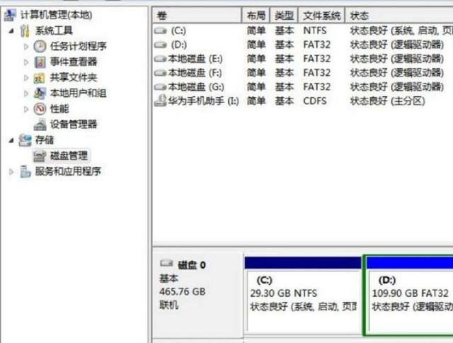


再点击“卷”，就可以看到此磁盘的基本信息了，这时我们就可以看到磁盘分区形式为gpt或MBR。


###### 方法二

1. 按下win+r打开运行，输入cmd打开命令提示符，输入bcdedit /enum {current}按回车执行；

2. 如果path路径是winload.efi ，则说明系统是通过UEFI模式启动。

   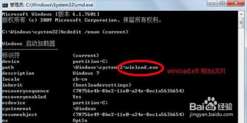


### AHCI模式

高级主机控制器接口（英文：Advanced Host Controller Interface，缩写：AHCI），是一种由英特尔制定的技术标准，它允许软件与SATA存储设备沟通的硬件机制，可让SATA存储设备激活高级SATA功能，例如原生指令队列及热插拔。AHCI详细定义一个存储器架构规范给予硬件制造商，规范如何在系统存储器与SATA存储设备间传输数据，目前（2014年3月）最新AHC

##### 开启

 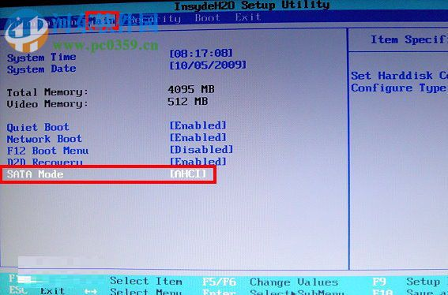 

##### 查询

 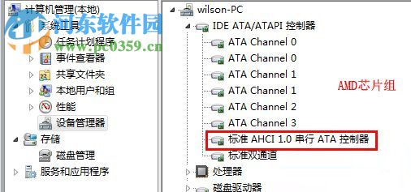 

 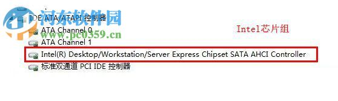 


# 声卡

### 音频输入设备

**什么是线路输入录音**

```
一般来说声卡有三个插孔：mic（麦克风）、line in（线路输入）、line out（线路输出）；

其中mic不用说了；

line in是用来将其他音频设备的输出线接入声卡的输入，例如通过音频线将录音机和声卡连结起来，将磁带的内容录制到电脑里，当然通过CD机录也是这个；

line out则是声音输出用的，常用的方法是直接接音箱或者耳机，也可以接其他的处理设备，如将电脑的音乐转录至磁带等；

软件里的CD唱机一般是指光驱，有些光驱有直接播放CD功能，通过音频线将光驱与声卡相连或者直接通过主板，实现录音功能。 
```


### Windows 10 如何将程序音频输出到特定的音频设备

如果你的电脑有多张声卡或多个音频输出设备，比如在电脑后面插个音响，前面插个耳机。某些情况下可能会有个需求，就是将特定程序的声音输出到特定的音频设备，比如想让游戏的声音或视频播放的声音单独输出到你的耳机或者你的另一个声卡，其他声音继续输出到默认音频设备。

要想实现这个功能，在 Windows 10 1803 之前需要借助第三方软件或者是某些程序（例如音乐播放器）内置的音频输出选项，对于那些没有内置音频输出选项的应用，用第三方软件可能会导致不稳定，而且必须一直在后台运行。

不过最新的 Windows 10 已经在系统层面加入了这个功能，好用、稳定、兼容 UWP 应用。

这篇教程小山就教大家如何使用这个功能，可能你觉得现在没用，但是后面我会出几篇跟这篇相关的教程。

小山推荐如果有内置音频输出选项的程序，还是用程序内置的音频选项，可以选择不同的音频 API，提供更好的性能，这个方法只适用于没有内置音频输出选项的程序，比如浏览器和 UWP 应用等。


------

这个功能使用起来十分简单

打开 【设置】 → 系统 → 声音 → 最底部的 [应用音量和设备首选项]

打开后可以看到当前有音频输出的所有程序，在它们后面分别有输出和输入的选项。如下图：


主音量的输出和输入是默认的播放设备和录音设备，如果要更改默认设备也可以在这里更改。

我想把网易云的声音单独输出到我的耳机，只需要把网易云后面的输出改为耳机就行了，当然，你需要知道耳机对应哪个输出设备。如果不需要让它输出到耳机，把输出选项改回为默认即可。

有些人可能会觉得，每次更改都需要点这么多次，太麻烦了，有没有更加便捷的方法。

当然有，小山找到了一个 UWP 应用，可以代替 Windows 自身的音量混合器，就是托盘哪里的音量图标，而且十分的好用。

这个应用叫做：EarTrumpet

下载地址：https://www.microsoft.com/store/productId/9NBLGGH516XP

打开后它会在托盘图标哪里出现一个和 Windows 默认一模一样的音量图标，如果有强迫症的话，可以把 Windows 默认图标给隐藏了。

隐藏方法：打开 【设置】 → 个性化 → 任务栏 → 打开或关闭系统图标

点击 EarTrumpet 的托盘图标，即可弹出默认音量混合器界面，可以调节主音量以及各个应用的音量，点击上方哪个小箭头即可弹出所有播放设备的音量混合器界面。

右键点击程序图标，点击右上角的切换按钮，即可切换程序的音频输出设备，是不是比上面的方便多了。

右键 EarTrumpet 的托盘图标即可切换系统默认的音频输出设备，还可以打开一个独立窗口的音量混合器以及打开系统的播放设备和录音设备等控制面板。


总而言之，这个应用用来控制系统声音是非常方便的，不需要再打开系统层层的设置面板了。

# 网络

### 修改网卡地址

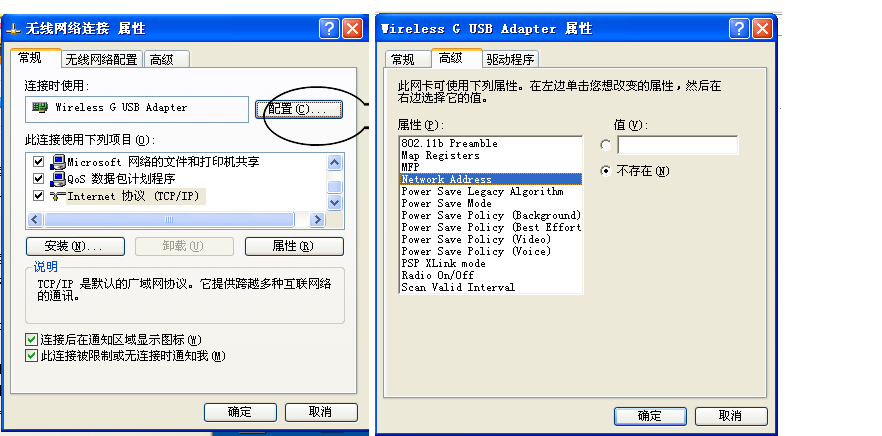

### win7-WiFi热点

1、以管理员身份运行命令提示符：
快捷键win+R→输入cmd→回车
2、启用并设定虚拟WiFi网卡：
运行命令：netsh wlan set hostednetwork mode=allow ssid=wuminPC key=wuminWiFi
此命令有三个参数，mode：是否启用虚拟WiFi网卡，改为disallow则为禁用。
         ssid：无线网名称，最好用英文(以wuminPC为例)。
         key：无线网密码，八个以上字符(以wuminWiFi为例)。

以上三个参数可以单独使用，例如只使用mode=disallow可以直接禁用虚拟Wifi网卡。


开启成功后，网络连接中会多出一个网卡为“Microsoft Virtual WiFi Miniport Adapter”的无线连接2，为方便起见，将其重命名为虚拟WiFi。若没有，只需更新无线网卡驱动就OK了。
3、设置Internet连接共享：
在“网络连接”窗口中，右键单击已连接到Internet的网络连接，选择“属性”→“共享”，勾上“允许其他······连接(N)”并选择“虚拟WiFi”。


4、开启无线网络：
继续在命令提示符中运行：netsh wlan start hostednetwork
（将start改为stop即可关闭该无线网，以后开机后要启用该无线网只需再次运行此命令即可）


5、至此，虚拟WiFi的红叉叉消失，WiFi基站已组建好，主机设置完毕。笔记本、带WiFi模块的手机等子机搜索到无线网络wuminPC，输入密码wuminWiFi，就能共享上网啦！


附：显示无线网络信息命令：netsh wlan show hostednetwork
  虚拟无线AP发射的WLAN是802.11g标准，带宽为54Mbps。

###  共享


# dos cli命令

```
\1.     磁盘检测 chkdsk /f d:

\2.     远程桌面 mstsc

\3.     立即关机shutdown -p

\4.     立即重启shutdown -r -t 00

\5.     进入休眠状态（若关闭休眠则进入待机状）态rundll32.exe powrProf.dll,SetSuspendState

\6.     Windows7关闭休眠功能：powercfg -h off

\7.     Windows7打开休眠功能：powercfg -h on

\8.     windos记住密码rundll32 netplwiz.dll,UsersRunDll
```

```
1.复制User目录到D盘：　robocopy “C:\Users” “D:\Users” /E /COPYALL /XJ
2.强制删除User目录：　rmdir “C:\Users” /S /Q
3.创建C盘下的User的软件链接，链接到D盘User目录：mklink /J "C:\Users" "D:\Users"
```

# 服务

不过是开机启动的cli命令,详情见 操作系统linuxt.md

# 系统

### Win7任务栏上的图标保存在哪个位置？

Win7任务栏上可以很方便的锁定程序图标，这样我们点击就可以打开，而不用去桌面上寻找了，那么有的朋友问了，当程序图标锁定到任务栏之后是保存到哪里的呢？下面小编教大家一个技巧来查看任务栏图标保存的位置。

1、首先按住“SHIFT”键，然后右键点击图标，然后选择 复制为路径 选项；

2、随便往什么地方粘贴，可以得到"C:\Users\你的用户名\AppData\Roaming\Microsoft\Internet Explorer\Quick Launch\User Pinned\TaskBar\Internet Explorer.lnk" 类似路径；

（注意，上面的你的用户名，改成你自己的）；

4、最后我们就找到任务栏上的图标保存文件夹了，大家可以对其中的图标（其实是快捷方式）进行操作了。

### 删除回收站图标

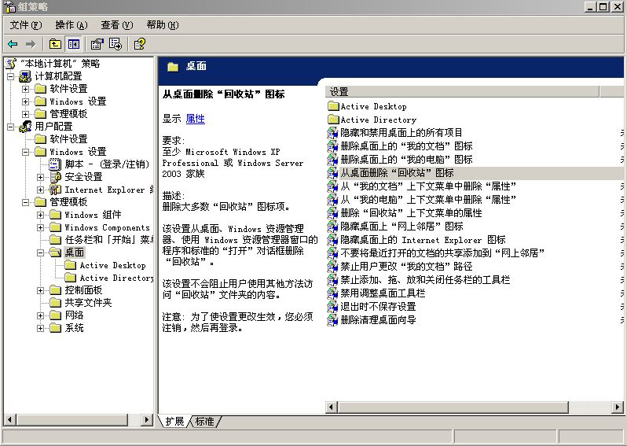

### 右键复制文件路径

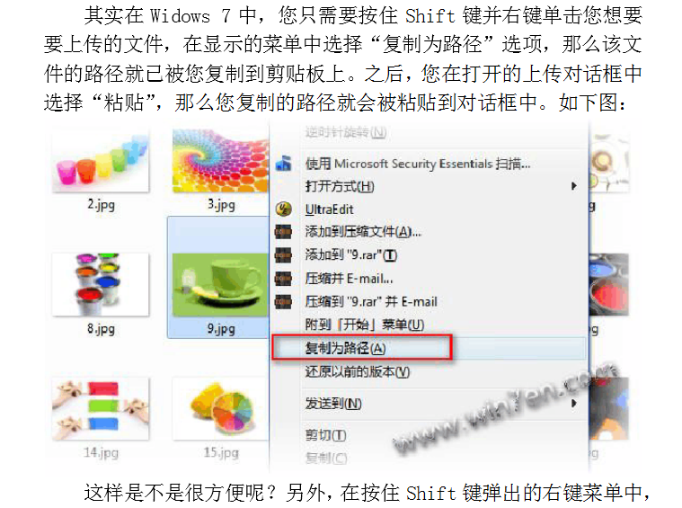


### windows 7-默认资源管理器

打开注册表，HKEY_CLASSES_ROOT\Folder\shell通过观察shell下的这几个项，发现都是右键点击文件夹时的菜单内容。既然这个注册表项跟文件夹弹出的右键菜单有关，那么修改里面的东西肯定能实现我要的功能。


 


点开open，opennewprocess，opennewwindow，里面的command键值都是一样的，那么我按照上述内容，将open下面的command键值修改为TC目录，删掉后面的DelegateExecute {11dbb47c-a525-400b-9e80-a54615a090c0}内容不就行了吗？立马试验，成功！修改后如下：


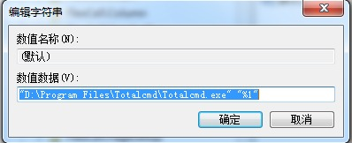


再发散：这样我就以后就只能用TC了吗？（当然只用TC没什么不好。）我如果要再用回资源管理器怎么办呢？聪明的你已经想到了吧。解决如下：

[HKEY_LOCAL_MACHINE\SOFTWARE\Classes\Folder\shell\下先建项，名称为openwithExplorer，键值为“资源管理器打开”，


再在openwithExplorer建项command，增添Execute，值为：{11dbb47c-a525-400b-9e80-a54615a090c0}，


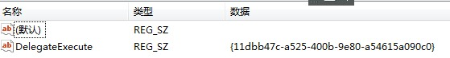


在TC中调用右键（如果右键选择NC模式时按徽标键与Ctrl之间的键）选择“资源管理器打开”即可继续使用资源管理器。


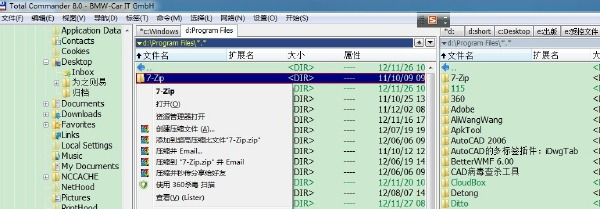

### 禁用程序


# 软件配置

### chrome

##### mht保存

快捷方式的目标位置`"C:\Program Files (x86)\Google\Chrome\Application\chrome.exe" --save-page-as-mhtml"`

