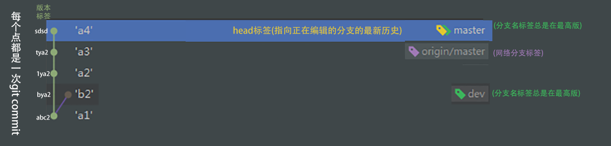
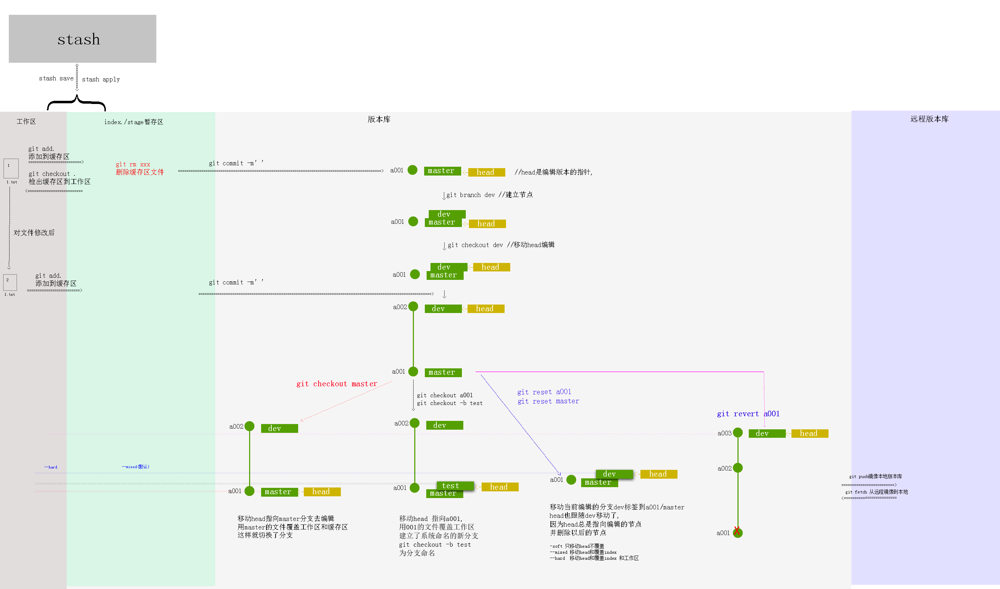

# 安装

### 在Linux上安装Git

首先，你可以试着输入`git`，看看系统有没有安装Git：

```
$ git
The program 'git' is currently not installed. You can install it by typing:
sudo apt-get install git
```

像上面的命令，有很多Linux会友好地告诉你Git没有安装，还会告诉你如何安装Git。

如果你碰巧用Debian或Ubuntu Linux，通过一条`sudo apt-get install git`就可以直接完成Git的安装，非常简单。

老一点的Debian或Ubuntu Linux，要把命令改为`sudo apt-get install git-core`，因为以前有个软件也叫GIT（GNU Interactive Tools），结果Git就只能叫`git-core`了。由于Git名气实在太大，后来就把GNU Interactive Tools改成`gnuit`，`git-core`正式改为`git`。

如果是其他Linux版本，可以直接通过源码安装。先从Git官网下载源码，然后解压，依次输入：`./config`，`make`，`sudo make install`这几个命令安装就好了。

###  Windows安装git

在Windows上使用Git，可以从Git官网直接[下载安装程序](https://git-scm.com/downloads)，（网速慢的同学请移步[国内镜像](https://pan.baidu.com/s/1kU5OCOB#list/path=%2Fpub%2Fgit)），然后按默认选项安装即可。


##### **1.在[git官网](https://link.jianshu.com/?t=https://git-scm.com/)下载对应版本的git 并按提示安装；**

安装完成后，在开始菜单里找到“Git”->“Git Bash”，蹦出一个类似命令行窗口的东西，就说明Git安装成功！

  

##### **2.安装成功后打开git Bash 设置用户名和邮箱**

```
  git config --global user.name "qingwabiaoge" 

  git config --global user.email "393502736@qq.com"
```

因为Git是分布式版本控制系统，所以，每个机器都必须自报家门：你的名字和Email地址。你也许会担心，如果有人故意冒充别人怎么办？这个不必担心，首先我们相信大家都是善良无知的群众，其次，真的有冒充的也是有办法可查的。

注意`git config`命令的`--global`参数，用了这个参数，表示你这台机器上所有的Git仓库都会使用这个配置，当然也可以对某个仓库指定不同的用户名和Email地址。

##### 3.生成SSH Key(类似git帐户密码生成token的工具,可以粘贴到github和码云使用)

  在git Bash 中输入ssh-keygen -t rsa -C " 393502736@qq.com"，连按三次enter键，会看到生成了 一个id_rsa.pub文件

> Your identification has been saved in /c/Administrator/asus/.ssh/id_rsa.
> Your public key has been saved in /c/Administrator/asus/.ssh/id_rsa.pub. 

##### **4.登录码云并添加密钥**

在提示的文件目录 `D:\Users\Administrator\.ssh\`下打开id_rsa.pub文件（或在git Bash中执行 cat id_rsa.pub命令）复制全部内容到[码云添加密钥](https://link.jianshu.com/?t=https://gitee.com/profile/sshkeys)，

##### 5.测试是否连接成功

git Bash中输入: ssh -T 393502736@qq.com， 返回 Welcome to Git@OSC, yourname!则成功


# 工作区、暂存区和版本库


* 工作区：即你的电脑里能看到的目录，平时开发代码的地方

* 暂存区：保存临时改动

* 版本库：

# 标签




# 整体图示




# git init

```
git init 初始化新项目
```

# git log

### 查看版本号

```
git log --oneline

git log --pretty=oneline


github上也可以找

webstorm versition log可以找

```

### 分支图打印


```
git log --graph --abbrev-commit --decorate --date=relative --all
```

### webstorm git log


# git logref

```javascript
git logref //拉取操作日志
```

# git add 

工作文件添加操作到缓存


```
git add .

git add 1.txt //添加特定文件
```

# git rm

删除缓存区文件


如果你想把一个文件从版本控制中移除，并且保留本地的文件，首先需要把这个文件加入到gitignore文件中。然后执行以下命令就可以了。
```
git rm  --cached file_path
```
以上命令将file_path所代表的文件从版本控制中删除，并保留本地文件，此外还要进行commit操作才能将服务器端的文件删掉。如果想把一个文件夹从版本控制中删除并保留本地的文件，只需在上述命令的基础上加上-r参数，即

```
git rm -r  --cached folder_path
```
如果想把所有gitignore中的文件从版本控制中删除的话，需要执行以下两个命令，即先移除所有文件，再执行添加所有文件（这次会忽略gitignore中的文件）。

```
git rm -r  --cached .
git add .
```


# git commit -m'' 

提交和设置标签名字

# git reset xxx 


### reset三种模式区别和使用场景

1. **--hard**：重置位置的同时，直接将 **working Tree工作目录**、 **index 暂存区**及 **repository** 都重置成目标**Reset**节点的內容,所以效果看起来等同于清空暂存区和工作区。
2. **--soft**：重置位置的同时，保留**working Tree工作目录**和**index暂存区**的内容，只让**repository**中的内容和 **reset** 目标节点保持一致，因此原节点和**reset**节点之间的【差异变更集】会放入**index暂存区**中(**Staged files**)。所以效果看起来就是工作目录的内容不变，暂存区原有的内容也不变，只是原节点和**Reset**节点之间的所有差异都会放到暂存区中。
3. **--mixed（默认）**：重置位置的同时，只保留**Working Tree工作目录**的內容，但会将 **Index暂存区** 和 **Repository** 中的內容更改和reset目标节点一致，因此原节点和**Reset**节点之间的【差异变更集】会放入**Working Tree工作目录**中。所以效果看起来就是原节点和**Reset**节点之间的所有差异都会放到工作目录中。

# git branch 

### git branch列出本地分支

```
git branch
```
### git branch -r 查看远程分支

```
git branch -r
```
### git branch -a 列出所有分支

```
git branch -a
```

### git branch dev创建并切换分支

```
$ git branch dev
```

###  git branch -m重命名分支

```
 git branch -m oldBranchName newBranchName
```

### git branch -d 删除分支

```
git branch -d dev
```

# git merge

### git merge dev合并dev分支到当前分支

```
git merge dev
```


# git checkout

### gitcheckout 用缓存区的文件覆盖工作区

```
gitcheckout
```

### git checkout dev 移动head到dev标签,用当前的head(dev)版本覆盖工作区

```
git checkout dev //移动head到dev标签,head移动到哪个节点就编辑哪个节点
```

### git checkout a1a1a1,head移动到任何一次提交,建立新分支,当前的head(temp branch name)覆盖到工作区,然后重命名为branchA

```
git checkout a1a1a1 //head移动到任何一次提交,不隐藏以后版本的提交,建立新分支!,
git checkout -b branchA //为分支命名 
```


# git revert


# git remote 

##### git remote add添加远程主机和主机名

```
git remote add origin git@github.com:qingwabiaoge/test.git

```

##### git remote -v 检查配置是否成功
```
git remote -v 
```

##### 修改远程主机和主机名

```

方法有三种：

1.修改命令

git remote origin set-url [url]

2.先删后加

git remote rm origin
git remote add origin [url]

3.直接修改config文件

```

# git push & git pull 

##### -u指定默认主机

```

//推送master到远程
//-u选项会指定一个默认主机

git push -u origin master

//推送dev分支到远程

git push  origin dev

```

##### 从默认远程分支主机的推送和拉取

```
git push

git pull
```

##### 推送的网络分支的指定主机

```
git push origin master

git pull origin  dev
```


##### git push -f 若当本地版本低于远程版本,想要本地版本覆盖远程版本 -f强制推入到远程

```
git push -f
```

##### git push origin --delete xxx 删除远程分支

```
git push origin --delete xxx
```
> 解决默认分支不可删除的情况


# git clone


### 克隆项目
```
git clone git@github.com:qingwabiaoge/test.git
```

### 看不到分支解决 

```
git checkout dev
```

# git diff

```
git diff  //比较工作区和缓存区的不同

git diff HEAD //比较工作区和HEAD

git diff origin/master 比较工作区和网络分支

git diff master dev 比较master和dev标签的节点内容

```

比较内容追加到文件


```
覆盖 git diff [branchA] [branchB] > a.txt
追加 git diff [branchA] [branchB] >> a.txt
git diff --color > foo.diff
foo.diff用notepad++/sublime 之类的编辑器打开，高亮颜色

```

webstorm比较

# .gitignore

忽略监听的文件

##### .gitignore规则不生效

.gitignore只能忽略那些原来没有被track的文件，如果某些文件已经被纳入了版本管理中，则修改.gitignore是无效的。

解决方法就是先把本地缓存删除（改变成未track状态），然后再提交:

```csharp
git rm -r --cached .
git add .
git commit -m 'update .gitignore'
```

# git config

命令别名

```
git config --global alias.xxx '开头省去 git xxx xxx xxx'
```

```
git config --global alias.lg " log --graph --abbrev-commit --decorate --date=relative --a
ll"
```


