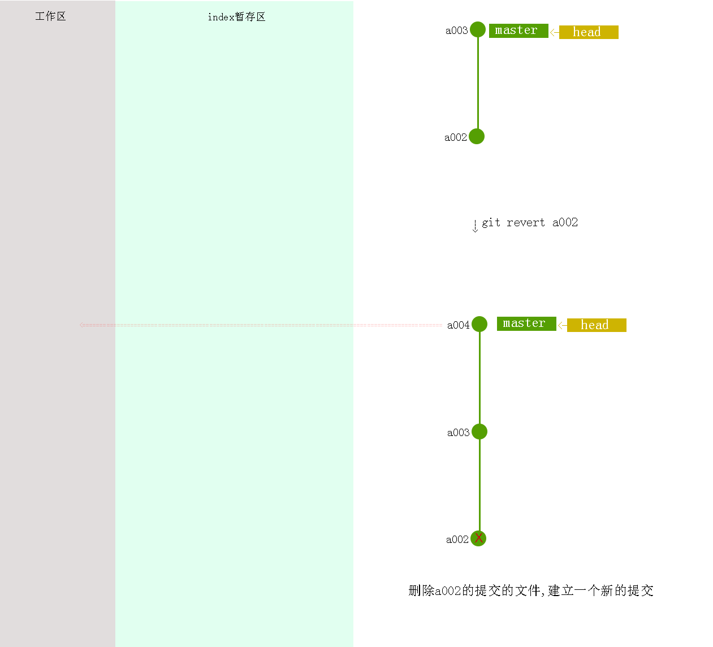

# 工作区、暂存区和版本库


* 工作区：即你的电脑里能看到的目录，平时开发代码的地方

* 暂存区：保存临时改动

* 版本库：

# 标签


# 版本操作


# git init

```
git init 初始化新项目
```

# git log

### 查看版本号

```
git log --oneline

git log --pretty=oneline


github上也可以找

webstorm versition log可以找

```

### 分支图打印


```
git log --graph --abbrev-commit --decorate --date=relative --all
```

### webstorm git log

# git logref

```javascript
git logref //拉取操作日志
```

# git add 

工作文件添加操作到缓存


```
git add .

git add 1.txt //添加特定文件
```

# git rm

删除缓存区文件


如果你想把一个文件从版本控制中移除，并且保留本地的文件，首先需要把这个文件加入到gitignore文件中。然后执行以下命令就可以了。
```
git rm  --cached file_path
```
以上命令将file_path所代表的文件从版本控制中删除，并保留本地文件，此外还要进行commit操作才能将服务器端的文件删掉。如果想把一个文件夹从版本控制中删除并保留本地的文件，只需在上述命令的基础上加上-r参数，即

```
git rm -r  --cached folder_path
```
如果想把所有gitignore中的文件从版本控制中删除的话，需要执行以下两个命令，即先移除所有文件，再执行添加所有文件（这次会忽略gitignore中的文件）。

```
git rm -r  --cached .
git add .
```


# git commit -m'' 

提交和设置标签名字

# git reset xxx 


### reset三种模式区别和使用场景

1. **--hard**：重置位置的同时，直接将 **working Tree工作目录**、 **index 暂存区**及 **repository** 都重置成目标**Reset**节点的內容,所以效果看起来等同于清空暂存区和工作区。
2. **--soft**：重置位置的同时，保留**working Tree工作目录**和**index暂存区**的内容，只让**repository**中的内容和 **reset** 目标节点保持一致，因此原节点和**reset**节点之间的【差异变更集】会放入**index暂存区**中(**Staged files**)。所以效果看起来就是工作目录的内容不变，暂存区原有的内容也不变，只是原节点和**Reset**节点之间的所有差异都会放到暂存区中。
3. **--mixed（默认）**：重置位置的同时，只保留**Working Tree工作目录**的內容，但会将 **Index暂存区** 和 **Repository** 中的內容更改和reset目标节点一致，因此原节点和**Reset**节点之间的【差异变更集】会放入**Working Tree工作目录**中。所以效果看起来就是原节点和**Reset**节点之间的所有差异都会放到工作目录中。

# git branch 

### 列出分支

本地分支

```
git branch
```
远程分支

```
git branch -r
```
所有分支

```
git branch -a
```

### 创建并切换分支

```
$ git branch dev
```

### 重命名分支

```
 git branch -m oldBranchName newBranchName
```

### 删除分支

```
git branch -d dev
```

### 合并dev分支到当前分支

```
git merge dev
```


# git checkout

### 移动head到dev标签

```
git checkout dev //移动head到dev标签,head移动到哪个节点就编辑哪个节点
```

### head移动到任何一次提交

```
git checkout a1a1a1 //head移动到任何一次提交,不隐藏以后版本的提交,建立新分支!,
git checkout -b branchA //为分支命名 
```

# git revert




# git remote 

##### 添加远程主机和主机名

```
git remote add origin git@github.com:qingwabiaoge/test.git

```

##### 检查配置是否成功
```
git remote -v 
```

##### 修改远程主机和主机名

```

方法有三种：

1.修改命令

git remote origin set-url [url]

2.先删后加

git remote rm origin
git remote add origin [url]

3.直接修改config文件

```

# git push & git pull 

##### 初次建立建立远程分支

```

//推送master到远程

git push -u origin master

//推送dev分支到远程

git push -u origin dev

```

##### 以后的推送和拉取

```
git pull

git push
```


##### 若当本地版本低于远程版本,想要本地版本覆盖远程版本 -f强制推入到远程

```
git push -f
```

##### 删除远程分支

```
git push origin --delete xxx
```
> 解决默认分支不可删除的情况


# git clone


### 克隆项目
```
git clone git@github.com:qingwabiaoge/test.git
```

### 看不到分支解决 

```
git checkout dev
```

# git diff

```
git diff  //比较工作区和缓存区的不同

git diff HEAD //比较工作区和HEAD

git diff origin/master 比较工作区和网络分支

git diff master dev 比较master和dev标签的节点内容

```

比较内容追加到文件


```
覆盖 git diff [branchA] [branchB] > a.txt
追加 git diff [branchA] [branchB] >> a.txt
git diff --color > foo.diff
foo.diff用notepad++/sublime 之类的编辑器打开，高亮颜色

```

webstorm比较

# .gitignore

忽略监听的文件

##### .gitignore规则不生效

.gitignore只能忽略那些原来没有被track的文件，如果某些文件已经被纳入了版本管理中，则修改.gitignore是无效的。

解决方法就是先把本地缓存删除（改变成未track状态），然后再提交:

```csharp
git rm -r --cached .
git add .
git commit -m 'update .gitignore'
```

# git config

命令别名

```
git config --global alias.xxx '开头省去 git xxx xxx xxx'
```

```
git config --global alias.lg " log --graph --abbrev-commit --decorate --date=relative --a
ll"
```


