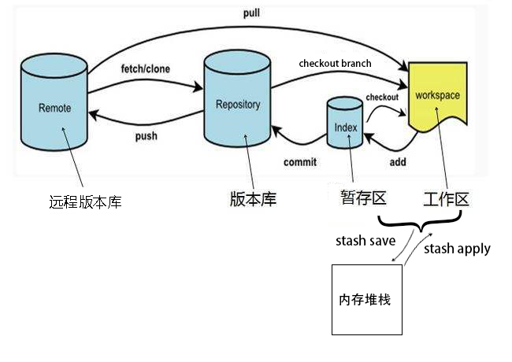

# 分布式版本控制系统

代表就是今天要说的GIT了。想知道GIT有多流行吗？看看GITHUB就知道了，现在很多公司都已经把自己的代码库迁移到了GIT。可见GIT在如今的流行程度，也说明分布式版本控制系统是如今的趋势。如下基本架构图：


关于分布式版本控制系统，这里只说优点：

- 适合多人团队协作开发；
- 代码集中化管理；
- 可以离线工作；
- 每个计算机都是一个完整仓库；

前面两点SVN也可以做到，说一下后两点。

可以离线工作，分布式版本管理系统每个计算机都有一个完整的仓库，可本地提交，可以做到离线工作。没有了SVN令人抓狂的断网无法工作问题;

每个计算机都是一个完整的仓库，也就没有了SVN的单点故障。

# GIT架构


  上图展示了git的整体架构，以及和各部分相关的主要命令。先说明下其中涉及的各部分。

  **工作区(working directory)，**简言之就是你工作的区域。对于git而言，就是的本地工作目录。工作区的内容会包含提交到暂存区和版本库(当前提交点)的内容，同时也包含自己的修改内容。

  **暂存区(stage area, 又称为索引区index)，**是git中一个非常重要的概念。是我们把修改提交版本库前的一个过渡阶段。查看GIT自带帮助手册的时候，通常以index来表示暂存区。在工作目录下有一个.git的目录，里面有个index文件，存储着关于暂存区的内容。git add命令将工作区内容添加到暂存区。

  **本地仓库(local repository)，**版本控制系统的仓库，存在于本地。当执行git commit命令后，会将暂存区内容提交到仓库之中。在工作区下面有.git的目录，这个目录下的内容不属于工作区，里面便是仓库的数据信息，暂存区相关内容也在其中。

  **远程版本库(remote repository)，**与本地仓库概念基本一致，不同之处在于一个存在远程，可用于远程协作，一个却是存在于本地。通过push/pull可实现本地与远程的交互；

**远程仓库副本，**可以理解为存在于本地的远程仓库缓存。如需更新，可通过git fetch/pull命令获取远程仓库内容。使用fech获取时，并未合并到本地仓库，此时可使用git merge实现远程仓库副本与本地仓库的合并。git pull =git fetch + git merge 或git pull --rebase= git fetch + git rebase。


# GIT文件一览

看看.git这个目录的下文件结构，如下图：


简要说明一下各个文件中所存放的内容信息：

**HEAD，**当前所在位置，其实就是工作区的在版本库中的那个提交点，最终会指向一个40位的HASH值；

**config，**当前版本库的专有配置文件，如使用命令git config user.name poloxue便会记录在此文件；

**description，**被gitweb (Github的原型)用来显示对repo的描述。

**hooks，**git有可自动运行在 git 任有意义阶段的脚本hooks, 如commit/release/pull/push等状态之前或者之后。个人思考的一个用处，如pre-push可以用来强制进行代码检查。

**index，**存放暂存区(stage area)的相关信息；

**info/exclue，**可以做到和.gitignore相同的事情，用于排除不要包含进版本库的文件。区别就是，此文件不会被共享。

**refs/heads，**目录下有关于本地仓库的所有分支；

**refs/remote，**目录下有关于远程仓库的所有分支；

**object，**目录下存放的就是实际的数据文件，关于其中的存放方式暂时还不了解，有兴趣可以研究一下；

本节从版本控制引出分布式版本控制，比较分布式版本控制系统与其他版本控制系统的区别，从而引入GIT。与SVN的比较明显可看出GIT的优秀之处。对GIT的架构也进行整体简单介绍。内容比较理论，期望在理清自己思路的同时，不会误导他人。

# 操作图示

 


# 安装git

### 在Linux上安装Git

首先，你可以试着输入`git`，看看系统有没有安装Git：

```
$ git
The program 'git' is currently not installed. You can install it by typing:
sudo apt-get install git
```

像上面的命令，有很多Linux会友好地告诉你Git没有安装，还会告诉你如何安装Git。

如果你碰巧用Debian或Ubuntu Linux，通过一条`sudo apt-get install git`就可以直接完成Git的安装，非常简单。

老一点的Debian或Ubuntu Linux，要把命令改为`sudo apt-get install git-core`，因为以前有个软件也叫GIT（GNU Interactive Tools），结果Git就只能叫`git-core`了。由于Git名气实在太大，后来就把GNU Interactive Tools改成`gnuit`，`git-core`正式改为`git`。

如果是其他Linux版本，可以直接通过源码安装。先从Git官网下载源码，然后解压，依次输入：`./config`，`make`，`sudo make install`这几个命令安装就好了。

###  Windows安装git

在Windows上使用Git，可以从Git官网直接[下载安装程序](https://git-scm.com/downloads)，（网速慢的同学请移步[国内镜像](https://pan.baidu.com/s/1kU5OCOB#list/path=%2Fpub%2Fgit)），然后按默认选项安装即可。

# 配置git

##### **1.在[git官网](https://link.jianshu.com/?t=https://git-scm.com/)下载对应版本的git 并按提示安装；**

安装完成后，在开始菜单里找到“Git”->“Git Bash”，蹦出一个类似命令行窗口的东西，就说明Git安装成功！

 

##### **2.安装成功后打开git Bash 设置用户名和邮箱**

```
  git config --global user.name "qingwabiaoge"

  git config --global user.email "393502736@qq.com"
```

因为Git是分布式版本控制系统，所以，每个机器都必须自报家门：你的名字和Email地址。你也许会担心，如果有人故意冒充别人怎么办？这个不必担心，首先我们相信大家都是善良无知的群众，其次，真的有冒充的也是有办法可查的。

注意`git config`命令的`--global`参数，用了这个参数，表示你这台机器上==所有的Git仓库都会使用这个配置==，当然也可以对某个仓库指定不同的用户名和Email地址。

##### 3.生成SSH Key(token)

  在git Bash 中输入ssh-keygen -t rsa -C " 393502736@qq.com"，连按三次enter键，会看到生成了 一个id_rsa.pub文件,git bash返回信息

 ```
 Your identification has been saved in /c/Administrator/asus/.ssh/id_rsa.
 Your public key has been saved in /c/Administrator/asus/.ssh/id_rsa.pub.
 ```

##### **4.登录码云并添加密钥**

在提示的文件目录 `c:\Users\Administrator\.ssh\`下打开id_rsa.pub文件（或在git Bash中执行 cat id_rsa.pub命令）复制全部内容到github或者[码云添加密钥](https://link.jianshu.com/?t=https://gitee.com/profile/sshkeys)，

##### 5.测试ssh是否连接github成功

git Bash中输入:`ssh -T git@github.com `(此处不是邮箱)， 返回 Welcome to Git@OSC, yourname!则成功

##### 6. 添加环境变量(window自动添加)

$  git --exec-path

C:/Program Files/Git/mingw64/libexec/git-core


# 版本标签


### head标签

指向正在编辑的分支的最新历史

移动head时间覆盖工作区和暂存区


# git init

```
git init 初始化新项目
```

# git clone/git fetch/git pull

**区别**

|                      | git clone                                                    | git fetch                                                    | git pull                                                     | git pull --rebase                                            |
| -------------------- | ------------------------------------------------------------ | ------------------------------------------------------------ | ------------------------------------------------------------ | ------------------------------------------------------------ |
| 是否需要git init     | 不需要                                                       | 需要                                                         | 需要                                                         | 需要                                                         |
| 是否携带远程主机信息 | √                                                            | x                                                            | x                                                            |                                                              |
| 作用                 | git clone 是将其他仓库克隆到本地，包括被 clone 仓库的版本变化，因此本地无需是一个仓库，且克隆将设置额外的远程跟踪分支。 | `git fetch`是将远程主机的最新内容拉到本地，用户在检查了以后决定是否合并到工作本机分支中。 | 而`git pull` 则是将远程主机的最新内容拉下来后直接合并，即：`git pull = git fetch + git merge`，这样可能会产生冲突，需要手动解决。 | `git pull --rebase=git fetch origin+git rebase origin/master` |


### git clone克隆项目

git clone 是将其他仓库克隆到本地，包括被 clone 仓库的版本变化，因此本地无需是一个仓库，且克隆将设置额外的远程跟踪分支。因为是克隆来的，所以 .git 文件夹里存放着与远程仓库一模一样的版本库记录，clone 操作是一个从无到有的克隆操作。

先github建立一个项目,会在远程仓库自动建一个分支mater ,web操作提交了一次版本


基本用法：

```
$ git clone <版本库的URL> [本地目录名]
```

如果不指定本地目录，则会在本地生成一个远程仓库同名的目录。

看不到分支解决

```
git checkout dev
```

git克隆项目到一个非空目录

1. 进入非空目录，假设是 /workdir/proj1

2. git clone --no-checkout https://git.oschina.net/NextApp/platform.git tmp

3. mv tmp/.git .  #将 tmp 目录下的 .git 目录移到当前目录

4. rmdir tmp

5. git reset --hard HEAD

### git pull

git pull 是拉取远程分支更新到本地仓库再与本地分支进行合并，即：git pull = git fetch + git merge

基本用法：

```
$ git pull <远程主机名> [远程分支名]:[本地分支名]
```

如果不指定远程分支名和本地分支名，则会将远程 master 分支拉取下来和本地的当前分支合并。

##### 语法

git pull的作用是从一个仓库或者本地的分支拉取并且整合代码。

```
git pull [<options>] [<repository> [<refspec>…]]
```

```
git pull gitee master
```

##### 描述

`git pull`相当于 `git fetch` +`git merge FETCH_HEAD`。``是仓库的名字，`` 是分支的名字。如果都不写，会有一个默认值。

一个例子：

```
     A---B---C master on origin
    /
D---E---F---G master
    ^
    origin/master in your repository
```

远程的`master`分支到了`C`，本地的开发到了`G`。

```
     A---B---C origin/master
    /         \
D---E---F---G---H master
```

`git pull`之后会生成一个新的`H`，合并两个分支。

如果发生了冲突，可以使用`git reset --merge`进行回退。

##### options（选项）

下面摘录几个常用的选项。

> –allow-unrelated-histories
> By default, git merge command refuses to merge histories that do not share a common ancestor. This option can be used to override this safety when merging histories of two projects that started their lives independently. As that is a very rare
> occasion, no configuration variable to enable this by default exists and will not be added.

允许无关的历史，这个选项，更多是在更改远程仓库的时候用到。

> –ff
> When the merge resolves as a fast-forward, only update the branch pointer, without creating a merge commit. This is the default behavior.
>
> –no-ff
> Create a merge commit even when the merge resolves as a fast-forward. This is the default behaviour when merging an annotated (and possibly signed) tag that is not stored in its natural place in refs/tags/ hierarchy.
>
> –ff-only
> Refuse to merge and exit with a non-zero status unless the current HEAD is already up to date or the merge can be resolved as a fast-forward.

`ff`选项，这几个选项是说合并时是否开启`fast-forward`，快速合并，这个有在[另外一篇帖子](https://www.oxysun.cn/git/git-git-merge-ff-no-ff.html)中详细讲解，这里就不赘述了。

按照`git branch` 设置的默认跟踪的服务器和分支来拉取。

```
git pull
```

 拉取远程服务器`origin`的`master`分支

```
git pull origin master
```

### git fetch

`git fetch`是将远程主机的最新内容拉到本地，用户在检查了以后决定是否合并到工作本机分支中

git fetch 并没更改本地仓库的代码，只是拉取了远程 commit 数据，将远程仓库的 commit id 更新为latest。

具体的行为你可以尝试看看.git文件夹：./git/refs 里面有三个文件夹：heads、remotes、tags。
heads 和 remotes 分别记录的就是本地和远程不同仓库的最新 commit id


fetch 改变的是 remotes 里面相应分支的 commit id。


理解 fetch 的关键, 是理解 FETCH_HEAD，FETCH_HEAD 指的是：某个 branch 在服务器上的最新状态。这个列表保存在 .git/FETCH_HEAD 文件中，其中每一行对应于远程服务器的一个分支。
当前分支指向的 FETCH_HEAD，就是这个文件第一行对应的那个分支。一般来说，存在两种情况：

- 如果没有显式的指定远程分支，则远程分支的 master 将作为默认的 FETCH_HEAD
- 如果指定了远程分支，就将这个远程分支作为 FETCH_HEAD

git fetch 更新本地仓库的两种用法：

```
# 方法一
$ git fetch origin master                #从远程的origin仓库的master分支下载代码到本地的origin master
$ git log -p master.. origin/master      #比较本地的仓库和远程参考的区别
$ git merge origin/master                #把远程下载下来的代码合并到本地仓库，远程的和本地的合并
# 方法二
$ git fetch origin master:temp           #从远程的origin仓库的master分支下载到本地并新建一个分支temp
$ git diff temp                          #比较master分支和temp分支的不同
$ git merge temp                         #合并temp分支到master分支
$ git branch -d temp                     #删除temp
```


# git log

### 查看版本号

```
git log --oneline

git log --pretty=oneline


github上也可以找

webstorm versition log可以找

```

### 分支图打印


```
git log --graph --abbrev-commit --decorate --date=relative --all
```

### webstorm git log


# git logref

```javascript
git logref //拉取操作日志
```

#  git status

`git status`命令用于显示工作目录和暂存区的状态。使用此命令能看到那些修改被暂存到了, 哪些没有, 哪些文件没有被Git tracked到。`git status`不显示已经`commit`到项目历史中去的信息。看项目历史的信息要使用`git log`.

**简介**

```shell
git status [<options>…] [--] [<pathspec>…]
Shell
```

## 描述

显示索引文件和当前HEAD提交之间的差异，在工作树和索引文件之间有差异的路径以及工作树中没有被Git跟踪的路径。 第一个是通过运行`git commit`来提交的; 第二个和第三个是你可以通过在运行`git commit`之前运行`git add`来提交的。

`git status`相对来说是一个简单的命令，它简单的展示状态信息。输出的内容分为3个分类/组。

```shell
# On branch master
# Changes to be committed:  (已经在stage区, 等待添加到HEAD中的文件)
# (use "git reset HEAD <file>..." to unstage)
#
#modified: hello.py
#
# Changes not staged for commit: (有修改, 但是没有被添加到stage区的文件)
# (use "git add <file>..." to update what will be committed)
# (use "git checkout -- <file>..." to discard changes in working directory)
#
#modified: main.py
#
# Untracked files:(没有tracked过的文件, 即从没有add过的文件)
# (use "git add <file>..." to include in what will be committed)
#
#hello.pyc
Shell
```

### 忽略文件(untracked文件)

没有`tracked`的文件分为两类. 一是已经被放在工作目录下但是还没有执行 `git add` 的, 另一类是一些编译了的程序文件(如`.pyc`, `.obj`, `.exe`等)。当这些不想add的文件一多起来, `git status`的输出简直没法看, 一大堆的状态信息怎么看?

基于这个原因。 Git让我们能在一个特殊的文件`.gitignore`中把要忽略的文件放在其中， 每一个想忽略的文件应该独占一行, `*`这个符号可以作为通配符使用。例如在项目根目录下的`.gitignore`文件中加入下面内容能阻止`.pyc`和`.tmp`文件出现在`git status`中:

```shell
*.pyc
*.tmp
Shell
```

## 示例

以下是一些示例 -

在每次执行 `git commit`之前先使用`git status`检查文件状态是一个很好的习惯, 这样能防止你不小心提交了您不想提交的东西。 下面的例子展示 stage 前后的状态, 并最后提交一个快照.

```shell
# Edit hello.py
$ git status
# hello.py is listed under "Changes not staged for commit"
$ git add hello.py
$ git status
# hello.py is listed under "Changes to be committed"
$ git commit
$ git status
# nothing to commit (working directory clean)
Shell
```

第一个状态输出显示了这个文件没有被放到暂存区(staged)。`git add`将影响第二个`git status`的输出, 最后一个`git status`告诉我们没有什么能可以提交了，工作目录已经和最近的提交相匹配了。有些命令 (如, `git merge`) 要求工作目录是`clean`状态, 这样就不会不小心覆盖更新了。

`git status`命令可以列出当前目录所有还没有被git管理的文件和被git管理且被修改但还未提交(`git commit`)的文件。下面来看看如下一个示例 -

```shell
$ git status
# On branch master
# Changes to be committed:
#   (use "git reset HEAD <file>..." to unstage)
#
#       modified:   2.txt
#
# Changes not staged for commit:
#   (use "git add <file>..." to update what will be committed)
#   (use "git checkout -- <file>..." to discard changes in working directory)
#
#       modified:   1.txt
#
# Untracked files:
#   (use "git add <file>..." to include in what will be committed)
#
#       1.log
Shell
```

上面输出结果中”*Changes to be committed*“中所列的内容是在索引中的内容，提交之后进入Git工作目录。
上面输出结果中“*Changed but not updated*”中所列的内容是在工作目录中的内容，`git add`之后将添加进入索引。
上面输出结果中“*Untracked files*”中所列的内容是尚未被Git跟踪的内容，`git add`之后进入添加进入索引。
通过`git status -uno`可以只列出所有已经被git管理的且被修改但没提交的文件。


# git diff

```
git diff  //比较工作区和缓存区的不同

git diff HEAD //比较工作区和HEAD

git diff origin/master 比较工作区和网络分支

git diff master dev 比较master和dev标签的节点内容

```

比较内容追加到文件


```
覆盖 git diff [branchA] [branchB] > a.txt
追加 git diff [branchA] [branchB] >> a.txt
git diff --color > foo.diff
foo.diff用notepad++/sublime 之类的编辑器打开，高亮颜色

```

webstorm比较


# git add

工作文件添加操作到缓存


```
git add .

git add 1.txt //添加特定文件
```

# git rm

**简介**

```shell
git rm [-f | --force] [-n] [-r] [--cached] [--ignore-unmatch] [--quiet] [--] <file>…
Shell
```

## 描述

从索引中删除文件，或从工作树和索引中删除文件。 `git rm`不会从您的工作目录中删除文件。 (没有任何选项只能从工作树中删除文件，并将其保留在索引中;)要删除的文件必须与分支的提示相同，并且在索引中不能对其内容进行更新，尽管可以使用`-f`选项覆盖(默认行为)。 当给出`--cached`时，暂存区内容必须与分支的提示或磁盘上的文件相匹配，从而仅将文件从索引中删除。

使用 `git rm` 来删除文件，同时还会将这个删除操作记录下来；而使用 `rm` 来删除文件，仅仅是删除了物理文件，没有将其从 `git` 的记录中剔除。

直观的来讲，`git rm` 删除过的文件，执行 `git commit -m "commit message or mark"` 提交时，会自动将删除该文件的操作提交上去。

而对于用 `rm` 命令直接删除的文件，执行 `git commit -m "commit message or mark"`提交时，则不会将删除该文件的操作提交上去。不过不要紧，即使你已经通过 `rm` 将某个文件删除掉了，也可以再通过 `git rm` 命令重新将该文件从 git 的记录中删除掉，
这样的话，在执行 `git commit -m "commit message or mark"` 以后，也能将这个删除操作提交上去。

如果之前不小心用 `rm` 命令删除了一大批文件呢？如此时用 `git rm` 逐个地再删除一次就显得相当卵痛了。可如下的方式做提交： `git commit -am "commit message or mark"`

## 示例

以下是一些示例 -

在git中我们可以通过`git rm`命令把一个文件删除，并把它从git的仓库管理系统中移除。但是注意最后要执行`git commit`才真正提交到git仓库。

**示例1**

删除`text1.txt`文件，并把它从git的仓库管理系统中移除。

```shell
git rm text1.txt
Shell
```

**示例2**

删除文件夹：`mydir`，并把它从git的仓库管理系统中移除。

```shell
git rm -r mydir
Shell
```

**示例3**

```shell
 git add 10.txt
$ git add -i
           staged     unstaged path
  1:        +0/-0      nothing 10.txt
  2:        +0/-0      nothing branch/t.txt
  3:        +0/-0      nothing branch/t2.txt

*** Commands ***
  1: [s]tatus     2: [u]pdate     3: [r]evert     4: [a]dd untracked
  5: [p]atch      6: [d]iff       7: [q]uit       8: [h]elp
What now> 7
Bye.
$ git rm --cached 10.txt
rm '10.txt'
$ ls
10.txt  2  3.txt  5.txt  readme.txt
$ git add -i
           staged     unstaged path
  1:        +0/-0      nothing branch/t.txt
  2:        +0/-0      nothing branch/t2.txt
*** Commands ***
  1: [s]tatus     2: [u]pdate     3: [r]evert     4: [a]dd untracked
  5: [p]atch      6: [d]iff       7: [q]uit       8: [h]elp//原文出自【易百教程】，商业转载请联系作者获得授权，非商业请保留原文链接：https://www.yiibai.com/git/git_rm.html


```

在通过 `git add 10.txt` 命令把文件`10.txt`添加到索引库中后，又通过 `git rm --cached 10.txt` 把文件`10.txt`从git的索引库中移除,但是对文件`10.txt`本身并不进行任何操作。

另外对于已经被`git rm`删除掉(还没被提交)的文件或目录，如果想取消其操作的话，可以首先通过`git add -i`的子命令`revert`从索引库中把它们剔除，然后用`git checkout <文件>` 命令来达到取消的目。

**示例4**

```shell
$ git rm Documentation/\*.txt
Shell
```

从`Documentation`目录及其任何子目录下的索引中删除所有`.txt`文件。

**示例5**

```shell
git rm -f git-*.sh
Shell
```

因为这个例子让shell扩展星号(即显式列出文件)，它不会删除子目录中的文件，如：`subdir/git-foo.sh`文件不会被删除。

​			

删除缓存区文件


如果你想把一个文件从版本控制中移除，并且保留本地的文件，首先需要把这个文件加入到gitignore文件中。然后执行以下命令就可以了。
```
git rm  --cached file_path
```
以上命令将file_path所代表的文件从版本控制中删除，并保留本地文件，此外还要进行commit操作才能将服务器端的文件删掉。如果想把一个文件夹从版本控制中删除并保留本地的文件，只需在上述命令的基础上加上-r参数，即

```
git rm -r  --cached folder_path
```
如果想把所有gitignore中的文件从版本控制中删除的话，需要执行以下两个命令，即先移除所有文件，再执行添加所有文件（这次会忽略gitignore中的文件）。

```
git rm -r  --cached .
git add .
```

# git mv

移动文件

不像其它的 VCS 系统，Git 并不显式跟踪文件移动操作。 如果在 Git 中重命名了某个文件，仓库中存储的元数据并不会体现出这是一次改名操作。 不过 Git 非常聪明，它会推断出究竟发生了什么，至于具体是如何做到的，我们稍后再谈。

既然如此，当你看到 Git 的 `mv` 命令时一定会困惑不已。 要在 Git 中对文件改名，可以这么做：

```console
$ git mv file_from file_to
```

它会恰如预期般正常工作。 实际上，即便此时查看状态信息，也会明白无误地看到关于重命名操作的说明：

```console
$ git mv README.md README
$ git status
On branch master
Changes to be committed:
  (use "git reset HEAD <file>..." to unstage)

    renamed:    README.md -> README
```

其实，运行 `git mv` 就相当于运行了下面三条命令：

```console
$ mv README.md README
$ git rm README.md
$ git add README
```

如此分开操作，Git 也会意识到这是一次改名，所以不管何种方式结果都一样。 两者唯一的区别是，`mv` 是一条命令而另一种方式需要三条命令，直接用 `git mv` 轻便得多。 不过有时候用其他工具批处理改名的话，要记得在提交前删除老的文件名，再添加新的文件名。

# git stash

### 应用场景：

1. 当你想切换分支时,但工作区和暂存区已经修改过了，如果你想切换分支，那么很遗憾，`git`会报错。这时候`git stash` 命令就派上用场了。这个命令可以保存工作区的修改。然后你就可以切换分支了。

### 命令详解：

#### 1 git stash

能够将所有未提交的修改（工作区==track过==的文件和暂存区）保存至堆栈中，用于后续恢复当前工作目录。

```
$ git status
On branch master
Changes not staged for commit:
  (use "git add <file>..." to update what will be committed)
  (use "git checkout -- <file>..." to discard changes in working directory)

        modified:   src/main/java/com/wy/CacheTest.java
        modified:   src/main/java/com/wy/StringTest.java

no changes added to commit (use "git add" and/or "git commit -a")

$ git stash
Saved working directory and index state WIP on master: b2f489c second

$ git status
On branch master
nothing to commit, working tree clean1234567891011121314151617
```

#### 2 git stash save

作用等同于git stash，区别是可以加一些注释，如下：
git stash的效果：

```
stash@{0}: WIP on master: b2f489c second1
```

git stash save “test1”的效果：

```
stash@{0}: On master: test11
```

#### 3 git stash list

查看当前stash中的内容

#### 4 git stash pop

将当前stash中的内容弹出，并应用到当前分支对应的工作目录上。
注：该命令将堆栈中最近保存的内容删除（栈是先进后出）
顺序执行git stash save “test1”和git stash save “test2”命令，效果如下：

```
$ git stash list
stash@{0}: On master: test2
stash@{1}: On master: test1

$ git stash pop
On branch master
Changes not staged for commit:
  (use "git add <file>..." to update what will be committed)
  (use "git checkout -- <file>..." to discard changes in working directory)

        modified:   src/main/java/com/wy/StringTest.java

no changes added to commit (use "git add" and/or "git commit -a")
Dropped refs/stash@{0} (afc530377eacd4e80552d7ab1dad7234edf0145d)

$ git stash list
stash@{0}: On master: test11234567891011121314151617
```

可见，test2的stash是首先pop出来的。
如果从stash中恢复的内容和当前目录中的内容发生了冲突，也就是说，恢复的内容和当前目录修改了同一行的数据，那么会提示报错，需要解决冲突，可以通过创建新的分支来解决冲突。

#### 5 git stash apply

将堆栈中的内容应用到当前目录，不同于git stash pop，该命令不会将内容从堆栈中删除，也就说该命令能够将堆栈的内容多次应用到工作目录中，适应于多个分支的情况。

```
$ git stash apply
On branch master
Changes not staged for commit:
  (use "git add <file>..." to update what will be committed)
  (use "git checkout -- <file>..." to discard changes in working directory)

        modified:   src/main/java/com/wy/StringTest.java

no changes added to commit (use "git add" and/or "git commit -a")

$ git stash list
stash@{0}: On master: test2
stash@{1}: On master: test112345678910111213
```

堆栈中的内容并没有删除。
可以使用git stash apply + stash名字（如stash@{1}）指定恢复哪个stash到当前的工作目录。

#### 6 git stash drop + 名称

从堆栈中移除某个指定的stash

#### 7 git stash clear

清除堆栈中的所有 内容

#### 8 git stash show

查看堆栈中最新保存的stash和当前目录的差异。

```
$ git stash show
 src/main/java/com/wy/StringTest.java | 2 +-
 1 file changed, 1 insertion(+), 1 deletion(-)123
```

git stash show stash@{1}查看指定的stash和当前目录差异。
通过 git stash show -p 查看详细的不同：

```
$ git stash show -p
diff --git a/src/main/java/com/wy/CacheTest.java b/src/main/java/com/wy/CacheTest.java
index 6e90837..de0e47b 100644
--- a/src/main/java/com/wy/CacheTest.java
+++ b/src/main/java/com/wy/CacheTest.java
@@ -7,6 +7,6 @@ package com.wy;
  */
 public class CacheTest {
     public static void main(String[] args) {
-        System.out.println("git stash test");
+        System.out.println("git stash test1");
     }
 }
diff --git a/src/main/java/com/wy/StringTest.java b/src/main/java/com/wy/StringTest.java
index a7e146c..711d63f 100644
--- a/src/main/java/com/wy/StringTest.java
+++ b/src/main/java/com/wy/StringTest.java
@@ -12,7 +12,7 @@ public class StringTest {

     @Test
     public void test1() {
-        System.out.println("=================");
+        System.out.println("git stash test1");
         System.out.println(Strings.isNullOrEmpty(""));//true
         System.out.println(Strings.isNullOrEmpty(" "));//false
         System.out.println(Strings.nullToEmpty(null));//""1234567891011121314151617181920212223242526
```

同样，通过git stash show stash@{1} -p查看指定的stash的差异内容。

#### 9 git stash branch

从最新的stash创建分支。
应用场景：当储藏了部分工作，暂时不去理会，继续在当前分支进行开发，后续想将stash中的内容恢复到当前工作目录时，如果是针对同一个文件的修改（即便不是同行数据），那么可能会发生冲突，恢复失败，这里通过创建新的分支来解决。可以用于解决stash中的内容和当前目录的内容发生冲突的情景。
发生冲突时，需手动解决冲突

# git commit -m''

提交和设置标签名字

# git reset xxx

见上图

# git branch /git merge 分支建立和合并

**分支的概念**


分支是用来标记特定代码的提交，每一个分支通过SHA1sum值来标识，所以对分支的操作是轻量级的，你改变的仅仅是SHA1sum值。

如下图所示，当前有2个分支，A,C,E属于master分支，而A,B，D,F属于dev分支。

```
A----C----E（master）
 \
  B---D---F(dev)
```

- 1
- 2
- 3

它们的head指针分别指向E和F，对上述做如下操作：

```
git checkout master  //选择or切换到master分支
git merge dev        //将dev分支合并到当前分支(master)中
```

- 1
- 2

合并完成后：

```
A---C---E---G(master)
 \         /
  B---D---F（dev）
```

- 1
- 2
- 3

现在ABCDEFG属于master，G是一次合并后的结果，是将E和Ｆ的代码合并后的结果，可能会出现冲突。而ABDF依然属于dev分支。可以继续在dev的分支上进行开发:

```
A---C---E---G---H(master)
 \         /
  B---D---F---I（dev）
```

- 1
- 2
- 3
- 4

分支（branch）的基本操作：

```
git branch //查看本地所有分支

git branch -r //查看远程所有分支

git branch -a //查看本地和远程的所有分支

git branch <branchname> //新建分支

git branch -d <branchname> //删除本地分支

git branch -d -r <branchname> //删除远程分支，删除后还需推送到服务器
git push origin:<branchname>  //删除后推送至服务器

git branch -m <oldbranch> <newbranch> //重命名本地分支
/**
*重命名远程分支：
*1、删除远程待修改分支
*2、push本地新分支到远程服务器
*/

//git中一些选项解释:

-d
--delete：删除

-D
--delete --force的快捷键

-f
--force：强制

-m
--move：移动或重命名

-M
--move --force的快捷键

-r
--remote：远程

-a
--all：所有
```

# get rebash

关于Git 我们之前有很多文章介绍过相关的功能和扩展应用。我也介绍过如何在Git中自由穿梭重置redo。当然有的时候我们需要改变Git的提交历史。Git也提交很多工具，本文虫虫带领大家来实例深入学习其中的一个工具rebase。


**准备**

为了不破坏现有的仓库，我们首先创建一个新建一个实验repo，所有操作都在该仓库下操作。创建命令如下：

mkdir rebase-repo

cd rebase-repo

git init rebase-repo

git commit --allow-empty -m "init"

注意我们给git commit -m "init"，增加了一个参数"--allow-empt"，否则如果是一个空库的时候会报错,如下


通过实验环境rebas-rep仓库，任何时候出现问题搞不定了，只需删除掉rm -rf rebase-repo/.git目录并重新运行这些命令就可以初始化整个实验环境。

**git pull --rebase**

如果远程git服务器仓库分支已经有了更新上，通常git pull时候将会默认执行merge合并提交。相当于执行两个操作：

git fetch origin

git merge origin/master

实际上除了合并外还有一种方法，那就是执行rebase来同步变化，它通常更有用，git提交历史也更清晰，rebase方法需要显性指定--rebase参数：

git pull --rebase ，他相当执行:

git fetch origin

git rebase origin/master

合并方法更简单，更容易理解。但是很多时候我们更需要的是rebase，我们也可以通过设置，设置rebase为pull时候默认执行的动作：

git config --global pull.rebase true

**使用git rebase改变分支依赖**

当然git最初始的功能是和其字面上意义一样，改变分支的依赖分支。假设有以下分支：


而且feature-2不依赖于feature-1中的任何变化，就可以rebase让它基于master。

git checkout feature-2

git rebase master

git rebase对所有涉及的commit（"pick"）执行默认操作，它只是将历史记录回滚到最后一个公共父节点，并重新生成两个分支的commit。git就会变成历史现在看起来像这样：


**修改最近的commit**

先做一个最简单的的操作：修复最近的提交。让我们在rebase-repo中增加一个文件，但是commit信息有问题：

echo "Hello Chongchong" > one.txt

git add one.txt

git commit -m "添加Hello"

修改commit非常简单，只需使用"—amend"选项就可以。我们可以编辑文件并用--amend提交，如下所示：

echo 'Hello Chongchong!' > one.txt

git commit -a --amend

指定-a添加所有更改的，而--amend会将更改添加到最近一个提交中。保存并退出编辑器（vim的话wq，也可以修改提交消息）。你可以通过运行git show来看提交的信息：


**修改历史commit**

"—amend"选项仅仅可以修改最近的一次提交。如果我们要需要修改更老的呢？我们先多创建一个提交历史环境

echo 'Hello ' >one.txt

git add one.txt

git commit -m "添加Hello"

echo "第二个文件" > two.txt

git add two.txt

git commit -m "添加two"

现在发现one.txt少了"Chongchong!"。现在需要添加上：

echo 'Hello Chongchong!' > one.txt

git commit -a -m "添加Chongchong"

这样既可以，但是为了commit历史更好看，需要把最后一个提交修改删除最后面这次提交历史。为此，为实现这个功能，我们需要使用rebase命令。下面我们使用交互式分时修改这三个提交：

git rebase -i HEAD~3

命令会在你默认的编辑器中打开最近三次的commit历史，-i表示用交互式打开，如下所示：


如上图，编辑器中显示了最经三次的历史，三个pick comit哈希。修改这个文件，我们可以告诉git修改历史记录。当我们保存推出编辑器时，git将从其历史记录中删除所有这些提交，然后一次执行每一行。默认情况下，会使用（pick）每个提交，并将其添加到分支。现在我们使用fixup，修改将操作从"pick"修改为"fixup"并在我们想要"fixup"，移动到"添加two"commit的前面：


wq保存退出编辑器 ， git会自动运行这些命令。git log看下git历史：


**将几个提交合并成一个**

有时候，我们需要将本地大量的提交合并为一个，然后提交到远程仓库或者合并到master时，以确保整个提交历史的清晰洁净，这也是rebase最常用的功能之一。为了合并提交，需要使用squash操作。我们先写脚本实现多次提交的环境,

git checkout -b squash

先创建一个新的分支，来执行下面shell：

for i in H e l l o , ' ' C h o n g c h o n g; do

echo "$i" >>hello.txt

git add hello.txt

git commit -m "增加Hello，$i"

done

执行该脚本，通过shell for循环多次，按照多个字母提交到文件文件，每次增加一个字母，最后实现"你好，Chongchong"。复制以上脚本到shell终端执行，


我们使用交互式rebase执行将它们合并到一起。我们执行git rebase -i master结果：


先我们要将所有这些更改压都合并为一个commit，要实现这个目的，只需将每个"pick"操作更改为"squash"，第一行除外，如下所示：

我们使用vim批量修改命令:2:$ s/pick/squash/


使用wq保存并退出编辑器时，git处理，并次打开编辑器以修改最终的提交消息。显示如下：


提醒我们为该合并使用一个合适的commit消息，默认显示了所有提交历史的commit，我们修改为我们需要显示的commit消息，然后推出保存。git show显示，提交信息如下：


现在我们可以将master分支rebase到squash分支，并删除临时的squash分支，这样就消除了所有分支合并的过程。git rebase这时的效果和git merge一样但是不会进行合并提交：

git checkout master

git rebase squash

git branch -D squash

**将一个提交分成几个**

上面我们介绍了将多个提交合并为一个。但是实际中也有需要将某一个比较重的提交分割成多个小提交的需求,我们此处就介绍这个。我从增加一个perl的md5检查程序（你可以用其他任何文件来代替）来开始：

vim md5check.pl

git add md5check.pl

git commit -m "增加一个perl程序"

接下来，给文件增加代码：

git commit -a -m "增加md5check"

git show 显示下本地提交的内容:


现在我们学习如何拆分该commit：

首先启动交互式rebase。让我们用git rebase -i HEAD~2来修改这个提交，显示：


我们把第二个条指令从"pick"更改为"edit"，然后wq保存并退出vim。Git会显示:


我们可以按照上面的说明给该次提交添加更改, 在此我们执行git reset HEAD^来执行软reset。将最新一次的文件状态修改为未提交状态。现在运行git status，我们可以看到它取消提交最新提交并将其更改添加到工作树：


为了解决这个问题，我们换用交互式提交。它可以让我们选择地提交工作树中的特定更改。运行git commit -p以启动此过程，将看到以下提示：


上图显示有一个大段的代码修改，我们来对该commit拆分。我们需要使用 "s"命令将大的提交拆分成更小的部分。


git自动分析，并将该修改分成6块，让我们点击"y"修改为分割的状态。然后点击"q" 完成交互式会话并继续提交。这是会显示未编辑界面，我们在此输入合适commit消息。


wq 保存退出编辑器。 执行保存该次拆分：

git commit -a -m"增加md5_check"

最后我们私用rebase --continue完成edit操作，并继续执行rebase。

git rebase --continue

使用git log来查看拆分结果


**对commit重新排序**

这个很容易。我们提交三个commit：

echo "one" >one.txt

git add one.txt

git commit -m "add one"

echo "two" >two.txt

git add two.txt

git commit -m "add two"

echo "three" >three.txt

git add three.txt

git commit -m "add three"

git log查看历史：


现在我们想要改变下commit的历史，以3，2，1顺序显示。运行git rebase -i HEAD~3，将会启动编辑器，媳那是rebase的操作列表：


修改列表顺序，如下：


wq保存并退出编辑器，git就会按照新的顺序重新生成commit历史。


**解决rebase冲突**

有时你在做一个rebase时会遇到合并冲突，解决方法和其他时候冲突解决方法也一样。git也会对受影响的文件设置冲突标记，可以用git status显示需要解决的冲突行，使用git add或git rm将文件标记为添加。但是在使用git rebase情况下，我们需要注意的是：完成冲突解决的方法不同，在解决git merge引起的冲突时是用的是commit，而在rebase时候用的是git rebase --continue，也可以使用git rebase --skip忽略此次最该的提交，这样就不会包含在rebase中。

**总结**

本文我们深入了git rebase的各种用法，善用git rebase可以让我们的提交历史变得更加优雅，虽然他不是一个必须的，但是对一个处女座的码农来说，rebase是必不可少的神器。

# git checkout

### gitcheckout .

用缓存区的文件覆盖工作区

```
gitcheckout
```

### git checkout dev

移动head到dev标签,用当前的head(dev)版本覆盖工作区和缓存区

```
git checkout dev //移动head到dev标签,head移动到哪个节点就编辑哪个节点
```

### git checkout a1a1a1,

head移动到任何一次提交,建立新分支,当前的head(temp branch name)覆盖到工作区,然后重命名为branchA

```
git checkout a1a1a1 //head移动到任何一次提交,不隐藏以后版本的提交,建立新分支!,
git checkout -b branchA //为分支命名
```


# git revert


# git remote

和本地主机一样的git系统,可能更多的节点,因为所有人都在push

##### git remote add为远程主机添加别名

```
git remote add [originHostName] git@github.com:qingwabiaoge/project.git
```

##### git remote -v 查看所有的远程主机
```
git remote -v
```

##### 删除主机别名 git remote rm

```
git remote rm [originHostName]
```

##### 修改远程主机别名的对应的地址


方法有3种：

1.使用修改命令

```
git remote [originHostName] set-url [url]
```

2.先删后加

```
git remote rm [originHostName]
git remote add origin [url]
```

3.直接修改config文件

# git push

##### git push [origin]  [master]建立/推送本地分支到远程主机的分支

```
git push origin master
```

##### git push -u [origin]  [master] 指定默认主机和主机分支

```
git push -u origin master
         -undefine
```

从默认远程主机/分支推送和拉取

```
git push
git pull
```


#####  git push -f [origin]  [master]  若当本地版本低于远程版本,想要本地版本覆盖远程版本 -f强制推入到远程

```
git push -f
        -force
```

#####  git push -d [origin]  [master]   删除远程分支

```
git push -d github dev
```
> 解决默认分支不可删除的情况


# .gitignore

忽略监听的文件

##### .gitignore规则不生效

.gitignore只能忽略那些原来没有被track的文件，如果某些文件已经被纳入了版本管理中，则修改.gitignore是无效的。

解决方法就是先把本地缓存删除（改变成未track状态），然后再提交:

```csharp
git rm -r --cached .
git add .
git commit -m 'update .gitignore'
```

# git config

命令别名

```
git config --global alias.xxx '开头省去 git xxx xxx xxx'
```

```
git config --global alias.lg " log --graph --abbrev-commit --decorate --date=relative --a
ll"
```


# Git 基础 - 记录每次更新到仓库

## 记录每次更新到仓库

现在我们手上有了一个真实项目的 Git 仓库，并从这个仓库中取出了所有文件的工作拷贝。 接下来，对这些文件做些修改，在完成了一个阶段的目标之后，提交本次更新到仓库。

请记住，你工作目录下的每一个文件都不外乎这两种状态：已跟踪或未跟踪。 已跟踪的文件是指那些被纳入了版本控制的文件，在上一次快照中有它们的记录，在工作一段时间后，它们的状态可能处于未修改，已修改或已放入暂存区。 工作目录中除已跟踪文件以外的所有其它文件都属于未跟踪文件，它们既不存在于上次快照的记录中，也没有放入暂存区。 初次克隆某个仓库的时候，工作目录中的所有文件都属于已跟踪文件，并处于未修改状态。

编辑过某些文件之后，由于自上次提交后你对它们做了修改，Git 将它们标记为已修改文件。 我们逐步将这些修改过的文件放入暂存区，然后提交所有暂存了的修改，如此反复。所以使用 Git 时文件的生命周期如下：


### 检查当前文件状态

要查看哪些文件处于什么状态，可以用 `git status` 命令。 如果在克隆仓库后立即使用此命令，会看到类似这样的输出：

```console
$ git status
On branch master
nothing to commit, working directory clean
```

这说明你现在的工作目录相当干净。换句话说，所有已跟踪文件在上次提交后都未被更改过。 此外，上面的信息还表明，当前目录下没有出现任何处于未跟踪状态的新文件，否则 Git 会在这里列出来。 最后，该命令还显示了当前所在分支，并告诉你这个分支同远程服务器上对应的分支没有偏离。 现在，分支名是 “master”,这是默认的分支名。 我们在 [Git 分支](https://git-scm.com/book/zh/v2/ch00/ch03-git-branching) 会详细讨论分支和引用。

现在，让我们在项目下创建一个新的 README 文件。 如果之前并不存在这个文件，使用 `git status` 命令，你将看到一个新的未跟踪文件：

```console
$ echo 'My Project' > README
$ git status
On branch master
Untracked files:
  (use "git add <file>..." to include in what will be committed)

    README

nothing added to commit but untracked files present (use "git add" to track)
```

在状态报告中可以看到新建的 README 文件出现在 `Untracked files` 下面。 未跟踪的文件意味着 Git 在之前的快照（提交）中没有这些文件；Git 不会自动将之纳入跟踪范围，除非你明明白白地告诉它“我需要跟踪该文件”， 这样的处理让你不必担心将生成的二进制文件或其它不想被跟踪的文件包含进来。 不过现在的例子中，我们确实想要跟踪管理 README 这个文件。

### 跟踪新文件

使用命令 `git add` 开始跟踪一个文件。 所以，要跟踪 README 文件，运行：

```console
$ git add README
```

此时再运行 `git status` 命令，会看到 README 文件已被跟踪，并处于暂存状态：

```console
$ git status
On branch master
Changes to be committed:
  (use "git reset HEAD <file>..." to unstage)

    new file:   README
```

只要在 `Changes to be committed` 这行下面的，就说明是已暂存状态。 如果此时提交，那么该文件此时此刻的版本将被留存在历史记录中。 你可能会想起之前我们使用 `git init` 后就运行了 `git add (files)` 命令，开始跟踪当前目录下的文件。 `git add` 命令使用文件或目录的路径作为参数；如果参数是目录的路径，该命令将递归地跟踪该目录下的所有文件。

### 暂存已修改文件

现在我们来修改一个已被跟踪的文件。 如果你修改了一个名为 `CONTRIBUTING.md` 的已被跟踪的文件，然后运行 `git status` 命令，会看到下面内容：

```console
$ git status
On branch master
Changes to be committed:
  (use "git reset HEAD <file>..." to unstage)

    new file:   README

Changes not staged for commit:
  (use "git add <file>..." to update what will be committed)
  (use "git checkout -- <file>..." to discard changes in working directory)

    modified:   CONTRIBUTING.md
```

文件 `CONTRIBUTING.md` 出现在 `Changes not staged for commit` 这行下面，说明已跟踪文件的内容发生了变化，但还没有放到暂存区。 要暂存这次更新，需要运行 `git add` 命令。 这是个多功能命令：可以用它开始跟踪新文件，或者把已跟踪的文件放到暂存区，还能用于合并时把有冲突的文件标记为已解决状态等。 将这个命令理解为“添加内容到下一次提交中”而不是“将一个文件添加到项目中”要更加合适。 现在让我们运行 `git add` 将"CONTRIBUTING.md"放到暂存区，然后再看看 `git status` 的输出：

```console
$ git add CONTRIBUTING.md
$ git status
On branch master
Changes to be committed:
  (use "git reset HEAD <file>..." to unstage)

    new file:   README
    modified:   CONTRIBUTING.md
```

现在两个文件都已暂存，下次提交时就会一并记录到仓库。 假设此时，你想要在 `CONTRIBUTING.md` 里再加条注释， 重新编辑存盘后，准备好提交。 不过且慢，再运行 `git status` 看看：

```console
$ vim CONTRIBUTING.md
$ git status
On branch master
Changes to be committed:
  (use "git reset HEAD <file>..." to unstage)

    new file:   README
    modified:   CONTRIBUTING.md

Changes not staged for commit:
  (use "git add <file>..." to update what will be committed)
  (use "git checkout -- <file>..." to discard changes in working directory)

    modified:   CONTRIBUTING.md
```

怎么回事？ 现在 `CONTRIBUTING.md` 文件同时出现在暂存区和非暂存区。 这怎么可能呢？ 好吧，实际上 Git 只不过暂存了你运行 `git add` 命令时的版本， 如果你现在提交，`CONTRIBUTING.md` 的版本是你最后一次运行 `git add` 命令时的那个版本，而不是你运行 `git commit` 时，在工作目录中的当前版本。 所以，运行了 `git add` 之后又作了修订的文件，需要重新运行 `git add` 把最新版本重新暂存起来：

```console
$ git add CONTRIBUTING.md
$ git status
On branch master
Changes to be committed:
  (use "git reset HEAD <file>..." to unstage)

    new file:   README
    modified:   CONTRIBUTING.md
```

### 状态简览

`git status` 命令的输出十分详细，但其用语有些繁琐。 如果你使用 `git status -s` 命令或 `git status --short` 命令，你将得到一种更为紧凑的格式输出。 运行 `git status -s` ，状态报告输出如下：

```console
$ git status -s
 M README
MM Rakefile
A  lib/git.rb
M  lib/simplegit.rb
?? LICENSE.txt
```

新添加的未跟踪文件前面有 `??` 标记，新添加到暂存区中的文件前面有 `A` 标记，修改过的文件前面有 `M` 标记。 你可能注意到了 `M` 有两个可以出现的位置，出现在右边的 `M` 表示该文件被修改了但是还没放入暂存区，出现在靠左边的 `M` 表示该文件被修改了并放入了暂存区。 例如，上面的状态报告显示： `README` 文件在工作区被修改了但是还没有将修改后的文件放入暂存区,`lib/simplegit.rb` 文件被修改了并将修改后的文件放入了暂存区。 而 `Rakefile` 在工作区被修改并提交到暂存区后又在工作区中被修改了，所以在暂存区和工作区都有该文件被修改了的记录。

### 忽略文件

一般我们总会有些文件无需纳入 Git 的管理，也不希望它们总出现在未跟踪文件列表。 通常都是些自动生成的文件，比如日志文件，或者编译过程中创建的临时文件等。 在这种情况下，我们可以创建一个名为 `.gitignore` 的文件，列出要忽略的文件模式。 来看一个实际的例子：

```console
$ cat .gitignore
*.[oa]
*~
```

第一行告诉 Git 忽略所有以 `.o` 或 `.a` 结尾的文件。一般这类对象文件和存档文件都是编译过程中出现的。 第二行告诉 Git 忽略所有以波浪符（~）结尾的文件，许多文本编辑软件（比如 Emacs）都用这样的文件名保存副本。 此外，你可能还需要忽略 log，tmp 或者 pid 目录，以及自动生成的文档等等。 要养成一开始就设置好 .gitignore 文件的习惯，以免将来误提交这类无用的文件。

文件 `.gitignore` 的格式规范如下：

- 所有空行或者以 `＃` 开头的行都会被 Git 忽略。
- 可以使用标准的 glob 模式匹配。
- 匹配模式可以以（`/`）开头防止递归。
- 匹配模式可以以（`/`）结尾指定目录。
- 要忽略指定模式以外的文件或目录，可以在模式前加上惊叹号（`!`）取反。

所谓的 glob 模式是指 shell 所使用的简化了的正则表达式。 星号（`*`）匹配零个或多个任意字符；`[abc]` 匹配任何一个列在方括号中的字符（这个例子要么匹配一个 a，要么匹配一个 b，要么匹配一个 c）；问号（`?`）只匹配一个任意字符；如果在方括号中使用短划线分隔两个字符，表示所有在这两个字符范围内的都可以匹配（比如 `[0-9]` 表示匹配所有 0 到 9 的数字）。 使用两个星号（`*`) 表示匹配任意中间目录，比如 `a/**/z` 可以匹配 `a/z` , `a/b/z` 或 `a/b/c/z` 等。

我们再看一个 .gitignore 文件的例子：

```
# no .a files
*.a

# but do track lib.a, even though you're ignoring .a files above
!lib.a

# only ignore the TODO file in the current directory, not subdir/TODO
/TODO

# ignore all files in the build/ directory
build/

# ignore doc/notes.txt, but not doc/server/arch.txt
doc/*.txt

# ignore all .pdf files in the doc/ directory
doc/**/*.pdf
```

### 查看已暂存和未暂存的修改

如果 `git status` 命令的输出对于你来说过于模糊，你想知道具体修改了什么地方，可以用 `git diff` 命令。 稍后我们会详细介绍 `git diff`，你可能通常会用它来回答这两个问题：当前做的哪些更新还没有暂存？ 有哪些更新已经暂存起来准备好了下次提交？ 尽管 `git status` 已经通过在相应栏下列出文件名的方式回答了这个问题，`git diff` 将通过文件补丁的格式显示具体哪些行发生了改变。

假如再次修改 README 文件后暂存，然后编辑 `CONTRIBUTING.md` 文件后先不暂存， 运行 `status` 命令将会看到：

```console
$ git status
On branch master
Changes to be committed:
  (use "git reset HEAD <file>..." to unstage)

    modified:   README

Changes not staged for commit:
  (use "git add <file>..." to update what will be committed)
  (use "git checkout -- <file>..." to discard changes in working directory)

    modified:   CONTRIBUTING.md
```

要查看尚未暂存的文件更新了哪些部分，不加参数直接输入 `git diff`：

```console
$ git diff
diff --git a/CONTRIBUTING.md b/CONTRIBUTING.md
index 8ebb991..643e24f 100644
--- a/CONTRIBUTING.md
+++ b/CONTRIBUTING.md
@@ -65,7 +65,8 @@ branch directly, things can get messy.
 Please include a nice description of your changes when you submit your PR;
 if we have to read the whole diff to figure out why you're contributing
 in the first place, you're less likely to get feedback and have your change
-merged in.
+merged in. Also, split your changes into comprehensive chunks if your patch is
+longer than a dozen lines.

 If you are starting to work on a particular area, feel free to submit a PR
 that highlights your work in progress (and note in the PR title that it's
```

此命令比较的是工作目录中当前文件和暂存区域快照之间的差异， 也就是修改之后还没有暂存起来的变化内容。

若要查看已暂存的将要添加到下次提交里的内容，可以用 `git diff --cached` 命令。（Git 1.6.1 及更高版本还允许使用 `git diff --staged`，效果是相同的，但更好记些。）

```console
$ git diff --staged
diff --git a/README b/README
new file mode 100644
index 0000000..03902a1
--- /dev/null
+++ b/README
@@ -0,0 +1 @@
+My Project
```

请注意，git diff 本身只显示尚未暂存的改动，而不是自上次提交以来所做的所有改动。 所以有时候你一下子暂存了所有更新过的文件后，运行 `git diff` 后却什么也没有，就是这个原因。

像之前说的，暂存 `CONTRIBUTING.md` 后再编辑，运行 `git status` 会看到暂存前后的两个版本。 如果我们的环境（终端输出）看起来如下：

```console
$ git add CONTRIBUTING.md
$ echo '# test line' >> CONTRIBUTING.md
$ git status
On branch master
Changes to be committed:
  (use "git reset HEAD <file>..." to unstage)

    modified:   CONTRIBUTING.md

Changes not staged for commit:
  (use "git add <file>..." to update what will be committed)
  (use "git checkout -- <file>..." to discard changes in working directory)

    modified:   CONTRIBUTING.md
```

现在运行 `git diff` 看暂存前后的变化：

```console
$ git diff
diff --git a/CONTRIBUTING.md b/CONTRIBUTING.md
index 643e24f..87f08c8 100644
--- a/CONTRIBUTING.md
+++ b/CONTRIBUTING.md
@@ -119,3 +119,4 @@ at the
 ## Starter Projects

 See our [projects list](https://github.com/libgit2/libgit2/blob/development/PROJECTS.md).
+# test line
```

然后用 `git diff --cached` 查看已经暂存起来的变化：（--staged 和 --cached 是同义词）

```console
$ git diff --cached
diff --git a/CONTRIBUTING.md b/CONTRIBUTING.md
index 8ebb991..643e24f 100644
--- a/CONTRIBUTING.md
+++ b/CONTRIBUTING.md
@@ -65,7 +65,8 @@ branch directly, things can get messy.
 Please include a nice description of your changes when you submit your PR;
 if we have to read the whole diff to figure out why you're contributing
 in the first place, you're less likely to get feedback and have your change
-merged in.
+merged in. Also, split your changes into comprehensive chunks if your patch is
+longer than a dozen lines.

 If you are starting to work on a particular area, feel free to submit a PR
 that highlights your work in progress (and note in the PR title that it's
```

| Note | Git Diff 的插件版本在本书中，我们使用 `git diff` 来分析文件差异。 但是，如果你喜欢通过图形化的方式或其它格式输出方式的话，可以使用 `git difftool` 命令来用 Araxis ，emerge 或 vimdiff 等软件输出 diff 分析结果。 使用 `git difftool --tool-help` 命令来看你的系统支持哪些 Git Diff 插件。 |
| ---- | ------------------------------------------------------------ |
|      |                                                              |

### 提交更新

现在的暂存区域已经准备妥当可以提交了。 在此之前，请一定要确认还有什么修改过的或新建的文件还没有 `git add` 过，否则提交的时候不会记录这些还没暂存起来的变化。 这些修改过的文件只保留在本地磁盘。 所以，每次准备提交前，先用 `git status` 看下，是不是都已暂存起来了， 然后再运行提交命令 `git commit`：

```console
$ git commit
```

这种方式会启动文本编辑器以便输入本次提交的说明。 （默认会启用 shell 的环境变量 `$EDITOR` 所指定的软件，一般都是 vim 或 emacs。当然也可以按照 [起步](https://git-scm.com/book/zh/v2/ch00/ch01-introduction) 介绍的方式，使用 `git config --global core.editor` 命令设定你喜欢的编辑软件。）

编辑器会显示类似下面的文本信息（本例选用 Vim 的屏显方式展示）：

```
# Please enter the commit message for your changes. Lines starting
# with '#' will be ignored, and an empty message aborts the commit.
# On branch master
# Changes to be committed:
#	new file:   README
#	modified:   CONTRIBUTING.md
#
~
~
~
".git/COMMIT_EDITMSG" 9L, 283C
```

可以看到，默认的提交消息包含最后一次运行 `git status` 的输出，放在注释行里，另外开头还有一空行，供你输入提交说明。 你完全可以去掉这些注释行，不过留着也没关系，多少能帮你回想起这次更新的内容有哪些。 （如果想要更详细的对修改了哪些内容的提示，可以用 `-v` 选项，这会将你所做的改变的 diff 输出放到编辑器中从而使你知道本次提交具体做了哪些修改。） 退出编辑器时，Git 会丢掉注释行，用你输入提交附带信息生成一次提交。

另外，你也可以在 `commit` 命令后添加 `-m` 选项，将提交信息与命令放在同一行，如下所示：

```console
$ git commit -m "Story 182: Fix benchmarks for speed"
[master 463dc4f] Story 182: Fix benchmarks for speed
 2 files changed, 2 insertions(+)
 create mode 100644 README
```

好，现在你已经创建了第一个提交！ 可以看到，提交后它会告诉你，当前是在哪个分支（`master`）提交的，本次提交的完整 SHA-1 校验和是什么（`463dc4f`），以及在本次提交中，有多少文件修订过，多少行添加和删改过。

请记住，提交时记录的是放在暂存区域的快照。 任何还未暂存的仍然保持已修改状态，可以在下次提交时纳入版本管理。 每一次运行提交操作，都是对你项目作一次快照，以后可以回到这个状态，或者进行比较。

### 跳过使用暂存区域

尽管使用暂存区域的方式可以精心准备要提交的细节，但有时候这么做略显繁琐。 Git 提供了一个跳过使用暂存区域的方式， 只要在提交的时候，给 `git commit` 加上 `-a` 选项，Git 就会自动把所有已经跟踪过的文件暂存起来一并提交，从而跳过 `git add` 步骤：

```console
$ git status
On branch master
Changes not staged for commit:
  (use "git add <file>..." to update what will be committed)
  (use "git checkout -- <file>..." to discard changes in working directory)

    modified:   CONTRIBUTING.md

no changes added to commit (use "git add" and/or "git commit -a")
$ git commit -a -m 'added new benchmarks'
[master 83e38c7] added new benchmarks
 1 file changed, 5 insertions(+), 0 deletions(-)
```

看到了吗？提交之前不再需要 `git add` 文件“CONTRIBUTING.md”了。

### 移除文件

要从 Git 中移除某个文件，就必须要从已跟踪文件清单中移除（确切地说，是从暂存区域移除），然后提交。 可以用 `git rm` 命令完成此项工作，并连带从工作目录中删除指定的文件，这样以后就不会出现在未跟踪文件清单中了。

如果只是简单地从工作目录中手工删除文件，运行 `git status` 时就会在 “Changes not staged for commit” 部分（也就是 *未暂存清单*）看到：

```console
$ rm PROJECTS.md
$ git status
On branch master
Your branch is up-to-date with 'origin/master'.
Changes not staged for commit:
  (use "git add/rm <file>..." to update what will be committed)
  (use "git checkout -- <file>..." to discard changes in working directory)

        deleted:    PROJECTS.md

no changes added to commit (use "git add" and/or "git commit -a")
```

然后再运行 `git rm` 记录此次移除文件的操作：

```console
$ git rm PROJECTS.md
rm 'PROJECTS.md'
$ git status
On branch master
Changes to be committed:
  (use "git reset HEAD <file>..." to unstage)

    deleted:    PROJECTS.md
```

下一次提交时，该文件就不再纳入版本管理了。 如果删除之前修改过并且已经放到暂存区域的话，则必须要用强制删除选项 `-f`（译注：即 force 的首字母）。 这是一种安全特性，用于防止误删还没有添加到快照的数据，这样的数据不能被 Git 恢复。

另外一种情况是，我们想把文件从 Git 仓库中删除（亦即从暂存区域移除），但仍然希望保留在当前工作目录中。 换句话说，你想让文件保留在磁盘，但是并不想让 Git 继续跟踪。 当你忘记添加 `.gitignore` 文件，不小心把一个很大的日志文件或一堆 `.a` 这样的编译生成文件添加到暂存区时，这一做法尤其有用。 为达到这一目的，使用 `--cached` 选项：

```console
$ git rm --cached README
```

`git rm` 命令后面可以列出文件或者目录的名字，也可以使用 `glob` 模式。 比方说：

```console
$ git rm log/\*.log
```

注意到星号 `*` 之前的反斜杠 `\`， 因为 Git 有它自己的文件模式扩展匹配方式，所以我们不用 shell 来帮忙展开。 此命令删除 `log/` 目录下扩展名为 `.log` 的所有文件。 类似的比如：

```console
$ git rm \*~
```

该命令为删除以 `~` 结尾的所有文件。

# 设置域名跳转

阿里云设置解析主机 ==这里不是senboma.http6.com而是qingwabiaoge.http6.com==


github-setting


如果是https网址


设置github项目根目录的index.html文件

```html
<html>
<body>
  <script>window.location.href="http://senboma.http6.net"</script>
</body>
</html>

```

