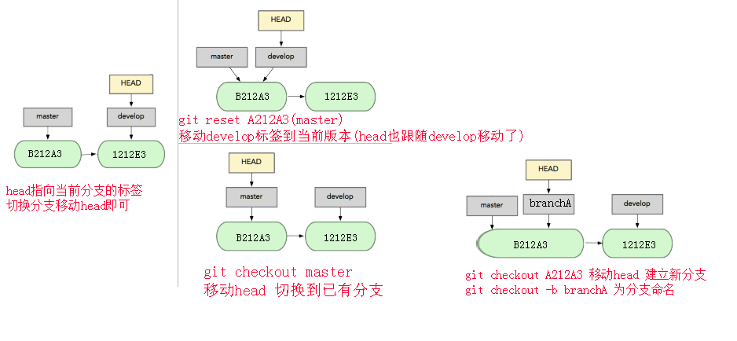
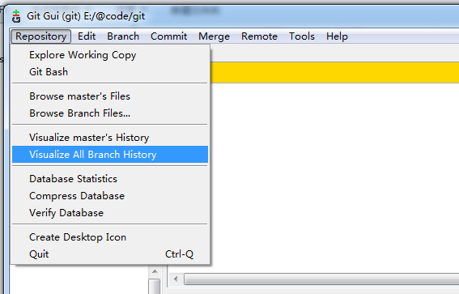

[[TOC]]
# 标签


# Git 工作区、暂存区和版本库


* 工作区：即你的电脑里能看到的目录，平时开发代码的地方

* 暂存区：保存临时改动
*
* 版本库：指向最后一次提交的结果


# git init

```
git init 初始化新项目

```


# git log

```
//查看版本号
git log --oneline

git log --pretty=oneline


github上也可以找

webstorm可以找

```

# git logref

```javascript
 //拉取操作日志
```

# git add 

添加操作到缓存


```
git add .

git add 1.txt
```

# git rm

删除缓存区文件


如果你想把一个文件从版本控制中移除，并且保留本地的文件，首先需要把这个文件加入到gitignore文件中。然后执行以下命令就可以了。
```
git rm  --cached file_path
```
以上命令将file_path所代表的文件从版本控制中删除，并保留本地文件，此外还要进行commit操作才能将服务器端的文件删掉。如果想把一个文件夹从版本控制中删除并保留本地的文件，只需在上述命令的基础上加上-r参数，即

```
git rm -r  --cached folder_path
```
如果想把所有gitignore中的文件从版本控制中删除的话，需要执行以下两个命令，即先移除所有文件，再执行添加所有文件（这次会忽略gitignore中的文件）。

```
git rm -r  --cached .
git add .
```

# git commit

提交到版本

```
git commit -m'备注名'

```
# git reset && git checkout



```
git checkout . //拉取缓存到工作区

```


```
git reset a1a1a1 --hard  // 拉取到缓存区和工作区

git reset master //拉取到缓存区
```
```
git checkout a1a1a1 //head移动到任何一次提交,不隐藏以后版本的提交,建立新分支!,分支重命名 git checkout -b branchA
git checkout master // header移动到分支的最高版本,不隐藏以后版本的提交

```


# git revert

```
git revert -n 8ce5
```
**


# 分支操作


### 列出分支
```
git branch
```
远程分支
```
git branch -r
```
### 切换分支

```
git checkout dev //拉取dev的本到工作区和缓存,并设置为head
```


### 创建并切换分支
```

$ git branch dev
$ git checkout dev


```

### 从任何版本建立分支

 ```
git checkout a1a1a1 //head移动到任何一次提交,不隐藏以后版本的提交,建立新分支!,

git checkout -b branchA //为分支命名 

 ```

### 分支图打印




```
git log --graph --abbrev-commit --decorate --date=relative --all
```

webstorm git log

### 重命名分支
```
 git branch -m oldBranchName newBranchName
```

### 删除分支

```
git branch -d dev
```

### 合并dev分支到当前分支

```
git merge dev
```

### git remote 远程主机

##### 添加远程主机和主机名

```
git remote add origin git@github.com:qingwabiaoge/test.git

```

##### 检查配置是否成功
```
git remote -v 
```

##### 修改远程主机和主机名

```

方法有三种：

1.修改命令

git remote origin set-url [url]

2.先删后加

git remote rm origin
git remote add origin [url]

3.直接修改config文件

```

### 远程分支

##### 建立远程分支

```

//推送master到远程

git push -u origin master

//推送分支到远程

git push -u origin dev

```

##### 以后的推送和拉取

```
git pull

git push
```

##### 若当本地版本低于远程版本,想要本地版本覆盖远程版本 -f强制推入到远程

```
git push -f

```

##### 删除远程分支

```
git push origin --delete xxx
```


# git clone


### 克隆项目
```
git clone git@github.com:qingwabiaoge/test.git
```

### 看不到分支解决 

```
git checkout dev
```

# git diff


```
git diff  //比较工作区和缓存区的不同

git diff HEAD //比较工作区和HEAD

git diff origin/master 比较工作区和网络分支

git diff branchA branchB 比较工作区和分支的最高版本


```

比较追加到文件


```

覆盖 git diff [branchA] [branchB] > a.txt
追加 git diff [branchA] [branchB] >> a.txt
git diff --color > foo.diff
foo.diff用notepad++/sublime 之类的编辑器打开，高亮颜色

```


# .gitignore

忽略的文件


# git config

命令别名

```

git config --global alias.xxx '开头省去 git xxx xxx xxx'
```

```
git config --global alias.lg " log --graph --abbrev-commit --decorate --date=relative --a
ll"


```


