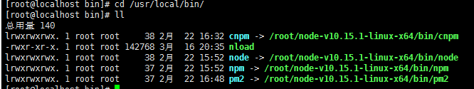

# CentOS7  CLI和GUI切换

### 方式1

在图形界面使用 ctrl+alt+F2切换到dos界面  

dos界面 ctrl+alt+F2切换回图形界面

### 方式2

在命令上 输入 init 3 命令 切换到dos界面 

输入 init 5命令 切换到图形界面

###  默认启动

如果想系统默认以某种方式启动， 使用systemd创建符号链接指向默认运行级别。

centos7以上的版本

```
1.首先删除已经存在的符号链接：

rm /etc/systemd/system/default.target 

2.默认级别转换为3(文本模式)： 

# ln类似windows的mklink

ln -sf /lib/systemd/system/multi-user.target /etc/systemd/system/default.target

3. 级别转换为5(图形模式)：

ln -sf /lib/systemd/system/graphical.target /etc/systemd/system/default.target

3.重启：

reboot

 
```

centos7以下的版本 

```
以管理员权限编辑/etc/inittab
把
id:5:initdefault:
改为
id:3:initdefault:
就ok。
```


# 文件目录

```
bin 存放二进制可执行文件(ls,cat,mkdir等)
boot 存放用于系统引导时使用的各种文件
dev 用于存放设备文件
etc 存放系统配置文件
home 存放所有用户文件的根目录
lib 存放跟文件系统中的程序运行所需要的共享库及内核模块
mnt 系统管理员安装临时文件系统的安装点
opt 额外安装的可选应用程序包所放置的位置
proc 虚拟文件系统，存放当前内存的映射
root 超级用户目录
sbin 存放二进制可执行文件，只有root才能访问
tmp 用于存放各种临时文件
usr 用于存放系统应用程序，比较重要的目录/usr/local 本地管理员软件安装目录
var 用于存放运行时需要改变数据的文件
```
# 快捷键

### linux

Ctrl+A： 将光标移动到命令行的开始处。 ~before
Ctrl+E：将光标移动到命行令的结尾处。~end
Ctrl+u: 清除光标之前的内容，快速删除shell中输入错误的命令，不必逐个字符删除
Ctrl+k: 清除光标之后的内容

Ctrl+r: 在历史命令中查找 ，非常好用，输入关键字就联想出以前的命令了 ~reverse

Ctrl + s 锁定屏幕显示的意思(以前电脑配置低时间使用现在已经不用了)
Ctrl + q 继续显示

Ctrl+l 清屏

Tab 键 自动补全命令

# 任务管理

### 查看剩余内存

```
free -h
```

### 任务管理器

`top`

### Linux前后台进程切换

##### (1) Linux前台进程与后台进程的区别

前台进程：是在终端中运行的命令，那么该终端就为进程的控制终端，一旦这个终端关闭，这个进程也随之消失。

后台进程：也叫守护进程（Daemon），是运行在后台的一种特殊进程，不受终端控制，它不需要终端的交互；Linux的大多数服务器就是使用守护进程实现的。比如Web服务器的httpd等。

##### (2) 进程的前台与后台运行

| 命令和快捷键           | 作用                                           |
| ---------------------- | ---------------------------------------------- |
| &                      | 用在一个命令的最后，可以把这个命令放到后台执行 |
| Ctrl+z                 | 暂停到后台                                     |
| ctrl+c                 | 关闭进程                                       |
| jobs <br />jobs –l     | 查看当前有多少在后台运行的进程.                |
| fg(foregroud  process) | 进程切换到前台                                 |
| bg(backgroud  process) | 后台运行继承                                   |
| kill(pid) (id)         | 关闭后台进程                                   |

##### (3) &的使用

　　如果直接使用&，部分命令仍然在前台显示，例如"ping 127.0.0.1 &"。此时我们可以使用nohup命令帮助，"nohup ping 127.0.0.1 &"，在执行时会创建一个nohup.out的文件。

# 文件操作

### 显示磁盘容量

```
df -a
df -h
```

### 浏览文件

```
ls (ls -lht)会列出当前目录下每个文件的大小，同时也会给出当前目录下所有文件大小总和

ls常用参数
-a:显示隐藏文件
-l :列表方式显示信息[英] list
-h:显示文件大小

du -sh *也会列出当前文件夹下所有文件对应的大小(指定文件大小和文件夹的大小)
```

### 建立和删除文件夹

```
mkdir

mkdir -p data/db 连带添加上级目录

rmdir
```

### 建立文件

```
touch 
```

### 设置权限

# Linux chmod命令

Linux/Unix 的文件调用权限分为三级 : 文件拥有者、群组、其他。利用 chmod 可以藉以控制文件如何被他人所调用。

**使用权限** : 所有使用者

### 语法

```
chmod [-cfvR] [--help] [--version] mode file...
```

### 参数说明

mode : 权限设定字串，格式如下 :

```
[ugoa...][[+-=][rwxX]...][,...]
```

其中：

- u 表示该文件的拥有者，g 表示与该文件的拥有者属于同一个群体(group)者，o 表示其他以外的人，a 表示这三者皆是。
- \+ 表示增加权限、- 表示取消权限、= 表示唯一设定权限。
- r 表示可读取，w 表示可写入，x 表示可执行，X 表示只有当该文件是个子目录或者该文件已经被设定过为可执行。

其他参数说明：

- -c : 若该文件权限确实已经更改，才显示其更改动作
- -f : 若该文件权限无法被更改也不要显示错误讯息
- -v : 显示权限变更的详细资料
- -R : 对目前目录下的所有文件与子目录进行相同的权限变更(即以递回的方式逐个变更)
- --help : 显示辅助说明
- --version : 显示版本

### 实例

将文件 file1.txt 设为所有人皆可读取 :

```
chmod ugo+r file1.txt
```

将文件 file1.txt 设为所有人皆可读取 :

```
chmod a+r file1.txt
```

将文件 file1.txt 与 file2.txt 设为该文件拥有者，与其所属同一个群体者可写入，但其他以外的人则不可写入 :

```
chmod ug+w,o-w file1.txt file2.txt
```

将 ex1.py 设定为只有该文件拥有者可以执行 :

```
chmod u+x ex1.py
```

将目前目录下的所有文件与子目录皆设为任何人可读取 :

```
chmod -R a+r *
```

此外chmod也可以用数字来表示权限如 :

```
chmod 777 file
```

语法为：

```
chmod abc file
```

其中a,b,c各为一个数字，分别表示User、Group、及Other的权限。

#### r=4，w=2，x（执行）=1

- 若要rwx属性则4+2+1=7；
- 若要rw-属性则4+2=6；
- 若要r-x属性则4+1=5。
- 0表示没有权限

```
chmod a=rwx file
```

和

```
chmod 777 file
```

效果相同

```
chmod ug=rwx,o=x file
```

和

```
chmod 771 file
```


chmod abc filename//abc分别主人，同组，其他用户数字权限

chomd 753 filename//主人读。写，执行（7)；同组读，执行(5)；其他写，执行(3)

chomd 644 passwd

例1 chomd 644 passwd

如图所示：


chmod 273 php.txt


字母相对和数字相对取舍？

修改权限相对比较多时候使用数字方式

.................少................字母方式

对当前目录下所有文件及文件夹极其子目录及子文件

```
chmod -R  777 *    
```

### 复制第一个文件夹到第二个文件夹

    cp -R /alidata/www/duchanghong.com/images/product  /alidata/www/@wanxiang

###### linux复制到远程主机

    scp local_file remote_username@remote_ip:remote_folder

### mv 移动和重命名

```
mv abc.txt 1234.txt

mv a.txt /b/c.txt
```

### 删除文件和文件夹

```
rm xxx
rm -rf
```

# 用戶信息

    who、w 和 users 等命令通过 utmp(/var/run/utmp) 文件查询当前登录用户的信息。
    last 和 ac 命令通过 wtmp(/var/log/wtmp) 文件查询当前与过去登录系统的用户的信息。
    lastb 命令通过 btmp(/var/log/btmp) 文件查询所有登录系统失败的用户的信息。
    lastlog 命令通过 lastlog(/var/log/lastlog) 文件查询用户最后一次登录的信息。
    
    passwd 修改当前用户的密码密碼

```
useradd testuser  创建用户testuser
passwd testuser  给已创建的用户testuser设置密码
说明：新创建的用户会在/home下创建一个用户目录testuser
usermod --help  修改用户这个命令的相关参数
userdel testuser  删除用户testuser
rm -rf testuser  删除用户testuser所在目录
```

# linux修改时间

服务器时间与网络时间不符：

一、手动修改

\1. date命令：查看当前时间


\2. date -s 时分秒 ：修改时间


还需要把日期改过来

\3. date -s 完整日期时间（YYYY-MM-DD hh:mm[:ss]）：修改日期、时间


时间要用双引号括起来，否则报错

手动修改会存在一定的时间误差

\4. hwclock -w


将时间写入bios避免重启失效。

当我们进行完 Linux 时间的校时后，还需要以 hwclock 来更新 BIOS 的时间，因为每次重新启动的时候，系统会重新由 BIOS 将时间读出来，所以， BIOS 才是重要的时间依据吶。

二、同步网络时间

\1. 检查系统是否安装ntp服务

安装ntp服务命令：

apt-get install ntp 或者 yum install ntp

\2. service --status-all：检查ntp服务是否启动


[+]表示服务已启动

\3. ntpdate 服务器IP：同步服务器时间

ntp常用服务器：
  中国国家授时中心：210.72.145.44
  NTP服务器(上海) ：ntp.api.bz
  美国：[time.nist.gov](https://www.cnblogs.com/suiyueshentou/p/time.nist.gov) 
  复旦：[ntp.fudan.edu.cn](https://www.cnblogs.com/suiyueshentou/p/ntp.fudan.edu.cn) 
  微软公司授时主机(美国) ：[time.windows.com](https://www.cnblogs.com/suiyueshentou/p/time.windows.com) 
  台警大授时中心(台湾)：[asia.pool.ntp.org](https://www.cnblogs.com/suiyueshentou/p/asia.pool.ntp.org)


服务器换成上海的


时间还是差一分钟，手动把时间与当前时间间隔改大一些，再同步发现有问题，服务器时间根本就不对，差了半天时间，/(ㄒoㄒ)/~~

用微软公司授时主机(美国)，发现和上海的服务器时间差不多，那是不是时区设置有问题？？

\4. 修改服务器时区

4.1 date -R ： 查看当前时区


另一台服务器（时间正常）时区：


so,现在要来改时区了

4.2 tzselect


时区没改回来

 最后一步


# 网络

### 修改网卡配置，让网卡驱动随操作系统自动启用

1，确保是root账号进行下面操作，如果不是root身份，首先要以root身份登入当前的CentOS 7 ！

2，在shell里面输入命令：cd /etc/sysconfig/network-scripts ，随后回车，进入这个目录。随后在shell里面输入：ls -a ，随后回车，会显示这个目录里面的所有文件。


3，修改网卡配置文件。“ifcfg-ens33”就是我的网卡配置文件，我用vi编辑它，在shell里面输入：vi ifcfg-ens33 ，随后回车，按"i"键，进入vi编辑模式，现在就可以编辑此文件了！


4，把“ONBOOT”的值修改为"yes"，CentOS最小化安装的网卡默认不跟随系统启用，所以这项的默认值为“no”。修改成"yes"后，直接输入":wq"保存当前修改，退出vi。


5，重启操作系统，在shell里面输入：reboot，随后回车，重启操作系统。

6，验证yum是否可以正常工作了，登入系统后，在shell里面输入：yum grouplist，如果网卡设置正确，那么yum就应该可以正常工作了，如下图：


### 查看ip地址

```
 先安装 yum install net-tools
ifconfig -a
```

### 查看开启的端口

     //需要先安装net-tools   
     netstat -lntp


### 查看网速
实时网速
```
nload
```
图像展示
```
nload -t 200 -i 1024 -o 128 -U M
```

### 关闭防火墙

```

1) 重启后生效 
开启： chkconfig iptables on 
关闭： chkconfig iptables off 

2) 即时生效，重启后失效 
开启： service iptables start 
关闭： service iptables stop 

 3)在开启了防火墙时，做如下设置，开启相关端口， 
修改/etc/sysconfig/iptables 文件，添加以下内容： 
-A RH-Firewall-1-INPUT -m state --state NEW -m tcp -p tcp --dport 80 -j ACCEPT 
-A RH-Firewall-1-INPUT -m state --state NEW -m tcp -p tcp --dport 22 -j ACCEPT
```
# 环境变量

### 设置永久的环境变量profile
profile里设置过的cli程序的path,cli命令可以全局使用(估计是操作系统的一种搜索机制)

##### 添加PATH

`vim /etc/profile`

```shell
export PATH=/usr/local/yarn-v1.15.2/bin

# 变量版
export MONGODB_HOME=/usr/local/mongodb  
export PATH=$PATH:$MONGODB_HOME/bin

```
`source /etc/profile `立马生效 

###### 设置软链接到已设置path的目录(window下是mklink)

软连接到 /usr/local/bin/ 

```
ln -s /alidata/node/bin/node /usr/local/bin/node
ln -s /alidata/node/bin/npm /usr/local/bin/npm
```
软连接到 /usr/local/bin/node

```
ln -s /alidata/node/bin/node /usr/local/bin/node
ln -s /alidata/node/bin/npm /usr/local/bin/npm
```



删除软链接

```
rm -rf xxx
```
##### 配置其他永久环境变量 

全局变量系统设置,可以供程序使用

设置永久环境变量

```
vim /etc/profile，里面记录直接加到文件里面，最后面

export HOST=47.107.170.105 
export PORT=3000
export NODE_ENV=production


source /etc/profile //立马生效 
```

### 设置临时修改设置环境变量 

使用export其实相当于导出变量，在shell里面，直接使用=赋值符号就可以定义一个变量，例如A=“test”，用命令echo $A就可以打印出"test"；
但这样定义的变量只在当前的shell中可用，多个命令用空格间隔

```
  HOST=47.107.170.105 PORT=3000 npm run start
```

如果要使其在外部（子shell中）可用,要加export, export A=“test”的方式，或者在定义A之后使用export A。

```
export NODE_PATH=/alidata/node/lib/node_modules
```


关闭命令行再打开,临时变量不存在


### 查看环境变量

显示所有环境变量

```
export/env 
```
显示path环境变量

```
echo $PATH
```
显示其他环境变量

```
echo $HOST
```

# 安装软件

### 查看是否安装过

rpm -qa | grep xxxx

### 源码包安装和卸载

  

  源码安装需要安装编译工具： yum -y install gcc gcc-c++ make

以Redhat下安装apache为例

- 先网站下载源代码包 httpd-2.2.15.tar.gz[^1]

- tar -xvf  httpd-2.2.15.tar.gz  -C  /usr/src  将其解压到 /usr/src/ 目录下

- 到其解压目录 /usr/src/httpd-2.2.15/ 下，

-  ./configure  运行configure配置文件,设置安装目录，安装模块等，不设置的话，软件默认安装在 /usr/local/apache2/目录下。

  如果  ./configure  --prefix=/usr/local/https/  ,则是将其安装在/usr/local/https/目录下。此时还并未安装，只是配置安装路径

- make 编译，生成可执行的二进制文件Makefile

- make  install 安装。此时，软件安装在 /usr/local/https/ 目录下

​      安装完成之后对安装包的清理

-   进入其解压目录  /usr/src/httpd-2.2.15/下  ，  make  uninstall  或者  make  clean 用于清除上一次的编译
-   然后返回到上一级目录，把 httpd-2.2.15 删除
-   如果要卸载软件的话，把 /usr/local/apache2 这个软件删除就可以


### 免编译包安装

下载

```
wget http://cn.wordpress.org/wordpress-3.1-zh_CN.zip 
```

```
tar -zxvf yarn-v1.7.0.tar.gz -C /usr/local/yarn
```

添加path

 命令全局访问 软件目录必须是path里有的目录或其下级目录

```
vim /etc/profile

#在文件结尾加入以下内容
export PATH=$PATH:/var/local/yarn/yarn-1.7.0/bin

#立马生效 

source /etc/profile

```

### yum \apt 安装

```
yum install wget -y
```

yum的安装路径, 已经添加到path了


列出安装过的包

```
yum grouplist
```

升级软件

```
sudo yum upgrade
```


# 运行软件

### 命令

##### 简单命令后面带参数

`pm2 start 1.js`

` mongod --dbpath d:\mongodb4.0.10\data`

` mongod --config "d:\mongodb4.0.10\mongo.conf" `

##### 复杂命令可以加配置文件

`pm2 start pm2.json`

` mongod --config d:\mongodb4.0.10\mongo.conf `

window有配置文件也是因为如此

### 多个命令

##### linux

空格间隔多个命令

##### windows

&&分离多个命令


# 服务(mongo为例)

linux和window所谓的任务不过是开机自动启动的后台cli程序

### 建立服务

linux系统结构/lib/systemd/system/目录 该目录自动存放启动文件的配置位置，里面一般包含有xxx.service 

`cd /lib/systemd/system `

`sudo vi mongodb.service` 

输入

```
[Unit]  
Description=mongodb  
After=network.target remote-fs.target nss-lookup.target  
  
[Service]  
Type=forking  
ExecStart=/usr/local/mongodb/bin/mongod --config /usr/local/mongodb/bin/mongodb.conf  
ExecReload=/bin/kill -s HUP $MAINPID  
ExecStop=/usr/local/mongodb/bin/mongod --shutdown --config /usr/local/mongodb/bin/mongodb.conf  
PrivateTmp=true  
  
[Install]  
WantedBy=multi-user.target
```
### 设置文件mongodb.service 权限

`chmod 754 mongodb.service`


### 服务操作 systemctl

##### 启动服务  
`systemctl start mongodb.service  `
##### 关闭服务  
`systemctl stop mongodb.service  `

##### 重启服务

`systemctl restart mongodb.service`

##### 查看服务当前状态

`systemctl status mongodb.service`

##### 看所有服务的状态

`systemctl list-unit-files`

##### 开机启动  
`systemctl enable mongodb.service `

##### 取消开机启动

`systemctl disable mongodb.servic`


[^1]: .tar.gz