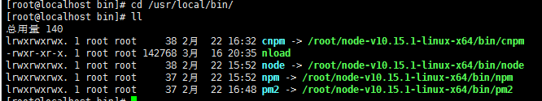
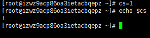
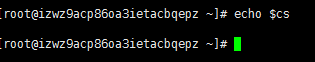
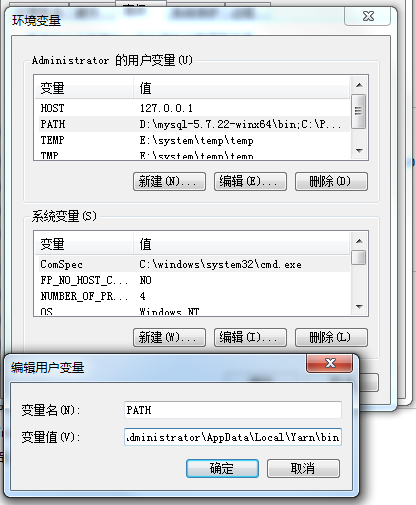

# 目录

```
bin 存放二进制可执行文件(ls,cat,mkdir等)
boot 存放用于系统引导时使用的各种文件
dev 用于存放设备文件
etc 存放系统配置文件
home 存放所有用户文件的根目录
lib 存放跟文件系统中的程序运行所需要的共享库及内核模块
mnt 系统管理员安装临时文件系统的安装点
opt 额外安装的可选应用程序包所放置的位置
proc 虚拟文件系统，存放当前内存的映射
root 超级用户目录
sbin 存放二进制可执行文件，只有root才能访问
tmp 用于存放各种临时文件
usr 用于存放系统应用程序，比较重要的目录/usr/local 本地管理员软件安装目录
var 用于存放运行时需要改变数据的文件
```
# 快捷键
    ctrl+z挂起进程
    Ctrl+c彻底关闭进程
    Ctrl+u撤销上一步操作
    ctrl+r恢复上一步被撤销的操作


# 文件操作

显示磁盘容量

```
df -a
df -h
```


浏览文件

```
ls (ls -lht)会列出当前目录下每个文件的大小，同时也会给出当前目录下所有文件大小总和

ls常用参数
-a:显示隐藏文件
-l:列表方式显示信息
-h:显示文件大小

du -sh *也会列出当前文件夹下所有文件对应的大小(指定文件大小和文件夹的大小)
```


建立和删除文件夹

```
mkdir、rmdir

mkdir -p data/db 连带添加上级目录

```


 设置权限

```
对当前目录下所有文件及文件夹极其子目录及子文件

    chmod -R  777 *
    
```


复制第一个文件夹到第二个文件夹

      cp -R /alidata/www/duchanghong.com/images/product  /alidata/www/@wanxiang


linux复制到远程主机

        scp local_file remote_username@remote_ip:remote_folder


mv 移动和重命名

```
mv abc.txt 1234.txt

mv a.txt /b/c.txt
```
 

删除文件

```
rm -rf
```


# 修改登录密码

      passwd


# 网络

### 查看ip地址

```
 先安装 yum install net-tools
ifconfig -a
```

### 查看开启的端口
   
    再运行    netstat -lntp


### 查看网速
实时网速
```
nload

```
图像
```
nload -t 200 -i 1024 -o 128 -U M
```

### 关闭防火墙

```

1) 重启后生效 
开启： chkconfig iptables on 
关闭： chkconfig iptables off 

2) 即时生效，重启后失效 
开启： service iptables start 
关闭： service iptables stop 

需要说明的是对于Linux下的其它服务都可以用以上命令执行开启和关闭操作。 

在开启了防火墙时，做如下设置，开启相关端口， 
修改/etc/sysconfig/iptables 文件，添加以下内容： 
-A RH-Firewall-1-INPUT -m state --state NEW -m tcp -p tcp --dport 80 -j ACCEPT 
-A RH-Firewall-1-INPUT -m state --state NEW -m tcp -p tcp --dport 22 -j ACCEPT
```
# 任务管理器

###  查看剩余内存

```
free -h
```
### 任务管理器
`top`


### 杀死进程

```
kill xxx
```


# linux环境变量

### 设置永久的环境变量
##### profile里设置path,让cli可以命令行全局使用(估计是操作系统的一种搜索机制)
```
vim /etc/profile，添加PATH

export PATH=/usr/local/yarn-v1.15.2/bin

export MONGODB_HOME=/usr/local/mongodb  
export PATH=$PATH:$MONGODB_HOME/bin

shell下输入source /etc/profile 立马生效 
```
##### 设置软链接到已设置path的目录(window下是mklink)


软连接到 /usr/local/bin/ 

```
ln -s /alidata/node/bin/node /usr/local/bin/node
ln -s /alidata/node/bin/npm /usr/local/bin/npm
```
软连接到 /usr/local/bin/node

```
ln -s /alidata/node/bin/node /usr/local/bin/node
ln -s /alidata/node/bin/npm /usr/local/bin/npm
```


* 删除软链接

```
rm -rf xxx
```
##### profile配置其他永久环境变量 

* 定义
全局变量系统设置,可以供程序使用
* 设置永久环境变量

```
vim /etc/profile，里面记录直接加到文件里面，最后面


export HOST=47.107.170.105 
export PORT=3000
export NODE_ENV=production


shell下输入source /etc/profile 立马生效 

```


### shell下临时修改设置环境变量 

使用export其实相当于导出变量，在shell里面，直接使用=赋值符号就可以定义一个变量，例如A=“test”，用命令echo $A就可以打印出"test"；
但这样定义的变量只在当前的shell中可用，如果要使其在外部（子shell中）可见，就要用export A=“test”的方式，或者在定义A之后使用export A。

```
export NODE_PATH=/alidata/node/lib/node_modules
```




关闭命令行再打开,临时变量不存在



(多个命令用空格间隔)

```
    Linux 下  HOST=47.107.170.105 PORT=3000 npm run start
```

### 查看环境变量

显示所有环境变量

```
env 
```
显示路径环境变量

```
echo $PATH
```
显示指定变量

```
echo $HOST
```


# windows 环境变量

### 配置永久的环境变量
##### windows的path让程序能在命令行全局运行



因为npm配置了path   , npm下方的运行文件也可以命令行全局运行,npm i -g xxx 安装到了npm下级文件夹


##### 永久设置windown环境变量让程序用


###  window命令行设置临时环境变量 


关闭命令行再打开


(多个命令用&间隔,不可以在webpack如此配置)


```
set HOST=47.107.170.105&set PORT=3000&set NODE_ENV=development&npm run start
```
### 查看环境变量

显示所有环境变量
```
set
```
显示path

```
set path
```

显示指定

```

set HOST
```

### 命令行运行程序

```
node

node-sass

babel-node

webpack

```


# 安装软件

 命令全局访问 软件目录必须是path里有的目录或其下级目录

### yum市场安装
```
yum install wget -y

```
YUN   已经添加到path了


### 安装源码

##### 下载
```
wget http://cn.wordpress.org/wordpress-3.1-zh_CN.zip 
```
##### 编译
1. ./configure是源代码安装的第一步，主要的作用是对即将安装的软件进行配置，检查当前的环境是否满足要安装软件的依赖关系，但并不是所有的tar包都是源代码的包，楼主可以ls看看有没有configure这个文件，也许你下的是二进制的包，如果是二进制的包，解压后直接就能使用
2. make 
3. make install


### 安装免编译安装包


##### 下载
```

wget http://cn.wordpress.org/wordpress-3.1-zh_CN.zip 
```

##### 解压

```

tar -zxvf yarn-v1.7.0.tar.gz -C /usr/local/yarn
```

##### 添加path

```
vim /etc/profile
#在文件结尾加入以下内容
export PATH=$PATH:/var/local/yarn/yarn-1.7.0/bin

 #立马生效 source /etc/profile

```


# vim

```
wim xxx 建立或者修改文件
      
esc->i输入模式
esc->:wq保存关闭
esc->:q不保存退出
esc->:q!强制退出


快捷键

       Ctrl + s 停止输入锁定
       Ctrl + q 继续

```

# 压缩

```
unzip test.zip
zip -r shipoe4.zip /alidata/www/shipoe.com
```

```

tar -zxvf yarn-v1.7.0.tar.gz -C /usr/local/yarn

x : 从 tar 包中把文件提取出来
z : 表示 tar 包是被 gzip 压缩过的，所以解压时需要用 gunzip 解压
v : 显示详细信息
f xxx.tar.gz : 指定被处理的文件是 xxx.tar.gz
```


# 建立服务并开机启动(mongo为例)

### 建立服务
linux系统结构/lib/systemd/system/目录 该目录自动存放启动文件的配置位置，里面一般包含有xxx.service 


```
cd /lib/systemd/system  
sudo vi mongodb.service 

```

输入

```
[Unit]  
Description=mongodb  
After=network.target remote-fs.target nss-lookup.target  
  
[Service]  
Type=forking  
ExecStart=/usr/local/mongodb/bin/mongod --config /usr/local/mongodb/bin/mongodb.conf  
ExecReload=/bin/kill -s HUP $MAINPID  
ExecStop=/usr/local/mongodb/bin/mongod --shutdown --config /usr/local/mongodb/bin/mongodb.conf  
PrivateTmp=true  
  
[Install]  
WantedBy=multi-user.target
```
### 设置文件权限

`chmod 754 mongodb.service`


### 操作服务

#####启动服务  
`systemctl start mongodb.service  `
#####关闭服务  
`systemctl stop mongodb.service  `

##### 重启服务

`systemctl restart mongodb.service`

##### 查看服务当前状态

`systemctl status mongodb.service`

##### 参看所有服务的状态

`systemctl list-unit-files`
##### 开机启动  
```
systemctl enable mongodb.service 

让/lib/systemd/system/supervisord.service文件开机启动
````
##### 取消开机启动

`systemctl disable`

# 参数的意义
-R  递归


