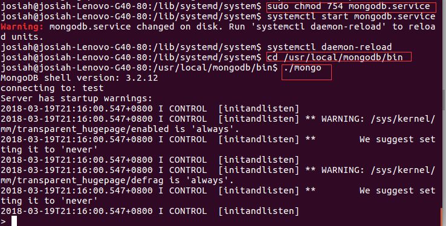

# 一、安装过程

1. 到mongodb官网下载对应系统的压缩包，我的系统是Ubuntu16.04,64位。（注意不要选错系统版本，也可以在本地下载好后上传到云服务器）

2. 默认下载路径是到用户目录下的Downloads目录，将其解压

```
tar -zxvf mongodb-linux-x86_64-3.2.12.tgz
```

3. 将解压后的文件夹移动到/usr/local/的mongodb目录下

```
mv -r mongodb-linux-x86_64-3.2.12 /usr/local/mongodb
```

4. 配置系统文件profile

```
sudo vi /etc/profile
```

插入下列内容：

```
export MONGODB_HOME=/usr/local/mongodb  
export PATH=$PATH:$MONGODB_HOME/bin
```

注意保存后要重启系统配置：

```
source /etc/profile
```

5. 创建用于存放数据和日志文件的文件夹，并修改其权限增加读写权限


```
cd /usr/local/mongodb
sudo mkdir -p data/dbsudo chmod -r 777 data/db
sudo mkdir logs
cd logs
touch mongodb.log
```


# 二、配置用户

6. mongodb启动配置

进入到bin目录，增加一个配置文件：

```
cd /usr/local/mongodb/bin  
sudo vi mongodb.conf
```

插入下列内容：

```
dbpath = /usr/local/mongodb/data/db #数据文件存放目录  
logpath = /usr/local/mongodb/logs/mongodb.log #日志文件存放目录  
port = 27017  #端口  
fork = true  #以守护程序的方式启用，即在后台运行  
nohttpinterface = false  #：是否禁止http接口，即28017 端口开启的服务。默认false，支持。
auth = true #开启密码
```

7. 创建用户

   ```
   db.createUser({ user: "admin", pwd: "admin", roles: [{ role: "userAdminAnyDatabase", db: "admin" }] })
   ```

   

8.  启动mongod数据库服务，以配置文件的方式启动

```
cd /usr/local/mongodb/bin
./mongod -f mongodb.conf
```

9. 连接mongodb数据库

```
./mongo
```


10. 登陆测试用户是否成功
    db.auth("root", "qinshilei@168") 如果返回1，则表示成功。
    show collections 验证是否登陆成功

# 三、设置mongodb.service启动服务

９．设置mongodb.service启动服务，设置开机启动

```
cd /lib/systemd/system  
sudo vi mongodb.service 
```

编辑其内容为：

```
[Unit]  
Description=mongodb  
After=network.target remote-fs.target nss-lookup.target  
  
[Service]  
Type=forking  
ExecStart=/usr/local/mongodb/bin/mongod --config /usr/local/mongodb/bin/mongodb.conf  
ExecReload=/bin/kill -s HUP $MAINPID  
ExecStop=/usr/local/mongodb/bin/mongod --shutdown --config /usr/local/mongodb/bin/mongodb.conf  
PrivateTmp=true  
  
[Install]  
WantedBy=multi-user.target
```

10．设置mongodb.service权限

```
chmod 754 mongodb.service
```

11．系统mongodb.service的操作命令如下：

```
#启动服务  
systemctl start mongodb.service  
#关闭服务  
systemctl stop mongodb.service  
#开机启动  
systemctl enable mongodb.service 
```


12．mongodb.service启动测试



 

# 四、安装过程中遇到的问题

**1.**

```
mongod: error while loading shared libraries: libnetsnmpmibs.so.30: cannot open shared object file: No such file or directory
```

这个报错信息是说找不到对应的库文件，原因是一开始我下错了安装包版本，所以在下载是一定要注意自己系统的版本


２．通过配置文件启动服务：mongod -f /etc/mongodb.conf 时报错

```
Error parsing INI config file: unrecognised option 'nohttpinterface' try './
```

这个一开始让我查了好久，后面查到是因为我下载的最新版本的mongodb，而最新的版本貌似不支持以这种配置文件的方式来启动服务，所以无奈我又重新下载安装了3.2.12的版本，然后再次启动服务就正常了。

３．启动服务时报错：

```
about to fork child process, waiting until server is ready for connections.
forked process: 11335
ERROR: child process failed, exited with error number 1
```

这个错误原因是dbpath文件的权限问题,data和logs目录增加写权限即可，上面提到了。

 