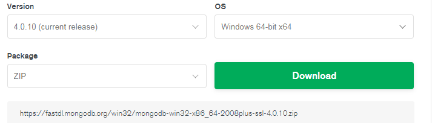
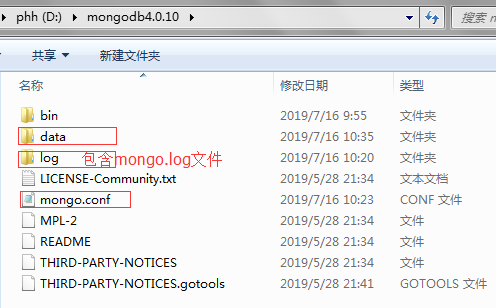
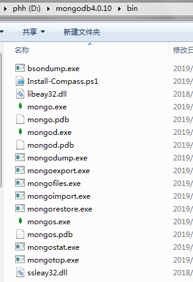
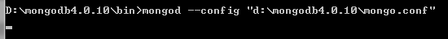
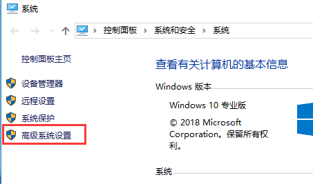
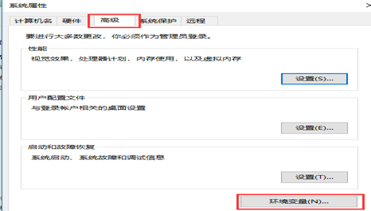
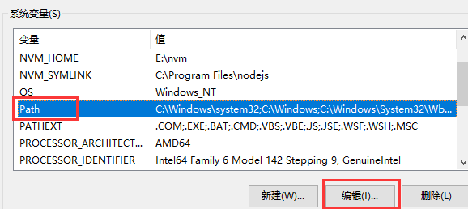
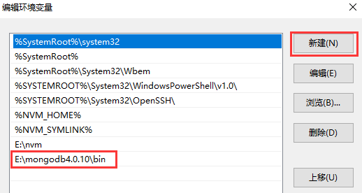

### 1.官网下载zip安装包

官网地址https://www.mongodb.com/download-center/community?jmp=nav，现在windows系统一般都是64位的，选好版本、系统和包类型之后点击download，mongodb-win32-x86_64-2008plus-ssl-4.0.10.zip。



 

### 2.解压zip包，创建数据文件、日志文件和数据库配置文件

将下载后的zip包解压到D盘并重命名为mongodb4.0.10，下图除去三个红框标记的其余都是zip解压缩后的文件。

在mongodb4.0.10中新建文件夹data，用于存放数据文件；新建文件夹log并在log下新建mongo.log文件，用于存放日志；新建mongo.conf配置文件，文件内容如下。

 


```
#数据库路径
dbpath=D:\mongodb4.0.10\data
#日志路径
logpath=D:\mongodb4.0.10\log\mongo.log
#启用日志文件，默认也启用
journal=true
#日志模式为追加
logappend=true
#过滤无用日志
quiet=true
#端口号
port=27017
```


 

### 3.安装mongo服务

进入安装包的解压路径的bin目录下，bin目录为执行文件目录，内容如下



 

 打开cmd窗口，在bin目录下执行mongod --config "d:\mongodb4.0.10\mongo.conf"（其实可以不加双引号），执行结果如下



 

### 4.启动mongo服务

关闭当前cmd窗口另开一个cmd窗口，在bin目录下执行mongod --dbpath d:\mongodb4.0.10\data，执行后如下

（如果不关闭上一个cmd窗口，这一步执行会报”另一个程序正在使用此文件，进程无法访问“）


在浏览器中输入[http://127.0.0.1:27017](http://127.0.0.1:27017/)，返回结果如下，表明mongo数据库安装成功。


 

### 5.连接mongo数据库

保持上一个cmd窗口开启，另开一个cmd窗口在bin目录下执行mongo，执行结果如下


 可执行命令查询当前版本和已存在的数据库。


 

6.后续要使用mongo数据库，先在bin目录下执行mongod --dbpath d:\mongodb4.0.10\data启动服务，保持窗口开启在另一窗口执行mongo即可进入数据库。

 

使用上面的方法即可正常启停和使用mongo数据库，但是每次都需要进入到安装路径的bin目录下启停服务、连接数据库十分麻烦。因此需要将mongo添加到windows的服务中，并且将mongo程序添加到环境变量中。

### 7.将mongo添加为windows服务

关闭之前所有的cmd窗口，使用管理员权限打开一个新的cmd窗口，bin目录下执行mongod --config d:\mongodb4.0.10\mongo.conf --install --serviceName MongoDB，安装完成后可在windows的服务中看到MongoDB，可以在服务中启动或停止服务，或者在cmd的任意路径中执行net start/stop MongoDB来启停，并且启动后如果不手动停止，服务回一直为启动状态，后续连接数据库之前不需要先启动服务。


如果不使用管理员权限安装服务，执行不报错但是服务无法注册成功，即无法在windows服务中找到mongoDB服务；使用管理员权限，如果有其他运行mongo服务的cmd窗口，也无法成功，查看日志如下，此时关闭其他cmd窗口重新执行安装服务即可。

```
exception in initAndListen: DBPathInUse: Unable to create/open the lock file: E:\mongodb4.0.10\data\mongod.lock (另一个程序正在使用此文件，进程无法访问。). 
Ensure the user executing mongod is the owner of the lock file and has the appropriate permissions. Also make sure that another mongod instance is not already running on the E:\mongodb4.0.10\data directory, terminating
```

bin目录下执行mongd --remove移除mongodb服务

 

### 8.将mongo添加到环境变量

上述添加到服务的操作解决的是在bin下执行mongod --dbpath d:\mongodb4.0.10\data启动服务的操作，但是要连接mongo数据库还是需要到bin目录下执行mongo，这就需要添加环境变量了，将mongo的bin路径添加到环境变量之后，就可以在cmd的任意路径中通过mongo连接到mongo数据库。。

电脑上右键-管理，打开系统设置界面如下图1，点击高级系统设置进入系统属性设置界面如下图2，在高级页签中点击环境变量，进入环境变量设置界面如下图3，选中系统变量Path点击编辑，进入编辑环境变量界面如下图4，点击新建，将mongo的完整bin路径添加到最后，保存即可。

        

 

   