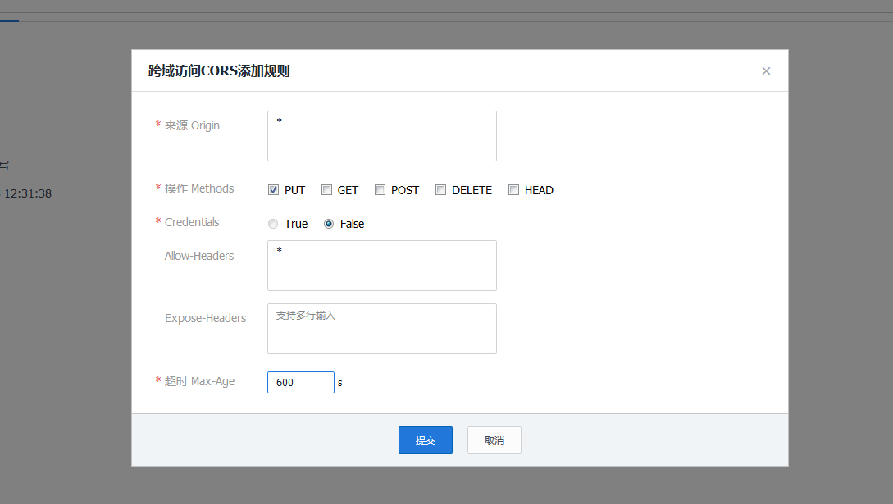

## 创建新站点的步骤
        1，chmod -R  777 /alidata/www
        2，阿里云域名解析,包含二级域名的解析
        3 vhost文件
        4重启service nginx restart
        如果是新服务器看是否设置了安全组(设置linux的端口)

## 重启nginx
     service nginx restart
     或
     /etc/init.d/nginx restart
## 虚拟主机配置文件文件

```
server {
        listen       80;
        server_name  http6.net www.http6.net;
	index index.html index.htm index.php;
	root /alidata/www/http6.net;
	location ~ .*\.(php|php5)?$
	{
		#fastcgi_pass  unix:/tmp/php-cgi.sock;
		fastcgi_pass  127.0.0.1:9000;
		fastcgi_index index.php;
		include fastcgi.conf;
	}
	location ~ .*\.(gif|jpg|jpeg|png|bmp|swf)$
	{
		expires 30d;
	}
	location ~ .*\.(js|css)?$
	{
		expires 1h;
	}
	#伪静态规则

	access_log  /alidata/log/nginx/access/http6.net.log;
}

```


```
server {
       listen 443;
        server_name  http6.net www.http6.net ;
	 ssl on;
	root /alidata/www/http6.net;
	index index.html index.htm index.php;
	ssl_certificate   cert/214778845660169.pem;
    ssl_certificate_key  cert/214778845660169.key;
    ssl_session_timeout 5m;
    ssl_ciphers ECDHE-RSA-AES128-GCM-SHA256:ECDHE:ECDH:AES:HIGH:!NULL:!aNULL:!MD5:!ADH:!RC4;
    ssl_protocols TLSv1 TLSv1.1 TLSv1.2;
    ssl_prefer_server_ciphers on;
	location ~ .*\.(php|php5)?$
	{
		#fastcgi_pass  unix:/tmp/php-cgi.sock;
		fastcgi_pass  127.0.0.1:9000;
		fastcgi_index index.php;
		include fastcgi.conf;
	}
	location ~ .*\.(gif|jpg|jpeg|png|bmp|swf)$
	{
		expires 30d;
	}
	location ~ .*\.(js|css)?$
	{
		expires 1h;
	}

if ($host = www.http6.net){
	rewrite "^/res/(.+)_(\d+)x(\d+).jpg$"   /public/api.thumb.php?fp=$1&w=$2&h=$3 last;
	}
	access_log  /alidata/log/nginx/access/http6.log;
}


```


## 虚拟主机跨域
添加到虚拟主机配置文件里跨域

    server {
    location ~* \.(eot|ttf|woff|svg|otf)$ {
         add_header Access-Control-Allow-Origin *;}
    
    location / {
      add_header Access-Control-Allow-Origin *;}
    }

## 腾讯云跨域



