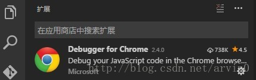
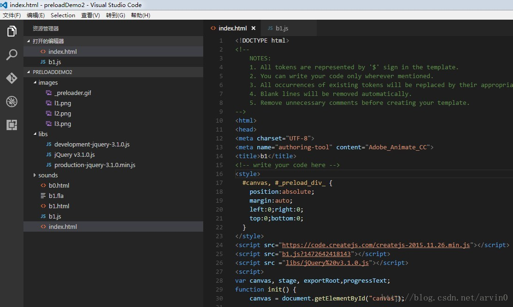
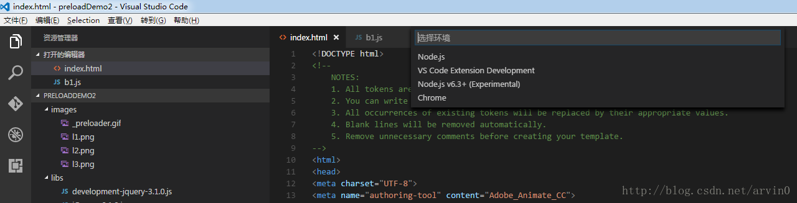
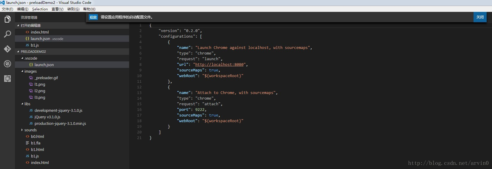
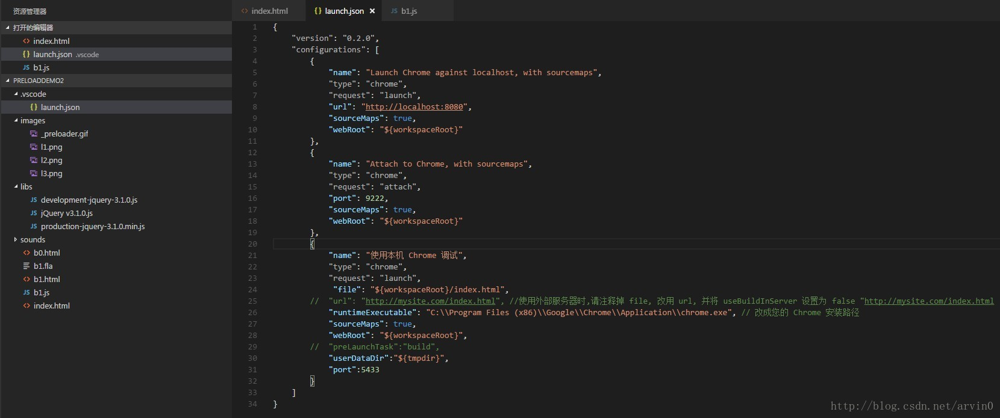
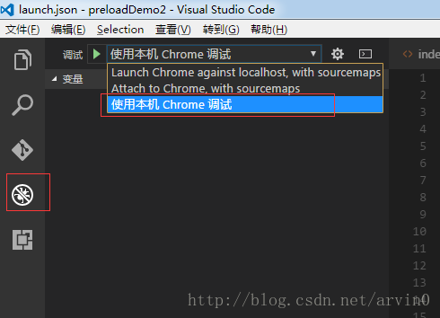
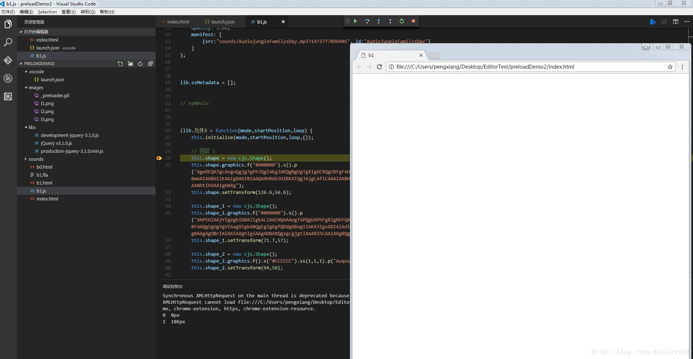

# [vscode调试html页面，及配置说明](https://www.cnblogs.com/codeww/p/7667543.html)

一、效果目的 
1.在VSCode里，直接F5打开html页面，并且可以在编辑器里，进行断点调试js代码；

二、工具准备 
1.VSCode 软件 
2.一个js项目 
3.VSCode 上装一个插件：Debugger for Chrome 
如图 


三、配置文件更改 
1.用VSCode装载项目 


2.然后按F5，出现这个框 

选择 Chrome

3.然后出现个配置的提示，和打开了launch.json这个文件 

在 这个文件里添加一段配置信息

```
,
        {
            "name": "使用本机 Chrome 调试",
            "type": "chrome",
            "request": "launch",
             "file": "${workspaceRoot}/index.html",
        //  "url": "http://mysite.com/index.html", //使用外部服务器时,请注释掉 file, 改用 url, 并将 useBuildInServer 设置为 false "http://mysite.com/index.html
            "runtimeExecutable": "C:\\Program Files (x86)\\Google\\Chrome\\Application\\chrome.exe", // 改成您的 Chrome 安装路径
            "sourceMaps": true,
            "webRoot": "${workspaceRoot}",
        //  "preLaunchTask":"build",
            "userDataDir":"${tmpdir}",
            "port":5433
        }
```

结果如图 


4.然后，更改调试方式 
 
如图，选择左边的圆形按钮，然后出来这个调试配置管理界面，选择“使用本机 Chrome 调试”。

5.然后在项目的 js 处设置好断点，按 F5，就可以进行断点调试了。 


6.接着就 Enjoy!

PS：这种方法只适合普通页面，要是你的js项目里，包含json等游览器不支持本地游览的资源，那么就需要开启服务器，配合这个插件，才能进行断点调试。

配置说明：

${workspaceRoot} VS Code当前打开的文件夹

${file} 当前打开的文件

${relativeFile} 相对于workspaceRoot的相对路径

${fileBasename} 当前打开文件的文件名

${fileDirname} 所在的文件夹，是绝对路径

${fileExtname} 当前打开文件的拓展名，如`.json`