 

## 快捷键

### 素材操作

截断素材 AlT+[ ] 

### 序列操作

序列的出点入点 b n

快速设置序列的出点入点  选中素材或者全选，然后ctrl+alt+B

进度线跳转到当前层的入点出点 i o

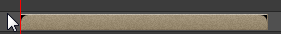

截图 Ctrl+alt+S

等比缩放   先缩放的再按shift

预览 小键盘0预览 shift+0带声音预览

复制图层Ctrl+d
 向前一帧 Page Down向后一帧 Page Up
 J k跳转关键帧

CTRL+ALT+F 　**拉伸层适合合成图像窗口** 

### 视频层修改

 显示所有关键帧U
 size s 
 透明度t 

旋转R

蒙版羽化F 

蒙版路径M

Shift+这些快捷键  在不隐藏修当前的设置的情况下显示

 

调整时间模式和帧模式，按住ctrl点时间

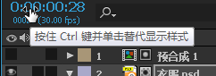

 

## 预合成

ctrl+shift+c几个图层合成到一个场景，类似于智能对象作用

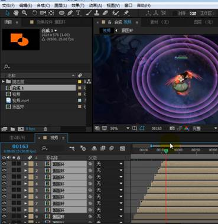

 

## 抠图

### 去除黑底

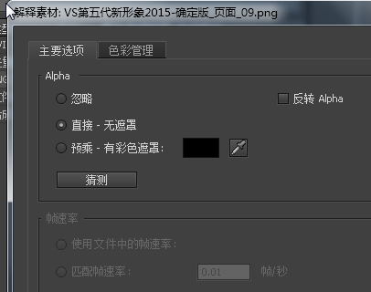

### 蒙版

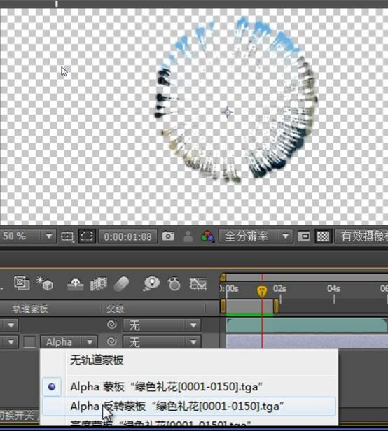

## 输入

### 导入素材文件夹

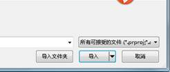

### 拖拉素材替换

替换素材切保留原来特效 拖拉素材替换 可用于同类元素重复的动画效果

## 输出

### 输出带通道透明视频

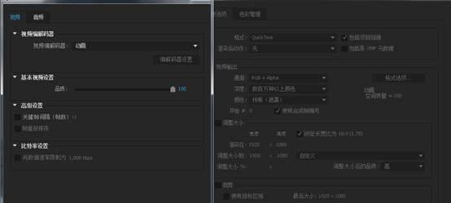

### 去media eccoder 输出

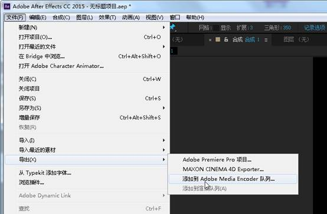

**
**

 

## 特效

### 黑白

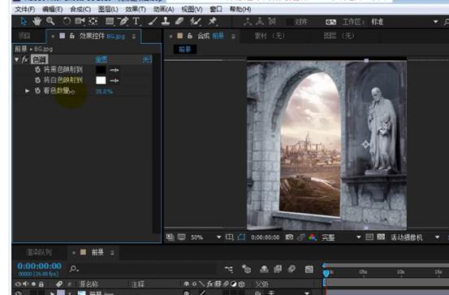

### 照片滤镜

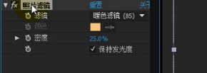

### 径向擦除

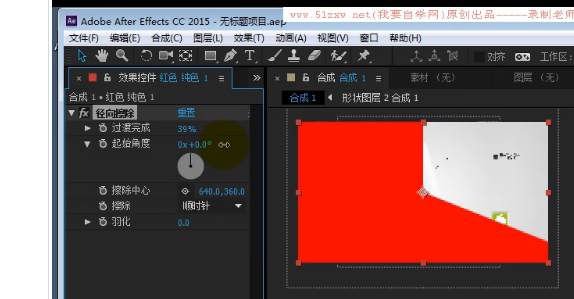

## 技巧

### 羽化圆环

固态层然后蒙版相减然后蒙版羽化

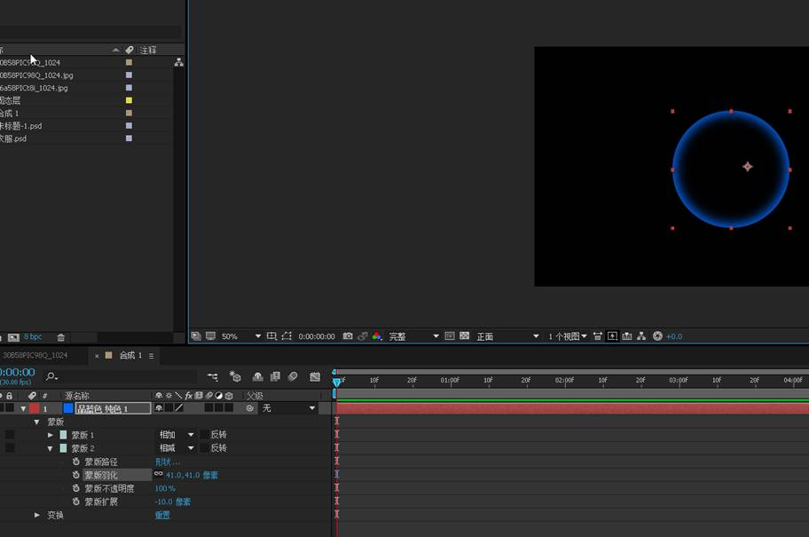

 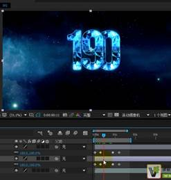

### 一起调节多个属性值

Ctrl选择多个相同的属性值 可一起调节数值

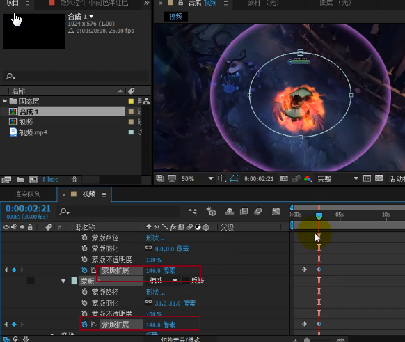

 

 