# bios定时开机

首先在启动计算机时，按“Delete”键进入BIOS界面。

在BIOS设置主界面中选择“Power Management Setup”菜单，进入电源管理窗口。

默认情况下，“Automatic Power Up(定时开机，有些机器选项为Resume By Alarm，或者Power alarm)”选项是关闭的，将光标移到该项，用PageUp或PageDown翻页键将“Disabled”改为“Enabled”，而后在“Date (of Month) Alarm”和“Time (hh:mm:ss) Alarm”中分别设定开机的日期和时间。

# 设备管理器(驱动)

其实是驱动管理


# 硬盘

### MBR  GPT

|             | 作为系统盘 | 作为数据盘   | 分区个数 | 引导文件 | 其他盘       |
| ----------- | ---------- | ------------ | -------- | -------- | ------------ |
| MBR系统分区 | Legacy引导 | 不受bios限制 | 4        | window盘 |              |
| GPT硬盘分区 | UEFI引导   | 不受bios限制 | 不限     | ESP盘    | MSR  recover |

##### 判断硬盘是什么分区

###### 方法一

1桌面上右键点击我的电脑/计算机/这台电脑，选择”管理”—“磁盘管理”；

2右键“磁盘0”，在弹出的菜单中如果有“转换成MBR磁盘”，则是UEFI启动的，反之则为传统的Legacy BIOS。


3. 如何查看硬盘分区是mbr还是gpt？右击计算机，点击“管理”，在管理中选中“磁盘管理”，右键点击“磁盘0”选择查看属性。

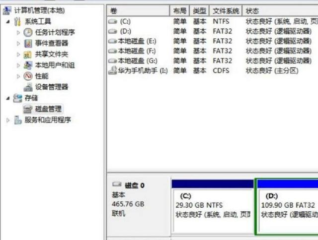


再点击“卷”，就可以看到此磁盘的基本信息了，这时我们就可以看到磁盘分区形式为gpt或MBR。


###### 方法二

1. 按下win+r打开运行，输入cmd打开命令提示符，输入bcdedit /enum {current}按回车执行；

2. 如果path路径是winload.efi ，则说明系统是通过UEFI模式启动。

   


### SataAHCI模式

高级主机控制器接口（英文：Advanced Host Controller Interface，缩写：AHCI），是一种由英特尔制定的技术标准，它允许软件与SATA存储设备沟通的硬件机制，可让SATA存储设备激活高级SATA功能，例如原生指令队列及热插拔。AHCI详细定义一个存储器架构规范给予硬件制造商，规范如何在系统存储器与SATA存储设备间传输数据，目前（2014年3月）最新AHC

##### 开启

 

##### 查询

 

 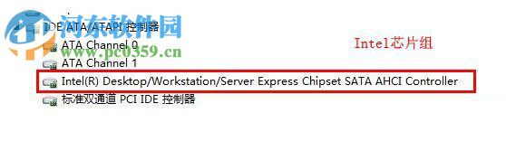

### m.2 cpu 内存速度


这是三星512nvme固态


# 声卡

### 音频输入设备

**什么是线路输入录音**

```
一般来说声卡有三个插孔：mic（麦克风）、line in（线路输入）、line out（线路输出）；

其中mic不用说了；

line in是用来将其他音频设备的输出线接入声卡的输入，例如通过音频线将录音机和声卡连结起来，将磁带的内容录制到电脑里，当然通过CD机录也是这个；

line out则是声音输出用的，常用的方法是直接接音箱或者耳机，也可以接其他的处理设备，如将电脑的音乐转录至磁带等；

软件里的CD唱机一般是指光驱，有些光驱有直接播放CD功能，通过音频线将光驱与声卡相连或者直接通过主板，实现录音功能。
```


### Windows 10 如何将程序音频输出到特定的音频设备

如果你的电脑有多张声卡或多个音频输出设备，比如在电脑后面插个音响，前面插个耳机。某些情况下可能会有个需求，就是将特定程序的声音输出到特定的音频设备，比如想让游戏的声音或视频播放的声音单独输出到你的耳机或者你的另一个声卡，其他声音继续输出到默认音频设备。

要想实现这个功能，在 Windows 10 1803 之前需要借助第三方软件或者是某些程序（例如音乐播放器）内置的音频输出选项，对于那些没有内置音频输出选项的应用，用第三方软件可能会导致不稳定，而且必须一直在后台运行。

不过最新的 Windows 10 已经在系统层面加入了这个功能，好用、稳定、兼容 UWP 应用。

这篇教程小山就教大家如何使用这个功能，可能你觉得现在没用，但是后面我会出几篇跟这篇相关的教程。

小山推荐如果有内置音频输出选项的程序，还是用程序内置的音频选项，可以选择不同的音频 API，提供更好的性能，这个方法只适用于没有内置音频输出选项的程序，比如浏览器和 UWP 应用等。


------

这个功能使用起来十分简单

打开 【设置】 → 系统 → 声音 → 最底部的 [应用音量和设备首选项]

打开后可以看到当前有音频输出的所有程序，在它们后面分别有输出和输入的选项。如下图：

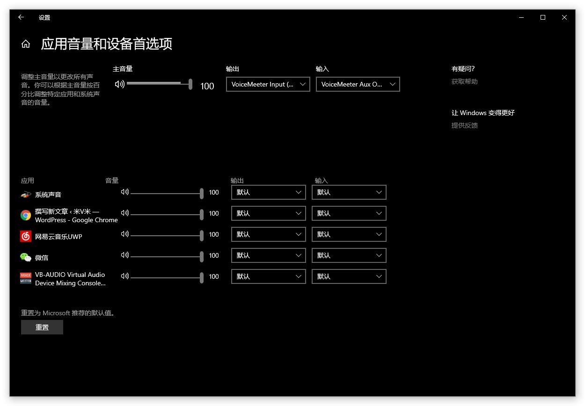

主音量的输出和输入是默认的播放设备和录音设备，如果要更改默认设备也可以在这里更改。

我想把网易云的声音单独输出到我的耳机，只需要把网易云后面的输出改为耳机就行了，当然，你需要知道耳机对应哪个输出设备。如果不需要让它输出到耳机，把输出选项改回为默认即可。

有些人可能会觉得，每次更改都需要点这么多次，太麻烦了，有没有更加便捷的方法。

当然有，小山找到了一个 UWP 应用，可以代替 Windows 自身的音量混合器，就是托盘哪里的音量图标，而且十分的好用。

这个应用叫做：EarTrumpet

下载地址：https://www.microsoft.com/store/productId/9NBLGGH516XP

打开后它会在托盘图标哪里出现一个和 Windows 默认一模一样的音量图标，如果有强迫症的话，可以把 Windows 默认图标给隐藏了。

隐藏方法：打开 【设置】 → 个性化 → 任务栏 → 打开或关闭系统图标

点击 EarTrumpet 的托盘图标，即可弹出默认音量混合器界面，可以调节主音量以及各个应用的音量，点击上方哪个小箭头即可弹出所有播放设备的音量混合器界面。

右键点击程序图标，点击右上角的切换按钮，即可切换程序的音频输出设备，是不是比上面的方便多了。

右键 EarTrumpet 的托盘图标即可切换系统默认的音频输出设备，还可以打开一个独立窗口的音量混合器以及打开系统的播放设备和录音设备等控制面板。


总而言之，这个应用用来控制系统声音是非常方便的，不需要再打开系统层层的设置面板了。

# 网络

### 修改网卡地址

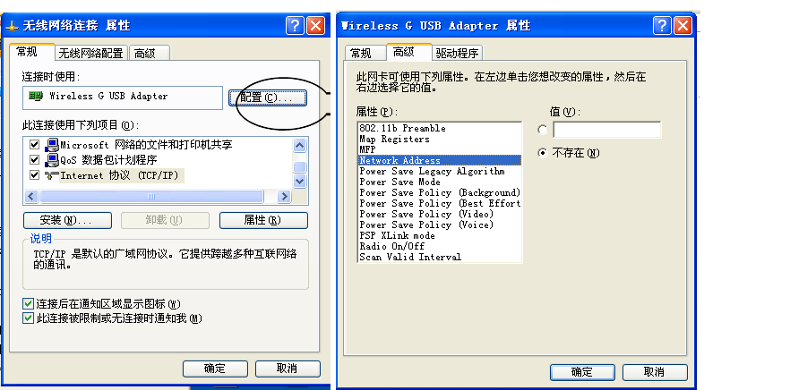

### win7-WiFi热点

1、以管理员身份运行命令提示符：
快捷键win+R→输入cmd→回车
2、启用并设定虚拟WiFi网卡：
运行命令：

netsh wlan set hostednetwork mode=allow ssid=qin key=shilei12

此命令有三个参数，mode：是否启用虚拟WiFi网卡，改为disallow则为禁用。
         ssid：无线网名称，最好用英文(以wuminPC为例)。
         key：无线网密码，八个以上字符(以wuminWiFi为例)。

以上三个参数可以单独使用，例如只使用mode=disallow可以直接禁用虚拟Wifi网卡。


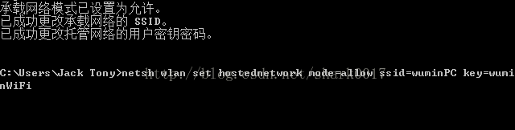


开启成功后，网络连接中会多出一个网卡为“Microsoft Virtual WiFi Miniport Adapter”的无线连接2，为方便起见，将其重命名为虚拟WiFi。若没有，只需更新无线网卡驱动就OK了。
3、设置Internet连接共享：
在“网络连接”窗口中，右键单击已连接到Internet的网络连接，选择“属性”→“共享”，勾上“允许其他······连接(N)”并选择“虚拟WiFi”。


4、开启无线网络：
继续在命令提示符中运行：netsh wlan start hostednetwork
（将start改为stop即可关闭该无线网，以后开机后要启用该无线网只需再次运行此命令即可）


5、至此，虚拟WiFi的红叉叉消失，WiFi基站已组建好，主机设置完毕。笔记本、带WiFi模块的手机等子机搜索到无线网络wuminPC，输入密码wuminWiFi，就能共享上网啦！


附：显示无线网络信息命令：netsh wlan show hostednetwork
  虚拟无线AP发射的WLAN是802.11g标准，带宽为54Mbps。

###  共享

##### 计算机共享名


### 共享某个文件夹


# dos cli命令

```
\1.     磁盘检测 chkdsk /f d:

\2.     远程桌面 mstsc

\3.     立即关机shutdown -p

\4.     立即重启shutdown -r -t 00

\5.     进入休眠状态（若关闭休眠则进入待机状）态rundll32.exe powrProf.dll,SetSuspendState

\6.     Windows7关闭休眠功能：powercfg -h off

\7.     Windows7打开休眠功能：powercfg -h on

\8.     windos记住密码rundll32 netplwiz.dll,UsersRunDll
```

```
1.复制User目录到D盘：　robocopy “C:\Users” “D:\Users” /E /COPYALL /XJ
2.强制删除User目录：　rmdir “C:\Users” /S /Q
3.创建C盘下的User的软件链接，链接到D盘User目录：mklink /J "C:\Users" "D:\Users"
```


# 系统配置

### Win7任务栏上的图标保存在哪个位置？

Win7任务栏上可以很方便的锁定程序图标，这样我们点击就可以打开，而不用去桌面上寻找了，那么有的朋友问了，当程序图标锁定到任务栏之后是保存到哪里的呢？下面小编教大家一个技巧来查看任务栏图标保存的位置。

1、首先按住“SHIFT”键，然后右键点击图标，然后选择 复制为路径 选项；

2、随便往什么地方粘贴，可以得到"C:\Users\你的用户名\AppData\Roaming\Microsoft\Internet Explorer\Quick Launch\User Pinned\TaskBar\Internet Explorer.lnk" 类似路径；

（注意，上面的你的用户名，改成你自己的）；

4、最后我们就找到任务栏上的图标保存文件夹了，大家可以对其中的图标（其实是快捷方式）进行操作了。

### 删除回收站图标

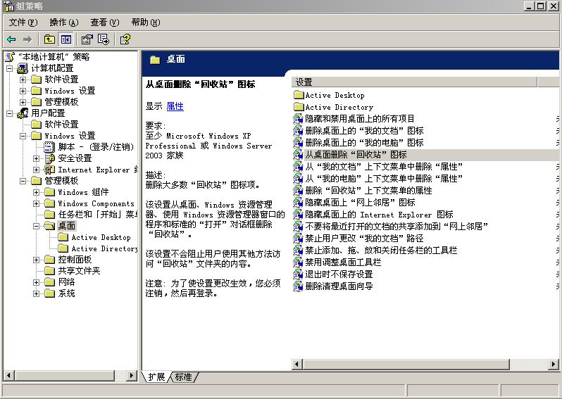

### 右键复制文件路径

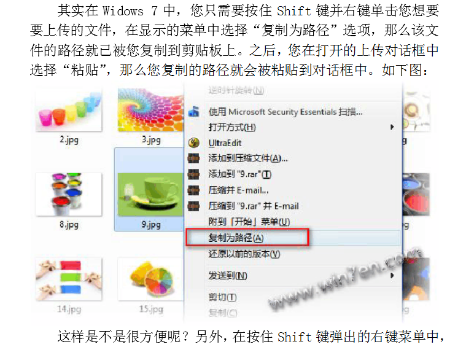


### windows 7-默认资源管理器

打开注册表，HKEY_CLASSES_ROOT\Folder\shell通过观察shell下的这几个项，发现都是右键点击文件夹时的菜单内容。既然这个注册表项跟文件夹弹出的右键菜单有关，那么修改里面的东西肯定能实现我要的功能。


点开open，opennewprocess，opennewwindow，里面的command键值都是一样的，那么我按照上述内容，将open下面的command键值修改为TC目录，删掉后面的DelegateExecute {11dbb47c-a525-400b-9e80-a54615a090c0}内容不就行了吗？立马试验，成功！修改后如下：


再发散：这样我就以后就只能用TC了吗？（当然只用TC没什么不好。）我如果要再用回资源管理器怎么办呢？聪明的你已经想到了吧。解决如下：

[HKEY_LOCAL_MACHINE\SOFTWARE\Classes\Folder\shell\下先建项，名称为openwithExplorer，键值为“资源管理器打开”，


再在openwithExplorer建项command，增添Execute，值为：{11dbb47c-a525-400b-9e80-a54615a090c0}，


在TC中调用右键（如果右键选择NC模式时按徽标键与Ctrl之间的键）选择“资源管理器打开”即可继续使用资源管理器。


### 禁用程序


# 任务和计划

### 关机前运行任务

 


# window服务

不过是开机启动的cli命令

### 建立服务

使用管理员权限打开一个新的cmd窗口，bin目录下执行`mongod --config "E:\mongodb-win32-x86_64-2012plus-4.2.1\mongo.conf" --install --serviceName MongoDB`，安装完成后可在windows的服务中看到MongoDB，可以在服务中启动或停止服务，或者在cmd的任意路径中执行net start/stop MongoDB来启停，并且启动后如果不手动停止，服务回一直为启动状态，后续连接数据库之前不需要先启动服务。

 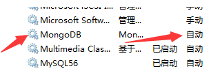

如果不使用管理员权限安装服务，执行不报错但是服务无法注册成功，即无法在windows服务中找到mongoDB服务；使用管理员权限，如果有其他运行mongo服务的cmd窗口，也无法成功，查看日志如下，此时关闭其他cmd窗口重新执行安装服务即可。

### 服务操作

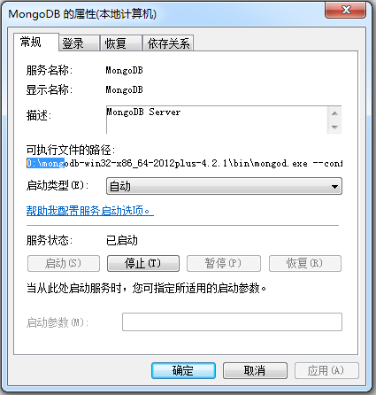


### 删除服务

 sc delete MongoDB


# windows 环境变量

### 配置永久的环境变量

##### windows的path让程序能在命令行全局运行

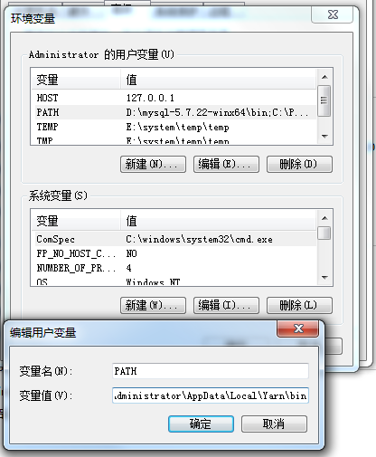

因为npm目录被配置了path   , npm下方的运行文件也可以命令行全局运行,npm i -g xxx 安装到了npm下级文件夹


##### 永久设置windown环境变量让程序用

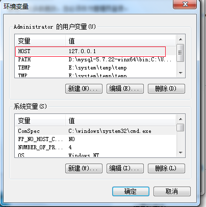


###  设置临时环境变量


关闭命令行再打开


(多个命令用&间隔,不可以在webpack如此配置)


```
set HOST=47.107.170.105&set PORT=3000&set NODE_ENV=development&npm run start
```

### 查看环境变量

显示所有环境变量

```
set
```

显示path

```
set path
```

显示指定

```
set HOST
```

# 删除登陆临时配置文件

### 第一种

然后你就会看到这里有一个临时文件了，把它删除掉，选择正确的配置文件，点击确定就好。如果那个临时的配置文件不能删除或者删除了也没有用的话那就用第二种方法把。

[](http://jingyan.baidu.com/album/9989c746fcb3fcf648ecfee9.html?picindex=5)

### 第二种

然后按照这个目录查找HKEY_LOCAL_MACHINE\SOFTWARE\Microsoft\Windows NT\CurrentVersion\ProfileList\，把这个文件夹下面有你登陆的那个账号的文件夹都删掉。然后重启。

[](http://jingyan.baidu.com/album/9989c746fcb3fcf648ecfee9.html?picindex=7)

然后，你就会发现已经不是使用临时文件登陆了。

[](http://jingyan.baidu.com/album/9989c746fcb3fcf648ecfee9.html?picindex=8)


# 账户信息

363019417@139.com
qingwabiaoge@qq.com

# 系统文件夹路径

### administer的

HKEY_CURRENT_USER\Software\Microsoft\Windows\CurrentVersion\Explorer\Shell Folders

### 公共的

HKEY_LOCAL_MACHINE \Software\Microsoft\Windows\CurrentVersion\Explorer\Shell Folders