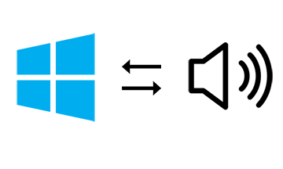
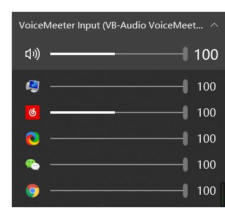
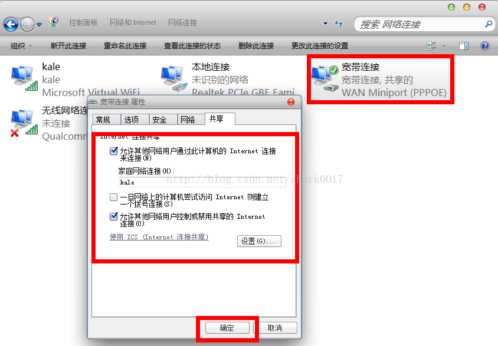
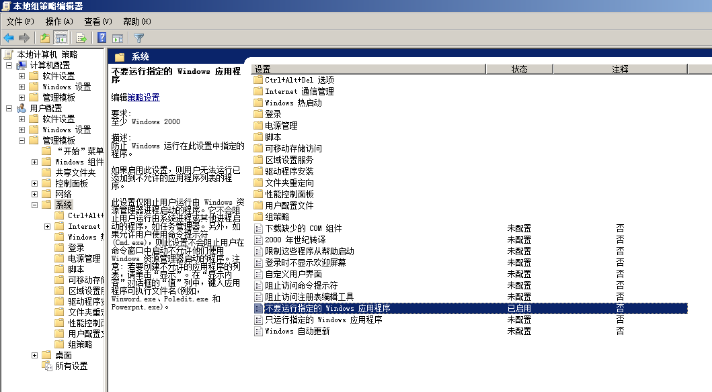
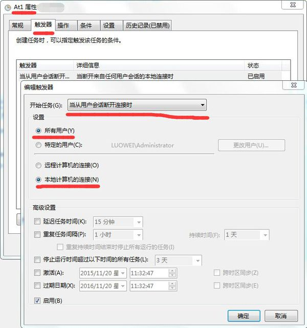
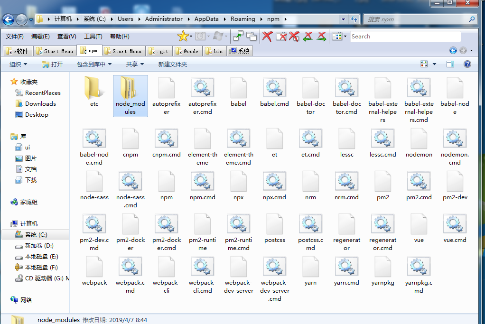
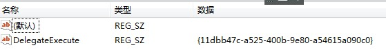

# bios设置

### 定时开机

首先在启动计算机时，按“Delete”键进入BIOS界面。

在BIOS设置主界面中选择“Power Management Setup”菜单，进入电源管理窗口。

默认情况下，“Automatic Power Up(定时开机，有些机器选项为Resume By Alarm，或者Power alarm)”选项是关闭的，将光标移到该项，用PageUp或PageDown翻页键将“Disabled”改为“Enabled”，而后在“Date (of Month) Alarm”和“Time (hh:mm:ss) Alarm”中分别设定开机的日期和时间。

# GUI

## 设备管理器(驱动)

其实是驱动管理


## 硬盘

### MBR  GPT

|             | 作为系统盘 | 作为数据盘   | 分区个数 | 引导文件 | 其他盘       |
| ----------- | ---------- | ------------ | -------- | -------- | ------------ |
| MBR系统分区 | Legacy引导 | 不受bios限制 | 4        | window盘 |              |
| GPT硬盘分区 | UEFI引导   | 不受bios限制 | 不限     | ESP盘    | MSR  recover |

##### 判断硬盘是什么分区

###### 方法一

1桌面上右键点击我的电脑/计算机/这台电脑，选择”管理”—“磁盘管理”；

2右键“磁盘0”，在弹出的菜单中如果有“转换成MBR磁盘”，则是UEFI启动的，反之则为传统的Legacy BIOS。


3. 如何查看硬盘分区是mbr还是gpt？右击计算机，点击“管理”，在管理中选中“磁盘管理”，右键点击“磁盘0”选择查看属性。


再点击“卷”，就可以看到此磁盘的基本信息了，这时我们就可以看到磁盘分区形式为gpt或MBR。


###### 方法二

1. 按下win+r打开运行，输入cmd打开命令提示符，输入bcdedit /enum {current}按回车执行；

2. 如果path路径是winload.efi ，则说明系统是通过UEFI模式启动。

   


### SataAHCI模式

高级主机控制器接口（英文：Advanced Host Controller Interface，缩写：AHCI），是一种由英特尔制定的技术标准，它允许软件与SATA存储设备沟通的硬件机制，可让SATA存储设备激活高级SATA功能，例如原生指令队列及热插拔。AHCI详细定义一个存储器架构规范给予硬件制造商，规范如何在系统存储器与SATA存储设备间传输数据，目前（2014年3月）最新AHC

##### 开启

 

##### 查询

 

 

### m.2 cpu 内存速度


这是三星512nvme固态


## 声卡

### 音频输入设备

**什么是线路输入录音**

```
一般来说声卡有三个插孔：mic（麦克风）、line in（线路输入）、line out（线路输出）；

其中mic不用说了；

line in是用来将其他音频设备的输出线接入声卡的输入，例如通过音频线将录音机和声卡连结起来，将磁带的内容录制到电脑里，当然通过CD机录也是这个；

line out则是声音输出用的，常用的方法是直接接音箱或者耳机，也可以接其他的处理设备，如将电脑的音乐转录至磁带等；

软件里的CD唱机一般是指光驱，有些光驱有直接播放CD功能，通过音频线将光驱与声卡相连或者直接通过主板，实现录音功能。
```


### Windows 10 如何将程序音频输出到特定的音频设备

如果你的电脑有多张声卡或多个音频输出设备，比如在电脑后面插个音响，前面插个耳机。某些情况下可能会有个需求，就是将特定程序的声音输出到特定的音频设备，比如想让游戏的声音或视频播放的声音单独输出到你的耳机或者你的另一个声卡，其他声音继续输出到默认音频设备。

要想实现这个功能，在 Windows 10 1803 之前需要借助第三方软件或者是某些程序（例如音乐播放器）内置的音频输出选项，对于那些没有内置音频输出选项的应用，用第三方软件可能会导致不稳定，而且必须一直在后台运行。

不过最新的 Windows 10 已经在系统层面加入了这个功能，好用、稳定、兼容 UWP 应用。

这篇教程小山就教大家如何使用这个功能，可能你觉得现在没用，但是后面我会出几篇跟这篇相关的教程。

小山推荐如果有内置音频输出选项的程序，还是用程序内置的音频选项，可以选择不同的音频 API，提供更好的性能，这个方法只适用于没有内置音频输出选项的程序，比如浏览器和 UWP 应用等。



------

这个功能使用起来十分简单

打开 【设置】 → 系统 → 声音 → 最底部的 [应用音量和设备首选项]

打开后可以看到当前有音频输出的所有程序，在它们后面分别有输出和输入的选项。如下图：


主音量的输出和输入是默认的播放设备和录音设备，如果要更改默认设备也可以在这里更改。

我想把网易云的声音单独输出到我的耳机，只需要把网易云后面的输出改为耳机就行了，当然，你需要知道耳机对应哪个输出设备。如果不需要让它输出到耳机，把输出选项改回为默认即可。

有些人可能会觉得，每次更改都需要点这么多次，太麻烦了，有没有更加便捷的方法。

当然有，小山找到了一个 UWP 应用，可以代替 Windows 自身的音量混合器，就是托盘哪里的音量图标，而且十分的好用。

这个应用叫做：EarTrumpet

下载地址：https://www.microsoft.com/store/productId/9NBLGGH516XP

打开后它会在托盘图标哪里出现一个和 Windows 默认一模一样的音量图标，如果有强迫症的话，可以把 Windows 默认图标给隐藏了。

隐藏方法：打开 【设置】 → 个性化 → 任务栏 → 打开或关闭系统图标

点击 EarTrumpet 的托盘图标，即可弹出默认音量混合器界面，可以调节主音量以及各个应用的音量，点击上方哪个小箭头即可弹出所有播放设备的音量混合器界面。

右键点击程序图标，点击右上角的切换按钮，即可切换程序的音频输出设备，是不是比上面的方便多了。

右键 EarTrumpet 的托盘图标即可切换系统默认的音频输出设备，还可以打开一个独立窗口的音量混合器以及打开系统的播放设备和录音设备等控制面板。



总而言之，这个应用用来控制系统声音是非常方便的，不需要再打开系统层层的设置面板了。

## win7用户组的操作权限

### WINDOWS NTFS文件系统的权限机制

1、WINDOWS文件权限是基于NTFS的，FAT32没有权限功能；

2、文件系统的最基本NTFS权限有：

完全控制、遍历文件夹/运行文件、列出文件夹/读取数据、读取属性、读取扩展属性、创建文件/写入数据、创建文件夹/附加数据、写入属性、写入扩展属性、删除子文件夹及文件、删除、读取权限、更改权限、取得所有权

共15种，所有的权限都是由这些基本权限组合而来；

3、每个基本权限都有“允许”和“拒绝”，按照WINDOWS安全性机制，“拒绝”的优先级比“允许”高，也就是说同时存在“允许”和“拒绝”时，等于“拒绝”；

4、文件系统中默认采用==继承父目录权限的方式==来授予文件权限； 

5、文件（夹）创建者默认为文件（夹）的所有者，具有完全控制权限，高于系统管理员权限；但系统管理员具有强制性的、最高级别的“取得所有权”权限，该权限无法被“拒绝”；

6、当同一分区内文件移动，移动后的文件权限将保留不变；跨分区移动文件，则移动后文件继承目标父目录的权限；而对于复制文件，不管是否跨域分区，复制后的文件权限都继承于父目录权限；

##### 右键-获得管理员权限做了什么


意思是*Authenticated Users*：（Windows系统中所有使用用户名、密码登录并通过身份验证的账户，不包括来宾账户Guest）都有读写的权限


administer还有对此文件完全控制的权限


users对此文件的权限


##### 更改权限


### 

### 默认权限

***\*WindowsXP用户组权限\****

system（系统组）：该组拥有系统中最高的权限，系统和系统级服务的运行都是依靠System赋予的权限(任务管理器很多进程由System开启的)。但是System组只有一个用户

就是System，它不允许任何用户的加入，在察看用户组的时候也不会显示出来。

Everyone（所有人）组：该用户组较为特殊，以下的所有用户组都隶属于这个组，因此，以下的用户组也都拥有该组拥有的所有权限。

Administrators组：该组默认拥有不受限制的完全访问权，可以对整个系统进行完全控制，是允许用户指定的用户组中权限最高的。

PowerUser组：该组可以执行除了Administrators组保留任务外的其他任何操作，分配给PowerUser组的默认权限允许它修改整个计算机的设置，但不能将自己添加到。

Administrators组，这个组的权限仅次于Administrators。

Users组：该组的用户无法修改操作系统的设置，注册表或用户资料。它只能运行经过验证的应用程序或创建本地组，但只能修改创建的本地组。

Guests组：该组的权限与Users组拥有的同等访问权，但操作系统对它的限制更多。

注意：除了Administrators组之外的用户组即使权限高于其他用户也不能访问其他用户的文件，除非得到其他用户的授权。用户永远得不到system权限，如果你学过操作系统

就会知道：system做的事对系统核心的东西进行操作，如果用户介入了，万一误操作，系统很容易就会崩溃的。


***\*win7用户组和权限\****

**内置普通组：**

Administrators（管理员组）属于该Administators本地组内的用户，都具备系统管理员的权限，它们拥有对这台计算机最大的控制权限，可以执行整台计算机的管理任务。内

置的系统管理员帐房Administrator就是本地组的成员，而且无法将它从该组删除。

如果这台计算机已加入域，则域的Domain Admins会自动地加入到该计算机的Administrators组内。也就是说，域上的系统管理员在这台计算机上也具备着系统管理员的权限。

Backup OPerators（备份操作组）在该组内的成员，不论它们是否有权访问这台计算机中的文件夹或文件，都可以通过“开始”－“所有程序”－“附件”－“系统工具”－

“备份”的途径，备份与还原这些文件夹与文件。

Guests（来宾用户组）该组是提供没有用户帐户，但是需要访问本地计算机内资源的用户使用，该组的成员无法永久地改变其桌面的工作环境。该组最常见的默认成员为用户

帐号Guest。

Network Configuration Operators　该组内的用户可以在客户端执行一般的网络设置任务，例如更改IP地址，但是不可以安装/删除驱动程序与服务，也不可以执行与网络

服务器设置有关的任务，例如DNS服务器、DHCP服务器的设置。

Power Users（高权限用户组）　该组内的用户具备比Users组更多的权利，但是比Administrators组拥有的权利更少一些，例如，可以：

创建、删除、更改本地用户帐户

创建、删除、管理本地计算机内的共享文件夹与共享打印机

自定义系统设置，例如更改计算机时间、关闭计算机等

Power Users　组的成员不可以更改Administrators与Backup Operators、无法夺取文件的所有权、无法备份与还原文件、无法安装删除与删除设备驱动程序、无法管理安全与

审核日志。包括高级用户以向下兼容，高级用户拥有有限的管理权限

Remote Desktop Users 此组中的成员被授予远程登录的权限该组的成员可以通过远程计算机登录，例如，利用终端服务器从远程计算机登录。

Users　（普通用户组）该组员只拥有一些基本的权利，例如运行应用程序，但是他们不能修改操作系统的设置、不能更改其它用户的数据、不能关闭服务器级的计算机。

所有添加的本地用户帐户者自动属于该组。

如果这台计算机已经加入域，则域的Domain Users会自动地被加入到该计算机的Users组中。

防止用户进行有意或无意的系统范围的更改，但是可以运行大部分应用程序

Cryptographic Operators  授权成员执行加密操作。

Distributed COM Users 成员允许启动、激活和使用此计算机上的分布式 COM 对象。

Event Log Readers 此组的成员可以从本地计算机中读取事件日志。

IIS_IUSRS  Internet 信息服务使用的内置组。默认成员NT AUTHORITY/IUSR。

Network Configuration Operators 此组中的成员有部分管理权限来管理网络功能的配置。

Performance Log Users 该组中的成员可以计划进行性能计数器日志记录、启用跟踪记录提供程序，以及在本地或通过远程访问此计算机来收集事件跟踪记录。

Performance Monitor Users 此组的成员可以从本地和远程访问性能计数器数据。

Replicator （文件复制组） 支持域中的文件复制。

HomeUsers 家庭用户安全组。


**内置特殊组：**

***\*system（系统组）\****这个成员是系统产生的，真正拥有整台计算机管理权限的账户，一般的操作是无法获取与它等价的权限的.该组拥有系统中最高的权限，系统和系统级服务的

运行都是依靠System赋予的权限(任务管理器很多进程由System开启的)。但是System组只有一个用户就是System，它不允许任何用户的加入，在察看用户组的时候也不会显示

出来。

***\*Everyone\**** 任何一个用户都属于这个组。注意，如果Guest帐号被启用时，则给Everyone这个组指派权限时必须小心，因为当一个没有帐户的用户连接计算机时，他被允许自动

利用Guest帐户连接，但是因为Guest也是属于Everyone组，所以他将具备Everyone所拥有的权限。

**Authenticated Users** 任何一个利用有效的用户帐户连接的用户都属于这个组。建议在设置权限时，尽量针对Authenticated Users组进行设置，而不要针对Everone进行设

置。

**Interactive \**Users\**** 任何在本地登录的用户都属于这个组。

**Network \**Users\****　任何通过网络连接此计算机的用户都属于这个组。

**Creator Owner(创建者）** 文件夹、文件或打印文件等资源的创建者，就是该资源的Creator Owner（创建所有者）。不过，如果创建者是属于Administrators组内的成员，则

其Creator Owner为Administrators组。　被标记为“创建者”权限的文件只有建立文件的那个用户才能访问，做到了一定程度的隐私保护。但是，所有的文件访问权限均可以

被管理员组用户和SYSTEM成员忽略，除非用户使用了NTFS加密。

Anonymous Logon Users　任何未利用有效的Windows Server 2003帐户连接的用户，都属于这个组。注意，在windows 2003内，Everone 组内并不包含“Anonymous Logon”组。

另：权限是取交集的
 如Remote Desktop Users组的成员在具有自身权限的同时它还属于everyone组享有everyone组所有权限但不想有其他非交集组的权限。

### 设置权限

1. 按住键盘**“Windows + R”**键，在弹出的运行对话框中输入**“secpol.msc”**进入本地安全策略，点击**“确定”**

   [](http://jingyan.baidu.com/album/ea24bc39d8ba7eda63b3314b.html?picindex=2)

2. 2

   进入**“本地策略”**后，依次点击**“本地策略——用户权限分配”**选项

   [](http://jingyan.baidu.com/album/ea24bc39d8ba7eda63b3314b.html?picindex=3)

   [](http://jingyan.baidu.com/album/ea24bc39d8ba7eda63b3314b.html?picindex=4)

3. 3

   在**“用户权限分配”**选项，点击**“创建全局对象”**

   [](http://jingyan.baidu.com/album/ea24bc39d8ba7eda63b3314b.html?picindex=5)

4. 4

   在用户对象中，点击**“添加用户和组”**选项；

   在**“用户和组”**中，选择**“高级”**

   [](http://jingyan.baidu.com/album/ea24bc39d8ba7eda63b3314b.html?picindex=6)

   [](http://jingyan.baidu.com/album/ea24bc39d8ba7eda63b3314b.html?picindex=7)

5. 5

   选择**“立即查找”**，查找到你要添加的账户，点击账户即可添加成功

   [](http://jingyan.baidu.com/album/ea24bc39d8ba7eda63b3314b.html?picindex=8)

6. 6

   添加好账户后，依次点击**“确定”**即可生效，这样就设置好用户权限了

   [](http://jingyan.baidu.com/album/ea24bc39d8ba7eda63b3314b.html?picindex=9)

   [](http://jingyan.baidu.com/album/ea24bc39d8ba7eda63b3314b.html?picindex=10)

## win7用户与组的文件权限

1。设置文件的所有者为administer

```
设置当前目录及子目录(/r)下所有文件(/f *)的所有者为管理员(/a)
takeown /f * /a /r 

我试用如下：
takeown /f C:\test  /a /r
```


2. 另一个程序正在使用此文件,进程无法访问，这种情况有管理员权限也不行

原因是因为在操作这个文件的时候，这个文件已经被其他的进程占用了。
很可能是IO没关掉的原因。

## 网络

### 修改网卡地址


### win7-WiFi热点

1、以管理员身份运行命令提示符：
快捷键win+R→输入cmd→回车
2、启用并设定虚拟WiFi网卡：
运行命令：

netsh wlan set hostednetwork mode=allow ssid=qin key=shilei12

此命令有三个参数，mode：是否启用虚拟WiFi网卡，改为disallow则为禁用。

netsh wlan set hostednetwork mode=disallow

​         ssid：无线网名称，最好用英文(以wuminPC为例)。
​         key：无线网密码，八个以上字符(以wuminWiFi为例)。

以上三个参数可以单独使用，例如只使用mode=disallow可以直接禁用虚拟Wifi网卡。


开启成功后，网络连接中会多出一个网卡为“Microsoft Virtual WiFi Miniport Adapter”的无线连接2，为方便起见，将其重命名为虚拟WiFi。若没有，只需更新无线网卡驱动就OK了。
3、设置Internet连接共享：
在“网络连接”窗口中，右键单击已连接到Internet的网络连接，选择“属性”→“共享”，勾上“允许其他······连接(N)”并选择“虚拟WiFi”。





4、开启无线网络：
继续在命令提示符中运行：netsh wlan start hostednetwork
（将start改为stop即可关闭该无线网，以后开机后要启用该无线网只需再次运行此命令即可）


5、至此，虚拟WiFi的红叉叉消失，WiFi基站已组建好，主机设置完毕。笔记本、带WiFi模块的手机等子机搜索到无线网络wuminPC，输入密码wuminWiFi，就能共享上网啦！


附：显示无线网络信息命令：netsh wlan show hostednetwork
  虚拟无线AP发射的WLAN是802.11g标准，带宽为54Mbps。

###  共享

##### 计算机共享名


### 共享某个文件夹


## 系统配置


### 右键复制文件路径


### 禁用程序



## 任务和计划

### 关机前运行任务

 


## window服务

不过是开机启动的cli命令

### 建立服务

使用管理员权限打开一个新的cmd窗口，bin目录下执行`mongod --config "E:\mongodb-win32-x86_64-2012plus-4.2.1\mongo.conf" --install --serviceName MongoDB`，安装完成后可在windows的服务中看到MongoDB，可以在服务中启动或停止服务，或者在cmd的任意路径中执行net start/stop MongoDB来启停，并且启动后如果不手动停止，服务回一直为启动状态，后续连接数据库之前不需要先启动服务。

 

如果不使用管理员权限安装服务，执行不报错但是服务无法注册成功，即无法在windows服务中找到mongoDB服务；使用管理员权限，如果有其他运行mongo服务的cmd窗口，也无法成功，查看日志如下，此时关闭其他cmd窗口重新执行安装服务即可。

### 服务操作


### 删除服务

 sc delete MongoDB


## windows 环境变量

### 配置永久的环境变量

##### windows的path让程序能在命令行全局运行


因为npm目录被配置了path   , npm下方的运行文件也可以命令行全局运行,npm i -g xxx 安装到了npm下级文件夹



##### 永久设置windown环境变量让程序用


###  设置临时环境变量


关闭命令行再打开


(多个命令用&间隔,不可以在webpack如此配置)


```
set HOST=47.107.170.105&set PORT=3000&set NODE_ENV=development&npm run start
```

### 查看环境变量

显示所有环境变量

```
set
```

显示path

```
set path
```

显示指定

```
set HOST
```

## .NET安装

net framework 4.5无法安装，提示等待另一个安装过程完成  
关掉msiexec.exe即可

# 注册表配置

### windows 7-默认资源管理器

打开注册表，HKEY_CLASSES_ROOT\Folder\shell通过观察shell下的这几个项，发现都是右键点击文件夹时的菜单内容。既然这个注册表项跟文件夹弹出的右键菜单有关，那么修改里面的东西肯定能实现我要的功能。


点开open，opennewprocess，opennewwindow，里面的command键值都是一样的，那么我按照上述内容，将open下面的command键值修改为TC目录，删掉后面的DelegateExecute {11dbb47c-a525-400b-9e80-a54615a090c0}内容不就行了吗？立马试验，成功！修改后如下：


再发散：这样我就以后就只能用TC了吗？（当然只用TC没什么不好。）我如果要再用回资源管理器怎么办呢？聪明的你已经想到了吧。解决如下：

[HKEY_LOCAL_MACHINE\SOFTWARE\Classes\Folder\shell\下先建项，名称为openwithExplorer，键值为“资源管理器打开”，


再在openwithExplorer建项command，增添Execute，值为：{11dbb47c-a525-400b-9e80-a54615a090c0}，





在TC中调用右键（如果右键选择NC模式时按徽标键与Ctrl之间的键）选择“资源管理器打开”即可继续使用资源管理器。


# 存储目录

## Users目录

### 安装完系统,和已有的`D:\Users`建立软连接`mklink /J "C:\Users" "D:\Users"`出错解决方案

1. window不同版本间的users不兼容，要复制新装系统的users文件夹覆盖`D:\Users`
2. `D:\Users`文件夹不存在 盘符发生了变化，修正盘符
3. 用户没有访问Users文件夹的访问权限
4. 系统找不到`D:\Users`文件夹 ,就会生成账户的临时配置目录 ,删除账户的临时配置目录

然后按照这个目录查找HKEY_LOCAL_MACHINE\SOFTWARE\Microsoft\Windows NT\CurrentVersion\ProfileList\，把这个文件夹下面有你登陆的那个账号的文件夹都删掉。然后重启。

[](http://jingyan.baidu.com/album/9989c746fcb3fcf648ecfee9.html?picindex=7)

然后，你就会发现已经不是使用临时文件登陆了。

[](http://jingyan.baidu.com/album/9989c746fcb3fcf648ecfee9.html?picindex=8)


## 注册表修改桌面我的文档开始菜单等文件夹路径

**administer的**

HKEY_CURRENT_USER\Software\Microsoft\Windows\CurrentVersion\Explorer\Shell Folders

**公共的**

HKEY_LOCAL_MACHINE \Software\Microsoft\Windows\CurrentVersion\Explorer\Shell Folders


## Win7任务栏上的图标保存在哪个位置？

Win7任务栏上可以很方便的锁定程序图标，这样我们点击就可以打开，而不用去桌面上寻找了，那么有的朋友问了，当程序图标锁定到任务栏之后是保存到哪里的呢？下面小编教大家一个技巧来查看任务栏图标保存的位置。

1、首先按住“SHIFT”键，然后右键点击图标，然后选择 复制为路径 选项；

2、随便往什么地方粘贴，可以得到"C:\Users\你的用户名\AppData\Roaming\Microsoft\Internet Explorer\Quick Launch\User Pinned\TaskBar\Internet Explorer.lnk" 类似路径；

（注意，上面的你的用户名，改成你自己的）；

4、最后我们就找到任务栏上的图标保存文件夹了，大家可以对其中的图标（其实是快捷方式）进行操作了。


# 账户密码 

363019417@139.com
qingwabiaoge@qq.com


# dos cli命令

```
\1.     磁盘检测 chkdsk /f d:

\2.     远程桌面 mstsc

\3.     立即关机shutdown -p

\4.     立即重启shutdown -r -t 00

\5.     进入休眠状态（若关闭休眠则进入待机状）态rundll32.exe powrProf.dll,SetSuspendState

\6.     Windows7关闭休眠功能：powercfg -h off

\7.     Windows7打开休眠功能：powercfg -h on

\8.     windos记住密码rundll32 netplwiz.dll,UsersRunDll

```

```
设置当前目录及子目录(/r)下所有文件(/f *)的所有者为管理员(/a)
takeown /f * /a /r 

我试用如下：
takeown /f C:\test  /a /r


设置当前目录及子目录下的所有文件(* /t)的权限为对所有人都为最高权限(everyone:f)
icacls * /t /grant:r everyone:f


我使用如下：
icacls C:\test /t /grant:r everyone:r

```

```
rd /s /q "C:\test"
```


```
1.复制User目录到D盘：　robocopy “C:\Users” “D:\Users” /E /COPYALL /XJ
2.强制删除User目录：　rmdir “C:\Users” /S /Q
3.创建C盘下的User的软件链接，链接到D盘User目录：mklink /J "C:\Users" "D:\Users"
```

