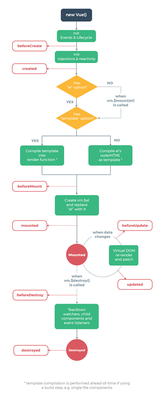
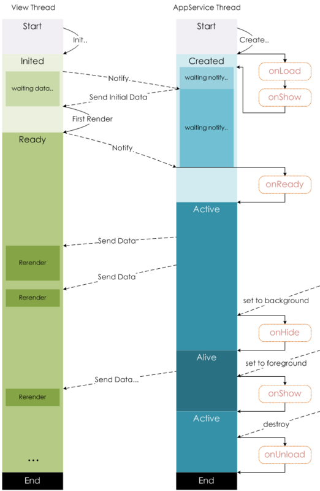

##vue和小程序模板对比

#变量模板

vue

```
{{msg}}
v-html
```
小程序

```
{{msg}}
<rich-text nodes="{{nodes}}" ></rich-text>
```

原生

```
`color-${red}`
```

# bind
vue
	
```
< div v-bind:prop="js-data"></div>	

```

小程序

```

<view prop="{{js-data}}"></view>	

```
原生
```
var prop=data
```


	
# 条件
vue

```
< div v-if='length>5'>1</div>
< div v-elseif='length>2'>2</div>
< div v-else>3</div>
```
小程序

```
<view wx:if="{{length > 5}}"> 1 </view>
<view wx:elif="{{length > 2}}"> 2 </view>
<view wx:else> 3 </view>
```
原生

```
if(length>5){}
elseif(length>2){}
else{}
```

# 显示隐藏
vue

```
v-hidden="ture"
```

小程序

```
hidden="{{true}}"
```

#控制class

vue

```
  <h2 class="class0" :class="['class1',
                                {class2:primary},
                                {class3:true,class4:true},
                                size?'btn-'+size:''
                                ]">h2</h2>
```

小程序

```
<view class=" {{class3}} {{true?'class1':'class2'}}">hello world</view>
```

#循环
vue

```
<li v-for="(item,index) in person" :key="item.name">
  {{index}}:{{item.name}}
</li>
```

小程序

```
 <text wx:for="{{person}}" wx:key="{{item.name}}">
  {{index}}:{{item.name}}
  </text>
```

原生

```
for..in, for...of
```
<br><br><br><br>
## 数据源比较

# 小程序data method,生命周期钩子函数


```
App({
  globalData: 1,
 // 生命周期函数，可以为函数，或一个在methods段中定义的方法名
  attached: function () { }
  moved: function () { }
  detached: function () {}
  onTap: function () {

    }
})
```
```
Page({
 data: {
    msg:""
  },
// 生命周期函数，可以为函数，或一个在methods段中定义的方法名
  attached: function () { }
  moved: function () { }
  detached: function () {}
 onTap: function () {

    }
})

```
```
Component({
 data: {
    msg:""
  },
// 生命周期函数，可以为函数，或一个在methods段中定义的方法名
  attached: function () { }
  moved: function () { }
  detached: function () {}
 methods: {
    onTap: function () {
     
    }
  }
})
```

# data:{msg:''}实时更新

vue

```
this.goodss=res
```
小程序 

```
none
```
# data:{arr:[]}实时更新

vue

```
  this.$set(this.obj, 'b', 3)
```
小程序

```
 this.setData({
      'array[0].text':'changed data'
    })


  this.setData({
      'object.text': 'changed data'
    });

this.setData({
      'newField.text': 'new data'
    })
```

原生

```
   obj = {a: 1, b: 2}


    Object.defineProperty(obj, 'c', {//可以改变其他属性的值，可以把其他属性的值赋值给自己
        configurable: false,
        enumerable: true,
        set: function () {
            this.a = 0
        },
        get: function () {
            return this.b
        }

    })
    obj.c = 3 //set触发tis.a=0
    console.log(obj)//除非get
```

# 表达式计算

vue

```
<template>{{msg}}<template>

compute:{
msg:funcution{
return this.a+this.b=this.c}
}
```


小程序


```
miniprogram-computed插件
```

原生

```
const a=1,b=2,c=3
const i= a+b-c
```


# props
vue

```
props:['']
 props:{
            prop1:{},  //声明属性等价于  let prop1 默认取值undifine
            prop2:{
                type:String,
                default:'prop2'
            }
        },
```
小程序


```
"usingComponents": {
    "tab-bar": "../../components/tabBar/tabBar"
  }
```

```
properties: {
    // 弹窗标题
    currentpage: {            // 属性名
      type: String,     // 类型（必填）
      value: 'index'     // 属性初始值（可选），如果未指定则会根据类型选择一个
    }
  }
```

原生

```
var prop1 //undefine
```
# 全局数据

vue

```
vuex

localstore
```
小程序

```
app.js


localstore
```


# router

vue

```
this.$route
```

小程序

```
this.route
```

# 页面栈
vue

```
$router路由栈
```

小程序

```
初始化：新页面入栈

打开新页面：新页面入栈(调用 API wx.navigateTo 或使用组件 <navigator open-type="navigateTo"/>)

页面重定向：当前页面出栈，新页面入栈(调用 API wx.redirectTo 或使用组件 <navigator open-type="redirectTo"/>)

页面返回：页面不断出栈，直到目标返回页，新页面入栈(调用 API wx.navigateBack 或使用组件<navigator open-type="navigateBack">或用户按左上角返回按钮)

Tab 切换：页面全部出栈，只留下新的 Tab 页面(调用 API wx.switchTab 或使用组件 <navigator open-type="switchTab"/> 或用户切换 Tab)

重加载：页面全部出栈，只留下新的页面(调用 API wx.reLaunch 或使用组件 <navigator open-type="reLaunch"/>)
```

```
小程序多页页面栈

<navigator url='/pages/navigate/index' open-type="navigateTo" >navigateTo打开新普通页,只有这个可用返回</navigator>
<navigator url='/pages/navigate/index' open-type="redirectTo" >redirectTo 重定向到普通页</navigator>
<navigator url='/pages/navigate/index' open-type="reLaunch" >reLaunch到普通页 </navigator>

<navigator url='/pages/switchTab/index' open-type="switchTab" >switchTab到tab页</navigator>
<navigator url='/pages/switchTab/index' open-type="reLaunch" >reLaunch到tab页 </navigator>

<navigator open-type="navigateBack"> 返回 </navigator>

```
原生

```
数组栈push pop 
```

<br><br><br><br><br>
## action

# 点击传参
vue

```
<b utton @click="say('明天不上班')"></button>

new Vue({
  el: '#app',
  methods:{
    say(arg){
    consloe.log(arg)
    }
  }
})

```
小程序

```
<view class='tr' bindtap='tap' data-id="10"> 点击传参</view>
Page({
 
  tap(e) {
    let id = e.currentTarget.dataset.id;
    console.log(id)
  }
})


```
原生

```


    <b utton data-id="10" onclick="fn(event)">
        按钮
    </button>


    function fn(e) {
        console.log(e.currentTarget.dataset.id)
    }

```
#阻止冒泡
vue

```
v-on:click.stop=
```
小程序

```
catchtap=
```

# 生命周期

vue


>组件和页面(路由设定显示的路由)都有生命周期钩子函数

>页面切换后销毁




小程序

>要写到component({})下才行

>其他页面返回后会销毁





原生

```
Fn(){ 

}
const vm=new Fn()

vm.distroy()
```

# 子数据传父&子调父
vue

```
this.$emit('myevent', myEventDetail)

```
小程序

```
this.triggerEvent('myevent', myEventDetail)
```
# 父调子
vue

```
this.refs.xxx.method()
```
小程序

```
this.selectComponent('#id').syaHello()
```
<br></br><br></br><br></br>
# class继承
vue

```
自定义组件符合标准的css继承
```
小程序

```
view不能继承父组件的 background

```
小程序组件私有css

```
组件内class私有 其他组件用不了 

```

小程序标签类

```
标签类(page,view)在任何页面和组件都会变成全局的 而且优先级最高
```

app.wxss全局css,默认给page 用但是不给组件用

```
设置给组件用全局的css
Component({
  options: {
    addGlobalClass: true,//组件内部使用全局的css
  }})
```

<br></br><br></br><br></br>

# 组件
```
vue所有组件都相同

小程序的app组件page组件和component组件不同
```


<br></br><br></br><br></br>

# template模块化dom
```
小程序专有
模块化dom用
```


<br></br><br></br><br></br>
# is动态组件

vue 用于组件

```

```

小程序用于template,

```
<template name="person"  >

 <view  bindtap='tap' >
  <text> {{name}}-{{age}} </text>
  </view>
</template>
```

 
```
<import src="../../template/person/index"/>

<template is="person" data="{{...item}}"></template>
```

<br></br><br></br><br></br>
#混合模块化代码

vue

```
mixin 用到页面组件和组件上

```

小程序

```
behaviors 不能用到页面 只能用到组件
```