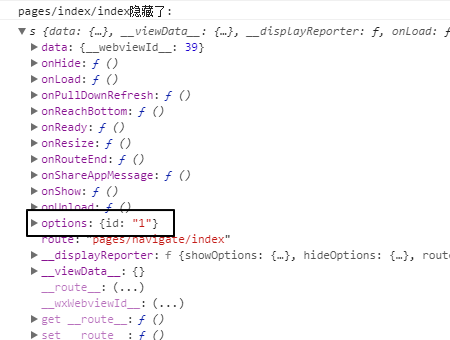

# 页面栈


navigator

```
初始化：新页面入栈

打开新页面：新页面入栈(调用 API wx.navigateTo 或使用组件 <navigator open-type="navigateTo"/>)

页面返回：页面不断出栈，直到目标返回页，新页面入栈(调用 API wx.navigateBack 或使用组件<navigator open-type="navigateBack">或用户按左上角返回按钮)

页面重定向：当前页面出栈，新页面入栈(调用 API wx.redirectTo 或使用组件 <navigator open-type="redirectTo"/>)

Tab 切换：页面全部出栈，只留下新的 Tab 页面(调用 API wx.switchTab 或使用组件 <navigator open-type="switchTab"/> 或用户切换 Tab)

重加载：页面全部出栈，只留下新的页面(调用 API wx.reLaunch 或使用组件 <navigator open-type="reLaunch"/>)


```

```
<navigator url='/pages/navigate/index' open-type="navigateTo" >navigateTo打开新普通页,只有这个可用返回</navigator>
<navigator url='/pages/navigate/index' open-type="redirectTo" >redirectTo 重定向到普通页</navigator>
<navigator url='/pages/navigate/index' open-type="reLaunch" >reLaunch到普通页 </navigator>

<navigator url='/pages/switchTab/index' open-type="switchTab" >switchTab到tab页</navigator>
<navigator url='/pages/switchTab/index' open-type="reLaunch" >reLaunch到tab页 </navigator>

<navigator open-type="navigateBack"> 返回 </navigator>

```

编程式路由

```
  wx.navigateTo({
      url: '/pages/navigate/index?id=1',
    })
```
# 路由信息



route

```
/pages/navigate/index

```

query


```
option

```