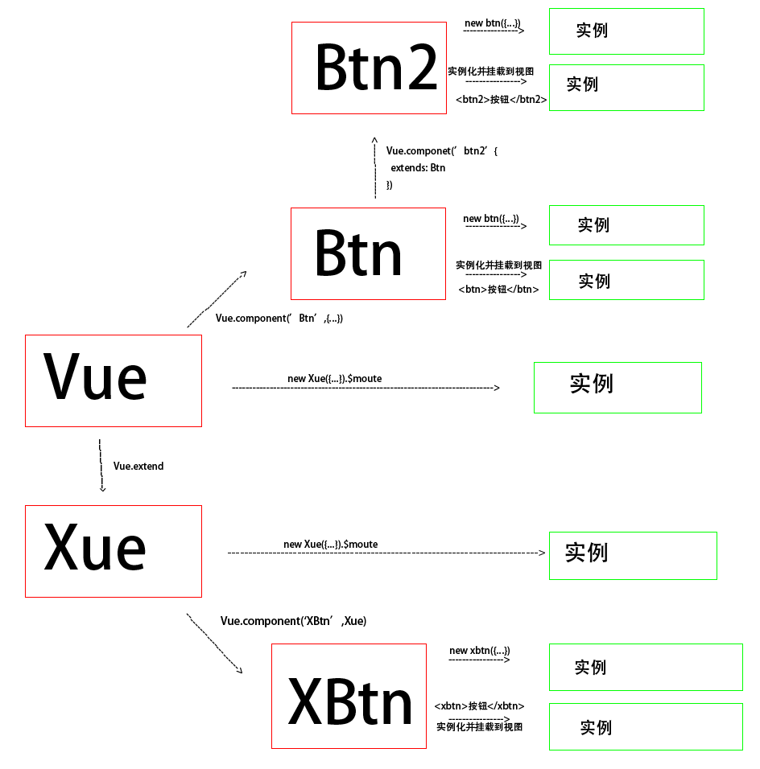

# 归类

### 类似的放在一起记忆

```
 Vue.myGlobalMethod = function () {
        console.log('Vue.myGlobalMethod静态函数运行图')
    };

    Vue.prototype.$fn = function () {

        console.log("Vue.prototype.$fn() / this.$fn运行")
    };

    Vue.mixin({
        mounted() {
            console.log('Vue.mixin运行')
        }
    });

    Vue.directive('focus', {
        inserted: function (el) {
            el.focus()
        }
    })

    Vue.component('cl', {template: '<div>cl</div>'})

    Vue.filter('setLength', function (value, num) {
        return value.slice(0, mum)
    })
```

### A=>B A,B可以一起放在一起

global默认省去=>i=1为全局变量


# 学习步骤

1. 找一个好教程学习
1. 基础实例弄熟 可以从github搜索实例包
2. 自己写实例
3. 看项目的视频教程
4. 看别人的项目 务必弄懂每个细节都掌握 跳过别人踩过的坑 尽可能不要自己踩坑,浪费时间

# 学习和总结


### 1. 搜索好的教程,学透了,总结笔记

 要细心的地方: 看别人的权威教程 一定要认真,错过细节或者理解错误,会浪费大量时间

### 2 教程原理复杂 不理解的

通过记忆吧

### 3. 通过实践臆想的总结(不推荐,容易出错,从心理学上讲人总是高估自己的总结和控制能力)

不要去为了记忆,推断你不太了解的东西,不了解原理的东西 都是瞎想,

总结起来困难的就是实践不够,继续实践, 不要强行总结

##### 举几个臆想的例子:

###### 例子1



###### 例子2:

错误概念:认为< button onclick="fn(event)">本质是 addEventListener('click',function(){fn(event) })

正确的解释: 这两种不是一回事,event是全局变量

错误的原因: 对dom事件不理解教程复杂,底层代码不了解,胡乱猜测

##### 举几个实践成功的例子

###### 例子1

概念:组件是构造器 vue组件标签就是实例化,从react那里证实, 

原因:对vue源码不了解

###### 例子2

vue组件封装的原理
vue用父组件的变量和函数做回调


# 节省时间为目标,跳过不需要细心的 
1. 跳过小问题,不影响使用的,跳过细节问题,浪费时间,收益小
7. 一些不重要的问题,和钱和项目无关的, 没必要较真  钻牛角尖 都是浪费时间 没收益
1. 跳过找最优方案,找最熟悉的方案 解决问题
3. 不要在教程分类上浪费时间 分类是为了方便以后查找,因为分类是多维度,参考美工图片分类,
 instance 属于操作符,属于原型链的判断方法,属于关键字,一个知识点可以属于不同的分类,就像素材属于男装,属于森林,属   于暗色主题一样
4. 不要纠结两难选择,其实投硬币就可以解决 快速决定
5. 原创会浪费时间 不管是技术 设计还是项目的组织方法,尽量仿照
6. 尽量不要自己摸索解决方案,去找权威资料学习,自己推论不严密,又浪费时间,找不到答案的可以放到遗留问题中


# 遗留问题


