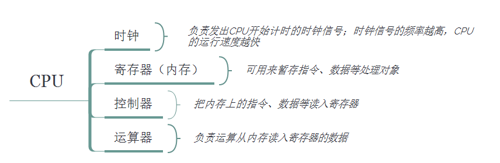

# 堆栈结构

### 栈(存放变量对象,变量对象存放变量,变量里存基本类型和引用类型地址)

* 一种后进先出的的数据结构,
* 数据大小确定，内存空间大小系统分配和回收(垃圾回收器)。


### 堆(树结构键值对,存放引用类型)

* 堆可以被看成是一棵树(通过键值对一分多)，
* 每个空间大小不一样，程序猿分配空间。


# 数据类型

### 基本类型(不可扩展)
常量池:存放5种类型的常量

常量直接量 1,true,null,undefine,'str'

### 引用类型 (可以扩展)


构造函数生成堆内存新对象 `new Object`


```

在堆内存中常量 [1,null,true], {a:1} 

在堆内存中存放其他对象的字面量,[[1,2,3],fn(){},{1,2,3}]

在堆内存中存放地址 [i,fn]

```

============================


# 变量对象

这是一个实例,下边是对实例的分析
```
   var obj = {a: 10}//省去了global
    let x = 1

    function f(p1,p2) {

        var a = 1 //a在变量对象里而没有注入到window里
        var b = obj.a  //先计算再赋值修正变量对象的键值
        var o = {}
        var fn2 = function () {
            console.log(this)
        }
        console.log(x)//1,跨作用域链寻找,模仿栈内寻找变量对象

        function fn() { //函数声明局部变量类似var,存储在变量对象
            console.log(this)
        }

        i = 10    //省去了global,注入到了window里
        m = fn    //省去了global,注入到了window里

        console.log(a) //1
        console.log(window.a)//undifine
        console.log(window.fn)//undifine,未注入到了window里
        console.log(window.fn2)//undefine
        console.log(window.i)//10,
        console.log(window.m)//[funcion]


    }


    console.log(window.i)// 10,因为注入过依然能输出

    obj.fn = f
    obj.fn(1,2)


```


### 全局上下文变量对象


```


 global={
    Math:<...>,
   String:<...>,
    ....
    ....
    x=1
    obj = 0xxxxxx1
    f=0xxxxxx2
    window:global
 };   
 ```
访问一般省去global


global是js的原生变量对象,但是window不是原生的而是bom的浏览器的窗口对象在浏览器中 window(窗口对象)引用了global对象


小程序没有window 有js原生的global

node没有window 有global

### 函数上下文变量对象


#####  f()函数上下文栈 进栈建立阶段的

变量对象为

```
vo= {
a=undefine
b=undefine
o=undefine
fn2=undefine
fn=0x000001 //开辟堆内存空间0x000001 赋值给fn,如果此时有同名的变量fn这位初始化,程序会优先访问0x000001

arguments:{
0:undifine,1:undifine,length:2
}

this:windows

chain:[global]
}


```


##### 函数上下文栈运行阶段 

变量对象赋值修正  指令和变量对象读入到cpu




```

VO= {
a=1
b=2  //obj.a,首先作用域链搜索obj,先让obj和'a'经过cpu计算得到值2,然后2赋值给i
o= #0x000000 //开辟堆内存空间{}复制地址#0x000002给o

fn2=0x000002
fn=ox0000001

arguments:{
0:1,1:2,length:2
}

this:obj

chain:[global]

}

AO=VO
```

```

window={
...
...
i=10,
m=ox0000001
}

```


##### 变量的复制,在变量对象内部进行


==================
##### 变量对象出栈


   1. __局部变量:__ 函数(栈stack)进栈后,编译器为局部变量分配的栈内存空间,函数出栈后变量销毁,释放内存空间，

   2. __global变量:__ global变量在程序进入global上下文栈建立栈内存空间,一直存在,不存在出栈,所以global变量不会释放；


===============================
# 堆,栈,变量对象,变量,数据(基本类型,引用类型),赋值操作的关系


js是静态作用域,函数在__定义的时候__就已经确定自由变量在哪个作用域取值,之所以这样分析是因为代码嵌套在模拟函数入栈顺序和层次,越外的越早入栈,越靠近底层


============================

# this


obj调用

```
obj={fn:function(){this.i}}

obj.fn--------> this===obj

```

函数里嵌套的函数

```

function(){

function f(){
console.log(this.i) //this===windows
}
f()
}()

```
call apply指定this

```
obj={}
function fn(){
console.log(this)
}

fn.call(obj)

```

new 的原理就是 P.call(new Object())

```
function P(){
this.i=1
this.m=2
console.log(this)
}
const p=new P()

```

prototype的this也是实例化对象本身
```
obj.__proto__=Fn.prototype


```

 箭头函数内部this继承其父函数的this,为了方便使用上级函数的this才引入的
 
```
其父函数的this,
```


method（this）不算method函数作用域因为是指令就是操作符一样


````
   var a=1
    function fn(i) {
        var a=2
        console.log(i)
    }
    fn(this.a)//此处this为window,()并非是函数内部不会间隔作用域
````

